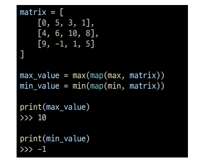

# 순회

이차원 리스트를 단순히 출력하면 아래와 같이 나온다.

이차원 리스트에 담긴 모든 원소를 아래와 같이 출력하고 싶다면 어떻게 할까?

인덱스를 통해 각각 출력하면 가능하다!

### 1. 이중 for문을 이용한 행 우선 순회

### 이중 for문을 이용한 열 우선 순회

### 행 우선 순회를 이용해 이차원 리스트의 총합 구하기

### Pythonic한 방법으로 이차원 리스트의 총합 구하기

### 행 우선 순회를 이용해 이차원 리스트의 최대값, 최소값 구하기

### Pythonic 한 방법으로 이차원 리스트의 최대값, 최소값 구하기

# 전치

전치(transpose)란 행렬의 행과 열을 서로 맞바꾸는 것을 의미한다.

# 회전

문제에서 이차원리스트를 왼쪽, 오른쪽으로 90도 회전하는 경우가 존재한다.

