# 완전탐색 1 (Exhaustive Search)

## 1. 무식하게 다해보기 (Brute-force)

Brute-force는 모든 경우의 수를 탐색하여 문제를 해결하는 방식이다.

- 브루트포스 라고도 하며, 무식하게 밀어붙인다는 뜻이다.
- 가장 단순한 풀이 기법이며, 단순 조건문과 반복문을 이용해서 풀수 있다.
- 복잡한 알고리즘 보다는, 아이디어를 어떻게 코드로 구현할 것인지가 중요하다.

블랙잭 문제를 통해 Brute-force 이해하기

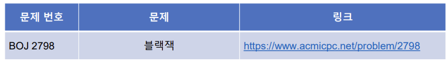

특별한 알고리즘 기법 없이, 모든 경우의 수를 탐색해봅니다.


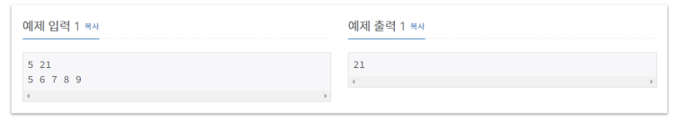

5장의 카드 5, 6, 7, 8, 9 중 세 장의 카드의 합(max_total)이 21이 넘지 않아야 한다.

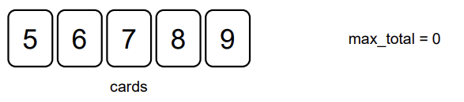

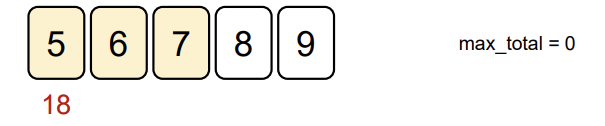

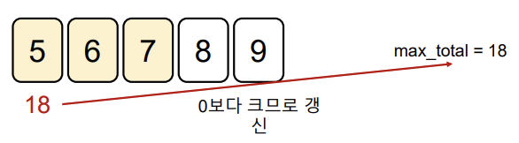

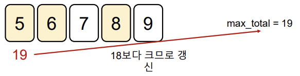

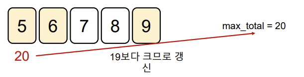

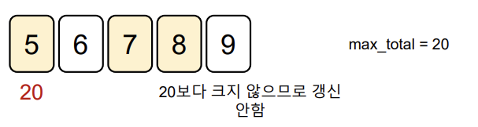

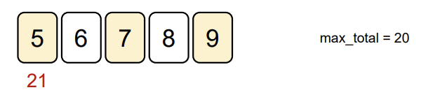

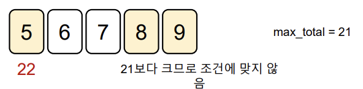

# 2. 델타 탐색(Delta Search)

지금까지는 모든 경우의 수를 따지는 일반적인 완전탐색을 알아보았다.

이차원 리스트의 완전탐색에서 많이 등장하는 유형인 델타 탐색(상하좌우 탐색)을 알아보자.

(0,0) 에서부터 이차원 리스트의 모든 원소를 순회하며 (완전탐색)

각 지점에서 상하좌우에 위치한 다른 지점을 조회하거나 이동하는 방식이다.

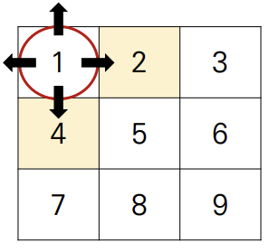

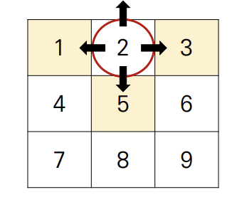

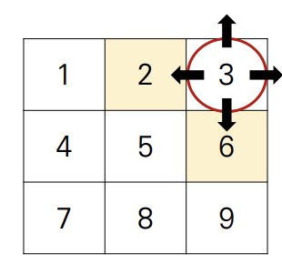

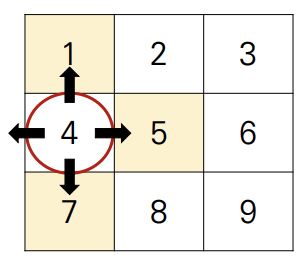

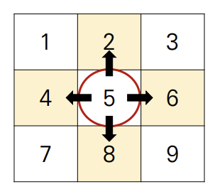

이차원 리스트의 인덱스(좌표)의 조작을 통해서 상하좌우 탐색을 한다. 이때 행과 열의 변량인 -1,+1을 델타(delta)값 이라 한다.

### 델타(delta)값을 이용해 상하좌우로 이동하기

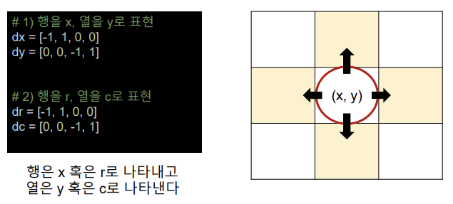

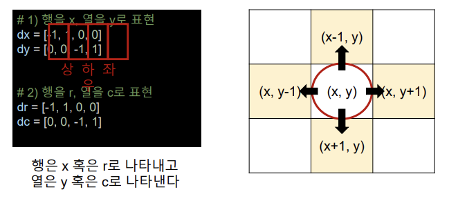

### 델타(delta)값을 이용해 상하좌우로 이동하기

```python 
행을 x 열을 y 로 두었다.		  1. 반복문을 통해 상하좌우 이동하기
dx = [-1,1,0,0]					for i in range(4):
dy = [0,0,-1,1]						nx = x + dx[i]
									ny = y + dy[i]
상 하 좌 우 이동				   2. 범위를 벗어나지 않으면 갱신
								 	if 0<=nx<3 and 0<=ny<3:
상(x-1,y)								x = nx
nx = x + dx[0]							 y = ny
ny = y + dy[0]

하(x+1,y)	
nx = x + dx[1]
ny = y + dy[1]

좌(x,y-1)
nx = x + dx[2]
ny = y + dy[2]

우(x,y+1)
nx = x + dx[3]
ny = y + dy[3]
```


### 이차원 리스트의 상하좌우 탐색정리

```python
1. 델타값 정의
dx = [0,0,-1,1]
dy = [-1,1,0,0]

2. 이차원 리스트 순회
for i in range(n):
    for j in range(n):
        
        3. 델타값을 이용해 상하좌우 이동
        for k in range(4):
            nx = x + dx[k]
            ny = y + dy[k]
            
            4. 범위를 벗어나지 않으면 갱신
            if 0<=nx<n and 0<=ny<n:
                x = nx
                y = ny
```
