# 문자열(String)

### 문자열은 immutable(변경 불가능한) 자료형!

## 1. 문자열 슬라이싱

s = ‘abcdefghi’

- s[2:5] 🡪 ‘cde’ 
- s[-6:-2] 🡪 ‘defg’ 
- s[2:-4] 🡪 ‘cde’

s = ‘abcdefghi’

- [2:5:2] 🡪 ‘ce’ 
- s[-6: -1:3] 🡪 ‘dg’ 
- s[2:5:-1] 🡪 ‘ ’ 
- s[5:2:-1] 🡪 ‘fed’

s = ‘abcdefghi’

- s[:3] 🡪 ‘abc’ 
- s[5:] 🡪 ‘fghi’ 
- s[:] 🡪 ‘abcdefghi’ 
- s[::-1] 🡪 ‘ihgfedcba’
- s[10:20] 🡪 ‘ ’

## 2. 문자열 메서드

### 1).split(기준문자)

문자열을 일정 기준으로 나누어 리스트로 반환

괄호 안에 아무것도 넣지 않으면 자동으로 공백을 기준으로 설정

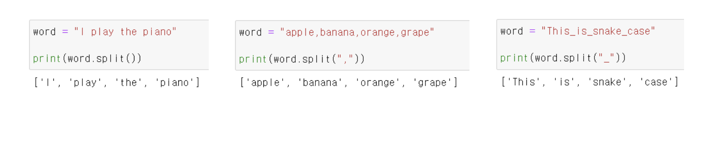

### 2) .strip(제거할 문자)

문자열의 양쪽 끝에 있는 특정 문자를 모두 제거한 새로운 문자열 반환

괄호 안에 아무것도 넣지 않으면 자동으로 공백을 제거 문자로 설정

제거할 문자를 여러 개 넣으면 해당하는 모든 문자들을 제거

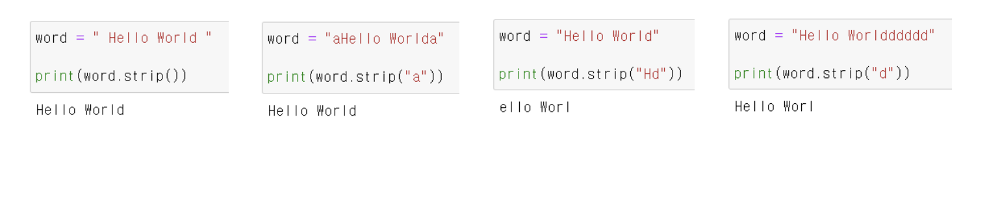

### 3) .find(찾는 문자)

특정 문자가 처음으로 나타나는 위치(인덱스)를 반환, 찾는 문자가 없다면 -1을 반환

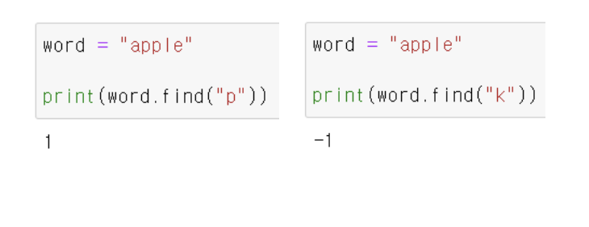

### 4) .index(찾는 문자)

특정 문자가 처음으로 나타나는 위치(인덱스)를 반환, 찾는 문자가 없다면 오류 발생

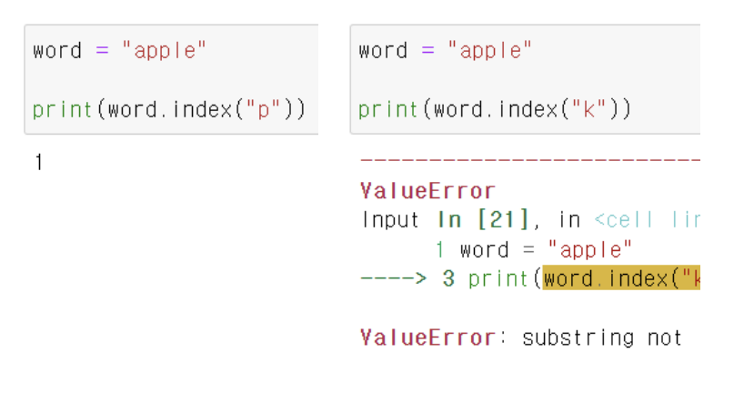

### 5) .count(개수를 셀 문자)

문자열에서 특정 문자가 몇 개 인지 반환, 문자 뿐만 아니라, 문자열의 개수도 확인 가능

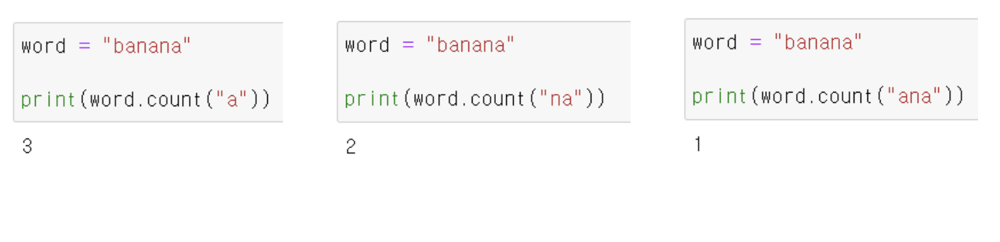

### 6) .replace(기존 문자, 새로운 문자)

문자열에서 기존 문자를 새로운 문자로 수정한 새로운 문자열을 반환

특정 문자를 빈 문자열('')로 수정하여 마치 해당 문자를 삭제한 것 같은 효과 가능

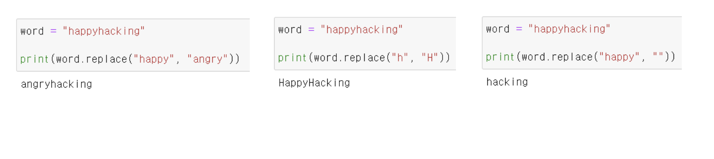

### 7) 삽입할 문자.join(iterable)

iterable의 각각 원소 사이에 특정 문자를 삽입한 새로운 문자열 반환

공백 출력, 콤마 출력 등 원하는 출력 형태를 위해 사용

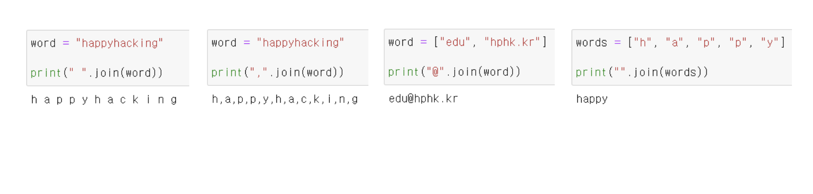

# 딕셔너리(Dictionary)

## 1. 해시 테이블

파이썬에는 딕셔너리(dict) 자료구조가 내장 되어 있다.

**Non-sequence & Key-Value**

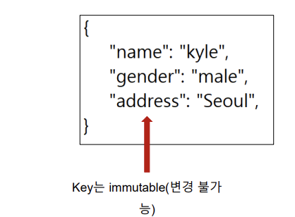

딕셔너리는 해시 테이블(Hash Table)을 이용하여 Key: Value를 저장

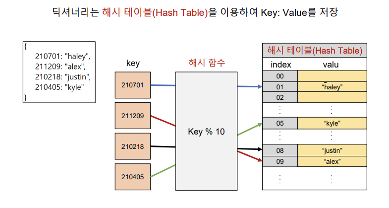

해시 함수 : 임의 길이의 데이터를 고정 길이의 데이터로 매핑하는 함수

해시 : 해시 함수를 통해 얻어진 값

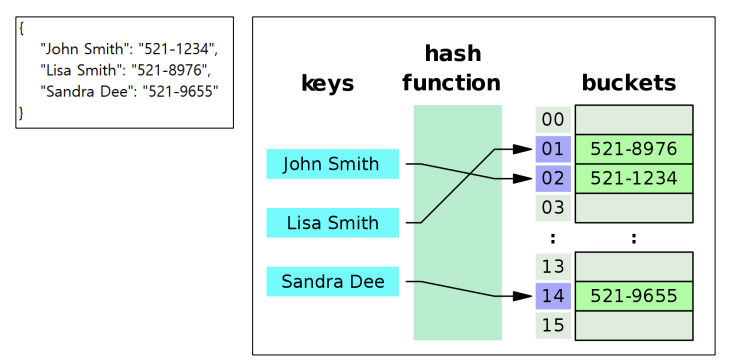

파이썬의 딕셔너리(Dictionary)는 해시 함수와 해시 테이블을 이용하여 

삽입, 삭제, 수정, 조회 연산의 속도가 리스트보다 빠르다.

## 2. 딕셔너리 기본 문법

**기본적인 딕셔너리 사용법 (선언)**

**변수 = { key1: value1, key2: value2 … }**

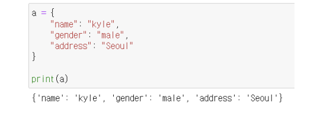

**기본적인 딕셔너리 사용법 (삽입/수정)** 

**딕셔너리[key] = value** 

**내부에 해당 key가 없으면 삽입, 있으면 수정**

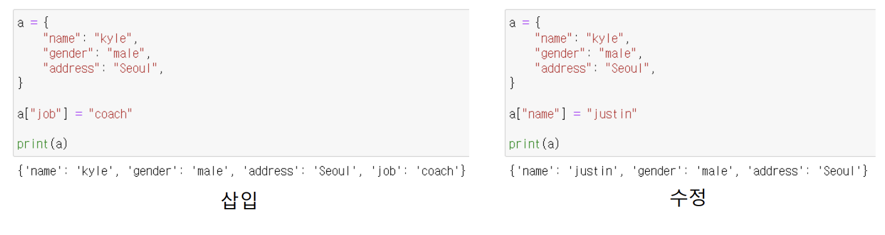

**기본적인 딕셔너리 사용법 (삭제)** 

**딕셔너리.pop(key)** 

**내부에 존재하는 key에 대한 value 삭제 및 반환, 존재하지 않는 key에 대해서는 KeyError 발생**

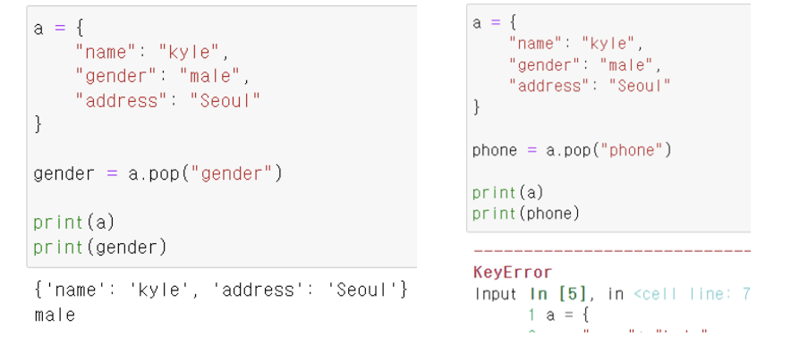

**기본적인 딕셔너리 사용법 (삭제)** 

**딕셔너리.pop(key, default)** 

**두 번째 인자로 default(기본)값을 지정하여 KeyError 방지 가능**

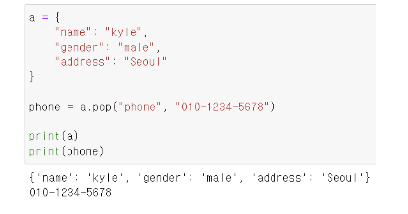

**기본적인 딕셔너리 사용법 (조회)** 

**key에 해당하는 value 반환**

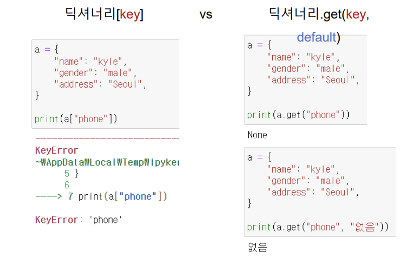

**딕셔너리 기본 문법 정리**

**선언			 변수 = {key1:value1, key2:value2....}**

**삽입/수정	딕셔너리[key] = value**

**삭제 			딕셔너리.pop(key, default)**

**조회			 딕셔너리[key]**

​					 **딕셔너리.get(key,default)**

## 3. 딕셔너리 메서드

### 1) .keys()

딕셔너리의 key 목록이 담긴 dict_keys 객체 반환

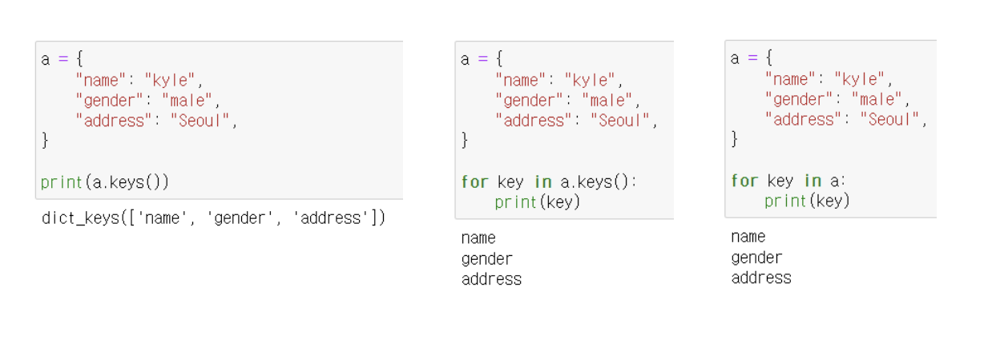

### 2) .values()

딕셔너리의 value 목록이 담긴 dict_values 객체 반환

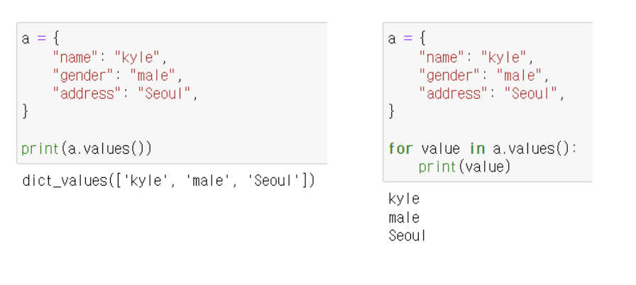

### 3) .items()

딕셔너리의 (key, value) 쌍 목록이 담긴 dict_items 객체 반환

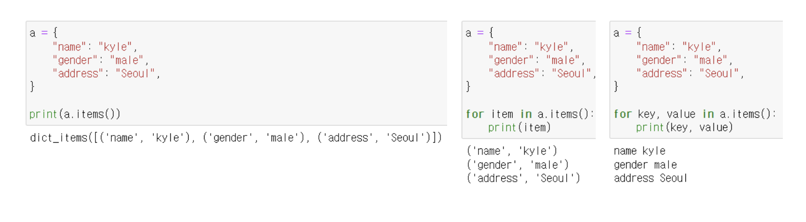