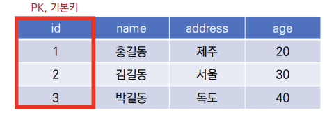

# Database

- 데이터베이스는 체계화된 데이터의 모임

- 여러 사람이 공유하고 사용할 목적으로 통합 관리되는 정보의 집합

- 논리적으로 연관된 (하나 이상의) 자료의 모음으로

  그 내용을 고도로 구조화 함으로써 검색과 갱신의 효율화를 꾀한 것

- 즉, 몇 개의 자료 파일을 조직적으로 통합하여 

  자료 항목의 중복을 없애고 자료를 구조화하여 기억시켜 놓은 자료의 집합체

- 데이터베이스로 얻는 장점들
  - 데이터 중복 최소화
  - 데이터 무결성 (정확한 정보를 보장)
  - 데이터 일관성
  - 데이터 독립성 (물리적/ 논리적)
  - 데이터 표준화
  - 데이터 보안 유지

# RDB (Relational Database)

- 관계형 데이터베이스
  - 서로 관련된 데이터를 저장하고 접근할 수 있는 데이터베이스 유형
  - 키(key)와 값(value)들의 간단한 관계(relation)를 표(table) 형태로 정리한 데이터베이스


- 스키마

  - 데이터베이스에서 자료의 구조, 표현방법, 관계등 전반적인 명세를 기술한 것

    

  - 표현방법 

    ```bash
    sqlite3 healthcare.sqlite3 # sqlite3 를 실행
    
    .schema healthcare # healthcare의 schema출력
    ```

- 테이블
  - 열(컬럼/필드) 과 행(로우/레코드) 값의 모델을 사용해 조직된 데이터 요소들의 집합

   

- 열 : 각 열에 고유한 데이터 형식 지정

  - 아래의 예시에서는 name이란 필드에 고객의 이름(TEXT)정보가 저장

  

- 행: 실제 데아터가 저장되는 형태

  - 아래의 예시에서는 총 3명의 고객정보가 저장되어 있음


- 기본키: 각 행의 고유 값

  - 반드시 설정해야 하며, 데이터베이스 관리 및 관계 설정시 주요하게 활용 됨

  



# RDBMS

- 관계형 데이터베이스 관리 시스템
  - 관계형 모델을 기반으로 하는 데이터베이스 관리시스템을 의미


- SQLite

  - 서버 형태가 아닌 파일 형식으로 응용 프로그램에 넣어서 사용하는 비교적 가벼운 데이터베이스
  - 구글 안드로이드 운영체제에 기본적으로 탑재된 데이터베이스이며, 임베디드에도 많이 활용됨
  - 로컬에서 간단한 DB 구성을 할 수 있으며, 오픈소스 프로젝트이기 때문에 자유롭게 사용가능

  

- SQLite Data Type
  1. NULL
  2. INTEGER
     - 크기에 따라 0, 1, 2, 3, 4, 6 또는 8바이트에 저장된 부호 있는 정수
  3. REAL
     - 8바이트 부동 소수점 숫자로 저장된 부동 소수점 값
  4. TEXT
  5. BLOV
     - 입력된 그대로 정확히 저장된 데이터(별다른 타입 없이 그대로 저장)

- SQL(Structured Query Language)
  - 관계형 데이터베이스 관리시스템의 데이터 관리를 위해 설계된 특수 목적으로 프로그래밍 언어
  - 데이터베이스 스키마 생성 및 수정
  - 자료의 검색 및 관리
  - 데이터베이스 객체 접근 조정 관리

# Hello World!

데이터베이스 생성하기


CSV 파일을 table로 만들기


SELECT 확인하기


터미널 VIEW 변경하기


진행 TIP – sqlite 확장프로그램 사용하기 (1/5)


진행 TIP – sqlite 확장프로그램 사용하기 (2/5)


진행 TIP – sqlite 확장프로그램 사용하기 (3/5)


진행 TIP – sqlite 확장프로그램 사용하기 (4/5)


진행 TIP – sqlite 확장프로그램 사용하기 (5/5)


- 테이블 생성 및 삭제 statement

  - CREATE TABLE
    - 데이터베이스에서 테이블 생성

  

  

  ​				

  - DROP TABLE
    - 데이터베이스에서 테이블 제거

​				


- 필드 제약 조건
  - NOT NULL : NULL 값 입력 금지
  - UNIQUE : 중복 값 입력 금지 (NULL값은 중복 입력 가능)
  - PRIMARY KEY: 테이블에서 반드시 하나. NOT NULL + UNIQUE
  - FOREIGN KEY: 외래키. 다른 테이블의 Key
  - CHECK : 조건으로 설정된 값만 입력 허용
  - DEFAULT: 기본 설정 값

# CRUD

# CREATE

- INSERT

  - 'insert a single row into a table'

  - 테이블에 단일 행 삽입

    ```bash
    INSERT INTO 테이블_이름 (컬럼1, 컬럼2) VALUES (값1, 값2);
    ```

  - 테이블에 정의된 모든 컬럼에 맞춰 순서대로 입력

    ```bash
    NSERT INTO 테이블_이름 VALUES (값1, 값2, 값3);
    ```

- classmates 테이블에 이름이 홍길동이고 나이가 23인 데이터를 넣어 봅시다.

  SELECT문을 통해 확인해보세요.


- classmates 테이블에 이름이 홍길동이고, 나이가 30이고, 주소가 서울인 데이터를 넣어봅시다. SELECT문을 통해 확인해보세요.


- rowid: SQLite에서 PRIMARY KEY사 없는 경우 자동으로 증가하는 PK 컬럼


- 지우고 새로 만들기

  

- INSERT 여러개 넣기

  


# READ

- SELECT
  - query data from a table
  - 테이블에서 데이터를 조회
  - SELECT 문은 SQLite에서 가장 기본이 되는 문이며 다양한 절(cluase)와 함께 사용
    - ORDER BY, DISTINCT, WHERE, LIMIT, GROUP BY ...

- LIMIT
  - constrain the number of rows returned by a query
  - 쿼리에서 반환되는 행 수를 제한
  - 특정 행부터 시작해서 조회하기 위해 OFFSET 키워드와 함께 사용하기도 함
- WHERE
  - specify the search condition for rows returned by the query
  - 쿼리에서 반환된 행에 대한 특정 검색 조건을 지정
- SELECT DISTINCT
  - remove duplicate rows in the result set
  - 조회 결과에서 중복 행을 제거
  - DISTINCT 절은 SELECT 키워드 바로 뒤에 작성해야 함

- Q. classmates 테이블에서 id, name 컬럼 값만 조회하세요.

  

- Q. classmates 테이블에서 id, name 컬럼 값을 하나만 조회하세요.

  

- Q. classmates 테이블에서 id, name 컬럼 값을 세 번쨰에 있는 하나만 조회하세요.


- OFFSET: 처음부터 주어진 요소나 지점까지의 차이를 나타내는 정수형
- 예시
  1. 문자열 ‘abcedf’ 에서 문자 `c`는 시작점 `a`에서 2의 OFFSET을 지님
  2. SELECT * FROM MY_TABLE LIMIT 10 OFFSET 5
     - 6번째 행 부터 10개 행을 조회 (6번째 행부터 10개를 출력)
     - 0부터 시작함

- Q. classmates 테이블에서 id, name 컬럼 값 중에 주소가 서울인 경우의 데이터를 조회하세요.


- Q. classmates 테이블에서 age값 전체를 중복없이 조회하세요.


