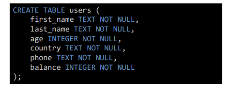
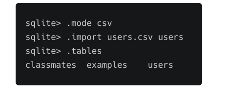
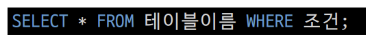
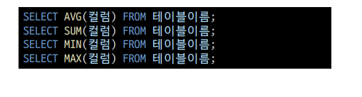
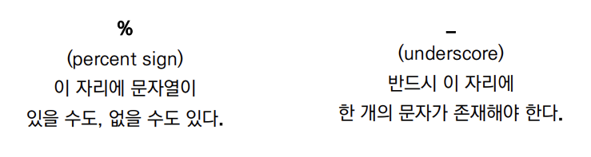
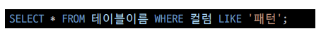
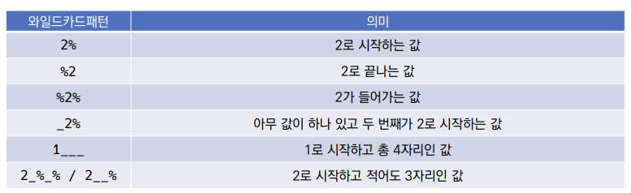

# WHERE

- Table users 생성

  

- csv파일 정보를 테이블에 적용하기

- 특정 조건으로 데이터 조회하기

- **WHERE절에서 사용할 수 있는 연산자**
  - 비교 연산자
    - =, >, >=, <, <= 는 숫자 혹은 문자 값의 대/소, 동일 여부를 확인하는 연산자
  - 논리 연산자
    - AND
      - 앞에 있는 조건과 뒤에 오는 조건이 모두 참인 경우
    - OR
      - 앞의 조건이나 뒤의 조건이 참인 경우
    - NOT
      - 뒤에 오는 조건의 결과를 반대로

- **SQL 사용할 수 있는 연산자**
  - BETWEEN 값1 AND 값2
    - 값1과 값2 사이의 비교 (값1 <= 비교값 <= 값2)
  - IN (값1, 값2, ...)
    - 목록 중에 값이 하나라도 일치하면 성공
  - LIKE
    - 비교 문자열과 형태 일치
    - 와일드카드 (% : 0개 이상문자, _: 1개 단일 문자)
  - IS NULL/ IS NOT NULL
    - NULL 여부를 확인할 떄는 항상 = 대신에 IS를 활용
  - 부정 연산자
    - 같지 않다. (!=, ^=, <>)
    - ~와 같지 않다.(NOT 칼럼명 = )
    - ~보다 크지 않다. (NOT 칼럼명 >)
- 연산자 우선순위
  - 1 순위 : 괄호 ()
  - 2 순위 : NOT
  - 3 순위 : 비교 연산자, SQL
  - 4 순위 : AND
  - 5 순위 : OR

# SQLite Aggregate Functions

- Aggregate function (집계 함수)

  - 값 집합에 대한 계산을 수행하고 단일 값을 반환
    - 여러 행으로부터 하나의 결괏값을 반환하는 함수
  - SELECT 구문에서만 사용됨
  - 예시
    - 테이블 전체 행 수를 구하는 COUNT(*)
    - age 컬럼 전체 평균 값을 구하는 AVG(age)

- COUNT

  - 그룸의 항목 수를 가져옴

  

- AVG

  - 모든 값의 평균을 계산

- MAX

  - 그룹에 있는 모든 값의 최대값을 가져옴

- MIN

  - 그룹에 있는 모든 값의 최소값을 가져옴

- SUM

  - 모든 값의 합을 계산

- AVG, SUM, MIN, MAX

  - 위 함수들은 기본적으로 해당 컬럼이 숫자(INTEGER)일 떄만 사용가능

  

# LIKE

- 패턴 일치를 기반으로 데이터를 조회하는 방법
- SQLite는 패턴 구성을 위한 2개의 wildcards를 제공
  - % (percent sign)
    - 0개 이상의 문자
  - _ (underscore)
    - 임의의 단일 문자

- wildecards

  

- LIKE statement : 패턴을 확인하여 해당하는 값을 조회하기

  

