# 기본 함수와 연산

- 문자열 함수

  - SUBSTR(문자열, start, length) : 문자열 자르기
    - 시작 인덱스는 1, 마지막 인덱스는 -1
  - TRIM(문자열), LTRIM(문자열), RTRIM(문자열) : 문자열 공백 제거
  - LENGTH(문자열) : 문자열 길이
  - REPLACE(문자열, 패턴, 변경값) : 패턴에 일치하는 부분을 변경
  - UPPER(문자열), LOWER(문자열) : 대소문자 변경
  - || : 문자열 합치기(concatenation)

- 숫자 함수

  - ABS(숫자) : 절대 값
  - SIGN(숫자) : 부호 (양수 1, 음수-1, 0 0)
  - MOD(숫자1,숫자2) : 숫자1을 숫자2로 나눈 나머지
  - CEIL(숫자), FLOOR(숫자), ROUND(숫자, 자리) : 올림, 내림, 반올림

  - POWER(숫자1, 숫자2) : 숫자1의 숫자2 제곱
  - SQRT(숫자) : 제곱근

- 산술 연산자

  - +,-,*,/ 와 같은 산술 연산자와 우선 순위를 지정하는 () 기호를 연산에 활용할 수 있음

  

# GROUP BY

- Aggregate function (집계 함수) 다시보기

  - 값 집합에 대한 계산을 수행하고 단일 값을 반환
    - 여러 행으로부터 하나의 결괏값을 반환하는 함수
  - SELECT 구문에서만 사용됨
  - 예시
    - 테이블 전체 행 수를 구하는 COUNT(*)
    - age 컬럼 전체 평균 값을 구하는 AVG(age)

- ALIAS

  - 칼럼명이나 테이블명이 너무 길거나 다른 명칭으로 확인하고 싶을 때는 ALIAS를 활용
  - AS를 생략하여 공백으로 표현할 수 있음
  - 별칭에 공백, 특수문자 등이 있는 경우 따옴표로 묶어서 표기

  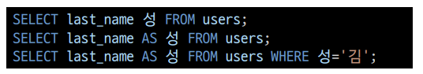

- GROUP BY

  - make a set of summary rows from a set of rows
  - SELECT 문의 optional 절
  - 행 집합에서 요약 행 집합을 만듦
  - 선택된 행 그룹을 하나 이상의 열 값으로 요약 행으로 만듦
  - 문장에 WHERE 절이 포함된 경우 반드시 WHERE 절 뒤에 작성해야 함

- GROUP BY

  - 지정된 컬럼의 값이 같은 행들로 묶음
  - 집계함수와 활용하였을 때 의미가 있음
  - 그룹화된 각각의 그룹이 하나의 집합으로 집계함수의 인수로 넘겨짐

  -  Q. users에서 각 성(last_name)씨가 몇 명씩 있는지 조회한다면?

- GROUP BY

  - GROUP BY절에 명시하지 않은 컬럼은 별도로 지정할 수 없음
    - 그룹마다 하나으 ㅣ행을 출력하게 되므로 집계 함수 등을 활용해야 함
  - GROUP BY의 결과는 정렬되지 않음
    - 기존의 순서와 바뀌는 모습도 있음
    - 원칙적으로 관계형 데이터베이스에서는 ORDER BY를 통해 정렬

- HAVING

  - 집계함수는 WHERE 절의 조건식에서는 사용할 수 없음(실행 순서에 의해)
    - WHERE로 처리하는 것이 GROUP BY 그룹화보다 순서상 앞에 있기 때문
  - 집계 결과에서 조건에 맞는 값을 따로 활용하기 위해서 HAVING을 활용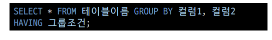

- SELECT 문장 실행 순서

  - FROM => WHERE => GROUP BY => HAVING => SELECT => ORDER BY
    - FROM 테이블을 대상으로
    - WHERE 제약조건에 맞춰서 뽑아서
    - GROUP BY 그룹화 한다.
    - HAVING 그룹 중에 조건과 맞는 것 만을
    - SELECT 조회하여
    - ORDER BY 정렬하고
    - LIMIT/ OFFSET 특정 위치의 값을 가져온다.

  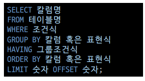

# ALTER TABLE

- ALTER TABLE
  1. 테이블 이름변경
  2. 새로운 column 추가
  3. column 이름 수정 (new in sqlite 3.25.0)
  4. column 삭제 (new in sqlite 3.35.0)
- Q. title과 content라는 컬럼을 가진 articles라는 이름의 table을 새롭게 만들어 보세요.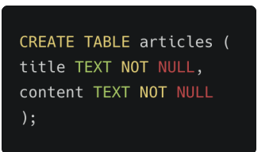

- Q. articles 테이블에 값을 추가해보세요! (title은 '1번 제목', content는 '1번내용')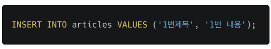

- 방금 만든 테이블의 이름을 변경해보기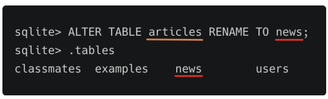

- 방금 만든 테이블에 새로운 컬럼을 추가해보자

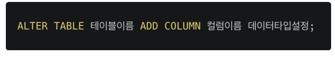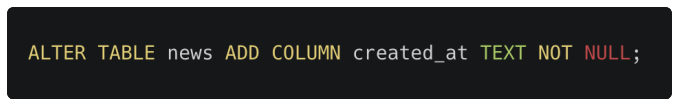

- 실패...Error를 읽어보자!

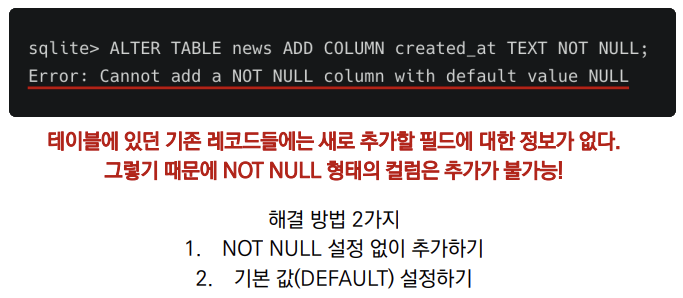

1. NOT NULL 설정 없이 추가하기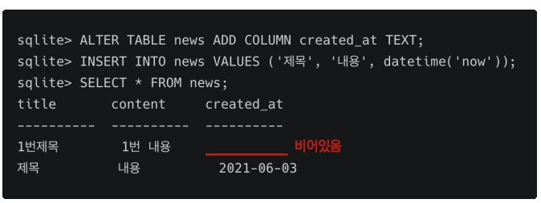

2. 기본 값(DEFAULT) 설정하기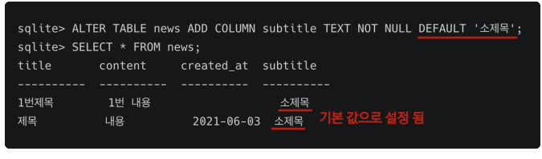