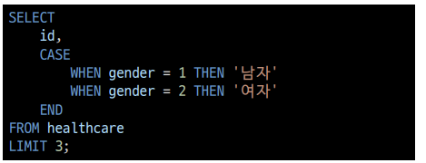
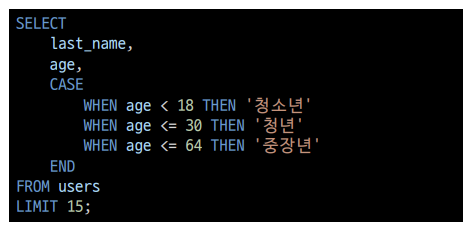
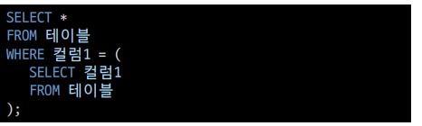
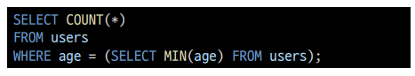
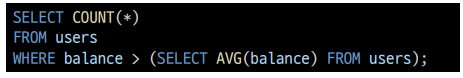
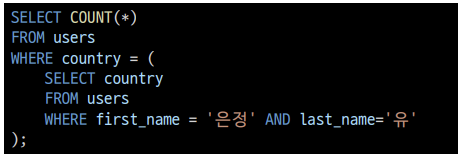
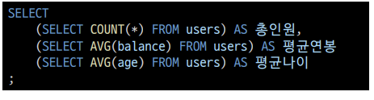
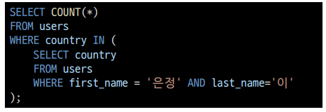
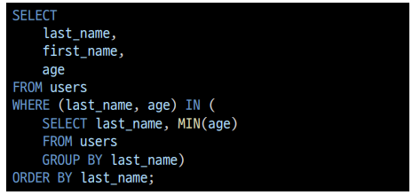

# CASE

- CASE 문은 특정 상황에서 데이터를 변환하여 활용할 수 있음
- ELSE를 생략하는 경우 NULL 값이 지정됨
- Q.gender가 1인 경우는 남자를 gender가 2인 경우에는 여자를 출력하시오.

​							

- Q.나이에 따라 청소년~18,청년~30,중장년~64 로 출력하시오.

# 서브쿼리

- 서브 쿼리는 특정한 값을 메인 쿼리에 반환하여 활용하는 것

- 실제 테이블에 없는 기준을 이용한 검색이 가능함

- 서브 쿼리는 소괄호로 감싸서 사용하며, 메인 쿼리의 칼럼을 모두 사용할 수 있음

- 메인 쿼리는 서브 쿼리의 칼럼을 이용할 수 없음

  

- 단일행 서브쿼리
  - 서브쿼리의 결과가 0또는 1개인 경우
  - 단일행 비교 연산자와 함께 사용(=,<,<=,>=,>,<>)
  - WHERE 에서의 활용
  - Q.users에서 가장 나이가 작은 사람의 수는?
  - Q.users에서 평균 계좌 잔고가 높은 사람의 수는?
  - Q.users에서 유은정과 같은 지역에 사는 사람의 수는?
  - Q. 전체 인원과 평균 연봉, 평균 나이를 출력하세요.

- 다중행 서브쿼리
  - 서브쿼리 결과가 2개 이상인 경우
  - 다중행 비교 연산자와 함께 사용 (IN, EXIST등)
  - Q.users에서 이은정과 같은 지역에 사는 사람의 수는?
- 다중컬럼 서브쿼리
  - Q.특정 성씨에서 가장 어린 사람들의 이름과 나이