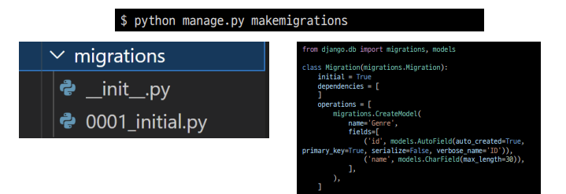

# ORM

- Object-Relational-Mapping
- 객체 지향 프로그래밍 언어를 사용하여 호환되지 않는 유형의 시스템 간의 데이터를 변환하는 프로그래밍 기술
- 파이썬에서는 SQLAlchemy,peewee 등 라이브러리가 있으며 Django 프레임워크에서는 내장 Django ORM을 활용

'객체(object)로 DB를 조작한다.'

```python
Genre.objects.all()
```

- 모델 설계

  - (1) 클래스를 생성하여 내가 원하는 DB의 구조를 만든다

    

  - (2) 클래스의 내용으로 데이터베이스에 반영하기 위한 마이그레이션 파일을 생성한다.

    

  - (3) DB에 migrate 한다.

    

- Migration(마이그레이션)
  - Model에 생긴 변화를 DB에 반영하기 위한 방법
  - 마이그레이션 파일을 만들어 DB 스키마를 반영한다.
  - 명령어
    - makemigrations : 마이그레이션 파일 생성
    - migrate : 마이그레이션을 DB에 반영

- Migrate 살펴보기

  

- 데이터베이스 조작(Database API)

  

# ORM 기본조작

- 기본적으로 ORM 을 조작하기 위해서는 아래명령어로 shell 에 진입후 실시한다.

  ```python
  python manage.py shell_plus
  ```

- Create

  ```python
  # 1. create 메서드 활용
  Genre.objects.create(name='발라드')
  
  # 2. 인스턴스 조작
  genre = Genre()
  genre.name = '인디밴드'
  genre.save()
  
  # 낱개로 생성하기
  
  Director.objects.create(name = '봉준호', debut = '1993-01-01', country ='KOR')
  Director.objects.create(name = '김한민', debut = '1999-01-01', country = 'KOR')
  Director.objects.create(name = '최동훈', debut = '2004-01-01', country = 'KOR')
  Director.objects.create(name = '이정재', debut = '2022-01-01', country = 'KOR')
  Director.objects.create(name = '이경규', debut = '1992-01-01', country = 'KOR')
  Director.objects.create(name = '한재림', debut = '2005-01-01', country = 'KOR')
  Director.objects.create(name = 'Joseph Kosinski', debut = '1999-01-01', country = 'KOR')
  Director.objects.create(name = '김철수', debut = '2022-01-01', country = 'KOR')
  
  # bulk_create 로 여러개 생성하기
  
  Director.objects.bulk_create([
      Director(name = '봉준호', debut = '1993-01-01', country ='KOR'),
      Director(name = '김한민', debut = '1999-01-01', country = 'KOR'),
      Director(name = '최동훈', debut = '2004-01-01', country = 'KOR'),
      Director(name = '이정재', debut = '2022-01-01', country = 'KOR'),
      Director(name = '이경규', debut = '1992-01-01', country = 'KOR'),
      Director(name = '한재림', debut = '2005-01-01', country = 'KOR'),
      Director(name = 'Joseph Kosinski', debut = '1999-01-01', country = 'KOR'),
      Director(name = '김철수', debut = '2022-01-01', country = 'KOR')
      ])
  
  # 인스턴스로 추가하기
  
  genres = ['액션','드라마','사극','범죄','스릴러','SF','무협','첩보','재난']
  
  for gen in genres:
      genre = Genre()
      genre.title = gen
      genre.save()
  ```

- Read

  ```python
  # 1. 전체 데이처 조회
  Genre.objects.all()
  # <QuerySet [<Genre: Genre object (1)>, <Genre: 
  Genre object (2)>]>
  
  director = Director.objects.all()
  for dir in director:
      print(dir.name,dir.debut,dir.country)
  
  # 2. 일부 데이터 조회(get)
  Genre.objects.get(id=1)
  # <Genre: Genre object (1)>
  
  data = Director.objects.get(id=1)
  print(data.name,data.debut,data.country)
  
  # 3. 일부 데이터 조회(filter)
  Genre.objects.filter(id=1)
  # <QuerySet [<Genre: Genre object (1)>]>
  
  data = Director.objects.filter(country='KOR')
  for da in data:
      print(da.name,da.debut,da.country)
  ```

- Update

  ```python
  # 1. genre 객체 활용
  genre = Genre.objects.get(id=1)
  
  # 2. genre 객체 속성 변경
  genre.name = '트로트'
  
  # 3. genre 객체 저장
  genre.save()
  
  data = Director.objects.get(name='Joseph Kosinski')
  data.country = 'USA'
  data.save()
  ```

- Delete

  ```python
  # 1. Genre클래스 에서 호출하여 삭제
  Genre.objects.get(id=1).delete()
  
  # 2. genre 객체 활용하여 삭제
  genre = Genre.objects.get(id=1)
  genre.delete()
  ```

  