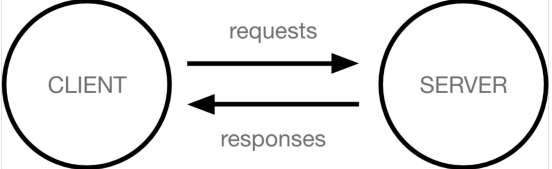

# Django 시작하기

### 지금까지 우리는

- python도 익숙하고 HTML, CSS도 배워서 웹 페이지도 구성할 수 있는 상태이다

  하지만 웹 서비스 하나 만들어줄 수 있어? 라고 묻는다면?

- '웹 서비스 개발' 에는 무엇이 필요할까?
  - 로그인, 로그아웃, 회원관리, 데이터베이스, 서버, 클라이언트, 보안 등
  - 너무 많은 기술들이 필요 -> 이걸 어떻게 다 만들어야 할까?
  - 모든 걸 직접 만들 필요 없음
  - 잘 만들어진 것들을 가져다가 좋은 환경에서 잘 쓰기만 하면 되는 세싱
    - '거인의 어깨 위에서 프로그래밍하기'

### Framework 이해하기

- 누군가 만들어 놓은 코드를 재사용 하는 것은 이미 익숙한 개발 문화

- 그렇다면 웹 서비스 도 누군가 개발해 놓은 코드를 재사용하면 된다

- 전 세계의 수많은 개발자들이 이미 수없이 많이 개발해 봤고,

  그 과정에서 자주 사용되는 부분들을 재사용 할 수 있게 좋은 구조의 코드로 만들어 두었음

- 그러한 코드들을 모아 놓은 것, 즉 서비스 개발에 필요한 기능들을 미리 구현해서 모아 놓은 것 = 프레임워크
- Frame + Work
  - 일정한 뼈대, 틀을 가지고 일하다
  - 제공받은 도구들과 뼈대, 규약을 가지고 무언가를 만드는 일
  - 특정 프로그램을 개발하기 위한 여러 도구들과 규약을 제공하는 것
- 소프트웨어 프레임워크 는 복잡한 문제를 해결하거나 서술하는 데 사용되는 기본 개념 구조
- 따라서 Framework를 잘 사용하기만 하면 웹 서비스 개발에 있어서 모든 것들을 하나부터 열까지 직접 개발할 필요 없이 내가 만들고자 하는 본질에 집중해 개발할 수 있음

- 소프트웨어의 생산성과 품질을 높임

### 여러가지 Web Framework

- 웹 서비스를 만들 수 있는 다양한 프레임워크
- 2020년 github star 수 기준 인기 프레임워크 순위

### Django를 배워야하는 이유

- Python으로 작성된 프레임워크
  - Python이라는 언어의 강력함과 거대한 커뮤니티
- 수많은 여러 유용한 기능들
- 검증된 웹 프레임워크
  - 화해, Toss, 두나무, 당근 마캣, 요기요 등
  - 유명한 많은 서비스들이 사용한다는 것 == 안정적으로 서비스를 할 수 있다는 검증

# Web 이해하기

### WWW (World Wide Web)

- 인터넷이란?
  - 우리가 구글에 접속할 때
    - 웹 브라우저를 켠다
    - 주소창에 주소를 입력한다 (www.google.com)
  - www, 즉 World Wide Web은 '전 세계에 퍼져 있는 거미줄 같은 연결망'

# 클라이언트와 서버

### 클라이언트-서버

- 오늘날 우리가 사용하는 대부분의 웹 서비스는 클라이언트-서버 구조를 기반으로 동작
- 클라이언트와 서버 역시 하나의 컴퓨터이며 이들이 어떻게 상호작용하는지에 대한 간소화된 다이어그램은 다음과 같음

- 클라이언트

  - 웹 사용자의 인터넷에 연결된 장치 (예를 들어 wi-fi에 연결된 컴퓨터 또는 모바일)
  - chrome 또는 Firefox와 같은 웹 브라우저
  - 서비스를 요청하는 주체

- 서버

  - 웹 페이지, 사이트 또는 앱을 저장하는 컴퓨터

  - 클라이언트가 웹 페이지에 접근하려고 할 때 서버에서 클라이언트 컴퓨터로

    웹 페이지 데이터를 응답해 사용자의 웹 브라우저에 표시됨

  - 요청에 대해 서비스를 응답하는 주체

- 상호작용 예시

  - 예를 들어, 우리가 Google 홈페이지에 접속한다는 것은 무엇을 뜻하는지 알아보자

  - 결론적으로 인터넷에 연결된 전세계 어딘가에 있는 구글 컴퓨터에게

    Google 홈페이지.html 파일을 달라고 요청하는 것

  - 그러면 구글 컴퓨터는 우리의 요청을 받고 Google 홈페이지.html 파일을 인터넷을 통해서 우리 컴퓨터에게 응답해줌
  - 그렇게 전달받은 Google 홈페이지.html 파일을 웹 브라우저가 우리가 볼 수 있도록 해석해주는 것

- 여기서 Google 홈페이지.html 을 달라고 요청한 컴퓨터, 웹 브라우저를 클라이언트 라고 하고 Google홈페이지.html 파일을 제공한 컴퓨터, 프로그램을 서버라고 함

- 어떠한 자원(resource)를 달라고 요청(request)하는 쪽을 클라이언트라고 하고 자우너을 제공해주는 쪽을 서버라고함

- 우리가 사용하는 웹은 클라이언트-서버 구조로 이루어져 있음

- 앞으로 우리가 배우는 것도 클라-서버 구조를 만드는 방법을 배우는 것

- 이 중에서 Django는 서버를 구현하는 웹 프레임워크

# Web browser와 Web page

### 웹 브라우저란?

- 웹에서 페이지를 찾아 보여주고, 사용자가 하이퍼링크를 통해 다른 페이지로 이동할 수 있도록 하는 프로그램
- 웹 페이지 파일을 우리가 보는 화면으로 바꿔주는(렌더링, rendering) 프로그램

### 웹브라우저 예시

- 우리가 보고 있는 웹 페이지는 사실 HTML 문서 파일 하나

- google 홈페이지를 예로 들면 우리는 구글 로고가 있는 예쁜 화면을 보지만,

  사실 빼곡한 코드로 작성된 HTML 문서를 서버로 부터 전달받게 됨

- 즉, 웹 페이지 코드를 받으면 우리가 보는 화면처럼 바꿔주는 것이 바로 웹 브라우저
- HTML / CSS / JS 등의 코드를 읽어 실제 사람이 볼 수 있는 화면으로 만들어 줌

### 웹 페이지란?

- 웹에 있는 문서
  - 우리가 보는 화면 각각 한 장 한 장이 웹 페이지
- 웹 페이지 종류
  - 정적 웹 페이지
  - 동적 웹 페이지

### 정적 웹 페이지

- Static Web page
- 있는 그대로를 제공하는 것(served as-is)을 의미
- 우리가 지금까지 작성한 웹 페이지이며 한 번 작성된 HTML 파일의 내용이 변하지 않고 모든 사용자에게 동일한 모습으로 전달되는 것
  - == 서버에 미리 저장된 HTML 파일 그대로 전달된 웹 페이지
  - == 같은 상황에서 모든 사용자에게 동일한 정보를 표시

### 동적 웹 페이지

- Dynamic Web page

- 사용자의 요청에 따라 웹 페이지에 추가적인 수정이 되어 클라이언트에게 전달되는 웹 페이지

- 웹 페이지의 내용을 바꿔주는 주체 == 서버

  - 서버에서 동작하고 있는 프로그램이 웹 페이지를 변경해줌

    이렇게 사용자의 요청을 받아서 적절한 응답을 만들어주는 프로그램을

    쉽게 만들 수 있게 도와주는 프레임워크가 바로 우리가 배울 Django