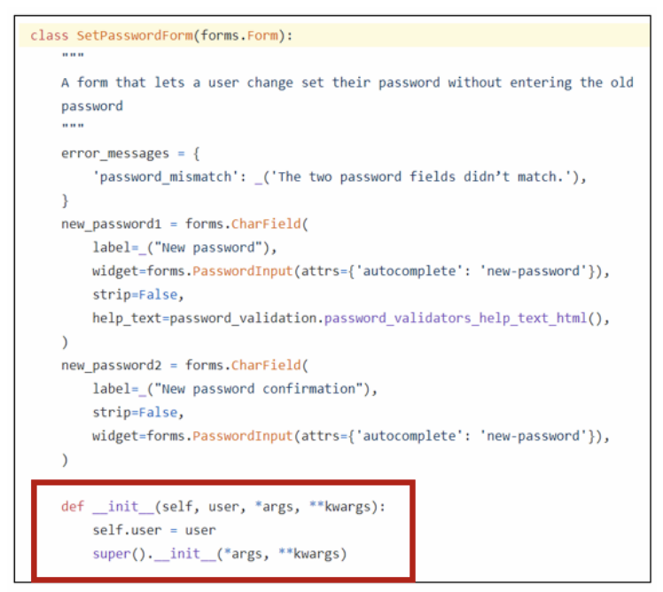

# 회원정보 수정

### UserChangeForm

- 사용자의 정보 및 권한을 변경하기 위해 admin 인터페이스에서 사용되는 ModelForm
- UserChangeForm 또한 ModelForm 이기 때문에 instance 인자로 기존 user 데이터 정보를 받는 구조 또한 동일함
- 이미 이전에 CustomUserChangeForm으로 확장했기 때문에 CustomUserChangeForm을 사용하기

- UserChangeForm 역시 ModelForm으로 구성되어 있어. User 모델 정보를 변경하여 활용해야 함

  ```python
  # accounts/forms.py
  
  from django.contrib.auth import get_user_model
  from django.contrib.auth.forms import UserChangeForm
  
  class CustomUserChangeForm(UserChangeForm):
      
      class Meta(UserChangeForm.Meta):
          model = get_user_model()
          
  # accounts/urls.py
  
  app_name = 'accounts'
  urlpatterns = [
      ...,
      path('update/', views.update, name='update'),
  ]
  
  # accounts/views.py
  
  def update(request):
      if request.method == 'POST'
      	pass
      else:
          form = CustomUserChangeForm(instance=request.user)
      context = {
          'form' : form
      }
      return render(request, 'accounts/update.html', context)
  ```

  ```django
  <!--accounts/update.html-->
  
  
  
  <h1>
      회원정보 수정
  </h1>
  <form action='' method='POST'>
      
      {{ form.as_p }}
      <input type='submit'>
  </form>
  
  
  <!-- base.html 회원정보 수정 페이지 링크 작성-->
  <div class='container'>
      <a href=''>Signup</a>
      <a href=''>회원정보 수정</a>
      <hr>
      
      
  </div>
  ```

### CustomUserChangeForm fields 재정의

- UserChangeForm은 실제 관리자 화면에서 활용 중인 form으로 세부 필드들이 모두 노출되는 것을 확인할 수 있음

- 직접 fields를 정의하여 원하는 형식으로 활용 가능함

- User 모델의 fields명은 어떻게 알 수 있을까?

  ```python
  # accounts/forms.py
  
  class CustomUserChangeForm(UserChangeForm):
      
      class Meta(UserChangeForm.Meta):
          model = get_user_model()
          fields = ???
  ```

- 수정하고자 하는 필드 작성 후 출력 확인

  ```python
  # accounts/forms.py
  
  class CustomUserChangeForm(UserChangeForm):
      
      class MEta(UserChangeForm.Meta):
          model = get_user_model()
          fields = ('email', 'first_name', 'last_name',)
  ```

### 회원정보 수정 로직 작성

- 작성 후 실제 회원정보가 수정되었는지 확인

  ```python
  # accounts/views.py
  
  def update(reqeust):
      if request.method == 'POST':
          form = CustomUserChangeForm(request.POST, instance=request.user)
          # form = CustomUserChangeForm(data=request.POST, instance=request.user)
          if form.is_valid():
              form.save()
              return redirect('articles:index')
      else:
          form = CustomUserChangeForm(instance=request.user)
      context = {
          'form' : form,
       }
      return render(request, 'accounts/update.html', context)
              
  ```

### User model 상속 구조 살펴보기

- UserChangeForm 클래스 구조 

  - Meta클래스를 보면 User 라는 model을 참조하는 ModelForm 이라는 것을 확인할 수 있음
  - https://github.com/django/django/blob/main/django/contrib/auth/forms.py#L147

  ```python
  class UserChangeForm(forms.ModelForm):
      password = ReadOnlyPasswordHashField(
          label=_("Password"),
          help_text=_(
              "Raw passwords are not stored, so there is no way to see this "
              "user’s password, but you can change the password using "
              '<a href="{}">this form</a>.'
          ),
      )
  
      class Meta:
          model = User
          fields = "__all__"
          field_classes = {"username": UsernameField}
  
      def __init__(self, *args, **kwargs):
          super().__init__(*args, **kwargs)
          password = self.fields.get("password")
          if password:
              password.help_text = password.help_text.format("../password/")
          user_permissions = self.fields.get("user_permissions")
          if user_permissions:
              user_permissions.queryset = user_permissions.queryset.select_related(
                  "content_type"
              )
  ```

- User 클래스 구조

  - User 클래스는 Meta 클래스를 제외한 코드가 없고 AbstractUser 클래스를 상속 받고 있음
  - https://github.com/django/django/blob/main/django/contrib/auth/models.py#L405

  ```python
  class User(AbstractUser):
      """
      Users within the Django authentication system are represented by this
      model.
      Username and password are required. Other fields are optional.
      """
  
      class Meta(AbstractUser.Meta):
          swappable = "AUTH_USER_MODEL"
  ```

- AbstractUser 클래스 구조 확인

  - 클래스 변수명들을 확인해보면 회원수정 페이지에서 봤던 필드들과 일치한다는 것을 확인할 수 있음
  - https://github.com/django/django/blob/main/django/contrib/auth/models.py#L334

  ```python
  class AbstractUser(AbstractBaseUser, PermissionsMixin):
      """
      An abstract base class implementing a fully featured User model with
      admin-compliant permissions.
      Username and password are required. Other fields are optional.
      """
  
      username_validator = UnicodeUsernameValidator()
  
      username = models.CharField(
          _("username"),
          max_length=150,
          unique=True,
          help_text=_(
              "Required. 150 characters or fewer. Letters, digits and @/./+/-/_ only."
          ),
          validators=[username_validator],
          error_messages={
              "unique": _("A user with that username already exists."),
          },
      )
      first_name = models.CharField(_("first name"), max_length=150, blank=True)
      last_name = models.CharField(_("last name"), max_length=150, blank=True)
      email = models.EmailField(_("email address"), blank=True)
      is_staff = models.BooleanField(
          _("staff status"),
          default=False,
          help_text=_("Designates whether the user can log into this admin site."),
      )
      is_active = models.BooleanField(
          _("active"),
          default=True,
          help_text=_(
              "Designates whether this user should be treated as active. "
              "Unselect this instead of deleting accounts."
          ),
      )
      date_joined = models.DateTimeField(_("date joined"), default=timezone.now)
  
      objects = UserManager()
  
      EMAIL_FIELD = "email"
      USERNAME_FIELD = "username"
      REQUIRED_FIELDS = ["email"]
  ```

- 공식문서의 User 모델 Fields와 비교

  - https://docs.djangoproject.com/en/3.2/ref/contrib/auth/#user-model

  [`User`](https://docs.djangoproject.com/en/3.2/ref/contrib/auth/#django.contrib.auth.models.User) objects have the following fields:

  - `username`[¶](https://docs.djangoproject.com/en/3.2/ref/contrib/auth/#django.contrib.auth.models.User.username)

    Required. 150 characters or fewer. Usernames may contain alphanumeric, `_`, `@`, `+`, `.` and `-` characters.The `max_length` should be sufficient for many use cases. If you need a longer length, please use a [custom user model](https://docs.djangoproject.com/en/3.2/topics/auth/customizing/#specifying-custom-user-model). If you use MySQL with the `utf8mb4` encoding (recommended for proper Unicode support), specify at most `max_length=191` because MySQL can only create unique indexes with 191 characters in that case by default.

  - `first_name`[¶](https://docs.djangoproject.com/en/3.2/ref/contrib/auth/#django.contrib.auth.models.User.first_name)

    Optional ([`blank=True`](https://docs.djangoproject.com/en/3.2/ref/models/fields/#django.db.models.Field.blank)). 150 characters or fewer.Changed in Django 3.1:The `max_length` increased from 30 to 150 characters.

  - `last_name`[¶](https://docs.djangoproject.com/en/3.2/ref/contrib/auth/#django.contrib.auth.models.User.last_name)

    Optional ([`blank=True`](https://docs.djangoproject.com/en/3.2/ref/models/fields/#django.db.models.Field.blank)). 150 characters or fewer.

  - `email`[¶](https://docs.djangoproject.com/en/3.2/ref/contrib/auth/#django.contrib.auth.models.User.email)

    Optional ([`blank=True`](https://docs.djangoproject.com/en/3.2/ref/models/fields/#django.db.models.Field.blank)). Email address.

  - `password`[¶](https://docs.djangoproject.com/en/3.2/ref/contrib/auth/#django.contrib.auth.models.User.password)

    Required. A hash of, and metadata about, the password. (Django doesn’t store the raw password.) Raw passwords can be arbitrarily long and can contain any character. See the [password documentation](https://docs.djangoproject.com/en/3.2/topics/auth/passwords/).

  - `groups`[¶](https://docs.djangoproject.com/en/3.2/ref/contrib/auth/#django.contrib.auth.models.User.groups)

    Many-to-many relationship to [`Group`](https://docs.djangoproject.com/en/3.2/ref/contrib/auth/#django.contrib.auth.models.Group)

  - `user_permissions`[¶](https://docs.djangoproject.com/en/3.2/ref/contrib/auth/#django.contrib.auth.models.User.user_permissions)

    Many-to-many relationship to [`Permission`](https://docs.djangoproject.com/en/3.2/ref/contrib/auth/#django.contrib.auth.models.Permission)

  - `is_staff`[¶](https://docs.djangoproject.com/en/3.2/ref/contrib/auth/#django.contrib.auth.models.User.is_staff)

    Boolean. Designates whether this user can access the admin site.

  - `is_active`[¶](https://docs.djangoproject.com/en/3.2/ref/contrib/auth/#django.contrib.auth.models.User.is_active)

    Boolean. Designates whether this user account should be considered active. We recommend that you set this flag to `False` instead of deleting accounts; that way, if your applications have any foreign keys to users, the foreign keys won’t break.This doesn’t necessarily control whether or not the user can log in. Authentication backends aren’t required to check for the `is_active` flag but the default backend ([`ModelBackend`](https://docs.djangoproject.com/en/3.2/ref/contrib/auth/#django.contrib.auth.backends.ModelBackend)) and the [`RemoteUserBackend`](https://docs.djangoproject.com/en/3.2/ref/contrib/auth/#django.contrib.auth.backends.RemoteUserBackend) do. You can use [`AllowAllUsersModelBackend`](https://docs.djangoproject.com/en/3.2/ref/contrib/auth/#django.contrib.auth.backends.AllowAllUsersModelBackend) or [`AllowAllUsersRemoteUserBackend`](https://docs.djangoproject.com/en/3.2/ref/contrib/auth/#django.contrib.auth.backends.AllowAllUsersRemoteUserBackend) if you want to allow inactive users to login. In this case, you’ll also want to customize the [`AuthenticationForm`](https://docs.djangoproject.com/en/3.2/topics/auth/default/#django.contrib.auth.forms.AuthenticationForm) used by the [`LoginView`](https://docs.djangoproject.com/en/3.2/topics/auth/default/#django.contrib.auth.views.LoginView) as it rejects inactive users. Be aware that the permission-checking methods such as [`has_perm()`](https://docs.djangoproject.com/en/3.2/ref/contrib/auth/#django.contrib.auth.models.User.has_perm) and the authentication in the Django admin all return `False` for inactive users.

  - `is_superuser`[¶](https://docs.djangoproject.com/en/3.2/ref/contrib/auth/#django.contrib.auth.models.User.is_superuser)

    Boolean. Designates that this user has all permissions without explicitly assigning them.

  - `last_login`[¶](https://docs.djangoproject.com/en/3.2/ref/contrib/auth/#django.contrib.auth.models.User.last_login)

    A datetime of the user’s last login.

  - `date_joined`[¶](https://docs.djangoproject.com/en/3.2/ref/contrib/auth/#django.contrib.auth.models.User.date_joined)

    A datetime designating when the account was created. Is set to the current date/time by default when the account is created.

# 비밀번호 변경

### PasswordChangeForm

- 사용자가 비밀번호를 변경할 수 있도록 하는 Form
- 이전 비밀번호를 입력하여 비밀번호를 변경할 수 있도록 함
- 이전 비밀번호를 입력하지 않고 비밀번호를 설정 할 수 있는 SetPasswordForm을 상속받는 서브 클래스

- 비밀번호 변경 페이지 작성

  ```python
  # accounts/urls.py
  
  app_name = 'accounts'
  
  urlpattersn = [
      ...,
      path('password/', views.change_password, name='change_password'),
  ]
  
  # accounts/views.py
  
  from django.contrib.auth.forms import AuthenticationForm, PasswordChangeForm
  
  def change_password(request):
      if request.method=='POST':
          pass
      else:
          form = PasswordChangeForm(request.user)
      context = {
          'form' : form,
      }
      return render(request, 'accounts/change_password.html', context)
  ```

  ```django
  <!-- accounts/change_password.html -- >
  
  
  
  <h1>비밀번호 변경</h1>
  <form action='' method='POST'>
  	
  	{{ form.as_p }}
  	<input type='submit'>
  </form>
  
  ```

### [참고] SetPasswordForm 살펴보기

- PasswordChangeForm은 SetPasswordForm의 하위 클래스이기 때문에 SetPasswordForm을 확인



### 비밀번호 변경 로직 작성

- 작성 후 비밀번호 변경 확인

  - 변경 후 로그인 상태가 지속되지 못하는 문제 발생

  ```python
  # accounts/views.py
  
  def change_password(request):
      if request.method == 'POST'
          form = PasswordChangeForm(request.user, request.POST)
          if form.is_valid():
              form.save()
              return redirect('articles:index')
      else:
          form = PasswordChangeForm(request.user)
      context = {
          'form' : form,
      }
      return redner(request, 'accounts/change_password.html', context)
  ```

  

### AbstractBaseUser의 모든 subclass와 호환되는 forms

- forms.ModelForm 상속
  - UserCreationForm
  - UserChangeForm
- forms.Form 상속
  - AuthenticationForm
  - SetPasswordForm
  - PasswordChangeForm
  - AdminPasswordChangeForm

### [참고1] 회원가입 이후 로그인

- 회원가입 후 곧바로 로그인 진행

  ```python
  # accounts/views.py
  
  def signup(request):
      if request.method == 'POST':
      	form = CustomUserCreationForm(request.POST)
          if form.is_valid()
          	user = form.save()
              auth_login(request, user)
              return redirect('articles:index')
          else:
              form = CustomUserCreationForm()
          context = {
              'fomr' : form,
          }
          return render(request, 'accpunts/signup.html', context)
  ```

### [참고2] 암호 변경 시 세션 무효화 방지하기

- 비밀번호가 변경되면 기존 세션과의 회원 인증 정보가 일치하지 않게 되어 버려 로그인 상태가 유지되지 못함

- 비밀번호는 잘 변경되었으나 비밀번호가 변경 되면서 기존 세션과의 회원인증 정보가 일치하지 않기 때문

- **update_session_auth_hash(request, user)**

  - 현재 요청(current request)과 새 session data 가 파생 될 업데이트 된 사용자 객체를 가져오고, session data를 적절하게 업데이트 해줌
  - 암호가 변경되어도 로그아웃 되지 않도록 새로운 password의 session data로 session을 업데이트

  ```python
  # accounts/views.py
  
  from django.contrib.auth import update_session_auth_hash
  
  def change_password(request):
      if request.method == 'POST'
      	form = PasswordChangeForm(request.user, request.POST)
          if form.is_valid():
              form.save()
              update_session_auth_hash(request, form.user) # 이부분을 사용
              return redirect('articles:index')
      else:
          form = PasswordChangeForm(request.user)
      context = {
          'form' : form,
      }
      return render(request, 'accounts/change_password.html', context)
  ```

### [참고3] 탈퇴 하면서 해당 유저의 세션 정보도 함께 지우고 싶을 경우

- '탈퇴(1) 후 로그아웃(2)'의 순서가 바뀌면 안됨

  - 먼저 로그아웃 해버리면 해당 요청 객체의 정보가 없어지기 때문에 탈퇴에 필요한 정보 또한 없어지기 때문

  ```python
  # accounts/views.py
  
  def delete(request):
      request.user.delete() # 이순서가 중요
      auth_logout(request)
  ```

  