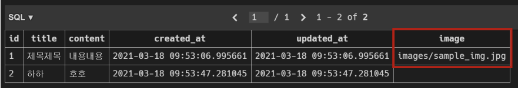

# 이미지 업로드(기본 설정)

**미디어파일**

- 사용자가 웹에서 업로드하는 정적 파일 (uesr-uploaded)
- 유저가 업로드 한 모든 정적 파일

**Media 관련필드** 

- ImageField
  - 이미지 업로드에 사용하는 모델 필드
  - FileField를 상속받는 서브 클래스이기 때문에 FileField의 모든 속성 및 메서드를 사용 가능하며 더해서 사용자에 의해 업로드 된 객체가 유효한 이미지인지 검사함
  - ImageField 인스턴스는 최대 길이가 100자인 문자열로 DB에 생성되며, max_length인자를 사용하여 최대 길이를 변경 할 수 있음
  - **[주의]** 사용하려면 반드시 Pillow 라이브러리가 필요
- FileField
  - 파일 업로드에 사용하는 모델 필드
  - 2개의 선택 인자를 가지고 있음
    - upload_to
    - storate

**모델 설정**

- upload_to

  - 문자열 경로 지정 방식

    ```python
    # models.py
    
    class Mymodel(models.Model):
        # MEDIA_ROOT/uploads/ 경로로 파일 업로드
        upload = models.FileField(upload_to='uploads/')
        # or
        # MEDAI_ROOT/uploads/2021/01/01/ 경로로 파일 업로드
        upload = models.FileField(upload_to='uploads/%Y/%m/%d/')
    ```

  - 함수 호출

    ```python
    # models.py
    
    def articles_image_path(instance, filename):
        # MEDAI_ROOT/user_<pk>/ 경로로 <filename> 이름으로 업로드
        return f'user_{instance.user.pk}/{filename}'
    
    class Article(models.Model):
        image = models.ImageField(upload_to=articles_image_path)
    ```

**URL 설정**

- settings.py 에 MEDIA_ROOT,  MEDIA_URL 설정

- upload_to 속성을 정의하여 업로드 된 파일에 사용 할 MEDIA_ROOT의 하위 경로를 지정

- **업로드 된 파일의 경로는 django 가 제공하는 'url' 속성을 통해 얻을 수 있음**

  ```django
  
  ```

- MEDIA_ROOT

- 사용자가 업로드 한 파일(미디어 파일)들을 보관할 디렉토리의 절대 경로

- django는 성능을 위해 업로드 파일은 데이터베이스에 저장하지 않음

  - 실제 데이터베이스에 저장되는 것은 파일의 경로

    ```python
    # settings.py
    
    MEDIA_ROOT = BASE_DIR / 'media'
    ```

- MEDIA_URL

- MEDIA_ROOT 에서 제공되는 미디어를 처리하는 URL

- 업로드 된 파일의 주소(URL)를 만들어 주는 역할

  - 웹 서버 사용자가 사용하는 public URL

- 비어 있지 않은 값으로 설정 한다면 반드시 slash(/)로 끝나야 함

  ```python
  # settings.py
  
  MEDIA_URL = '/media/'
  ```

- 개발 단계에서 사용자가 업로드 한 파일 제공하기

  ```python
  # urls.py
  from django.conf import settings
  from django.conf.urls.static import static
  
  urlpatterns = [
      ...,
      ...,
  ] + static(settings.MEDIA_URL, document_root=settings.MEDIA_ROOT)
  
  # 업로드 된 파일의 URL == settings.MEDIA_URL
  # 위 URL을 통해 참조하는 파일의 실제 위치 == settings.MEDIA_ROOT
  ```

  사용자가 업로드 한 파일이 우리 프로젝트에 업로드 되지만, 실제로 사용자에게 제공하기 위해서는 업로드 된 파일의 URL이 필요함

# 이미지 업로드(CREATE)

**모델 설정**

- ImageField

  - upload_to='images/'

    - 실제 이미지가 저장되는 경로를 지정

  - blank=True

    - 이미지 필드에 빈 값(빈 문자열)이 허용되도록 설정 (이미지를 선택적으로 업로드 할 수 있도록)

      ```python
      # arcitles.models.py
      
      class Article(models.Model):
          title = models.CharField(max_length=20)
          content = models.TextField()
          # saved to 'MEDIA_ROOT/images'
          image = models.ImageField(blank=True, upload_to='images/')
          created_at = models.DateTimeField(auto_now_add=True)
          updated_at = models.DateTimeField(auto_now=True)
      ```

- Model field option - 'blank'
  - 기본 값 : False
  - True 인 경우 필드를 비워 둘 수 있음
    - DB에는 빈 문자열이 저장됨
  - 유효성 검사에서 사용 됨 (is_valid)
    - 필드에 blank=True 가 있으면 form 유효성 검사에서 빈 값을 입력할 수 있음

- Model field option = 'null'
  - 기본 값 : False
  - True면 django는 빈 값을 DB에 NULL 로 저장
  - 주의 사항
    - CharField, TextField와 같은 문자열 기반 필드에는 사용하는 것을 피해야 함
    - 문자열 기반 필드에 True로 설정 시 '데이터 없음(no-data)'에 '빈 문자열(1)' 과 'NULL(2)' 의 2가지 가능한 값이 있음을 의미하게 됨
    - 대부분의 경우 '데이터 없음'에 대해 두 개의 가능한 값을 갖는 것은 중복되며, Django는 NULL이 아닌 빈 문자열을 사용하는 것이 규칙

- black & null 비교
  - blank
    - Validation-rerated
  - null
    - Database-related
  - 문자열 기반 및 비문자열 기반 필드 모두에 대해 null option은 DB에만 영향을 미치므로, form에서 빈 값을 허용하려면 blank=True를 설정해야 함

- 마이그레이션 실행

  (단 , ImageField를 사용하기 위해서는 Pillow 라이브러리 설치 필요)

  ```bash
  $ pip install Pillow
  
  $ python manage.py makemigrations
  $ python manage.py migrate
  
  $ pip freeze > requirements.txt
  ```

**HTML 설정**

- 게시글 작성 form enctype 속성 지정

```django
<!--articles/create.html-->

<form action='' method='POST' enctype='multipart/form-data'>
    
    {{ form.as_p }}
    <input type='submit' value='작성'>
</form>
```

- form 요소 - enctype(인코딩) 속성

  - multipart/form-data
    - 파일/이미지 업로드 시에 반드시 사용해야 함 (전송되는 데이터의 형식을 지정)
    - < input type='file'>을 사용할 경우에 사용
  - application/x-www-form-urlencoded
    - (기본값) 모든 문자 인코딩
  - text/plain
    - 인코딩을 하지 않은 문자 상태로 전송
    - 공백은 '+' 기호로 변환하지만, 특수 문자는 인코딩 하지 않음

- input 요소의 accept속성 확인

  

**View 설정**

- 업로드 한 파일은 request.FILES 객체로 전달됨

  ```python
  views.py
  
  @require_http_methods(['GET','POST'])
  def create(request):
      if request.method == 'POST'
      	form = ArticleForm(request.POST, request.FILES)
          # form = ArticleForm(data=request.POST, files=request.FILES)
          if form.is_valid():
              article.save()
              return redirect('articles:detail', article.pk)
      else:
          form = ArticleForm()
      context = {
          'form' : form,
      }
      return render(request, 'articles/create.html', context)
  ```

- DB 및 파일 트리 확인

- 실제 파일 위치

  - MEDIA_ROOT/images/

  


# 이미지 출력(READ)

**img 태그 활용**

- article.image.url == 업로드 파일의 경로

- article.image == 업로드 파일의 파일 이름

  ```django
  <!--detail.html-->
  
  
  
  
  	<h2 class='text-center'>
          DETAIL
  	</h2>
  	<h3>
          {{ article.pk }} 번 글
  	</h3>
  	
  	<hr>
  	...
  
  ```

# 이미지 업로드(UPDATE)

**이미지 수정하기**

- 이미지는 바이너리 데이터(하나의 덩어리)이기 때문에 텍스트처럼 일부만 수정 하는 것은 불가능하고, 새로운 사진으로 덮어 씌우는 방식을 사용

```django
<!--articles/update.html-->



    <h1>
        UPDATE
    </h1>
    <form action='' method='POST' enctype='multipart/form-data'>
        
        {{ form.as_p }}
        <button>
            수정
        </button>
    </form>
    <hr>
    <a href=''>[back]</a>

```

```python
# views.py

@require_http_methods(['GET', 'POST'])
def update(request, pk):
    article = get_object_or_404(Article, pk=pk)
    if request.method == 'POST':
        form = ArticleForm(request.POST, request.FILES, instance=article)
        if form.is_valid():
            form.save()
            return redirect('artciels:index', article.pk)
    else:
        form = ArticleForm(instance=article)
    context = {
        'article' : article,
        'form' : form,
    }
    return render(request, 'articles/update.html', context)
```

# 이미지 Resizing

**Django-imagekit**

- 실제 원본 이미지를 서버에 그대로 업로드 하는 것은 서버의 부담이 크다.

- < img> 태그에서 직접 사이즈를 조정할 수도 있지만 (width 와 height),

  업로드 될 때 이미지 자체를 resizing 하는 것을 사용해 볼 것

- django-imagekit 라이브러리 활용

- 1. django-imagekit 설치
  2. INSTALLED_APPS에 추가

  ```bash
  $ pip install django-imagekit
  $ pip freeze > requirements.txt
  ```

  ```python
  # settings.py
  
  INSTALLED_APP = [
      ...,
      'imagekit',
      ...
  ]
  ```

  3. 이미지 크기 변경하기

  ```python
  # models.py
  
  from imagekit.models import ProcessedImageField
  from imagekit.processors import Thumbnail
  
  class Article(models.Model):
      title = models.CharField(max_lenth=10)
      content = models.TextField()
      image=ProcessedImageField(
          upload_to='images/',
      	blank = True,
          processors=[Thumbnail(200,300)],
          format='JPEG',
          options={'quality' : 90},
      )
      created_at = models.DateTimeField(auto_now_add=True)
      updated_at = models.DateTimeField(auto_now=True)
      
      def __str__(self):
          return slef.title
  ```

  이후에 makemigrations migrate 실행

  ```bash
  $ python manage.py makemigrations
  $ python manage.py migrate
  ```

  ProcessedImageField()의 parameter로 작성된 값들은 변경이 되더라도 다시 makemigrations를 해줄 필요없이 즉시 반영 됨

### 관계 모델 참조

**Related manager**

- Related manager는 1:N 혹은 M:N 관계에서 사용 가능한 문맥(context)
- Django는 모델 간 1:N 혹은 M:N 관계가 설정되면 역참조할 때에 사용할 수 있는 manager를 생성
  - 이전에 모델 생성 시 objects라는 매니저를 통해 queryset api를 사용했던 것처럼 related manager를 통해 queryset api를 사용할 수 있게 됨
- 지금은 1:N 관계에서의 related manager 만을 학습할 것

**역참조**

- 나를 참조하는 테이블(나를 외래 키로 지정한)을 참조하는 것
- 즉, 본인을 외래 키로 참조 중인 다른 테이블에 접근하는 것
- 1:N 관계에서는 1이 N을 참조하는 상황
  - 외래 키를 가지지 않은 1이 외래 키를 가진 N을 참조

```bash
article.comment_set.method()
```

- Article 모델이 Comment 모델을 참조(역참조)할 때 사용하는 매니저
- article.comment 형식으로는 댓글 객체를 참조 할 수 없음
  - 실제로 Article 클래스에는 Comment와의 어떠한 관계도 작성되어 있지 않음
- 대신 Django가 역참조 할 수 있는 comment_set manager를 자동으로 생성해 article.comment_set 형태로 댓글 객체를 참조할 수 있음
  * 1:N 관계에서 생성되는 Related manager의 이름은 참조하는 '모델명_set' 이름 규칙으로 만들어짐
- 반면 참조상황(Comment->Article)에서는 실제 ForeignKey 클래스로 작성한 인스턴스가 Comment 클래스의 클래스 변수이기 때문에 comment.article 형태로 작성 가능

