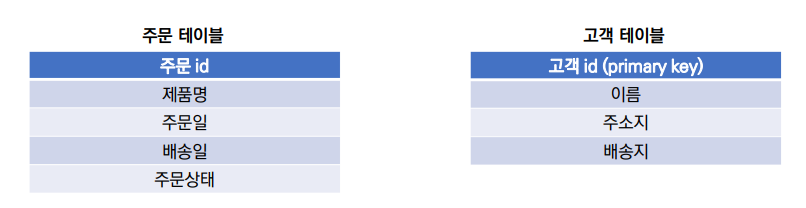
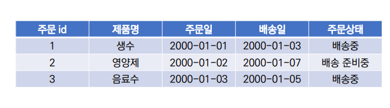
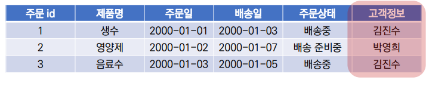
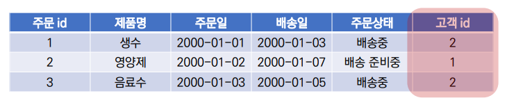
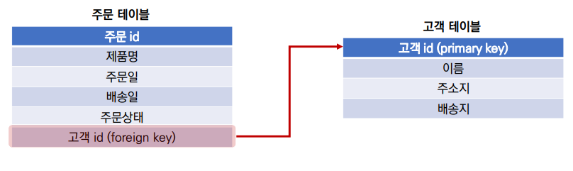
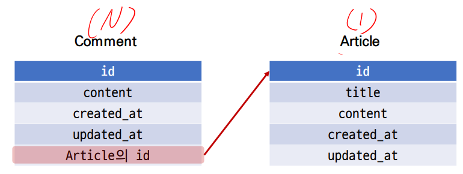
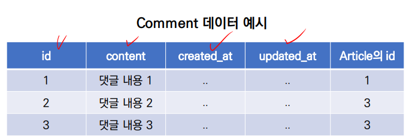
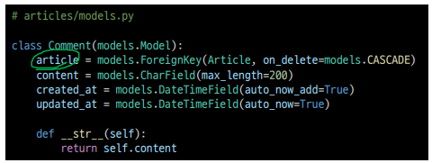
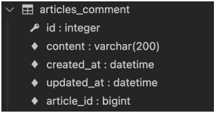

### 1:N relationship (A one-to-many relationship)

**RDB(관계형 데이터베이스) 복습**

- 데이터를 테이블, 행, 열 등으로 나누어 구조화하는 방식
- RDB의 모든 테이블에는 행에서 고유하게 식별 가능한 '기본키' 속서이 있으며,  '외래키' 를 사용하여 각 행에서 서로 다른 테이블 간의 관계를 만드는데 사용할수 있음

**테이블 간 관계**

- 주문서비스 데이터베이스 : 고객 테이블, 주문 테이블
  - 고객 테이블 : 고객 정보(이름, 주소 정보)
  - 주문 테이블 : 주문 정보(제품, 주문/배송 정보)



- 고객이 제품을 주문하는 경우 주문 테이블에 레코드가 생성됨
- 주문 정보가 아래의 테이블처럼 기록되어 있을 때 고객 정보는 어떻게 표현할까?



- 고객 정보(이름) 기록

  

  - 하지만 이렇게 이름으로 저장할 경우 이름이 같은 다른 사용자를 구분할 수 없음
  - 그렇다면 고객 정보의 어떤 데이터를 사용하는 것이 적합할까?

- 고객 정보(id) 기록

  

  - 외래 키(Foreign Key, FK) : 관계형 데이터베이스에서 다른 테이블의 행을 식별할 수 있는 필드(키)



**RDB에서의 관계**

- 1:1
  - 한 테이블의 레코드 하나가 다른 테이블의 레코드 단 한 개와 관련된 경우
- 1:N
  - 한 테이블의 0개 이사의 레코드가 다른 테이블의 레코드 한 개와 관련된경우
- M:N
  - 한 테이블의 0개 이상의 레코드가 다른 테이블의 0개 이상의 레코드와 관련된 경우
  - 양쪽 모두에서 1:N 관계를 가짐

### Foreign Key

- 외래 키(외부 키)
- 관계형 데이터베이스에서 다른 테이블의 행을 식별할 수 있는 키
- 참조되는 테이블의 기본 키(Primary Key)를 가리킴
- 참조하는 테이블의 행 1 개의 값은, 참조되는 측 테이블의 행 값에 대응됨
  - 이 때문에 참조하는 테이블의 행에는, 참조되는 테이블에 나타나지 않는 값을 포함할 수 없음
- 참조하는 테이블 행 여러 개가, 참조되는 테이블의 동일한 해을 참조할 수 있음

**특징**

- 키를 사용하여 부모 테이블의 유일한 값을 참조 (참조 무결성)
  - 참조 무결성 : 데이터베이스 관계 모델에서 관련된 2개의 테이블 간의 일관성
    - 외래 키가 선언된 테이블의 외래 키 속성의 값은 해당 테이블의 기본 키 값으로 존재
- 외래 키의 값이 반드시 부모 테이블의 기본 키 일 필요는 없지만 **유일한 값**이어야 함

### 1:N (Article - Comment)

### 모델 관계 설정

- 게시판의 게시글과 1:N 관계를 나타낼 수 있는 댓글 구현
- 1:N 관계에서 Article 모델은 1, Comment 모델은 N이 될 것
  - 게시글(1)은 댓글을 0개 이상 가진다.
    - 게시글(1)은 여러 개의 댓글(N)을 가진다.
    - 게시글(1)은 댓글을 가지지 않을 수도 있다.
  - 댓글은 반드시 하나의 게시글에 속한다. 



- comment 테이블에 데이터가 다음과 같이 작성되었다면 1번 게시글에는 1개의 댓글이, 3번 게시글에는 2개의 댓글이 작성된 것이다

  

**Django Relationshil fields 종류**

- OneToOneField()
  - A one-to-one relationsship
- ForeignKey()
  - A one-to-many relationship
- ManyToManyField()
  - A many-to-many relationship

**ForeignKey(to, on_delete, ** ** **options)**

- A one-to-many relationship을 담당하는 Django의 모델 필드 클래스
- Django 모델에서 관계형 데이터베이스의 외래 키 속성을 담당
- 2개의 필수 위치 인자가 필요
  - 참조하는 model class
  - on_delete 옵션

**ForeignKey - on_delete**

- 외래 키가 참조하는 객체가 사라졌을 때, 외래 키를 가진 객체를 어떻게 처리할 지를 정의
- 데이터 무결성을 위해서 매우 중요한 설정
- on_delete 옵션 값
  - CASCADE : 부모 객체(참조 된 객체)가 삭제 됐을 때 이를 참조하는 객체도 삭제
  - PROTECT, SET_NULL, SET_DEFAULT 등 여러 옵션 값들이 존재
  - 수업에서는 CASCADE 값만 사용할 예정

**Comment 모델 정의**

- 외래 키 필드는 ForeignKey 클래스를 작성하는 위치와 관계없이 필드의 마지막에 작성됨
- ForeignKey() 클래스의 인스턴스 이름은 참조하는 모델 클래스 이름의 단수형(소문자) 으로 작성하는 것을 권장



**Migration 진행**

- models.py 에서 모델에 대한 수정사항이 발생했기 때문에 migration 과정을 진행

  ```bash
  $ python manage.py makemigrations
  
  # migrate 진행
  $ python manage.py migrate
  ```

- migrate 후 Comment 모델 클래스로 인해 생성된 테이블 확인

  

- ForeignKey 모델 필드로 인해 작성된 컬럼의 이름이 article_id 인것을 확인
- 만약 ForeignKey 인스턴스를 article이 아닌 abcd로 생성 했다면 abcd_id 로 만들어짐
  - 이처럼 명시적인 모델 관계 파악을 위해 참조하는 클래스 이름의 소문자로 작성하는 것이 권장

### [참고]

- Shell_plus 사용방법
- django-extensions 를 pip를 통해 설치
- 메인 settings.py의 INSTALLED_APPS 에 'django_extensions' 를 추가
- python manage.py shell_plus를 통해 실행
- shell과 shell_plus의 차이점
  - shell - 불러올 모델을 한개씩 작성해줘야함
  - shell_plus - 모델을 별도로 작성하지 않아도 자동으로 모델을 불러옴

#### **ForeignKey arguments - related_name**

- ForeignKey 클래스의 선택 옵션

- 역참조 시 사용하는 매니저 이름(model_set manager)을 변경할 수 있음

- 작성 후, migration과정이 필요

  ```python
  # articles/models.py
  
  class Comment(models.Model):
      article = models.ForeignKey(Article, on_delete=models.CASCADE, related_name='comments')
  ```

  위와 같이 **related_name = 'comments'**로 변경하게 되면 기존에 article에서 comment를 역참조할때에 사용했던 명령문인 **article.comment_set**은 더이상 사용할 수 없고 **article.comments**로 대체된다.

#### admin.site 등록

- 새로 작성한 Comment모델을 admin.site에 등록하기

  ```python
  # articles/admin.py
  
  from .models import Article, Comment
  
  admin.site.register(Article)
  admin.site.register(Comment)
  ```

#### Comment 구현

- 사용자로부터 댓글 데이터를 입력 받기 위한 CommentForm  작성

  ```python
  # articles/forms.py
  
  from .models import Article, Comment
  
  class CommentForm(forms.ModelForm):
      
      class Meta:
          model = Comment
          fields = ['content']
          
  # articles/views.py
  
  from .forms import ArticleForm, CommentForm
  
  def detail(request, pk):
      article = Article.objects.get(pk=pk)
      if request.method == 'POST':
          comment_form = CommentForm(request.POST)
          if comment_form.is_valid():
              comments = comment_form.save(commit=False)
              comments.user = request.user
              comments.article = article
              comments.save()
              return redirect('articles:detail', pk)
      else:
          comment_form = CommentForm()
      comments = article.comments_set.order_by('-pk')
      context = {
         'article' : article,
         'comment_form' : comment_form,
         'comments' : comments
      }
      return render(request, 'articles/detail.html', context)
  ```

  ```html
  <!-- articles/detail.html-->
  
  
  
  
  <h1>
      articles detail페이지 입니다.
  </h1>
  <div>
      <h3>
          {{ article.title }}
      </h3>
      <p>
          {{ article.content }}
      </p>
      
  </div>
  <form action='' method='POST'>
      
      
      <input type='submit' value='댓글작성'>
  </form>
  <h3>
      댓글목록
  </h3>
  
  <p>
      {{ comment.content }}
  </p>
  <hr>
  
  
  ```

#### Comment Delete 구현

```python
# articles/urls.py

urlpatterns = [
    ...,
    path('<int:a_pk>/comments/<int:c_pk>', views.c_delete, name='c_delete'),
]

# articles/views.py

def c_delete(request, a_pk, c_pk):
    comment = Comment.objects.get(pk=c_pk)
    comment.delete()
    return redirect('articles:detail', a_pk)
```

```html
<!-- articles/detail.html-->

<h3>
    댓글목록
</h3>

<p>
    {{ c.content }} | 
    <a href=''>
    	댓글삭제
    </a>
</p>

```

#### Comment 추가 사항

- 댓글 개수 출력하기
  - DTL filter - length 사용
  - Queryset API - count() 사용

- 댓글이 없는 경우 대체 컨텐츠 출력

**댓글 개수 출력하기**

- DTL filter - length 사용

  ```django
  {{ comments|length }}
  
  {{ article.comment_set.all|length }}
  ```

- QuerysetAPI - count() 사용

  ```django
  {{ comments.count }}
  
  {{ article.comment_set.count }}
  ```

- detail 템플릿에 작성하기

  ```django
  <!-- articles/detail.html-->
  
  <h4>
      댓글 목록
  </h4>
  
  <p>
      <b>{{ comments|length }}개의 댓글이 있습니다.</b>
  </p>
  
  ```

**댓글이 없는 경우 대체 컨텐츠 출력하기**

- DTL for empty 활용하기

  ```html
  <!--articles/detail.html-->
  
  
  <p>
      {{ comment.content }}
  </p>
  
  <p>
      댓글이 없어요..
  </p>
  
  ```

  


