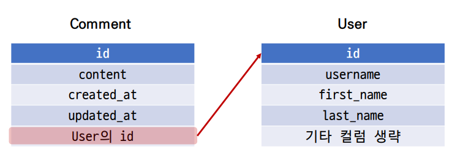
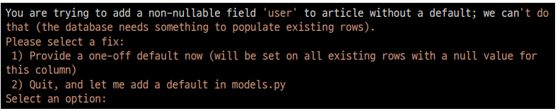
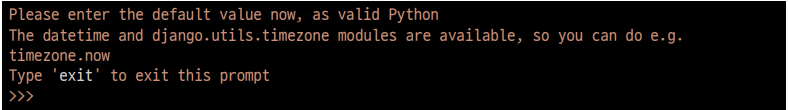
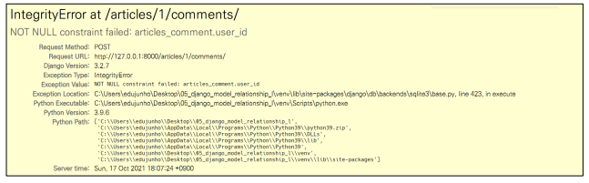

### 1:N (User - Comment)

- User(1) - Comment(N)
- User 모델과 Comment 모델 간 관계 설정
- 0 개 이상의 댓글은 1개의 회원에 의해 작성 될 수 있음

### 모델 관계 설정



- Comment 모델에 User 모델을 참조하는 외래 키 작성

  ```python
  # articles/models.py
  
  class Comment(models.Model):
      article = models.ForeignKey(Article, on_delete=models.CASCADE)
      user = models.ForeignKey(settings.AUTH_USER_MODEL, on_delete=models.CASCADE)
  ```

**Migration 진행**

- 이전에 User와 Article모델 관계 설정 때와 마찬가지로 기존에 존재하던 테이블에 새로운 컬럼이 추가되어야 하는 상황이기 때문에 migrations 파일을 만들기위해 makemigrations를 진행한다

  ```bash
  $ python manage.py makemigrations
  ```

- 첫번째 화면

  - 기본적으로 모든 컬럼은 NOT NULL 제약조건이 있기 때문에 데이터가 없이는 새로 추가되는 외래 키 필드 user_id가 생성되지 않음

  - 그래서 기본값을 어떻게 작성할 것인지 선택해야 함

  - 1을 입력하고 진행

    

- 두번째 화면

  - comment의 user_id에 어떤 데이터를 넣을 것인지 직접 입력해야 함

  - 마찬가지로 1 입력하고 진행

  - 기존에 작성된 댓글이 있다면 모두 1번 회원이 작성한 것으로 처리됨

    

- migrations 파일 생성 후 migrate 진행

  ```bash
  $ python manage.py migrate
  ```

### Comment CREATE

-  인증된 회원의 댓글 작성 구현하기
- 작성하기 전 로그인을 먼저한 상태로 진행

- CommentForm의 출력 필드 수정

  ```python
  # articles/forms.py
  
  class CommentForm(forms.ModelForm):
      
      class Meta:
          model = Comment
          exclude = ('article', 'user')
  ```

- 외래 키 데이터 누락

  - 댓글 작성 시 NOT NULL constraint failed: articles_comment.user_id 에러 발생

    

  - NOT NULL 제약 조건이 실패했다. articles_comment 테이블의 user_id 컬럼에서

  - 댓글 작성 시 외래 키에 저장되어야 할 작성자 정보가 누락 되었기 떄문

  - 댓글 작성 시 작성자 정보가 함께 저장될 수 있도록 save의 commit 옵션을 활용

    ```python
    # articles/views.py
    
    def detail(request, pk):
        article = Article.objects.get(pk=pk)
        if request.method=='POST':
            form = CommentForm(request.POST)
            if form.is_valid():
                forms = form.save(commit=False)
                forms.user = request.user
                forms.article = article.pk
                forms.save()
                return redirect('articles:detail', pk)
        else:
            form = CommentForm()
        context = {
            'form' : form,
            'articles' : article,
        }
        return render(request, 'articles/detail.html', context)
    ```

### Comment READ(출력)

```html
<!-- articles/detail.html-->




<h4>
    댓글 목록
</h4>

<p>
    {{ comment.user }} | {{ comment.content }} |
    <a href='' class='btn btn-light'>
    	삭제하기
    </a>
</p>

```

