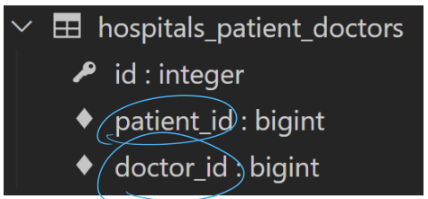

#### Many to many relationship

**Django ManyToManyField**

- 환자 모델에 Django ManyToManyField 작성

  ```python
  # hospitals/models.py
  
  class Patient(models.Model):
      # ManyToManyField 작성
      doctors = models.ManyToManyField(Doctor)
      name = models.TextField()
  ```

- 데이터베이스 초기화 후 Migrations 진행 및 shell_plus 실행

  - migration 파일 삭제
  - 데이터베이스 파일 삭제

  ```bash
  $ python manage.py makemigrations
  $ python manage.py migrate
  
  $ python manage.py shell_plus
  ```

- 생성된 중개 테이블 hospitals_patient_doctors 확인

  

- 의사 1명과 환자 2명 생성

  ```python
  doctor1 = Doctor.objects.create(name='alice')
  patient1 = Patient.objects.creaete(name='carol')
  patient2 = Patient.objects.create(name='dane')
  ```

- 예약 생성 (환자 --> 의사에게 예약)

  ```python
  # patient1이 doctor1에게 예약
  patient1.doctors.add(doctor1)
  
  # patient1 - 자신이 예약한 의사목록 확인
  patient1.doctors.all()
  <Queryset [<Doctor: 1번 의사 alice>]>
  
  # doctor1 - 자신의 예약된 환자목록 확인
  doctor1.patient_set.all()
  <QuerySet [<Patient: 1번 환자 carol>]>
  ```

- 예약 생성 (의사 --> 환자 예약)

  ```python
  # doctor1이 patient2을 예약
  doctor1.patient_set.add(patient2)
  
  # doctor1 - 자신의 예약 환자목록 확인
  doctor1.patient_set.all()
  <QuerySet [<Patient: 1번 환자 carol>, <Patient: 2번 환자 dane>]>
  
  # patient1, 2 - 자신이 예약한 의사목록 확인
  patient1.doctors.all()
  <QuerySet [<Doctor: 1번 의사 alice>]>
  
  patient2.doctors.all()
  <QuerySet [<Doctor: 1번 의사 alice>]>
  ```

- 예약 취소하기 (삭제)

  ```python
  # doctor1이 patient1 진료 예약 취소
  doctor1.patient_set.remove(patient1)
  
  doctor1.patient_set.all()
  <QuerySet [<Patient: 2번 환자 harry>]>
  
  patient1.doctors.all()
  <QuerySet []>
  
  # pacient2가 doctor1 진료 예약 취소
  patient2.doctors.remove(doctor1)
  
  patient2.doctors.all()
  <QuerySet []>
  
  doctor1.patient_set.all()
  <QuerySet []>
  ```

- Django는 ManyToManyField를 통해 중개 테이블을 자동으로 생성함

**'related_name' argument**

- target model이 source model을 참조할 때 사용할 manager name

- ForeignKey()의 related_name 과 동일

  ```python
  class Patient(models.Model):
      # ManyToManyField - related_name 작성
     	doctors = models.ManyToManyField(Doctor, related_name='patients')
  ```

- Migrations 진행 및 shell_plus 실행

  ```bash
  $ python manage.py makemigrations
  $ python manage.py migrate
  
  $ python manage.py shell_plus
  ```

- related_name 설정 값 확인하기

  ```python
  # 1번 의사 조회하기
  doctor1 = Doctor.objects.get(pk=1)
  
  # 에러 발생 (related_name 을 설정하면 기존 _set manager는 사용못함)
  doctor1.patient_set.all()
  AttributeError: 'Doctor' object has no attribute 'patient_set'
  
  # 변경 후
  doctor1.patients.all()
  <QuerySet []>
  ```

**'through' argument**

- 중개 모델을 직접 작성하는 경우
  - 중개 테이블을 수동으로 지정하려는 경우 **through** 옵션을 사용하여 사용하려는 중개 테이블을 나타내는 Django모델을 지정할 수 있음
- 가장 일반적인 용도는 중개 테이블에 추가 데이터를 사용해 다대다 관계와 연결하려는경우

- through 설정 및 Reservation Class 수정

  - 이제는 예약 정보에 증상과 예약일이라는 추가 데이터가 생김

  ```python
  class Patient(models.Model):
      doctors = models.ManyToManyField(Doctor, through='Reservation')
     	name = models.TextField()
      
  class Reservation(models.Model):
      doctor = models.ForeignKey(Doctor, on_delete=models.CASCADE)
      patient = models.ForeignKey(Patient, on_delete=models.CASCADE)
      symptom = models.TextField()
      reserved_at = models.DateTimeField(auto_now_add=True)
      
  ```

​	**정리**

- M:N 관계로 맺어진 두 테이블에는 변화가 없음
- Django의 ManyToManyField은 중개 테이블을 자동으로 생성함
- Django의 ManyToManyField는 M:N 관계를 가진 모델 어디에 위치해도 상관 없음
  - 대신 필드 작성 위치에 따라 참조와 역참조 방향 주의!

#### ManyToManyField

**ManyToManyField 란**

- ManyToManyField(to, **options)
- 다대다 (M:N, many-to-many) 관계 설정 시 사용하는 모델 필드
- 하나의 필수 위치인자(M:N 관계로 설정할 모델 클래스)필요
- 모델 필드의 RelatedManager를 사용하여 관련 개체를 추가. 제거 또는 만들 수 있음
  - add(), remove(), create(), clear()

**데이터베이스에서의 표현**

- Django는 다대다 관계를 나타내는 중개 테이블을 만듦
- 테이블 이름은 ManyToManyField 이름과 이를 포함하는 모델의 테이블 이름을 조합하여 생성
- 'db_table' arguments을 사용하여 중개 테이블의 이름을 변경할 수 있음

#### ManyToManyField's Arguments

- related_name

  - target model이 source model을 참조할 떄 사용할 manager name
  - ForeignKey의 related_name과 동일

- through

  - 중개 테이블을 직접 작성하는 경우, through 옵션을 사용하여 중개 테이블을 나타내는 Django 모델을 지정
  - 일반적으로 중개 테이블에 추가 데이터를 사용하는 다대다 관계와 연결하려는 경우에 사용됨

- symmetrical

  - 기본 값: True

  - ManyToManyField가 동일한 모델(on self)를 가리키는 정의에서만 사용

    ```python
    class Person(models.Model):
        friends = models.ManyToManyField('self')
        # friends = models.ManyToManyField('self', symmetricla=False)
    ```

  - True일 경우

    - _set 매니저를 추가 하지 않음
    - source 모델의 인스턴스가 target 모델의 인스턴스를 참조하면 자동으로 target 모델 인스턴스도 source 모델 인스턴스를 자동으로 참조하도록 함(대칭)
    - 내가 팔로우하면 상대방도 자동으로 나를 팔로우하게됨

  - 대칭을 원하지 않는 경우 False로 설정

**Related Manager**

- N:1 혹은 M:N 관계에서 사용 가능한 문맥(context)
- Django는 모델 간 N:1 혹은 M:N 관계가 설정되면 역참조시에 사용할 수 있는 manager를 생성
  - 우리가 이전에 모델 생성 시 objects 라는 매니저를 통해 queryset api를 사용했던 것처럼 related manager를 토해 queryset api를 사용할 수 있게 됨
- 같은 이름의 메서드여도 각 관계(N:1, M:N)에 따라 다르게 사용 및 동작됨
  - N:1 에서는 target 모델 객체만 사용 가능
  - M:N 관계에서는 관련된 두 객체에서 모두 사용 가능
- 메서드 종류
  - add(), remove(), create(), clear(), set() 등

**methods**

- add()
  - 지정된 객체를 관련 객체 집합에 추가
  - 이미 존재하는 관계에 사용하면 관계가 복제되지 않음
  - 모델 인스턴스, 필드 값(PK)을 인자로 허용
- remove()
  - 관련 객체 집합에서 지정된 모델 개체를 제거
  - 내부적으로 QuerySet.delete()를 사용하여 관계가 삭제됨
  - 모델 인스턴스, 필드 값(PK)을 인자로 허용

**중개 테이블 필드 생성 규칙**

- 소스(source model) 및 대상(target model) 모델이 다른 경우
  - id
  - <containing_model>_id
  - <other_moel>_id
- ManyToManyField가 동일한 모델을 가리키는 경우
  - id
  - from_< model>_id
  - to_< model>_id

#### M:N (Article-User)

**LIKE**

- ManyToManyField 작성

  ```python
  # articles/models.py
  
  class Article(models.Model):
      user = models.ForeignKey(settings.AUTH_USER_MODEL, on_delete=models.CASCADE)
      like_users = models.ManyToManyField(settings.AUTH_USER_MODEL)
      title = models.CharField(max_length=10)
      content = models.TextField()
      created_at = models.DateTimeField(auto_now_add=True)
      updated_at = models.DateTimeField(auro_now=True)
  ```

- Migration 진행 후 에러 확인

  ```bash
  $ python manage.py makemigrations
  
  ERRORS:
  articles.Article.like_users: (fields.E304) Reverse accessor for 'Article.like_users' clashes with
  reverse accessor for 'Article.user'. 
  HINT: Add or change a related_name argument to the definition for 'Article.like_users' or
  'Article.user'.
  articles.Article.user: (fields.E304) Reverse accessor for 'Article.user' clashes with reverse 
  accessor for 'Article.like_users'.
  HINT: Add or change a related_name argument to the definition for 'Article.user' or
  'Article.like_users'.
  ```

- like_users 필드 생성 시 자동으로 역참조에는 .article_set 매니저가 생성됨

- 그러나 이전 N:1(Article-User) 관계에서 이미 해당 매니저를 사용 중

  - user.article_set.all() -> 해당 유저가 작성한 모든 게시글 조회
  - user 가 작성한 글들과 user가 좋아요를 누른 글을 구분할 수 없게 됨

- user와 관계된 ForeignKey 혹은 ManyToManyField중 하나에 related_name을 작성해야함

- ManyToManyField에 related_name 작성 후 Migration

  ```python
  # articles/models.py
  
  class Article(models.Model):
      user = models.ForeignKey(settings.AUTH_USER_MODEL, on_delete=moels.CASCADE)
      like_users = models.ManyToManyField(settings.AUTH_USER_MODEL, related_name='like_articles')
      title = models.CharField(max_length=10)
      content = models.TextField()
      created_at = models.DateTimeField(auto_now_add=True)
      updated_at = models.DateTimeField(auto_now=True)
  ```

  ```bash
  $ python manage.py makemigrations
  $ python manage.py migrate
  ```

- User -Article 간 사용 가능한 related manager 정리
  - article.user
    - 게시글을 작성한 유저 - N:1
  - user.article_set
    - 유저가 작성한 게시글(역참조) - N:1
  - article.like_users
    - 게시글을 좋아요한 유저 - M:N
  - user.like_articles
    - 유저가 좋아요한 게시글(역참조) - M:N

#### LIKE 구현

- url 및 view 함수 작성

  ```python
  # articles/urls.py
  
  urlpatterns = [
      ...,
      path('<int:article_pk>/likes/', views.likes, name='likes'),
  ]
  
  # articles/views.py
  
  def likes(request, article_pk):
      article = Article.objects.get(pk=article_pk)
      
      if article.like_users.filter(pk=request.user.pk).exist():
          article.like_users.remove(request.user)
      else:
          article.like_users.add(request.user)
      return redirect('articles:index')
  ```

- index 템플릿에서 각 게시글에 좋아요 버튼 출력하기

  ```html
  <!-- articles/index.html -->
  
  
  
  	
  <div>
  	<form action='' method='POST'>
          
          
          	<input type='submit' value='좋아요 취소'>
          
          	<input type='submit' value='좋아요'>
          
      </form>            
  </div>
  ```

  

**.exists()**

- QuerySet에 결과가 포함되어 있으면 True를 반환하고 그렇지 않으면 False를 반환
- 특히 큰 QuerySey에 있는 특정 개체의 존재와 관련된 검색에 유용

