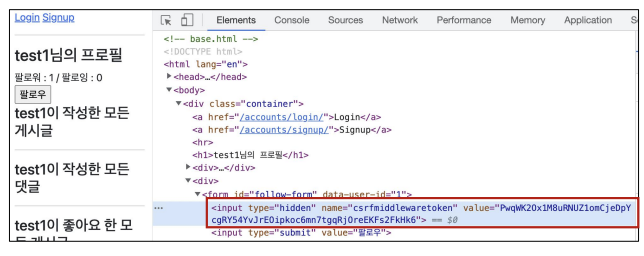

#### Axios

- Promise based HTTP client for the borwser and Node.js

- 브라우저를 위한 Promise 기반의 클라이언트

- 원래는 XHR 이라는 브라우저 내장 객체를 활용해 AJAX 요청을 처리하는데, 이보다 편리한 AJAX 요청이 가능하도록 도움을 줌

  - 확장 가능한 인터페이스와 함께 패키지로 사용이 간편한 라이브러리를 제공

  ```javascript
  axios.get('https://jsonplaceholder.typicode.com/todos/1/') // Promise return
  	.then(..)
  	.catch(..)
  ```

- XMLHttpRequest

  ```javascript
  <script>
      const xhr = new XMLHttpRequest()
  	const URL = 'https://jsonplaceholder.typicode.com/todos/1'
      
      xhr.open('GET', URL)
  	xhr.send()
  
  xhr.onreadystatechange = function (event) {
      if (xhr.readyState === XMLHttpRequest.DONE) {
          const status = event.target.status
          if (status === 0 || (status >= 200 && status < 400)) {
              const res = event.target.response
              const data = JSON.parse(res)
          }	else{
              console.log(data.title)
          }
      }
  }
  </script>
  ```

- Axios

  ```javascript
  <script src='https://unpkg.com/axios/dist/axios.min.js'></script>
  <script>
      
      const URL = 'https://jsonplaceholder.typicode.com/todos/1'
  
  	axios.get(URL)
  		.then(res => console.log(res.data.title))
  		.catch(err => console.log('Error!'))
  </script>
  
  //or
  
  <script>
      
      const URL = 'https://jsonplaceholder.typicode.com/todos/1'
  
  	axios.get(URL)
          .then(function (response) {
          console.log(response)
          return response.data
      })
  		.then(function (data) {
          return data.title
      })
  		.then(function (title) {
          console.log(title)
      })
  		.catch(function (error) {
          console.log(error)
      })
  		.finally(function(){
          console.log('이건 무조건 실행됩니다.')
      })
  
  		.catch(err => console.log('Error!'))
  </script>
  ```

**Promise**

- 비동기 작업을 관리하는 객체

  - 미래의 완료 또는 실패와 그 결과 값을 나타냄
  - 미래의 어떤 상황에 대한 약속

- 성공(이행)에 대한 약속

  - .then()

- 실패(거절)에 대한 약속

  - .catch()

  ```js
  const myPromise = axios.get(URL)
  // console.log(myPromise) // Promise Object
  
  myPromise
  	.then(reponse => {
      return response.data
  })
  
  //catching
  axios.get(URL)
  	.then(reponse => {
      return response.data
  })
  .then(reponse => {
      return response.title
  })
  .catch(error => {
      console.log(error)
  })
  .finally(function() {
      console.log('나는 마지막에 무조건 시행!!')
  })
  ```

- .then(callback)
  - 이전 작업(promise)이 성공했을 때(이행했을 때) 수행할 작업을 나타내는 callback 함수
  - 그리고 각 callback 함수는 이전 작업의 성공 결과를 인자로 전달받음
  - 따라서 성공했을 때의 코드를 callback 함수 안에 작성
- .catch(callback)
  - .then이 하나라도 실패하면(거부 되면) 동작 (동기식의 'try -except' 구문과 유사)
  - 이전 작업의 실패로 인해 생성된 error 객체는 catch 블록 안에서 사용할 수 있음

- 각각의 .then() 블록은 서로 다른 promise 를 반환
  - 즉, .then()을 여러 개 사용(chaining)하여 연쇄적인 작업을 수행할 수 있음
  - 결국 여러 비동기 작업을 차례대로 수행할 수 있다는 뜻
- .then()과 .catch() 메서드 모두 promise 를 반환하기 때문에 chaining 가능
- 주의
  - 반환 값이 반드시 있어야 함
  - 없다면 callback 함수가 이전의 promise 결과를 받을 수 없음
- .finally(callback)
  - Primise 객체를 반환
  - 결과와 상관없이 무조건 지정된 callback 함수가 실행
  - 어떠한 인자도 전달받지 않음
    - Promise가 성공되었는지 거절되었는지 판단할 수 없기 때문
  - 무조건 실행되어야 하는 절에서 활용
    - .then 과 .catch 블록에서의 코드 중복을 방지

```js
work1(function(result1) {
    work2(result1, function(result2) {
        work3(result2, function(result3) {
            console.log('최종 결과: ' + result3)
        })
    })
})
```

에서

```js
work1().then(function(result1) {
    return work2(result1)
})
.then(function(result2) {
    return work3(result2)
})
.then(function(result3) {
    console.log('최종결과 ' + result3)
})
.catch(failureCallback)
```

- .then을 여러번 사용 하여 여러 개의 callback 함수를 추가할 수 있음 (Chaining)
- callback 함수는 JS의 EventLoop가 현재 실행 중인 Call Stack을 오나료하기 이전에는 절대 호출되지 않음
  - Promise callback 함수는 Event Queue에 배치되는 엄격한 순서로 호출됨
  - 비동기 작업이 성공하거나 실패한 뒤에 .then 메서드를 이용한 경우도 마찬가지

#### 비동기 적용하기

**팔로우 (follow)**

- 각각의 템플릿에서 script 코드를 작성하기 위한 block tag 영역 작성

  ```html
  <!-- base.html -->
  
  <body>
      ...
      
      
  </body>
  ```

- axios CDN 작성

  ```html
  <!-- accounts/profile.html -->
  
  
  	<script src='https://cdn.jsdelivr.net/npm/axios/dis/axios.min.js'></script>
  <script></script>
  
  ```

- form 요소 선택을 위해 id 속성 지정 및 선택

- 불필요해진 action과 method 속성은 삭제 (요청은 axios로 대체되기 때문)

  ```html
  <!--accounts/profile.html-->
  
  <form id='follow-form'>
      ...
  </form>
  <script>
  	const form = document.querySelector('#follow-form')
  </script>
  ```

- form 요소에 이벤트 핸들러 작성 및 submit 이벤트 취소

  ```html
  <!-- accounts/profile.html-->
  
  <script>
  	const form = document.querySelector('#follow-form')
      form.addEventListener('submit', function(event) {
          event.preventDefault()
      })
  </script>
  ```

- axios 요청 준비

  ```html
  <!--accounts.profile.html-->
  
  <script>
  	const form = document.querySelector('#follow-form')
      form.addEventListener('submit', function(event) {
          event.preventDefault()
          axios({
              method : 'post',
              url : '/accounts/${???}/follow/',
          })
      })
  </script>
  ```

**팔로우 (follow)**

- 현재 axios로 POST 요청을 보내기 위해 필요한 것

  1. url에 작성할 user pk는 어떻게 작성해야할까

     - url에 작성할 user pk 가져오기 (HTML -> JavaScript)

     ```html
     <!-- accounts/profile.html-->
     
     <form id='follow-form' data-user-id='{{ person.pk }}'>
         ...
     </form>
     
     <!--accounts/profile.html-->
     
     <script>
     	const form = document.querySelector('#follow-form')
         form.addEventListener('submit', function(event){
             event.preventDefault()
             const userId = event.target.dataset.userId
         })
     </script>
     ```

     **data-* attributes**

     - 사용자 지정 데이터 특성을 만들어 임의의 데이터를 HTML과 DOM 사이에서 교환 할 수 있는 방법

     - 사용예시

       ```html
       <div data-my-id='my-data'>
       </div>
       <script>
       	const myId = event.target.dataset.myId
       </script>
       ```

     - 모든 사용자 지정 데이터는 dataset 속성을 통해 사용할 수 있음
     - 예를 들어 data-test-value라는 이름의 특성을 지정했다면 JS에서는 element.dataset.testValue로 접근할수 있음
     - 속석명 작성 시 주의사항
       - 대소문자 여부에 상관없이 xml로 시작하면 안 됨
       - 세미콜론을 포함해서는 안됨
       - 대문자를 포함해서는 안됨
     - url 작성 마치기

     ```html
     <! -- accounts/profile.html -->
     
     <script>
     	const form = document.querySelector('#follow-form')
         form.addEventListener('submit', function(event){
             event.preventDefault()
             const userId = event.tartget.dataset.userId
             axios({
                 method:'POST',
                 url: '/accounts/${userId}/follow/'
             })
         })
     </script>
     ```

  2. csrftoken은 어떻게 보내야 할까?

     - hidden 타입으로 숨겨져있는 csrf 값을 가진 input 태그를 선택해야함

     

     ```html
     <!-- accounts/profile.html-->
     
     <script>
     	const form = document.querySelector('#follow-form')
         const csrftoken = document.querySelector('[name=csrfmiddlewaretoken]').value
     </script>
     ```

     - AJAX 로 csrftoken을 보내는 방법

       ```html
       <!--accounts/profile.html-->
       
       <script>
       	const form = document.querySelector('#follow-form')
           const csrftoken = document.querySelector('[name=csrfmiddlewaretoken]').value
           form.addEventListener('submit', function(event){
               event.preventDefault()
               const userId = event.target.dataset.userId
               axios({
                   method: 'post',
                   url: '/accounts/${userId}/follow',
                   headers: {'X-CSRFToken':csrftoken},
               })
           })
       </script>
       ```

- 팔로우 버튼을 토글하기 위해서는 현재 팔로우가 된 상태인지 여부 확인이 필요

- axios 요청을 통해 받는 response 객체를 활용해 view 함수를 통해서 팔로우 여부를 파악 할 수 있는 변수를 담아 JSON 타입으로 응답하기

- 팔로우 여부를 확인하기 위한 is_followed 변수 작성 및 JSON 응답

  ```python
  # accounts/views.py
  
  from django.http import JsonResponse
  
  def follow(request, user_pk):
      if request.user.is_authenticated:
          User = get_user_model()
          me = request.iser
          you = User.objects.get(pk=user_pk)
          if me != you:
              if you.followers.filter(pk=me.pk).exist():
                  you.followers.remove(me)
                  is_followed = False
              else:
                  you.followers.add(me)
                  is_followed = True
              context = {
                  'is_followed' : is_followed,
              }
              return JsonResponse(context)
          return redirect('accounts:profile', you.username)
      return redirect('accounts:login')
  ```

  ```html
  <!--accounts.progfile.html-->
  
  <script>
  	...
      axios({
          method: 'post',
          url: '/accounts/${userId}/follow/',
          headers: {'X-CSRFToken': csrftoken,}
      })
      	.then((reponse) => {
          const isFollowed = response.data.is_followed
          const followBtn = document.querySelector('#follow-form > input[type=submit]')
          if (isFollowed === true) {
              followBtn.value = '언팔로우'
          }else{
              followBtn.value = '팔로우'
          }
      })
  </script>
  ```

**팔로워 & 팔로잉 수 비동기 적용**

- 해당 요소를 선택할 수 있도록 span 태그와 id 속성 작성

  ```html
  <!--accounts/profile.html-->
  
  
  
  
  	<h1>
          {{ person.username }} 님으 ㅣ프로필
  	</h1>
  <div>
      팔로워 : <span id='followers-count'>{{ person.followers.all|length }}</span> / 팔로잉 : <span id='followings-count'>{{ person.followings.all|length }}</span>
  </div>
  ```

- 직전에 작성한 span 태그를 각각 선택

  ```html
  <!--accounts/profile.html-->
  
  <script>
  	...
      axios({
          method: 'post',
          url: '/accounts/${userId}/follow/',
          headers: {'X-CSRFTokent': csrftoken,}
      })
      .then((response) => {
          ...
          const followersCountTag = document.querySelector('#followers-count')
          const followingsCountTag = document.querySelector('#followings-count')
      })
  </script>
  ```

- 팔로워, 팔로잉 인원 수 연산은 view 함수에서 진행하여 결과를 응답으로 전달

  ```python
  #accounts/views.py
  
  def follow(request, user_pk):
      ...
      context = {
          'is_followed' : is_followed,
          'followers_count' : you.followers.count(),
          'followings_count' : you.followings.count(),
      }
      return JsonResponse(context)
  return redirect('accounts:profile', you.username)
  return redirect('accounts:login')
  ```

- view 함수에서 응답한 연산 결과를 사용해 각 태그의 인원 수 값 변경하기

  ```html
  <!-- accounts/profile.html -->
  
  <script>
  	...
      axios({
          method: 'post',
          url: '/accounts/${userId}/follow/',
          headers: {'X-CSRFToken': csrftoken,}
      })
      .then((response) => {
          ...
          const followersCountTag = documents.querySelector('#followers-count')
          const followingsCountTag = document.querySelector('#followings-count')
          followersCountTag.innerText = followersCount
          followingsCountTag.innerText = followingsCount
      })
  </script>
  ```

- HTML 코드

  ```html
  <!--accounts/profile.html-->
  
  
  
  
  <h1>
  {{ person.username }}님의 프로필        
  </h1>
  <div>
      팔로워 : <span id='followers-count'>{{ person.followers.all|length }}</span>/
      팔로잉 : <span id='followings-count'>{{ person.followings.all|length }}</span>
  </div>
  
  
  <div>
      <form id='follow-form' data-user-id='{{ person.pk }}'>
          
          
          	<input type='submit' value='언팔로우'>
          
          	<input type='submit' value='팔로우'>
          
      </form>
  </div>
  ```

- python 코드

  ```python
  # accounts/views.py
  
  def follow(request, user_pk):
      if request.user.is_authenticated:
          User = get_user_model()
          me = request.user
          you = User.objects.get(pk=user_pk)
          if me != you:
              if you.followers.filter(pk=me.pk).exists():
                  you.followers.remove(me)
                  is_followed = False
              else:
                  you.followers.add(me)
                  is_followed = True
              context = {
                  'is_followed' : is_followed,
                  'followers_count' : you.foolowers.count()
                  'followings_count' : you.followings.count()
              }
              return JsonResponse(context)
          return redirect('accounts:profile', you.username)
      return redirect('accounts:login')
  ```

- JavaScript 코드

  ```js
  <!--accounts/profile.html-->
  const form = document.querySelector('#follow-form')
  const csrftoken = document.querySelector('[name=csrfmiddlewaretoken]').value
  
  form.addEventListener('submit', function (event) {
      event.preventDefault()
      const userId = event.target.dataset.userId
      
      axios({
          method: 'post',
          url: '/accounts/${userId}/follow/',
          headers: {'X-CSRFTokent' : csrftoken,}
      })
      .then((response) => {
          const isFollowed = response.data.is_followed
          const followBtn = document.querySelector('#follow-form > input[type=submit]')
          if (isFollowed === true){
              followBtn.value = '언팔로우'
          } else{
              followBtn.value = '팔로우'
          }
          const followersCountTag = document.querySelector('#followers-count')
          const followingsCountTag = document.querySelector('#followings=count')
          const followersCount = response.data.followers_count
          const followingsCount = response.data.followings_count
          followersCountTag.innerText = followersCount
          followingsCountTag.innerText = followingsCount
      })
      .catch((error) => {
          console.log(error.response)
      })
  }
  ```

**좋아요 비동기 구축**

- HTML 코드

  ```html
  <!--articles/index.html-->
  
  
  
  
  <h1>
      Articles
  </h1>
  ...
  <div>
      <form class='like-forms' data-article-id='{{ article.pk }}'>
          
          
          	<input type='submit' value='좋아요 취소' id='like-{{ article.pk }}'>
          
      		<input type='submit' value='좋아요' id='like-{{ article.pk }}'>
          
      </form>
  </div>
  ```

- python 코드

  ```python
  # articles/views.py
  
  from django.http import JsonResponse
  
  def likes(request, article_pk):
      if request.user.is_authenticated:
          article = Article.objects.get(pk=article_pk)
          
          if article.like_users.filter(pk=request.user.pk).exists():
              article.like_users.remove(request.user)
              is_liked = False
          else:
              article.like_users.add(request.user)
              is_like = True
          context = {
              'is_liked' : is_liked,
          }
          return JsonResponse(context)
      return redirect('accounts:login')
  ```

- Javascript 코드

  ```js
  <!-- articles/index.html-->
  
  const forms = document.querySelectorAll('.like-forms')
  const csrftoken = document.querySelector('[name=csrfmiddlewaretoken]').value
  
  forms.forEach(form) => {
      form.addEventListener('submit', function(event) {
          event.preventDefault()
          const articleId = event.target.dataset.articleId
          
          axios({
              method: 'post',
              url: 'http://127.0.0.1:8000/articles/${articleId}/likes/',
              headers: {'X-CSRFToken': csrftoken},
          })
          .then((response) => {
              const isLiked = response.data.is_liked
              const LikeBtn = document.querySelector('#Like-${articleId}')
              if(isLiked === true) {
                  likeBtn.value='좋아요 취소'
              } else {
                  likeBtn.value = '좋아요'
              }
          })
          .catch((error)=> {
              console.log(error.reponse)
          })
      })
  }
  ```

  

  

