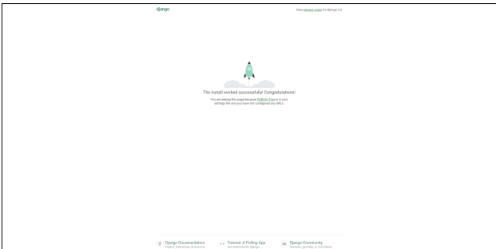
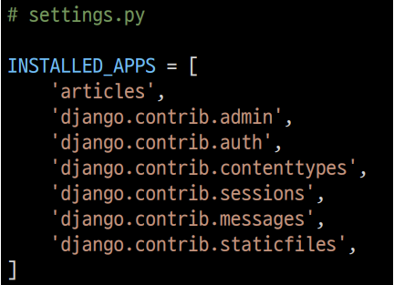
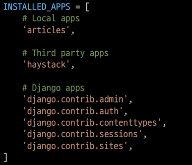
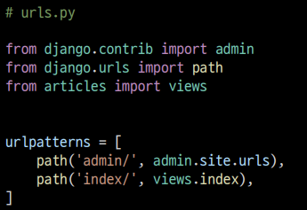
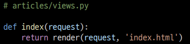

# Django Quick start

### Django 설치

- Django 4.0 릴리즈로 인해 3.2(LTS) 버전을 명시해서 설치

```bash
$ pip install django==3.2.13
```

- 패키지 목록 생성

```bash
$ pip freeze > requirements.txt
```

### [참고] LTS

- Long Term Surpport (장기 지원 버전)
- 일반적인 경우보다 장기간에 걸쳐 지원하도록 고안된 소프트웨어의 버전
- 컴퓨터 소프트웨어의 제품 수명주기 관리 정책
- 배포자는 LTS 확정을 통해 장기적이고 안정적인 지원을 보장함

### Django Project

- 프로젝트 생성

  ```bash
  $ django-admin startproject firstpjt .
  ```

  - Project 이름에는 Python이나 Djnago에서 사용 중인 키워드 및 '-'(하이픈) 사용 불가
  - '.'(dot)을 붙이지 않을 경우 현재 디렉토리에 프로젝트 디렉토리를 새로 생성하게 됨

- 서버 실행

  ```bash
  $ python manage.py runserver
  ```

- 서버 실행 후 메인 페이지 확인

  

### 프로젝트 구조

- __ init__.py

  - Python에게 이 디렉토리를

    하나의 Python 패키지로 다루도록 지시

  - 별도로 추가 코드를 작성하지 않음

- asgi.py

  - Asynchronous Server Gateway Interface

  - Django 애플리케이션이 비동기식

    웹 서버와 연결 및 소통하는 것을 도움

  - 추후 배포 시에 사용하며

    지금은 수정하지 않음

- settings.py

  - Django 프로젝트 설정을 관리

- urls.py

  - 사이트의 url과

    적절한 views의 연결을 지정

- wsgi.py

  - Web Server Gateway Interface

  - Django 애플리케이션이

    웹서버와 연결 및 소통하는 것을 도움

  - 추후 배포 시에 사용하며

    지금은 수정하지 않음

- manage.py

  - Django 프로젝트와 다양한 방법으로

    상호작용 하는 커맨드라인 유틸리티

  ```bash
  # manage.py Usage
  $ python manage.py <command> [options]
  ```

### Django Application

- 애플리케이션(앱) 생성

  ```bash
  $ python manage.py startapp articles
  ```

  - 일반적으로 애플리케이션 이름은 '복수형'으로 작성하는 것을 권장

- admin.py
  - 관리자용 페이지를 설정 하는 곳
- apps.py
  - 앱의 정보가 작성된 곳
  - 별도로 추가 코드를 작성하지 않음

- models.py

  - 애플리케이션에서 사용하는

    Model을 정의하는 곳

  - MTV 패턴의 M에 해당

- tests.py

  - 프로젝트의 테스트 코드를 작성하는곳

- views.py

  - view 함수들이 정의 되는 곳
  - MTV 패턴의 V에 해당

### 애플리케이션 구조

- 프로젝트에서 앱을 사용하기 위해서는 반드시 INSTALLED_APPS 리스트에 반드시 추가해야 함

- INSTALLED_APPS

  - Django installation에 활성화 된

    모든 앱을 지정하는 문자열 목록



- 해당 순서를 지기키 않아도 수업 과정에서는 문제가 없지만,

  추후 advanced 한 내용을 대비하기 위해 지키는 것을 권장



### Project & Application

- Project
  - collection of apps
  - 프로젝트는 앱의 집합
  - 프로젝트에는 여러 앱이 포함될 수 있음
  - 앱은 여러 프로젝트에 있을 수 있음
- Application
  - 앱은 실제 요청을 처리하고 페이지를 보여주는 등의 역할을 담당
  - 일반적으로 앱은 하나의 역할 및 기능 단위로 작성하는 것을 권장함

# 요청과 응답

- URL -> VIEW -> TEMPLATE 순의 작성 순서로 코드를 작성해보고 데이터의 흐름을 이해하기

### URLs

- URL -> VIEW -> TEMPLATE
- 기초 과정을 작성해보고
- 데이터의 흐름을 이해하기



### Views

- HTTP 요청을 수신하고 HTTP 응답을 반환하는 함수 작성

- Template 에게 HTTP 응답 서식을 맡김

  

### render()

- 주어진 템플릿을 주어진 컨텍스트 데이터와 결합하고

  렌더링 된 텍스트와 함께 HttpResponse(응답) 객체를 반환하는 함수

  - request
    - 응답을 생성하는 데 사용되는 요청 객체
  - template_name
    - 템플릿의 전체 이름 또는 템플릿 이름의 경로
  - context
    - 템플릿에서 사용할 데이터 (딕셔너리 타입으로 작성)

### Templates

- 실제 내용을보여주는데 사용된느 파일
- 파일의 구조나 레이아웃을 정의
- Template 파일의 기본 경로
  - app 폴더 안의 templates 폴더
  - app_name/templates/

- 템플릿 폴더 이름은 반드시 templates 라고 지정해야 함

### 코드 작성 순서

- 앞으로 Django 에서으 ㅣ코드 작성은 URL -> View -> Template 순으로 작성
- '데이터의 흐름 순서'

## 추가 설정

- LANGUAGE_CODE

  - 모든 사용자에게 제공되는 번역을 결정
  - 이 설정이 적용 되려면 USE_I18N이 활성화(True)되어 있어야 함

- TIME_ZONE

  - 데이터베이스 연결의 시간대를 나타내는 문자열 지정

  - USE_TZ 가 True이고 이옵션이 설정된 경우 데이터베이스에서 날짜 시간을 읽으면, 

    UTC 대신 새로 설정한 시간대의 인식 날짜&시간이 반환 됨

  - USE_TZ이 False인 상태로 이 값을 설정하는 것은 error가 발생하므로 주의

- USE_I18N

  - Django의 번역 시스템을 활성화해야 하는지 여부를 지정

- USE_L10N

  - 데이터의 지역화 된 형식을 기본적으로 활성화할지 여부를 지정
  - True일 경우, Django는 현재 locate의 형식을 사용하여 숫자와 날짜를 표시

- USE_TZ

  - datetimes가 기본적으로 시간대를 인식하는지 여부를 지정
  - True일 경우 Django는 내부적으로 시간대 인식 날짜 / 시간을 사용

# Django Template

- 데이터 표현을 제어하는 도구이자 표현에 관련된 로직
- Django Template을 이용한 HTML 정적 부분과 동적 컨텐츠 삽입
- Template System의 기본 목표를 숙지
- Django Template System
  - 데이터 표현을 제어하는 도구이자 표현에 관련된 로직을 담당

# Django Template Language(DTL)

- Django template 에서 사용하는 built0in template system

- 조건, 반복, 변수 치환, 필터 등의 기능을 제공

  - Python처럼 일부 프로그래밍 구조(if, for 등)를 사용할 수 있지만

    이것은 Python 코드로 실행되는 것이 아님

  - Django 템플릿 시스템은 단순히 Python이 HTML에 포함 된 것이 아니니 주의

- 프로그래밍적 로직이 아니라 프레젠테이션을 표현하기 위한 것임을 명심할 것

### DTL Syntax

- Variable
- Filters
- Tags
- Comments

### Variable

{{ variable }}

- 변수명은 영어, 숫자와 밑줄(_)의 조합으로 구성될 수 있으나 밑줄로는 시작 할 수 없음

  - 공백이나 구두점 문자 또한 사용할 수 없음

- dot(.)를 사용하여 변수 속성에 접근할 수 있음

- render()의 세번째 인자로 {'key' : value} 와 같이 딕셔너리 형태로 넘겨주며,

  여기서 정의한 key에 해당하는 문자열이 template에서 사용 가능한 변수명이 됨

### Filters

{{ variable|filter }}

- 표시할 변수를 수정할 때 사용

- 예시) {{ name|lower }}

  - name 변수를 모두 소문자로 출력

- 60개의 built-in template filters를 제공

- chained가 가능하며 일부 필터는 인자를 받기도 함

  {{  name|truncatewords:30 }}

### Tags



- 출력 텍스트를 만들거나, 반복 또는 논리를 수행하여 제어 흐름을 만드는 등

  변수보다 복잡한 일들을 수행

- 일부 태그는 시작과 종료 태그가 필요 
- 약 24개의 built-in template tags를 제공

### Comments

{# #}

- Django template에서 라인의 주석을 표현하기 위해 사용
- 한 줄 주석에만 사용할 수 있음 (줄 바꿈이 허용되지 않음)
- 여러 줄 주석은 와  사이에 입력