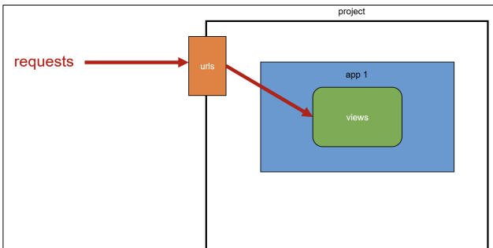
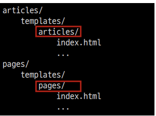

# App URL mapping

- 앱이 많아졌을 때 urls.py 를 각 app에 매핑하는 방법을 이해하기

- 두번째 app 인 pages를 생성 및 등록 하고 진행

- app의 view 함수가 많아지면서 사용하는 path() 또한 많아지고,

  app 또한 더 많이 작성되기 때문에 프로젝트의 urls.py 에서 모두 관리하는 것은

  프로젝트 유지보수에 좋지 않음

### 개선전

- 각 앱의 view 함수를 다른 이름으로 import 할 수 있음
- 이렇게도 가능하지만.. 더 좋은 방법을 생각해보자

```python
# firstpjt/urls.py

from articles import views as articles_views
from pages import views as pages_views

urlpatterns = [
    ...,
    path('pages-index', pages_views.index),
]
```

### 개선후

- 하나의 프로젝트의 여러 앱이 존재한다면, 각각의 앱 안에 urls.py를 만들고

  프로젝트 urls.py 에서 각 앱의 urls.py 파일로 URL 매핑을 위탁할 수 있음

- 각각의 app 폴더 안에 urls.py를 작성하고 다음과 같이 수정 진행

```python
# articles/urls.py

from django.urls import path
from . import views

urlpatterns = [
    path('index/',views.index),
    path('greeting/',views.greeting),
    path('dinner/',views.dinner),
    path('throw/',views.throw),
    path('catch/',views.catch),
    path('hello/<str:name>/',views.hello),
]

# pages/urls.py

from django.urls import path

urlpatterns = [
    
]
```

### Including other URLconfs

- urlpattern은 언제든지 다른 URLconf 모듈을 포함(include)할 수 있음

- include 되는 앱의 url.py에 urlpatterns가 작성되어 있지 않다면 에러가 발생

  예를 들어, pages 앱의 urlpatterns가 빈 리스트라도 작성되어 있어야 함

```python
# firstpjt/urls.py

from django.contrib import admin
from django.urls import path, include

urlpatterns = [
    path('admin/', admin.site.urls),
    path('articles/', include('articles.urls')),
    path('pages/', include('pages.urls')),
]
```

- 이제 메인 페이지의 주소는 이렇게 바뀌었음

- http://127.0.0.1:8000/index/

  ->http://127.0.0.1:8000/articles/index/

### include()

- 다른 URLconf(app1/urls.py)들을 참조할 수 있도록 돕는 함수

- 함수 include()를 만나게 되면 URL의 그 시점까지 일치하는 부분을 잘라내고,

  남은 문자열 부분을 후속 처리를 위해 include된 URLconf로 전달

### URL 구조의 변화

- 앱의 URL을 project의 urls.py에서 관리

  

- 복수 개의 앱의 URL을 project의 urls.py 에서 관리

  


- 각각의 앱에서 URL을 관리


# Template namespace

### 2가지 문제 발생

1. articles app.index 페이지에 작성한 두번째 앱 index로 이동하는 하이퍼 링크를 클릭 시 현재 페이지로 다시 이동

   - URL namespace

2. pages app 의 index url (http://127.0.0.1:8000/pages/index/)로 직접

   이동해도 articles app의 index 페이지가 출력됨

   - Template namespace

### 개요

- Django는 기본적으로 app_name/templates/ 경로에 있는 templates 파일들만 찾을 수 있으며, settings.py의 INSTALLED_APPS 에 작성한 app 순서로 template을 검색 후 렌더링 함
- 바로 이 속성 값이 해당 경로를 활성화하고 있음


### 디렉토리 생성을 통해 물리적인 이름공간 구분

- Django templates의 기본 경로에 app과 같은 이름의 폴더를 생성해

  폴더 구조를 app_name/templates/app_name/ 형태로 변경

- Django templates의 기본 경로 자체를 변경할 수는 없기 때문에

  물리적인 이름 공간을 만드는 것



### 템플릿 경로 변경

- 폴더 구조 변경 후 변경된 경로로 해당하는 모든 부분을 수정하기


### 반드시 Template namespace를 고려해야 할까?

- 만약 단일 앱으로만 이루어진 프로젝트라면 상관없음

- 여러 앱이 되었을 때에도 템플릿 파일 이름이 겹치지 않게 하면 되지만,

  앱이 많아지면 대부분은 같은 이름의 템플릿 파일이 존재하기 마련