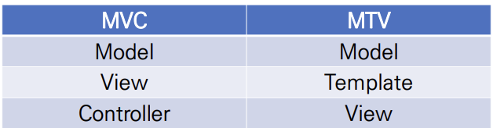
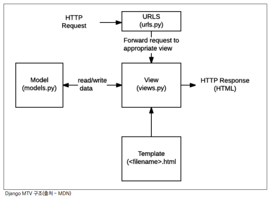
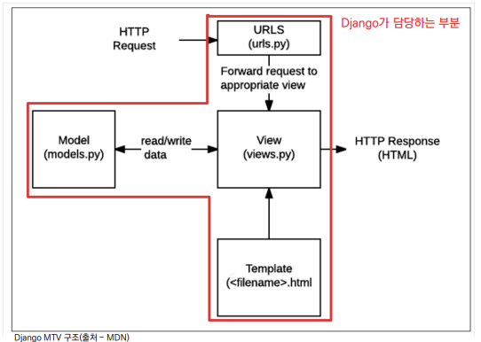

# Naming URL patterns

### Naming URL Patterns 의 필요성

- 만약 'index/' 의 문자열 주소를 'new-index/' 로 바꿔야 한다고 가정해보자
- 그렇다면 'index/' 주소를 사용했던 모든 곳을 찾아서 변경해야 하는 번거로움이 발생함

- 이제는 링크에 URL을 직접 작성하는 것이 아니라 'path()'함수의 name 인자를 정의해서 사용
- DTL의 Tag중 하나인 URL 태그를 사용해서 'path()'함수에 작성한 name을 사용할 수 있음
- 이를 통해 URL 설정에 정의된 특정한 경로들의 의존성을 제거할 수 있음
- Django는 URL에 이름을 지정하는 방법을 제공함으로써 view함수와 템플릿에서 특정 주소를 쉽게 참조할 수 있도록 도움

```python
# articles/urls.py
urlpatterns = [
    path('index/', views.index, name='index'),
    path('greeting/', views.greeting, name='greeting'),
    path('dinner/', views.dinner, name='dinner'),
    path('throw/', views.throw, name='throw'),
    path('catch/', views.catch, name='catch'),
    path('hello/<str:name>/', views.hello, name='hello'),
]
```

### Built in tag 'URL'

- 주어진 URL 패턴 이름 및 선택적 매개 변수오 ㅏ일치하는 절대 경로 주소를 반환
- 템플릿에 URL을 하드 코딩하지 않고도 DRY 원칙을 위반하지 않으면서 링크를 출력하는 방법
- 

ex)

```html
<!-- index.html -->


...
<a href="">greeting</a>
<a href="">dinner</a>
<a href="">throw</a>

<!-- dinner, greeting.html-->
<a href="">뒤로</a>

```

### DRY 원칙

- Don't Repeat Yourself의 약어
- 더 품질 좋은 코드를 작성하기 위해서 알고, 따름녀 좋은 소프트웨어 원칙들 중 하나로 '소스 코드에서 동일한 코드를 반복하지 말자' 라는 의미'
- 동일한 코드가 반복된다는 것은 잠재적인 버그의 위협을 증가 시키고 반복되는 코드를 변경해야 하는 경우, 반복되는 모든 코드를 찾아서 수정해야함
- 이는 프로젝트 규모가 커질수록 애플리케이션의 유지 보수 비용이 커짐

### Django의 설계 철학 (Templates System)

1. 표현과 로직(view)을 분리
   - 템플릿 시스테믄 표현을 제어하는 도구이자 표현에 관련된 로직일 뿐
   - 즉, 템플릿 시스템은 이러한 기본 목표를 넘어서는 기능을 지원하지 말아야 함
2. 중복을 배제
   - 대다수의 동적 웹사이트는 공통 header footer navbar 같은 공통 디자인을 갖음
   - Django 템플릿 시스템은 이러한 요소를 한 곳에 저장하기 쉽게 하여 중복 코드를 없애야함
   - 템플릿 상속의 기초가 되는 철함

### Framework의 성격

- 독선적(Opinionated)
  - 독선적인 프레임워크들은 어떤 특정 작업을 다루는 '올바른 방법'에 대한 분명한 의견(규약)을 가지고 있음
  - 대체로 특정 문제내에서 빠른 개발방법을 제시
  - 어떤 작업에 대한 올바른 방법이란 보통 잘 알려져 있고 문서화가 잘 되어있기 때문
  - 하지만 주요 상황을 벗어난 문제에 대해서는 그리 유연하지 못한 해결책을 제시할 수 있음
- 관용적(Unopnionated)
  - 관용적인 프레임워크들은 구성요소를 한데 붙여서 해결해야 한다거나 심지어 어떤 도구를 써야 한다는 '올바른 방법'에 대한 제약이 거의 없음
  - 이는 개발자들이 특정 작업을 완수하는데 가장 적절한 도구들을 이용할 수 있는 자유도가 높음
  - 하지만 개발자 스스로가 그 도구들을 찾아야 한다는 수고가 필요

### Django Framework의 성격

- '다소 독선적'
  - 양쪽 모두에게 최선의 결과를 준다고 강조
- 결국 하고자 하는 말은 현대 개발에 있어서는 가장 중요한 것들 중 하나는 '생산성'
- 프레임워크는 우리가 하는 개발을 방해하기 위해 규칙, 제약을 만들어 놓은 것이 아님
- 우리가 온전히 만들고자 하는 곳에만 집중할 수 있게 도와주는 것
- '수레바퀴를 다시 만들지 말라.'

# Django 구조 이해하기 (MTV Design Pattern)

### Design Patter 이란?

- 부산의 명물이라는 광안대교, 이러한 다리는 어떻게 만들까?
- 광안대교 같은 다리를 현수교라고 함
- 교량의 양쪽 끝과 가운데 솟아있는 주탑에 케이블을 두고 상판을 메다는 형식의 공법
- 이와 똑같은 방식을 사용해서 인천대교, 이순신대교 등이 만들어 졌음
- 즉, 여러 번 짓다보니 자주 사용되는 구조가 있다는 것을 알게 되었고 이를 일반화해서 하나의 공법으로 만들어 둔 것
- 소프트웨어에서의 관점
  - 각기 다른 기능을 가진 다양한 응용 소프트웨어를 개발할 때 공통적인 설계 문제가 존재하며, 이를 처리하는 해결책 사이에도 공통점이 있단는 것을 발견
  - 이러한 유사점을 패턴이라 함

### 소프트웨어 디자인 패턴

- 소프트웨어도 수십년 간 전세계의 개발자들이 계속 만들다 보니 자주 사용되는 구조와 해결책이 있다는 것을 알게 됨
- 앞서 배웠던 클라이언트-서버 구조도 소프트웨어 디자인 패턴 중 하나
- 자주 사용되는 소프트웨어의 구조를 소수의 뛰어난 엔지니어가 마치 건축의 공법처럼 일반적인 구조화를 해둔 것

### 소프트웨어 디자인 패턴의 목적

특정 문맥에서 공통적으로 발생하는 문제에 대해 재사용 가능한 해결책을 제시

프로그래머가 어플리케이션이나 시스템을 디자인할 때 발생하는 공통된 문제들을 해결하는데 형식화 된 가장 좋은 관행

### 소프트웨어 디자인 패턴의 장점

- 디자인 패턴을 알고 있다면 서로 복잡한 커뮤니케이션이 매우 간단해짐
- Befor
  - 무언가 서비스를 요청을 하는 쪽을 하나 만들고... 둘 사이에 데이터를 주고 받는 방식을 정의 한 다음.. 요청을 처리하는 쪽을 하나 따로 개발해서.. 다슈의 요청을 처리하는 구조로 만들어보자..!
- After
  - 우리 이거 클라이언트-서버 구조로 구현하자
- 다수의 엔지니어들이 일반화된 패턴으로 소프트웨어 개발을 할 수 있도록 한 규칙, 커뮤니케이션의 효율성을 높이는 기법

### Django에서의 디자인 패턴

- Django에도 이러한 디자인 패턴이 적용이 되어 있는데,

  Django에 적용된 디자인 패턴은 MTV 패턴이다.


- Django는 MVC 패턴을 기반으로 한 MTV 패턴을 사용

  두 패턴은 서로 크게 다른 점은 없으며 일부 역할에 대해 부르는 이름이 다름



- MTV 패턴은 MVC 디자인 패턴을 기반으로 조금 변형된 패턴이다.

### MVC 소프트웨어 디자인 패턴

- MVC 는 Model - View - Controller의 준말

  데이터 및 논리 제어를 구현하는데 널리 사용되는 소프트웨어 디자인 패턴

- 하나의 큰 프로그램을 세가지 역할로 구분한 개발 바법론
- Model : 데이터와 관련된 로직을 관리
- View : 레이아웃과 화면을 처리
- Controller : 명령을 model과 view 부분으로 연결

### MVC 소프트웨어 디자인 패턴의 목적

- 관심사 분리
- 더 나은 업무의 분리와 향상된 관리를 제공
- 각 부분을 독립적으로 개발할 수 있어, 하나를 수정하고 싶을 때 모두 건들지 않아도 됨
  - == 개발 효율성 및 유지보수가 쉬워짐
  - == 다수의 멤버로 개발하기 용이함

### MTV 디자인 패턴

- Model

  - MVC 패턴에서 Model의 역할에 해당
  - 데이터와 관련된 로직을 관리
  - 응용프로그램의 데이터 구조를 정의하고 데이터베이스의 기록을 관리

- Template

  - 레이아웃과 화면을 처리
  - 화면상의 사용자 인터페이스 구조와 레이아웃을 정의
  - MVC 패턴에서 View의 역할에 해당

- View

  - Model & Template과 관련한 로직을 처리해서 응답을 반환

  - 클라이언트의 요청에 대해 처리를 분기하는 역할

  - 동작 예시

    - 데이터가 필요하다면 model에 접근해서 데이터를 가져오고

      가져온 데이터를 template로 보내 화면을 구성하고

      구성된 화면을 응답으로 만들어 클라이언트에게 반환

  - MVC 패턴에서 Controller의 역할에 해당





### 정리

- Django는 MTV 디자인 패턴을 가지고 있음
  - Model : 데이터 관련
  - Template : 화면 관련
  - View : Model & Template 중간 처리 및 응답 반환