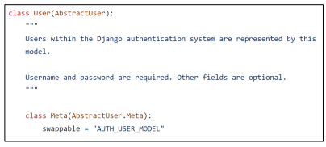
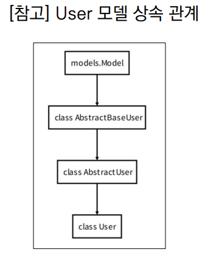

# Django Auth

### Django Auth 개요

- Django authentication system(인증 시스템)은 인증(Authentication)과

  권한(Authorization) 부여를 함께 제공(처리)하고 있음

  - User
  - 권한 및 그룹
  - 암호 해시 시스템
  - Form 및 View 도구
  - 기타 적용가능한 시스템

- 필수 구성은 settings.py의 INSTALLED_APPS에서 확인 가능

  - django.contrib.auth

- Authentication (인증)

  - 신원 확인
  - 사용자가 자신이 누구인지 확인하는 것

- Authorization(권한, 허가)

  - 권한 부여
  - 인증된 사용자가 수행할 수 있는 작업을 결정

### 사전 설정

- accounts app 생성 및 등록

```bash
$ python manage.py startapp accounts
```

```python
# settings.py

INSTALLED_APPS = [
    'articles',
    'accounts',
]
```

> auto와 관련된 경로나 키워드들을 Django 내부적으로 accounts라는 이름으로 상요하고 있기 때문에 되도록 accounts로 지정하는 것을 권장

> 다른 이름으로 설정해도 되지만 나중에 추가 설정을 해야 할 일들이 생기게 됨

- url 분리 및 매핑

```python
# crud/urls.py

urlpatterns = [
    path('accounts/',include('accounts.urls')),
]


# accounts/urls.py

from django.urls import path
from. import views

app_name = 'accounts'
urlpatterns = [
    
]
```

# User model 활용하기

### Django User Model

- 'Custom User Model'로 대체하기

- Django는 기본적인 인증 시스템과 여러 가지 필드가 포함된 User Model을 제공,

  대부분의 개발 환경에서 기본 User Model을 Custom User Model로 대체함

- Django는 새 프로젝트를 시작하는 경우 비록 기본 User 모델이 충분 하더라도

  커스텀 User 모델을 설정하는 것을 강력하게 권장

- 커스텀 User 모델은 기본 User 모델과 동일하게 작동 하면서도

  필요한 경우 나중에 맞춤 설정할 수 있기 때문

  - 단, User 모델 대체 작업은 프로젝트의 모든 migrations 혹은

    첫 migrate를 실행하기 전에 이 작업을 마쳐야 함

- 개발자들이 작성하는 일부 프로젝트에서는 django에서 제공하는

  built-in User model의 기본 인증 요구사항이 적절하지 않을 수 있음

  - 예를 들어, 내 서비스에서 회원가입 시 username 대신 email을 식별 값으로 

    사용하는 것이 더 적합한 사이트인 경우, Django의 User Model은 기본적으로 username을 식별 값으로 사용하기 때문에 적합하지 않음

- Django는 현재 프로젝트에서 사용할 User Model을 결정하는 

  AUTO_USER_MODEL 설정 값으로 Default User Model을 재정의 할 수 있도록 함

### AUTH_USER_MODEL

- 프로젝트에서 User를 나타낼 때 사용하는 모델
- 프로젝트가 진행되는 동안 (모델을 만들고 마이그레이션 한 후) 변경할 수 없음
- 프로젝트 시작 시 설정하기 위한 것이며, 참조하는 모델은 첫 번째 마이그레이션에서 사용할 수 있어야 함
  - 즉, 첫번째 마이그레이션 전에 확정 지어야 하는 값
- 다음과 같은 기본 값을 가지고 있음

```python
# settings.py

AUTO_USER_MODEL = 'auth.User'
```

### [참고] settings의 로드 구조

- AUTH_USER_MODEL은 settings.py 에서 보이지 않는데 어디에 기본 값이 작성되어 있는 걸까?
  - 우리가 작성하는 settings.py는 사실 global_settings.py를 상속받아 재정의하는 파일임

### 대체하기

- AbstractUser를 상속받는 커스텀 User 클래스 작성
- 기존 User 클래스도 AbstractUser를 상속받기 때문에 커스텀 User 클래스도 완전히 같은 모습을 가지게 됨

```python
# accounts/models.py

from django.contrib.auth.models import AbstractUser

class User(AbstractUser):
    pass
```



- Django 프로젝트에서 User를 나타내는데 사용하는 모델을 방금 생성한 커스텀 User 모델로 지정

```python
# settings.py

AUTH_USER_MODEL = 'accounts.User'
```

- admin.py에 커스텀 User 모델을 등록
  - 기본 User 모델이 아니기 때문에 등록하지 않으면 admin site에 출력되지 않음

```python
# accounts/admin.py

from django.contrib import admin
from django.contrib.auth.admin import UserAdmin
from .models import User

admin.site.register(User, UserAdmin)

```



### 데이터베이스 초기화(실습용)

- 수업 진행을 위한 데이터베이스 초기화 후 마이그레이션 (프로젝트 중간일 경우)
- migrations 파일 삭제
  - migrations 폴더 및 __ init__.py는 삭제하지 않음
  - 번호가 붙은 파일만 삭제
- db.sqlite3 삭제
- migrations 진행
  - makemigrations
  - migrate

### custom User로 변경된 테이블 확인

- 이제 auth_user테이블이 아니라 accounts_user 테이블을 사용하게 됨

### User 객체 활용

- User 객체는 인증 시스템의 가장 기본
- 기본 속성
  - username
  - password
  - email
  - first_name
  - last_name

### 암호 관리

- 회원은 가입시 일반적으로 암호저장이 필수적이며 별도의 처리가 필요
- Django 에서는 기본으로 PBKDF2를 사용하여 저장
  - 단방향 해시함수를 활용하여 비밀번호를 다이제스트로 암호화하며, 이는 복호화가 불가능함
    - 단방향 해시함수는 MD5 SHA-1 SHA-256등이 존재하며 Django는 SHA-256 활용
  - 단방향 해시함수의 경우 레인보우 공격 및 무차별 대입 공격 등의 문제가 발생 가능함
  - 이를 보완하기 위하여 아래으 ㅣ기법을 추가적으로 활용함
    - 솔팅(salting) : 패스워드에 임의의 문자열인 salt를 추가하여 다이제스트를 생성
    - 키 스트레칭 (Key Stretching) : 해시를 여러 번 반복하여 시간을 늘림

### User 객체 활용

- User 생성

  ```python
  user = user.objects.create_user('john', 'john@google.com', '1q2w3e4r!')
  ```

- User 비밀번호 변경

  ```python
  user = user.objects.get(pk=2)
  user.set_password('new password')
  user.save()
  ```

- User 인증(비밀번호 확인)

  ```python
  from django.contrib.auth import authenticate
  user = authenticate(username='john',password='secret')
  ```

# 회원 가입

### UserCreationForm

- 주어진 username과 password로 권한이 없는 새 user를 생성하는 ModelForm

- 3개의 필드를 가짐

  - username (from the user model)

  - password1
  - password2

```python
# accounts/urls.py

app_name = 'accounts'

urlpatterns = [
    path('signup/', views.signup, name='signup'),
]

# accounts/views.py

from django.contrib.auth.forms import AuthenticationForm, UserCreationForm

def signup(request):
    if request.method == 'POST':
        pass
    else:
        form = UserCreationForm()
    context = {
        'form' : form,
    }
    return render(request, 'accounts/signup.html', context)
```

```django
<!-- accounts/urls.py-->




<h1>
    회원가입
</h1>
<form action='' method='POST'>
    
    {{ form.as_p }}
    <input type='submit'>
</form>

```

- 회원가입 링크 작성 후 페이지 확인

```django
<!-- base.html -->

<div class='container'>
    <a href=''>Signup</a>
    <hr>
    
    
</div>
```

- 회원가입 로직 작성

```python
# accounts/views.py

def signup(request):
    if request.method == 'POST'
    	form = UserCreationForm(request.POST)
        if form.is_valid():
            form.save()
            return redirect('articles:index')
     else:
         form = UserCreationForm()
            context = {
            'form' : form,
        }
        return render(request, 'accounts/signup.html', context)
```

### 회원가입 진행 후 에러 페이지를 확인

- 회원가입에 사용하는 UserCreationForm이 우리가 대체한 커스텀 유저 모델이 아닌 기존 유저 모델로 인해 작성된 클래스이기 때문

```python
class UserCreationForm(forms.ModelForm):
    class Meta:
        model = User
        fields = ('username',)
        field_classes = {
            ;'username' : UsernameField
        }
```


### UserCreationForm() 커스텀 하기

- 기존 UserCreationForm을 상속받아 User 모델 재정의

  ```python
  # accounts/forms.py
  
  from django.contrib.auth import get_user_model
  from django.contrib.auth.forms import UserCreationForm
  
  class CustomUserCreationForm(UserCreationForm):
      
      class Meta(UserCreationForm.Meta):
          model = get_user_model()
  ```

- get_user_model()
  - 현재 프로젝트에서 활성화된 사용자 모델(active user model)을 반환
  - Django에서는 User 클래스는 커스텀을 통해 변경 가능하여, 직접 참조하는 대신 get_user_model()을 사용할 것을 권장함

- CustomUserCreationForm()으로 대체하기

```python
# accounts/views.py

from django.contrib.auth.forms import AuthenticationForm.UserCreationForm
from .forms import CustomUserCreationForm, CustomUserChangeForm

def signup(request):
    if request.method == 'POST'
    	form = CustomUserCreationForm(request.POST)
        if form.is_valid():
            form.save()
            return redirect('articles:index')
        else:
            form = CustomUserCreationForm()
        context = {
            'form' : form
        }
        return render(request, 'accounts/signup.html', context)
```

- 회원가입 진행 후 테이블 확인

### UserCreationForm의 save 메서드

- user를 반환하는 것을 확인

```python
def save(self, commit=True):
    user = super().save(commit=False)
    user.set_password(self.cleaned_data['password1'])
    if commit:
        user.save()
    return user
```

