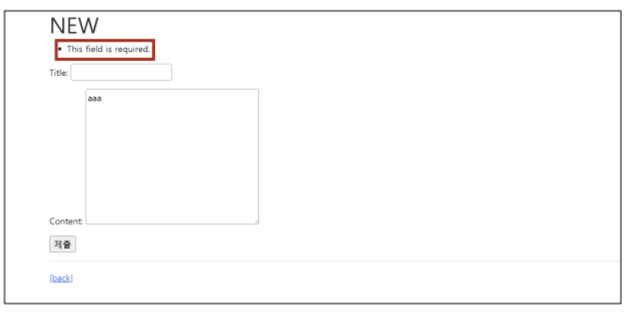
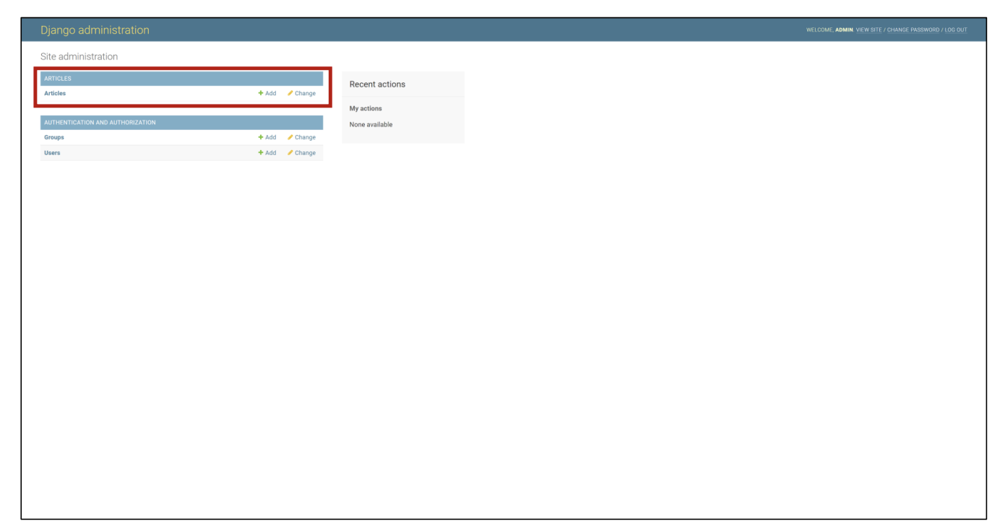
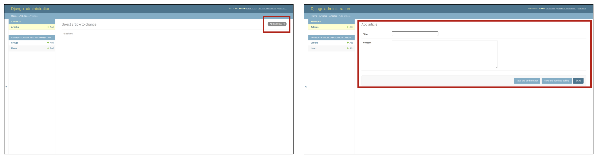
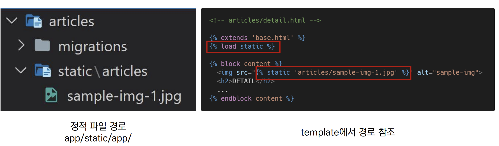
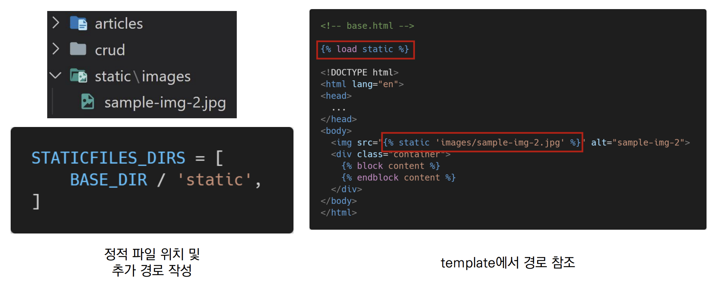

# Django 개발 환경 설정 가이드


#### **Django로 개발을 진행할 폴더를 생성한다.**

```bash
$ mkdir project1
```


#### **위에서 만든 폴더에 가상환경 생성**

```bash
$ python -m venv venv 			
```

- $ python -m venv [생성할 가상환경이름]


#### **가상환경 실행**

```bash
$ source venv/Scripts/activate
or
$ . venv/Scripts/activate
```

- $ source [가상 공간 폴더명]/Scripts/activate 로 가상환경을 실행시킨다.
- 가상환경 폴더내의 activate 파일만 실행 시키면 되므로 만약 현재의 위치가 가상환경 폴더 안이라면 `$ source Scripts/activate` 로 실행 시킨다.


#### **가상환경에서 LTS버전인 django 3.2.13 버전을 설치**

```bash
(venv)
$ pip install django==3.2.13
```


#### [참고] pip install 패키지들을 requirements.txt 파일로 저장

```bash
(vnev)
$ pip freeze > requirements.txt
```

#### requirements.txt 로 pip install 하기

```bash
(venv)
$ pip install -r requirements.txt
```


#### **장고에서 기본 프로젝트 생성**

```bash
(venv)
$ django-admin startproject first .
```

- 마침표를 입력하면 현재 폴더에 프로젝트를 생성한다.
- 마침표를 입력하지 않으면 현재 폴더에 새로운 폴더를 만들고 그폴더 내에서 프로젝트를 생성한다.
- `$ django-admin startproject [생성할 프로젝트이름] .` 으로 기본 프로젝트 생성


#### **프로젝트에서 사용할 app 생성**

```bash
(venv)
$ python manage.py startapp drink
```

- `$ python manage.py startapp [생성할 app이름]` 으로 앱을 생성


#### **프로젝트 폴더의 settings.py 의  INSTALLED_APPS 에 app 등록**

```python
# project/settings.py

INSTALLED_APPS = [
    'drink',
    ...,
]
```


#### **프로젝트 폴더의 urls.py에 app으로 연결해주는 url작성**

```python
# project/urls.py

from django.urls import path, include # include를 추가시켜서 app의 urls.py로 연결시켜준다.

urlpatterns = [
    path('drink/', include('drink.urls')),
]
```


#### **drink 앱 폴더내에 urls.py를 생성하고 urls.py에서 app_name과 urlpatterns를 작성**

```python
# drink/urls.py

from django.urls import path
from . import views

app_name = 'drink'

urlpatterns = [
    path('',views.index, name='index')
]
```


#### **drink앱 폴더의 views.py에 index함수 생성**

```python
# drink/views.py

def index(request):
    context = {
        
    }
    return render(request, 'drink/index.html', context
```

**drink앱 폴더 내에 templates/drink 폴더 생성 **


#### **프로젝트 settings.py 에 TEMPLATES 의 DIRS 경로를 BASE_DIR/'templates' 로 작성**

```python
# project/settings.py

TEMPLATES = [
    {
        'DIRS':[BASE_DIR / 'templates'],
    }
]
```


#### **서버 실행**

```bash
(venv)
$ python manage.py runserver
```

- 웹 브라우저에 localhost:8000 or http:127.0.0.1:8000 을 입력하면 내가 실행한 서버가 나온다.


#### **서버 종료**

**<kbd>Ctrl</kbd> + <kbd>c</kbd>** 를 입력해서 나가고 **diactivate**를 입력해서 서버를 종료시킨다.

```bash
(venv)
$ deactivate

///

(venv)
$
```

VS코드에서 서버를 실행하거나 가상환경을 켰을때에 VS코드를 종료하면 자동으로 서버가 닫히고 가상환경이 꺼진다.


#### base.html 설정하기

```python
# settings.py 

TEMPLATES = [
    ...,
    'DIRS' : [BASE_DIR/'templates'] # 이렇게 설정
]

# 이후에 manage.py 가있는 폴더 내에서 templates 폴더를 생성하고 그안에 base.html 생성
```

```django
<!-- templates/base.html -->


css_cdn or 
...


javascript_cdn or 
...
```


#### **url을 통한 변수받기**

변수를 받을 앱폴더에  urls.py에서 path의 주소창 안에 <>를 표시하고 그 안에 정의할 수나 문자를 넣는다.

```python
# drink/urls.py

urlpatterns = [
    path('drink/<int:pk>', views.drink),
]
```

 이후 앱폴더내의 views.py에서 함수를 정의할때에 request 옆에 새로운 변수 pk를 입력받는다.

```python
# drink/views.py

def drink(request, pk):
    context = {
        'pk' : pk,
    }
    return render(request, 'drink/drink.html', context)
```


#### **form 을 통한 변수받기**

form을 통한 변수를 받기 위해서는 변수를 보내는 url과 받는 url이 urls.py내에 기록되어야 한다.

```python
# drink/urls.py

urlpatterns = [
    path('past/', views.past),
    path('past-r/', views.past_r),
]
```

변수를 보내는 쪽의 html에서 form을 정의하고 form 태그 안에서 action 값을 변수를 받는 url을 입력하고

input 태그안에 name 속성을 통해 변수이름을 설정해서 보낸다.

```html
# drink/templates/drink/past.html

<form action=''>
    <label for='naming'>이름을 입력하세요.</label>
    <input type='text' name='name' placeholder='이름을 입력하세요'>
   	<button type='submit'>전생 확인하기</button>
</form>
```

변수를 보내는 쪽의 함수정의는 할게 없다.

```python
# drink/views.py

def past(request):
    return render(request, 'drink/past.html')
```

변수를 받는쪽의 함수에서는 request.GET.get('name') 으로 변수를 받아들인다. name은 변수를 보내는쪽의 input 태그의 name 속성으로 정의했던 이름이다.

```python
# drunk/views.py

def past_r(request):
    name = request.GET.get('name')
    context = {
        'name' : name,
    }
    return render(request,'drink/past-r.html', context)
```


#### Django ModelForm

- Model을 통해 Form Class를 만들 수 있는 helper class
- ModelForm은 Form과 똑같은 방식으로 View 함수에서 사용


#### ModelForm 선언

- forms 라이브러리인 ModelForm 클래스를 상속받음

- 정의한 ModelForm 클래스 안에 Meta 클래스를 선언

- 어떤 모델을 기반으로 form을 작성할 것인지에 대한 정보를 Meta 클래스에 지정

  ```python
  # articles/forms.py
  
  from django import forms
  from. models import Article
  
  class ArticleForm(forms.ModelForm):
      
      class Meta:
          model = Article
          fields = '__all__'
  ```


#### ModelForm에서의 Meta Class

- ModelForm의 정보를 작성하는 곳

- ModelForm을 사용할 경우 참조 할 모델이 있어야 하는데, Meta class의 model 속성이 이를 구성함

  - 참조하는 모델에 정의된 field정보를 Form에 적용함

  - fields 속성에 '__ all__' 를 사용하여 모델의 모든 필드를 포함할 수 있음

  - 또는 exclude 속성을 사용하여 모델에서 포함하지 않을 필드를 지정할 수 있음

    ```python
    # articles/forms.py
    
    class ArticleForm(forms.ModelForm):
        class Meta:
            model = Article
            fields = '__all__'
            
    # articles/forms.py
    
    class ArticleForm(forms.ModelForm):
        class Meta:
            model = Article
            exclude = ('title',)
    ```


#### ModelForm 활용

1. ModelForm 객체를 context로 전달

   ```python
   # articles/views.py
   
   from .forms import ArticleForm
   
   def new(request):
       form = ArticleForm()
       context = {
           'from' : form,
       }
       return render(request, 'articles/new.html', context)
   ```

2. Input Field 활용

   ```html
   <!-- articles/new.html-->
   
   
   
   
       <h1>
           NEW
       </h1>
       <form action='' method="POST">
           
           {{ form.as_p }}
           <input type='submit'>
       </form>	
       <hr>
       <a href=''>[back]</a>
   
   ```


#### Form 렌더링 옵션

- < label> & < input> 쌍에 대한 3가지 출력 옵션
  - **as_p()**
    - 각 필드가 단락(< p>태그)으로 감싸져서 렌더링
  - as_ul()
    - 각 필드가 목록 항목(< li>태그)으로 감싸져서 렌더링
  - **as_table()**
    - 각 필드가 테이블(< tr>태그) 행으로 감싸져서 렌더링


#### CREATE

- 유효성 검사를 통과하면 1. 데이터 저장 2. 상세 페이지로 리다이렉트

- 통과하지 못하면 1. 작성 페이지로 리다이렉트

  ```python
  # articles/views.py
  
  def create(request):
      form = ArticleForm(request.POST)
      if form.is_valid():
          article = form.save()
          return redirect('articles:detail', article.pk)
      return redirect('articles:new')
  ```


#### is_valid() method

- 유효성 검사를 실행하고, 데이터가 유효한지 여부를 boolean으로 반환


#### save() method

- form 인스턴스에 바인딩된 데이터를 통해 데이터베이스 객체를 만들고 저장

- ModelForm의 하위 클래스는 키워드 인자 instance 여부를 통해 새성할 지 수정할지를 결정함

  - instance가 제공되지 않은 경우 save()는 지정된 모델의 새 인스턴스를 생성(CREATE)

  - instance가 제공된 경우 save()는 해당 인스턴스를 수정(UPDATE)

    ```python
    # CREATE
    form = ArticleForm(request.POST)
    form.save()
    
    # UPDATE
    form = ArticleForm(request.POST, instance=article)
    form.save()
    ```


#### form 인스턴스의 errors 속성

- is_valid() 의 반환 값이 False인 경우 form 인스턴스의 errors 속성에 값이 작성 되는데 유효성 검증을 실패한 원인이 딕셔너리 형태로 저장됨

  ```python
  # articles/views.py
  
  def create(request):
      form = ArticleForm(request.POST)
      if form.is_valid():
          article = form.save()
          return redirect('articles:detail', article.pk)
      print(f'에러: {form.errors}')
      return redirect('articles:new')
  ```

- title에 공백을 넣고 제출했을때 아래와 같은 required 에러가 뜬다.



- 이 같은 특징을 통해 다음과 같은 구조로 코드를 작성하면 유효성 검증을 실패 했을 때 사용자에게 실패 결과 메세지를 출력해줄 수 있다

  ```python
  # articles/urls.py
  
  from . import views
  
  app_name = 'articles'
  
  urlpatterns = [
      ...,
      path('create/', views.create, name='create'),
  ]
  ```
  
  ```python
  # articles/views.py
  
  def create(request):
      if request.method == 'POST'
      	form = ArticleForm(request.POST)
          if form.is_valid():
              article = form.save()
          	return redirect('articles:detail', article.pk)
      else:
          form = ArticleForm()
      context = {
          'form' : form,
      }
      return render(request, 'articles/create.html', context)
  ```
  
  

#### READ

- 정의했던 Model로 부터 불러와서 context로 넣어준다

  ```python
  # articles/urls.py
  
  from . import views
  
  app_name ='articles'
  
  urlpatterns = [
      ...,
      path('', views.index, name='index'),
  ]
  
  
  # articles/views.py
  
  from .models import review
  
  def index(request):
      review = Review.objects.order_by('-pk')
      context = {
          'reviews' : reviews,
      }
      return render(request, 'articles/index.html', context)
  ```

- 템플릿에서 정의된 context로 부터 값을 출력시킨다.

  ```html
  
  	<tr onclick='location.href="{{ r.pk }}"' style='cursor: pointer;'>
          <td>{{ r.pk }}</td>
          <td>{{ r.movie_name }}</td>
          <td>{{ r.title }}</td>
          <td>{{ r.grade }}</td>
          <td>{{ r.updated_at }}</td>
      </tr>
  
  ```


#### UPDATE

- ModelForm의 인자 instance는 수정 대상이 되는 객체(기존 객체)를 지정한다.

- request.POST

  - 사용자가 form 을 통해 전송한 데이터 (새로운 데이터)

- Instance 

  - 수정이 되는 대상

  ```python
  # articles/urls.py
  from . import views
  
  app_name = 'articles'
  
  urlpatterns = [
      path('<int:pk>/update/', views.update, name='update')
  ]
  
  # articles/views.py
  
  def update(request, pk):
      article = Article.objects.get(pk=pk)
      if request.method == 'POST':
          form = ArticleForm(request.POST, instance=article)
          if form.is_valid():
              form.save()
              return redirect('articles:detail', article.pk)
      else:
      	form = ArticleForm(instance=article)        
      context = {
          'form' : form,
          'article' : article,
      }
      return render(request, 'articles/edit.html', context)
  ```


#### DELETE

```python
# accounts/urls.py

from . import views

app_name = 'articles'

urlpatterns = [
    ...,
    path('<int:pk>/delete',views.delete, name='delete'),
]

# accounts/views.py

from .models import Article

def delete(request, pk):
	article = Article.objects.get(pk=pk)
    article.delete()
    return redirect('article:index')
```


#### DETAIL

```python
# accounts/urls.py

from . import views

app_name = 'articles'

urlpatterns = [
    ...,
    path('<int:pk>',views.detail,name='detail'),
]

# accounts/views.py

from .models import Article

def detail(request, pk):
    articles = Article.objects.get(pk=pk)
    context = {
        'articles' : articles,
    }
    return render(request, 'articles/detail.html', context)
```


#### 회원가입 페이지 생성

#### 사전 설정

- accounts app 생성 및 등록

```bash
$ python manage.py startapp accounts
```

```python
# settings.py

INSTALLED_APPS = [
    'articles',
    'accounts',
]
```

- url 분리 및 매핑

```python
# urls.py

urlpatterns = [
    path('accounts/', include('accounts.urls')),
]

# accounts/urls.py

from django.urls import path
from . import views

app_name = 'accounts'

urlpatterns = [
    
]
```


#### User model 활용

- Django는 기본적인 인증 시스템과 여러가지 필드가 포함된 User Model을 제공,  대부분의 개발 환경에서 기본 User Model을 Custom User Model로 대체함

- Custom User Model은 기본 User Model과 동일하게 작동하면서도 필요한 경우 나중에 맞춤 설정할 수 있기 때문

  - 단! User Model 대체 작업은 프로젝트의 모든 migrations 혹은 첫 migrate를 실행하기 전에 이 작업을 마쳐야 함

- Custom User Model 로 대체하기

  - Django는 현재 프로젝트에서 사용할 User Model을 결정하는 **AUTO_USER_MODEL** 설정 값으로 

    Default User Model을 재정의 할 수 있도록 함


#### AUTH_USER_MODEL

- 프로젝트에서 User를 나타낼 때 사용하는 모델
- 프로젝트가 진행되는 동안 (모델을 만들고 마이그레이션 한 후) 변경할 수 없음
- 프로젝트 시작 시 설정하기 위한 것이며, 첫번째 마이그레이션 전에 확정 지어야 하는 값!

다음과 같은 기본 값을 가지고 있음

- AUTH_USER_MODEL은 settings.py 에서 보이지 않는데 아래의 값을 입력함으로써

  global_settings.py를 상속받아 재정의할수 있음

```python
# settings.py

AUTH_USER_MODEL = 'auth.User' 
```


#### 대체하기

- AbstractUser를 상속받는 커스텀 User 클래스 작성

- 기존 User 클래스도 AbstracUser를 상속받기 때문에 커스텀 User 클래스도 완전히 같은 모습을 가지게 됨

  ```python
  # accounts/models.py
  
  from django.contrib.auth.models import AbstractUser
  
  class User(AbstractUser):
      pass
  ```

- settings.py 로 가서 Django 프로젝트에서 User를 나타내는데 사용하는 모델을 방금 생성한 커스텀 User 모델로 지정

  ```python
  # settings.py
  
  AUTH_USER_MODEL = 'accounts.User'
  ```

- admin.py에 커스텀 User 모델을 등록. 기본 User 모델이 아니라서 등록하지 않으면 admin site에 출력되지 않음

  ```python
  # accounts/admin.py
  
  from django.contrib import admin
  from django.contrib.auth.admin import UserAdmin
  from .models import User
  
  admin.site.register(User, UserAdmin)
  ```


#### 데이터베이스 초기화(실습용)

- 수업 진행을 위한 데이터베이스 초기화 후 마이그레이션 (프로젝트 중간일 경우)
- migrations 파일 삭제
  - migrations 폴더, __ init__.py 는 삭제하지않음
  - 번호가 붙은 파일만 삭제
- db.sqlite3 삭제
- migrations 진행
  - makemigrations
  - migrate
- 이제부터는 auth_user 테이블이 아니라 accounts_user 테이블을 사용하게 되었다.


#### 회원가입(Signup) / UserCreationForm  _  ModelForm

- 주어진 username과 password로 권한이 없는 새 user를 생성하는 ModelForm

  ```python
  # accounts/forms.py
  
  from django.contrib.auth import get_user_model # 현재 사용하는 user를 불러옴
  from django.contrib.auth.forms import UserCreationForm
  
  class CustomUserCreationForm(UserCreationForm):
      
      class Meta(UserCreationForm.Meta): # 뒤에 .Meta 반드시 들어가야함
          model = get_user_model()
          
  # get_user_model()
  	# 현재 프로젝트에서 활성화된 모델(active user model)을 반환
      # Django에서는 User 클래스는 커스텀을 통해 변경 가능, 
      # User를 직접 참조하는 대신 get_user_model()을 사용할 것을 권장
  
  --------------------------------------------------------------------
  
  # accounts/urls.py
  
  app_name = 'accounts'
  
  urlpatterns = [
      path('signup/', views.signup, name='signup'),
  ]
  --------------------------------------------------------------------
  
  # accounts/views.py
  
  from .forms import CustomUserCreationForm
  
  def signup(request):
      if request.method == 'POST'
      	form = CustomUserCreationForm(request.POST)
          if form.is_valid():
              form.save()
              return redirect('articles:index')
      else:
          form = CustomUserCreationForm()
      context = {
          'form' : form,
      }
      return render(request, 'accounts/signup.html', context)
  ```

  ```django
  <!-- accounts/signup.html-->
  
  
  
  <h1>
      회원가입
  </h1>
  <form action='' method='POST'>
      
      {{ form.as_p }}
      <input type='submit'>
  </form>
  
  ```


#### 회원가입 진행 후 에러 페이지 확인

- 회원가입에 사용하는 UserCreationForm이 우리가 대체한 커스텀 유저 모델이 아닌 기존 유저 모델로 인해 작성된 클래스 이기 때문

  ```python
  class UserCreationForm(forms.ModelForm)
  	class Meta:
          model = User # 이 부분에서 기존 User를 사용하게 되서 에러가 발생
          fields = ('username',)
          field_classes = {
              'username' : UsernameField,
          }

- **[참고] UserCreationForm의 save 메서드**

  ```python
  def save(self, commit=True):
      user = super().save(commit=False)
      user.set_password(self.cleaned_data['password1'])
      if commit:
          user.save()
      return user # 핵심은 UserCreationForm의 save 메서드는 저장한 user를 반환
  ```


#### 로그인(Login) / AuthenticationForm  _  Form 

#### 어떻게 로그인 상태를 유지할까?

- 서버와 클라이언트 간 지속적인 상태 유지를 위해 쿠키와 세션이 존재

#### Session in Django

- Django는 database-backed sessions 저장 방식을 기본 값으로 사용
  - session 정보는 Django DB의 django_session 테이블에 저장
  - 설정을 통해 다른 저장방식으로 변경 가능
- Django는 특정 session id 를 포함하는 쿠키를 사용해서 각각의 브라우저와 사이트가 연결된 session을 확인함

#### AuthenticationForm

- 로그인을 위한 built in form

  - 로그인 하고자 하는 사용자 정보를 입력 받음(username, password)
  - ModelForm이 아닌 일반 Form을 상속 받고 있으며, request를 첫번째 인자로 취함

  ```python
  # accounts/urls.py
  
  from django.urls import path
  from . import views
  
  app_name = 'accounts'
  
  urlpatterns = [
      path('login/', views.login, name='login')
  ]
  
  # accounts/views.py
  
  from django.contrib.auth.forms import AuthenticationForm
  from django.contrib.auth import login as auth_login
  
  def login(request):
      if request.method == 'POST':
          form = AuthenticationForm(request, data=request.POST)
          if form.is_valid():
              auth_login(request, form.get_user())
              return redirect('articles:index')
      else:
          form = AuthenticationForm()
      context = {
          'form' : form,
      }
      return render(request, 'accounts/login.html', context)
  ```
  
  ```django
  <!-- accounts/login.html -->
  
  
  
  <h1>
      로그인
  </h1>
  <form action = '' method='POST'>
      
      {{ form.as_p }}
      <input type='submit'>
  </form>
  
  ```

#### login()

- login(request, user, backend=None)
- 인증된 사용자를 로그인
- 유저의 ID를 세션에 저장하여 세션을 기록
- HttpRequest 객체와 User 객체가 필요
  - 유저 정보는 반드시 인증된 유저 정보여야 함
    - authenticate() 함수를 활용한 인증
    - AuthenticationForm 을 활용한 is_valid

- 일반적인 ModelForm 기반의 Create 로직과 동일하지만 ModelForm이 아닌 Form으로써 필수 인자 구성이 다름

- DB에 저장하는 것 대신 세션에 유저를 기록하는 함수를 호출함

  - View 함수와 이름이 동일하여 변경하여 호출
  - 로그인 URL의 기본값은 'accounts/login/' 이지만 변경이 필요한 경우 settings.py LOGIN_URL을 변경 해야함


**get_user()**

- AuthenticationForm의 인스턴스 메서드
- 유효성 검사를 통과했을 경우 로그인 한 사용자 객체를 반환


#### base.html에 현재 로그인 되어있는 유저 정보 출력하기

```django
<!-- base.html -->
<body>
    <div class='container'>
        <h3>
            Hello, {{ request.user }}
        </h3>
        <hr>
        
        
    </div>
</body>
```

- base 템플릿에서 context 없이 user 변수를 사용할수 있는 이유?
  - 기본 settings.py 의 context processors 설정의 django.contrib.auth.context_processors.auth 의 기본 설정에 user가 포함되어 있기때문
  - 템플릿 변수 {{ user }}
    - 클라이언트에서 로그인한 경우 User 클래스의 인스턴스
    - 클라이언트가 로그인 하지 않은 경우 AnonymousUser 클래스의 인스턴스


#### Logout / logout()

- logout(request)
- 요청 유저에 대한 세션 정보를 삭제함 
  - DB에서 session data 삭제
- HttpRequest 객체를 인자로 받고 반환값 없음

- 사용자가 로그인하지 않은 경우 오류를 발생시키지 않음

  ```python
  # accounts/urls.py
  
  from django.urls import path
  from . import views
  
  app_name = 'accounts'
  
  urlpatterns = [
      path('login/', views.login, name='login'),
      path('logout/', views.logout, name='logout'),
  ]
  
  # accounts/views.py
  
  from django.contrib.auth import logout as auth_logout
  
  def logout(request):
      auth_logout(request)
      return redirect('articles:index')
  ```

  ```django
  <!-- base.html -- >
  
  <body>
  	<div class='container'>
          <h3>Hello. {{ user }}</h3>
          <form action='' method='POST'>
              
              <input type='submit' value='Logout'>
          </form>
  		<a href=''>Logout</a>
          <hr>
          
          
  
      </div>
  </body>
  ```


#### 회원정보수정(update) / UserChangeForm  _  ModelForm

- 사용자의 정보 및 권한을 변경하기 위해 admin 인터페이스에서 사용되는 ModelForm
- UserChangeForm 또한 ModelForm이기 때문에 instance 인자로 기존 user 데이터 정보를 받는 구조 또한 동일함

- 이전에 CustomUserChangeForm으로 확장했기 때문에 CustomUserChangeForm을 사용하기

- UserChangeForm 역시 ModelForm으로 구성되어 있어 User 모델 정보를 변경하여 활용


#### CustomUserChangeForm fields 재정의

- UserChangeForm 은 실제 관리자 화면에서 활용 중인 form으로 세부 필드들이 모두 노출된다

- 직접 fields를 정의하여 원하는 형식으로 활용 가능함

```python
# accounts/forms.py

from django.contrib.auth import get_user_model
from django.contrib.auth.forms import UserChangeForm

class CustomUserChangeForm(UserChangeForm):
    
    class Meta(UserChangeForm.Meta):
        model = get_user_model()
        fields = ('email', 'first_name', 'last_name',)

# accounts/ursl.py

app_name = 'accounts'
urlpatterns = [
    ...,
    path('update/', views.update, name='update'),
]

# accounts/views.py

from .forms import CustomUserChangeForm

def update(request):
   if request.method == 'POST':
   		form = CustomUserChangeForm(request.POST, instance=request.user)
   		if form.is_valid():
   			form.save()
   			return redirect('articles:index')
   else:
   		form = CustomUserChangeForm(instance=request.user)
   context = {
   		'form' : form
   }
   return render(request, 'accounts/update.html', context)
```

```html
<!-- accounts/update.html -->



<h1>
    회원정보 수정
</h1>
<form action='' method='POST'>
    
    {{ form.as_p }}
    <input type='submit'>
</form>

<!-- base.html -->

<div class='container'>
    <a href=''>Signup</a>
    <a href=''>회원정보 수정</a>
    <hr>
    
    
</div>        
```


#### User model 상속구조

**AbstractUser** => **User** => **UserChangeForm** 으로 상속되고있다.


#### 비밀번호변경(change_password) / PasswordChangeForm _ Form

- 사용자가 비밀번호를 변경할 수 있도록 하는 Form
- 이전 비밀번호를 입력하여 비밀번호를 변경할 수 있도록 함
- 이전 비밀번호를 입력하지 않고 비밀번호를 설정할 수 있는 SetPasswordForm을 상속받는 서브 클래스
- 비밀번호 변경 후 로그인 상태가 지속되지 못하는 문제 발생
- 이를 해결하기 위해 암호 변경 시 세션 무효화 방지하기

  - 비밀번호가 변경되면 기존 세션과의 회원 인증 정보가 일치하지 않게 되서 로그인 상태가 유지되지 못함
- **update_session_auth_hash(request, user)**

  - 현재 요청(current request)과 새 session data가 업데이트 된 사용자 객체를 가져오고 session data를 적절하게 업데이트 해줌
  - 암호가 변경되어도 로그아웃 되지 않도록 새로운 password의 session data로 session을 업데이트


```python
# accounts/urls.py

app_name = 'accounts'

urlpatterns = [
    ...,
    path('password/', views.change_password, name='change_password'),
]

# accounts/views.py

from django.contrib.auth import update_session_auth_hash
from django.contrib.auth.forms import PasswordChangeForm

def change_password(request):
    if request.method == 'POST'
    	form = PasswordChangeForm(request.user, request.POST)
        if form.is_valid():
            form.save()
            update_session_auth_hash(request, form.user) # 이부분을 통해 세션유지
            return redirect('articles:index')
    else:
    	form = PasswordChangeForm(request.user)
    context = {
        'form' : form,
    }
    return render(request, 'accounts/change_password.html', context)
```

```html
<!-- accounts/change_password.html-->



<h1>
    비밀번호 변경
</h1>
<form action='' method='POST'>
    
    {{ form.as_p }}
    <input type='submit'>
</form>

```


#### 탈퇴 delete

- 탈퇴와 동시에 해당 유저의 세션 정보도 함께 지우고 싶을 경우

- 탈퇴(1) 후 로그아웃(2) 의 순서를 반드시 지켜야됨

- 먼저 로그아웃을 해버리면 해당 요청 객체의 정보가 없어지기 때문에 탈퇴에 필요한 정보 또한 없어지기 떄문

  ```python
  # accounts/urls.py
  
  urlpatterns = [
      path('delete/', views.delete, name='delete')
  ]
  
  # accounts/views.py
  
  def delete(request):
      request.user.delete() # 이 순서가 중요   1.삭제
      auth_logout(request) # 2. 로그아웃
      return redirect('articles:index')
  ```


####  로그인 사용자에 대한 접근 제한 Limiting access to logged-in users

- 로그인 사용자에 대한 접근 제한하기
- 접근을 제한하는 2가지 방법
  - is_authenticated attribute를 활용한 조건문
  - login_required decorators를 활용한 view 제한


#### 1.  is_authenticated

- User model의 속성중 하나

- 사용자가 인증 되었는지 여부를 알 수 있는 방법

- 모든 User 인스턴스에 대해 항상 True인 읽기 전용 속성

  - AnonymousUser 에 대해서는 항상 False

- 일반적으로 request.user에서 이 속성을 사용 (request.user.is_authenticated)

- 권한(permission)과 관련이 없고, 사용자가 활성화 (active)이거나 유효한 세션(valid session)을 가지고 있는지도 확인하지 않음

  **is_authenticated 내부코드**

  ```python
  class AbstractBaseUser(models.Model):
      ...
      def is_authenticated(self):
  		"""
          Always return True. This is a way to tell if the user has been
          authenticated in templates.
          """
          return True
  ```

  **is_authenticated 적용코드**

  ```django
  <!-- base.html -->
  
  
  	<h3>hello, {{ request.user }}</h3>
      <a href=''>Logout</a>
      <a href=''>회원정보수정</a>
      <!--
      <form action='' method='POST'>
          
          <input type='submit' value='회원탈퇴'>
      </form>
      -->
      <a href=''>회원탈퇴</a>
  
      <!--
      <form action='' method='POST'>
          
          <input type='submit' value='login'> 
      </form>
      -->
      <a href=''>Login</a>
      <a href=''>Signup</a>
  
  ```

  **is_authnticated 적용하기**

  인증된 사용자만 게시글 작성 링크를 볼 수 있도록 처리하기

  - URL을 직접입력하면 게시글 작성 페이지로 갈 수 있음
  - View에서의 처리도 반드시 필요함

  ```django
  <!-- articles/index.html-->
  
  
  
  	<h1>
          Articles
      </h1>
      
          <a href=''>CREATE</a>
      
          <a href=''>새 글을 작성하려면 로그인하세요</a>
      
  
  ```

  ```python
  # articles/views.py
  
  def create(request):
      if request.user.is_authenticated:
          pass
      else:
          return redirect('accounts:login')
  ```

  

  **is_authenticated 인증된 사용자라면 로그인 로직을 수행할 수 없도록 처리**

  ```python
  # accounts/views.py
  
  def login(request):
      if request.user.is_authenticated:
          return redirect('articles:index')
  ```


#### 2.  login_required

- login_required decorators

  - 사용자가 로그인 되어 있으면 정상적으로 view 함수를 실행
  - 로그인 하지 않은 사용자의 경우 settings.py 의 LOGIN_URL 문자열 주소로 redirect
    - LOGIN_URL의 기본값은 /accounts/login

- 로그인 상태에서만 글을 작성/수정/삭제 할 수 있도록 변경

  ```python
  from django.contrib.auth.decorators import login_required
  
  @login_required
  def create(request):
      pass
  
  @login_required
  def delete(request, pk)
  	pass
  
  @login_required
  def update(request, pk)
  	pass
  ```


#### login_required 적용확인하기

- /articles/create/ 로 브라우저에 직접 요청
- 로그인 페이지로 리다이렉트 및 URL 확인
  - 인증 성공 시 사용자가 redirect되어야 하는 경로는 'next' 라는 쿼리 문자열 매개 변수에 저장됨
  - 예시) /accounts/login/?next=/articles/create/


#### 'next' query string parameter 대응

```python
# accounts/views.py

def login(request):
    if request.user.is_authenticated:
        return redirect('articles:index')
    
    if request.method == 'POST'
    	form = AuthenticationForm(request, request.POST)
        if form.is_valid():
    		auth_login(request, form.get_user())
            return redirect(request.GET.get('next') or 'articles:index' )
    else:
    	form = AuthenticationForm()
    context = {
        'form' : form,
    }
    return render(request, 'accounts/login.html', context)
```


#### 'next' query string parameter 주의사항

- 만약 login 템플릿에서 form action이 작성되어 있다면 동작하지 않음
- 해당 action 주소 next 파라미터의 url이 아닌 login 템플릿의 form action인 /accounts/login/으로 요청을 보내기 때문이다.

```html
<!-- accounts/login.html -->


<h1>
    로그인
</h1>
<form action='비워둬야함' 만약 이렇게 주소가 작성되어 있으면 next파라 미터가 작성되어있는 url이 날아가지않고 위의 url로 날아가게됨 method='POST'>
    
    {{ for.as_p }}
    <input type='submit'>
</form>

```


#### AbstractBaseUser의 모든 subclass와 호환되는 forms

- **forms.ModelForm 상속**
  - UserCreationForm
  - UserChangeForm
- **forms.Form 상속**
  - AuthenticationForm
  - SetPasswordForm
  - PasswordChangeForm
  - AdminPasswordChangeForm


#### Admin site

- Django의 가장 강력한 기능 중 하나인 automatic admin interface 알아보기
- 관리자 페이지
  - 사용자가 아닌 서버의 관리자가 활용하기 위한 페이지
  - 모델 class를 admin.py에 등록하고 관리
  - 레코드 생성 여부 확인에 매우 유용하며 직접 레코드를 삽입할 수도 있음


#### Admin 계정 생성

```bash
$ python manage.py createsuperuser
```

- username과 password를 입력해 관리자 계정을 생성
  - email은 선택사항이기 때문에 입력하지 않고 enter를 입력하는 것이 가능
  - 비밀번호 생성 시 보안상 터미널에 입력되지 않으니 무시하고 입력을 이어가도록 함


#### Admin site 로그인

- http://127.0.0.1:8000/admin/ 로 접속후 로그인
- 계정만 만든 경우 Django 관리자 화면에서 모델 클래스는 보이지 않음


#### Admin에 모델 클래스등록

- 모델의 record를 보기 위해서는 admin.py에 등록 필요

  ```python
  # articles/admin.py
  
  from django.contrib import admin
  frrom .models import Article
  
  admin.site.register(Article)
  ```

​	**등록된 모델 확인**

​	**admin 페이지에서 데이터를 조작해보기**




#### 정적파일 사용하기 - 기본 경로




#### 정적파일 사용하기 - 추가 경로

추가경로를 사용하기 위해서는 settings.py에 STATICFILES_DIRS = [BASE_DIR/ 'static'] 을 등록해야한다.



#### 이미지 업로드(기본 설정)

**미디어 파일**

- 사용자가 웹에서 업로드하는 정적 파일

**Media 관련필드**

- ImageField
  - **[주의]**사용하려면 반드시 Pillow 라이브러리가 필요
  - ImageField 인스턴스는 최대 길이가 100자인 문자열로 DB에 생성되며, max_length인자를 사용하여 최대 길이를 변경 할 수 있음
  - FileField를 상속받는 서브 클래스이기 떄문에 FileField의 모든 속성 및 메서드를 사용가능
- FileField
  - 파일 업로드에 사용하는 모델 필드
  - 2개의 선택 인자를 가지고 있음
    - upload_to
    - storate

**메인 settings.py, 메인 url.py 설정**

- settings.py에 MEDIA_ROOT, MEDIA_URL 설정

- MEDIA_ROOT
  - 사용자가 업로드 한 파일(미디어 파일)들을 보관할 디렉토리의 절대경로
  - django는 성능을 위해 업로드 파일은 데이터베이스에 저장하지않고 파일의 경로만 저장

- MEDIA_URL

  - MEDIA_ROOT 에서 제공되는 미디어를 처리하는 URL
  - 업로드 된 파일의 주소(URL)를 만들어 주는 역할
  - 값을 입력하면 반드시 slash( / ) 로 끝나야 함

  ```python
  # settings.py
  
  MEDIA_ROOT = BASE_DIR / 'media'
  MEDIA_URL = '/media/'
  
  # urls.py
  
  from django.conf import settings
  from django.conf.urls.static import static
  
  urlpatterns =[
      ...,
      ...,
  ] + static(settings.MEDIA_URL, document_root=settings.MEDIA_ROOT)
  
  # 업로드 된 파일의 URL == settings.MEDIA_URL
  # 위 URL을 통해 참조하는 파일의 실제 위치 == settings.MEDIA_ROOT

**모델 설정**

- upload_to

  - 문자열 경로 지정 방식

  ```python
  # articles.models.py
  
  from django.db import models
  
  class Article(models.Model):
      title = models.CharField(max_length=80)
      content = models.TextField()
      image = models.ImageField(upload_to='images/', blank=True,)
      
  ```

**마이그레이션 실행**

```bash
# ImageField를 사용하기 위해서는 Pillow 라이브러리 설치 필요

$ pip install Pillow

$ python manage.py makemigrations
$ python manage.py migrate
```

**articles/forms.py 필드에 image 추가**

```python
# articles/forms.py

from .models import Article
from django import forms

class ArticleForm(forms.ModelForm):
    class Meta:
        model = Article
        fields = ['title', 'content', 'image']
```

**HTML 설정**

```html
<!--articles/create.html-->

<form action='' method='POST' enctype='multipart/form-data'>
    
    {{ bootstrap_form form }}
    <input type='submit' value='글쓰기'>
</form>
```

**View 설정**

- 업로드한 파일은 request.FILES 객체로 전달됨

  ```python
  # articles/views.py
  
  def create(request):
      if request.method=='POST':
          form = ArticleForm(request.POST, request.FILES)
          if form.is_valid():
              form.save()
              return redirect('articles:index')
      else:
          form = ArticleForm()
      context = {
          'form' : form,
      }
      return render(request, 'articles/create.html', context)
  ```


#### 이미지 출력(READ)

**img 태그 활용**

- article.image.url == 업로드 파일의 경로

- article.image == 업로드 파일의 파일 이름

  ```html
  <!--detail.html-->
  
  
  
      <h2>
          DETAIL
      </h2>
      <h3>
          {{ article.pk }} 번 글
      </h3>
      
      <hr>
      ...
  
  ```

  

#### 이미지 수정(UPDATE)

- 이미지는 바이너리 데이터(하나의 덩어리)이기 때문에 텍스트처럼 일부만 수정 하는 것은 불가능하고, 새로운 사진으로 덮어 씌우는 방식을 사용

  ```html
  <!--articles/update.html-->
  
  
  
  <h1>
      UPDATE
  </h1>
  <form action='' method='POST' enctype='multipart/form-data'>
      
      {{ bootstrap_form form }}
      <input type='submit' value='수정하기'>
  </form>
  
  ```

  ```python
  # articles/views.py
  
  @require_http_methods(['GET', 'POST'])
  def update(request, pk):
      article = get_object_or_404(Article, pk=pk)
      if request.method == 'POST':
          form = ArticleForm(request.POST, request.FILES, instance=article)
          if form.is_valid():
              form.save()
              return redirect('articles:index', article.pk)
      else:
     		form = ArticleForm(intance=article)
      context = {
          'form' : form,
       }
      return render(request, 'articles/update.html', context)
  ```


#### **이미지 Resizing**

**Django-imagekit**

- 실제 원본 이미지를 서버에 그대로 업로드 하는 것은 서버의 부담이 크다

-  태그에서 직접 사이즈를 조정할 수도 있지만 (width 와 height), 업로드 될 때 이미지 자체를 resizing 하는 것을 사용해 볼 것

- django-imagekit 라이브러리 활용

  1. django-imagekit 설치
  2. INSTALLED_APPS에 추가

  ```bash
  $ pip install django-imagekit
  ```

  ```python
  # settings.py
  
  INSTALLED_APP = [
      ...,
      'imagekit',
      ...
  ]
  ```

  3. 이미지 크기 변경하기

  ```python
  # articles/models.py
  
  from imagekit.models import ProcessedImageField
  from imagekit.processors import Thumbnail
  
  class Article(models.Model):
      title = models.CharField(max_length=50)
      content = models.TextField()
      image = ProcessedImageField(
      	upload_to='images/',
      	blank = True,
      	processors=[Thumbnail(400,500)],
      # processors = [ResizeToFill(1200,960)] 이미지 사이즈를 1200x960으로 변환
      	format="JPEG",
      	options={'quality' : 90},
      )
  ```

  4. 이후에 makemigtations -> migrate 실행

  ```bash
  $ python manage.py makemigrations
  $ python manage.py migrate
  ```

  ProcessedImageField()의 parameter로 작성된 값들은 변경이 되더라도 다시 makemigrations를 해줄 필요없이 즉시 반영됨

#### 관계 모델 참조

**Related manager**

- Related manager는 1:N 혹은 M:N 관계에서 사용 가능한 문맥(context)
- Django는 모델 간 1:N 혹은 M:N 관계가 설정되면 역참조할 때에 사용할 수 있는 manager를 생성
  - 이전에 모델 생성시 objects 라는 매니저를 통해 queryset api를 사용했던 것처럼 related manager를 통해 queryset api를 사용할 수 있게 됨
- 지금은 1:N 관계에서의 related manager 만을 학습할 것

**역참조**

- 나를 참조하는 테이블(나를 외래 키로 지정한)을 참조하는 것

- 즉, 본인을 외래 키로 참조 중인 다른 테이블에 접근하는 것

- 1:N 관계에서는 1이 N을 참조하는 상황

  - 즉, 외래 키를 가지지 않은 1이 외래 키를 가진 N을 참조

  ```python
  article.comment_set.method()
  ```

- Article 모델이 Comment 모델을 역참조 할 때 사용하는 매니저
- article.comment 혁식으로는 댓글 객체를 참조 할 수 없음
  - 실제로 Article 클래스에는 Comment와의 어떠한 관계도 작성되어 있지 않음

- 대신 Django가 역참조 할 수 있는 comment_set manager를 자동으로 생성해 article.comment_set 형태로 댓글 객체를 참조할 수 있음
  - 1:N 관계에서 생성되는 Related manafer의 이름은 참조하는 '모델명_set' 이름 규칙으로 만들어짐
- 반면 참조상황(Comment -> Article)에서는 실제 ForeignKey 클래스로 작성한 인스턴스가 Comment 클래스의 클래스 변수이기 때문에 comment.article 형태로 작성 가능

#### [참고]

- shell_plus 사용방법
- django-extensions 를 pip를 통해 설치
- 메인 seetings.py의 INSTALLED_APPS에 'django_extensions'를 추가
- python manage.py shell_plus 를 통해 실행
- shell 과 shell_plus의 차이점
  - shell - 불러올 모델을 한개씩 작성해줘야함
  - shell_plus - 모델을 별도로 작성하지 않아도 자동으로 모델을 불러옴

#### Comment 모델 정의/ ForeignKey - related_name

- ForeignKey 클래스의 선택 옵션

- 역참조시 사용하는 매니저 이름(model_set manager)을 변경할 수 있음

- 작성 후, migration 과정이 필요

  ```python
  # articles/models.py
  
  class Comment(models.Model):
      article = models.ForeignKey(Article, on_delete=models.CASCADE, 
                                 related_name='comments')
  ```

  위와 같이 **related_name = 'comments'**로 변경하게 되면 기존에 article에서 comment를 역참조할때에 사용했던 명령문인 **article.comment_set**은 더이상 사용할 수 없고 **article.comments**로 대체된다.

**Migration 진행**

- models.py 에서 모델에 대한 수정사항이 발생했기 때문에 migration 과정을 진행

  ```bash
  $ python manage.py makemigrations
  $ python manage.py migrate
  ```

#### admin.site 등록

- 새로 작성한 Comment모델을 admin.site에 등록하기

  ```python
  # articles/admin.py
  
  from .models import Article, Comment
  
  admin.site.register(Article)
  admin.site.register(Comment)
  ```

#### Comment 구현

- 사용자로부터 댓글 데이터를 입력 받기 위한 CommentForm 작성

  ```python
  # articles/forms.py
  
  from .models import Article, Comment
  
  class CommentForm(forms.ModelForm):
      
      class Meta:
          model = Comment
          fields = ['content']
          
  # articles/views.py
  
  from .forms import ArticleForm, CommentForm
  
  def detail(request, pk):
      article = Article.objects.get(pk=pk)
      if request.method == 'POST':
          form = CommentForm(request.POST)
          if form.is_valid():
              forms = form.save(commit=False)
              forms.user = request.user
              forms.article = article
              forms.save()
              return redirect('articles:detail', pk)
      else:
          form = CommentForm()
      comments = article.comments_set.order_by('-pk')
      context = {
          'article' : article,
          'form' : form,
          'comments' : comments,
      }
      return render(request, 'articles/detail.html', context)
  ```

  ```html
  <!-- articles/detail.html-->
  
  
  
  
  <h1>
      articles detail 페이지 입니다.
  </h1>
  <div>
      <h3>
          {{ article.title }}
      </h3>
      <p>
          {{ article.content }}
      </p>
      
  </div>
  <form action='' method='POST'>
      
      
      <input type='submit' value='댓글작성'>
  </form>
  <h3>
      댓글목록
  </h3>
  
  <p>
      {{ comment.content }}
  </p>
  <hr>
  
  
  ```

#### Comment Delete 구현

```python
# articles/urls.py

urlpattrerns = [
    ...,
    path('<int:a_pk>/comments/<int:c_pk>', views.c_delete, name='c_delete')
]

# articles/views.py

def c_delete(request, a_pk, c_pk):
    comment = Comment.objects.get(pk=c_pk)
    comment.delete()
    return redirect('articles:detail', a_pk)
```

```html
<!-- articles/detail.html -->
<h3>
    댓글목록
</h3>

<p>
    {{ c.content }} |
    <a href=''>댓글삭제</a>
</p>

```

#### Comment  추가사항

- 댓글 개수 출력하기
  - DTL filter -length 사용
  - QuerysetAPI - count() 사용
- 댓글이 없는 경우 대체 컨텐츠 출력

**댓글 개수 출력하기**

- DTL filter -length 사용

  ```django
  {{ comments|length }}
  {{ article.comment_set.all|length }}
  ```

- QuerysetAPI - count() 사용

  ```django
  {{ comment.count }}
  {{ article.comment_set.count }}
  ```

- detail 템플릿에 작성하기

  ```django
  <!--articles/detail.html-->
  
  <h4>
      댓글목록
  </h4>
  
  <p>
      <b>{{ comments|length }}개의 댓글이 있습니다.</b>
  </p>
  
  ```

**댓글이 없는 경우 대체 컨텐츠 출력하기**

- DTL for empty 활용하기

  ```html
  <!--articles/detail.html-->
  
  
  <p>
      {{ comment.content }}
  </p>
  
  <p>
      댓글이 없습니다.
  </p>
  
  ```


#### 비동기 구현

**Axios** 추후 추가예정 -
