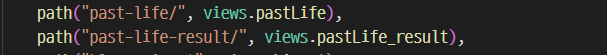

# Django 개발 환경 설정 가이드

### 1. git bash창을 아무위치에서 열고나서 cd ~를 입력해서 ~ 홈폴더로 간다


### 2. ~ 홈화면에서 서버로 만들 폴더를 mkdir 명령어를 통해 만든다.


### 3. cd명령어를 통해서 해당 서버 폴더로 이동한다.


### 4. $ python -m venv [일반적으로는 이름-venv 로 생성함] 명령어를통해 파이썬 모듈인 venv를 실행시켜 [가상공간폴더]를 생성한다.

### 5. $ source [가상 공간 폴더명]/Scripts/activate 명령어로 가상서버를 실행시킨다.

- **그냥 activate파일만 실행 시키면 되므로 만약 최초의 서버 폴더안에 있었다면**

  즉 **~/test 의 위치에 내가 있다면**

  **sourve test-venv/Scripts/activate** 로 입력해서 가상공간을 실행시킨다.

  **만약 생성된 가상공간폴더안에 위치해 있다면**

  즉 **~/test/test-venv/ 의 위치에 내가 있다면**

  **source Scripts/activate** 를 입력해서 가상 공간을 형성한다.


 ### 6. 해당 가상공간폴더에 가장 안전한 버전의 django 3.2.13버전을 설치한다.

- **pip install django==3.2.13 명령어를 통해 설치한다.**


### 7. django-admin startproject [프로젝트 이름] . 을 통해 장고 기본 프로젝트를 생성합니다.

- 반드시 . 마침표를 입력해서 현재 폴더에 프로젝트를 생성하기로 합니다.


### 8. 해당 프로젝트에서 사용할 app을 아래 명령어를 통해 생성합니다.


### 9. 프로젝트 폴더안에 settings.py 에 ISTALLED_APPS 에 생성한 app을 추가해줍니다.


### 10. 프로젝트 폴더안의 urls.py 안에 from drink import views 를 추가시키고 urlpatterns 안에 views에서 실행할 함수를 views.[함수이름] 으로 추가해줍니다.


### 11. 이후 drink 폴더의 views.py 로 돌아가서 drink라는 함수를 생성해줍니다.


### 12. 이후 drink 폴더 내에 templates 라는 폴더를 생성한 이후에 templates 폴더 안에 drink.html 이라는 파일을 생성해줍니다.


### 13. python manage.py runserver 명령어를 통해 서버를 실행시킵니다.


- 기본적으로 웹브라우저에 localhost:8000 을 입력시키면 내가 실행시킨 서버의 django가 나온다.

### 14. 서버를 종료할때

**<kbd>Ctrl</kbd> + <kbd>c</kbd>** 를 입력해서 나가고 **diactivate**를 입력해서 서버를 종료시킨다.야


- **<kbd>Ctrl</kbd> + <kbd>c</kbd>** 로 나가게되면 해당 서버는 들어가지지 않는다.

### url을 통한 변수받기

url을 통해서 값을 받기 위해서는 프로젝트폴더 내에 urls.py에서 path의 주소창 안에 <>를 표시하고 그 안에 정의할 수나 문자를 넣는다.


이후에 프로젝트앱 폴더내의 views.py에서 함수를 정의할때에 request옆에 처음에 정의했던 number나 혹은 number1 number2 를 입력해서 받고 이를 해당 함수 context안에 넣는다.


### form을 통한 변수받기

변수를 보내는 url과 받는 url 모두 프로젝트본체 폴더 안에 urls.py 내에 기록되어야한다.



form을 통해서 변수를 받기 위해서는 변수를 보내는쪽과 변수를 받는쪽 총 2개의 페이지가 있어야한다.  

변수를 보내는 쪽의 html에서 form을 정의하고 form 태그 안에서 action 값을 변수를 받을 url을 입력한다. 

이후 변수로 보낼 input 태그 안에 name이라는 속성을 통해 변수이름을 설정해서 보낸다.


변수를 보내는 쪽의 함수정의는 딱히 할게없다.


변수를 받는쪽의 함수정의에서는 request.GET.get('name')으로 변수를 받아들인다.

변수를 보내는쪽의 form태그에서 name속성으로 정의했던 이름이 변수의 이름이다.


변수를 여러개 받을수도있다.


### 회원가입 페이지 생성

### 사전 설정

- accounts app 생성 및 등록

```bash
$ python manage.py startapp accounts
```

```python
# settings.py

INSTALLED_APPS = [
    'articles',
    'accounts',
]
```

- url 분리 및 매핑

```python
# urls.py

urlpatterns = [
    path('accounts/', include('accounts.urls')),
]

# accounts/urls.py

from django.urls import path
from . import views

app_name = 'accounts'

urlpatterns = [
    
]
```

### User model 활용

- Django는 기본적인 인증 시스템과 여러가지 필드가 포함된 User Model을 제공, 

  대부분의 개발 환경에서 기본 User Model을 Custom User Model로 대체함

- Custom User Model은 기본 User Model과 동일하게 작동하면서도 필요한 경우 나중에

  맞춤 설정할 수 있기 때문

  - 단! User Model 대체 작업은 프로젝트의 모든 migrations 혹은 첫 migrate를 실행하기 전에 이 작업을 마쳐야 함

- Custom User Model 로 대체하기

  - Django는 현재 프로젝트에서 사용할 User Model을 결정하는

    AUTO_USER_MODEL 설정 값으로 Default User Model을 재정의 할 수 있도록 함

### AUTH_USER_MODEL

- 프로젝트에서 User를 나타낼 때 사용하는 모델
- 프로젝트가 진행되는 동안 (모델을 만들고 마이그레이션 한 후) 변경할 수 없음
- 프로젝트 시작 시 설정하기 위한 것이며, 첫번째 마이그레이션 전에 확정 지어야 하는 값!

다음과 같은 기본 값을 가지고 있음

- AUTH_USER_MODEL은 settings.py 에서 보이지 않는데 아래의 값을 입력함으로써

  global_settings.py를 상속받아 재정의할수 있음

```python
# settings.py

AUTO_USER_MODEL = 'auth.User'
```

### 대체하기

- AbstractUser를 상속받는 커스텀 User 클래스 작성

- 기존 User 클래스도 AbstracUser를 상속받기 때문에 커스텀 User 클래스도 완전히 같은 모습을 가지게 됨

  ```python
  # accounts/models.py
  
  from django.contrib.auth.models import AbstractUser
  
  class User(AbstracUser):
      pass
  ```

- settings.py 로 가서 Django 프로젝트에서 User를 나타내는데 사용하는 모델을 방금 생성한 커스텀 User 모델로 지정

  ```python
  # settings.py
  
  AUTH_USER_MODEL = 'accounts.User'
  ```

- admin.py에 커스텀 User 모델을 등록. 기본 User 모델이 아니라서 등록하지 않으면 admin site에 출력되지 않음

  ```python
  # accounts/admin.py
  
  from django.contrib import admin
  from django.contrib.auth.admin import UserAdmin
  from .models import User
  
  admin.site.register(User, UserAdmin)
  ```

### 데이터베이스 초기화(실습용)

- 수업 진행을 위한 데이터베이스 초기화 후 마이그레이션 (프로젝트 중간일 경우)
- migrations 파일 삭제
  - migrations 폴더, __ init__.py 는 삭제하지않음
  - 번호가 붙은 파일만 삭제
- db.sqlite3 삭제
- migrations 진행
  - makemigrations
  - migrate
- 이제부터는 auth_user 테이블이 아니라 accounts_user 테이블을 사용하게 되었다.

# 회원 가입

### UserCreationForm

- 주어진 username과 password로 권한이 없는 새 user를 생성하는 ModelForm

  ```python
  # accounts/urls.py
  
  app_name = 'accounts'
  
  urlpatterns = [
      path('signup/', views.signup, name='signup'),
  ]
  
  # accounts/views.py
  
  from django.contrib.auth.forms import AuthenticationForm, UserCreationForm
  
  def signup(request):
      if request.method == 'POST':
          pass
      else:
          form = UserCreationForm()
      context = {
          'form' : form,
      }
      return render(request, 'accounts/signup.html', context)
  ```

  ```django
  <!-- accounts/signup.html-->
  
  
  
  <h1>
      회원가입
  </h1>
  <form action='' method='POST'>
      
      {{ form.as_p }}
      <input type='submit'>
  </form>
  
  ```

- base.html에 회원가입 링크 작성

  ```django
  <!-- base.html -->
  
  <div class='container'>
      <a href=''>Signup</a>
      <hr>
      
      
  </div>
  ```

- 회원가입 로직 작성

  ```python
  # accounts/views.py
  
  def signup(request):
      if request.method == 'POST':
          form = UserCreationForm(request.POST)
          if form.is_valid():
              form.save()
              return redirect('articles:index')
      else:
          form = UserCreationForm()
      context = {
              'form' : form,
      }
      return render(request, 'accounts/signup.html', context)	
  ```

### 회원가입 진행 후 에러 페이지 확인

- 회원가입에 사용하는 UserCreationForm이 우리가 대체한 커스텀 유저 모델이 아닌 기존 유저 모델로 인해 작성된 클래스 이기 때문

  ```python
  class UserCreationForm(forms.ModelForm)
  	class Meta:
          model = User # 이 부분에서 기존 User를 사용하게 되서 에러가 발생
          fields = ('username',)
          field_classes = {
              'username' : UsernameField,
          }

### UserCreationForm( ) 커스텀하기

- 기존 UserCreationForm을 상속받아 User 모델 재정의

  ```python
  # accounts/forms.py
  
  from django.contrib.auth import get_user_model # 현재 사용하는 user를 불러옴
  from django.contrib.auth.forms import UserCreationForm
  
  class CustomUserCreationForm(UserCreationForm):
      
      class Meta(UserCreationForm.Meta): # 뒤에 .Meta 반드시 들어가야함
          model = get_user_model()
          
  # get_user_model()
  	# 현재 프로젝트엣 활성화된 모델(active user model)을 반환
      # Django에서는 User 클래스는 커스텀을 통해 변경 가능, 
      # User를 직접 참조하는 대신 get_user_model()을 사용할 것을 권장
  ```

- 기존 UserCreationForm을 CustomUserCreationForm() 으로 대체하기

  ```python
  # accounts/views.py
  
  from django.contrib.auth.forms import AuthenticationForm, UserCreationForm
  from .forms import CustomUserCreationForm, CustomUserChangeForm
  
  def signup(request):
      if request.method == 'POST'
      	form = CustomUserCreationForm(request.POST)
          if form.is_valid():
              form.save()
              return redirect('articles:index')
      else:
          form = CustomUserCreationForm()
      context = {
          'form' : form,
      }
      return render(request, 'accounts/signup.html', context)
  ```

- **[참고] UserCreationForm의 save 메서드**

  ```python
  def save(self, commit=True):
      user = super().save(commit=False)
      user.set_password(self.cleaned_data['password1'])
      if commit:
          user.save()
      return user # 핵심은 UserCreationForm의 save 메서드는 저장한 user를 반환
  ```

# 로그인 Login

### 어떻게 로그인 상태를 유지할까?

- 서버와 클라이언트 간 지속적인 상태 유지를 위해 쿠키와 세션이 존재

### Session in Django

- Django는 database-backed sessions 저장 방식을 기본 값으로 사용
  - session 정보는 Django DB의 django_session 테이블에 저장
  - 설정을 통해 다른 저장방식으로 변경 가능
- Django는 특정 session id 를 포함하는 쿠키를 사용해서 각각의 브라우저와 사이트가 연결된 session을 확인함

### AuthenticationForm

- 로그인을 위한 built in form

  - 로그인 하고자 하는 사용자 정보를 입려 받음(username, password)
  - ModelForm이 아닌 일반 Form을 상속 받고 있으며, request를 첫번째 인자로 취함

  ```python
  # accounts/urls.py
  
  from django.urls import path
  from . import views
  
  app_name = 'accounts'
  
  urlpatterns = [
      path('login/', views.login, name='login')
  ]
  
  # accounts/views.py
  
  from django.contrib.auth.forms import AuthenticationForm
  
  def login(request):
      if request.method == 'POST':
          pass
      else:
          form = AuthenticationForm()
      context = {
          'form' : form,
      }
      return render(request, 'accounts/login.html', context)
  ```

  ```django
  <!-- accounts/login.html -->
  
  
  
  <h1>
      로그인
  </h1>
  <form action = '' method='POST'>
      
      {{ form.as_p }}
      <input type='submit'>
  </form>
  
  ```

### login()

- login(request, user, backend=None)
- 인증된 사용자를 로그인

- 유저의 ID를 세션에 저장하여 세션을 기록
- HttpRequest 객체와 User 객체가 필요
  - 유저 정보는 반드시 인증된 유저 정보여야 함
    - authenticate() 함수를 활용한 인증
    - AuthenticationForm 을 활용한 is_valid

### 로그인 로직 작성

- 일반적인 ModelForm 기반의 Create 로직과 동일하지만 ModelForm이 아닌 Form으로써 필수 인자 구성이 다름

- DB에 저장하는 것 대신 세션에 유저를 기록하는 함수를 호출함

  - View 함수와 이름이 동일하여 변경하여 호출
  - 로그인 URL이 'accounts/login/' 에서 변경되는 경우 settings.py LOGIN_URL을 변경 해야함

  ```python
  # accounts/views.py
  
  from django.contrib.auth import login as auth_login
  
  def login(request):
      if request.method == 'POST':
          form = AuthenticationForm(request, data=request.POST)
          if form.is_valid():
              auth_login(request, form.get_user())
              return redirect('articles:index')
      else:
          form = AuthenticationForm()
      context = {
          'form' : form,
      }
      return render(request, 'accounts/login.html', context)
  ```

### get_user()

- AuthenticationForm의 인스턴스 메서드
- 유효성 검사를 통과했을 경우 로그인 한 사용자 객체를 반환

### base.html 에 로그인 링크 추가

```django
<!-- base.html -->
<body>
    <div class='container'>
        <a href=''>Login</a>
        <hr>
        
        
    </div>
</body>
```

### base.html에 현재 로그인 되어있는 유저 정보 출력하기

```django
<!-- base.html -->
<body>
    <div class='container'>
        <h3>
            Hello, {{ request.user }}
        </h3>
        <hr>
        
        
    </div>
</body>
```

- base 템플릿에서 context 없이 user 변수를 사용할수 있는 이유?
  - 기본 settings.py 의 context processors 설정의 django.contrib.auth.context_processors.auth 의 기본 설정에 user가 포함되어 있기때문
  - 템플릿 변수 {{ user }}
    - 클라이언트에서 로그인한 경우 User 클래스의 인스턴스
    - 클라이언트가 로그인 하지 않은 경우 AnonymousUser 클래스의 인스턴스

# Logout

### logout()

- logout(request)
- 요청 유저에 대한 세션 정보를 삭제함
