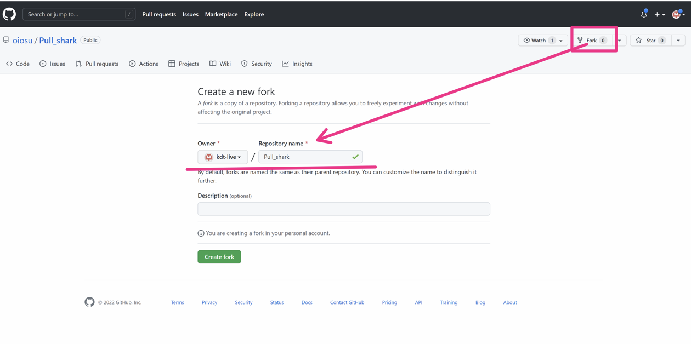
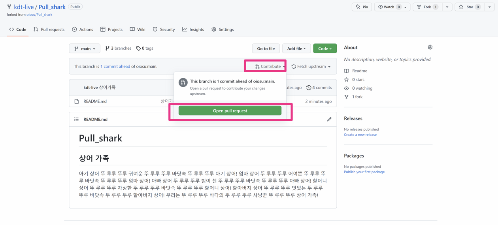
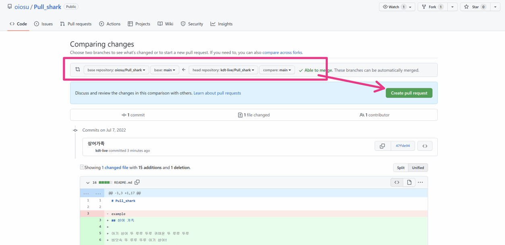
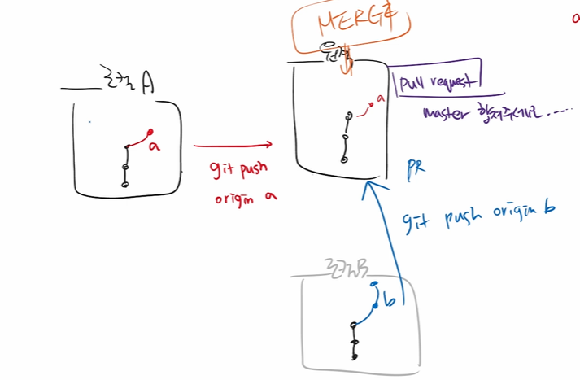
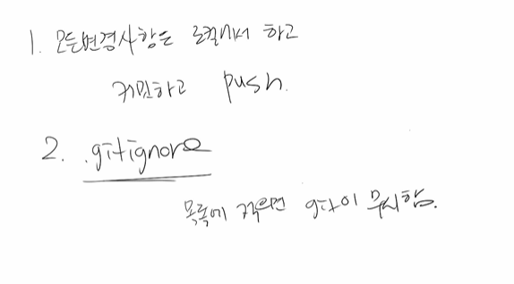

## Branch 

🔥**브랜치를 만들기 위해서는 최초의 커밋즉 root commit 이 필요하다.** 🔥

- HEAD -> 는 내가 지금있는 브랜치의 위치정보
- 브랜치를 만들고 나서 merge 하고나면 기존의 브랜치는 지워서 가지치기를 한다. 

### GIT 핵심용어 간단 정리

```bash
# 로컬
$ git init
$ git add
$ git commit -m 'z커밋메시지'
$ git status
$ git log

# 원격
$ git push origin master
$ git pull origin master
$ git remote add origin url
$ git clone url
```

## Branch Basic command

```bash
$ git branch name : name 이라는 브랜치를 생성
$ git checkout branchName : branchName 이라는 브랜치로 이동
$ git checkout -b branchName : 브랜치 생성후 이동
$ git merge branchName : 현재 브랜치에서 branchName을 병합하는것
$ git branch : 브랜치를 조회
$ git branch -d branchName : branchName 이라는 브랜치를 지운다. 
(반드시 병합을 한이후에 지워야 지워지는 브랜치에서 만들었던 commit이 없어지지않는다.)

$ git restore --staged <file> : 특정파일을 unstage 하기위해
```

## Branch merge

1. 각 branch에서 작업을 한 이후 이력을 합치기 위해서는 merge 명령어를 사용한다.
2. 병합을 진행할 때 서로 다른 commit에서 동일한 파일을 수정한 경우 충돌이 발생할 수 있다. 이 경우에는 반드시 직접 수정을 진행 해야 한다.
3. 충돌이 발생한 것은 오류가 발생한것이 아니라 이력이 변경되는 과정에서 반드시 발생할 수 있는 것이다.

## Branch 병합시나리오

###  상황 1. Fast- forward (혼자 작업, 조원 프리라이딩)

- 기존 master 브랜치에 변경사항이 없어 단순히 앞으로 이동

1. feature-a branch로 이동 후 commit
2. master 별도 commit이 없음
3. master branch로 병합

### 상황 2. merge commit

---

- 기존 master 브랜치에 변경사항이 있어 병합 커밋 발생

1. feature-a branch로 이동 후 commit
2. master branch commit
3. master branch로 병합

---

1. 같은 파일을 수정하게되면 => 충돌을 해결하고 병합
2. 같은 파일을 수정하지않고 서로다른 파일이라면 그냥 병합

### Github Flow 기본원칙

1. master branch는 반드시 배포 가능한 상태여야 한다.
2. feature branch는 각 기능의 의도를 알 수 있도록 작성한다.
3. **Commit message는 매우 중요하며 명확하게 작성한다.**
4. **Pull Request를 통해 협업을 진행한다.**
5. 변경사항을 반영하고 싶다면 master branch에 병합한다.

### Fork Pull Request

---



Fork 할 프로젝트에 들어가서 fork를 누르고 repository를 설정한다.

이후에 clone 으로 바탕화면에 불러들인후 new commit을 생성하여 나의 repository에 올린다.



이후 Contribute에서 Open pull request 를 누르고



Create pull request 를 클릭한다.

## github으로 협업하는 방법

1. Feature Beanch Workflow (저장소의 소유권이 있는경우)




2. Forking Workflow(저장소의 서유권이 없는경우)

   clone url 로 fork했던 것을 불러온다.

## 한눈에 보는 Gut hub


### 브랜치 흐름




# 협업을 위한 방법 2가지

- Shared repo : 초대해서 하는것으로 권한을가지고있다


- Fork & Pull Request 하는이유는 ?? : 소유하지 않아서 

  1. Fork 찍어서 가져옴
  2. 이제부터는 내 저장소를 관리하는것과 100%동일
     - clone
     - add
     - commit
   - 내 저장소로 push
     - GitHub 가서 Pull Resquest


**merge request == Pull request 같은말이다**


## gitkeep 과 gitignore

```bash
$ touch .gitkeep : 
# 1. 빈 폴더를 만들기위해서사용 한다. 유지시키려는 빈폴더에 .gitkeep 파일을 생성하면 해당 빈폴더를 유지시킬수있다. 
# 2. 말고 다른 이름으로 사용이 가능하다. 관용적으로 쓰이는 것이다 ex).keep .dummy 등등 다 사용가능하지만 그냥 관용표현인 		 gitkeep을 사용하는것이 좋다.
# 3. .gitkeep 이 들어있는 폴더안의 다른폴더의 파일들의 링크는 불러와지지 않는다. 그래서 링크를 걸어야 하는 곳은 사용금지
$ touch .gitignore :
# 1. git으로 추적하지 않는 파일을 관리한다. WHY? git은 하위 디렉토리의 모든 파일을 추적하기 때문에
# 2. gitkeep처럼 이름을 바꿀수 없다. 오로지 gitignore 로만 사용 가능하다.
```


``.gitkeep`` : 빈 폴더를 만들기위해서사용 한다. 유지시키려는 빈폴더에 .gitkeep 파일을 생성하면 해당 빈폴더를 유지시킬수있다. 

``.gitkeep`` 말고 다른 이름으로 사용이 가능하다. 관용적으로 쓰이는 것이다 ex).keep 등등 하지만 그냥 관용표현인 gitkeep을 사용하는것이 나아보인다.

``.gitignore`` : git으로 추적하지 않는 파일 관리-- why? -- git은 하위 디렉토리의 몯느 파일을 추적하니까

이름 바꾸기 불가능 .gitignore 로만 사용가능