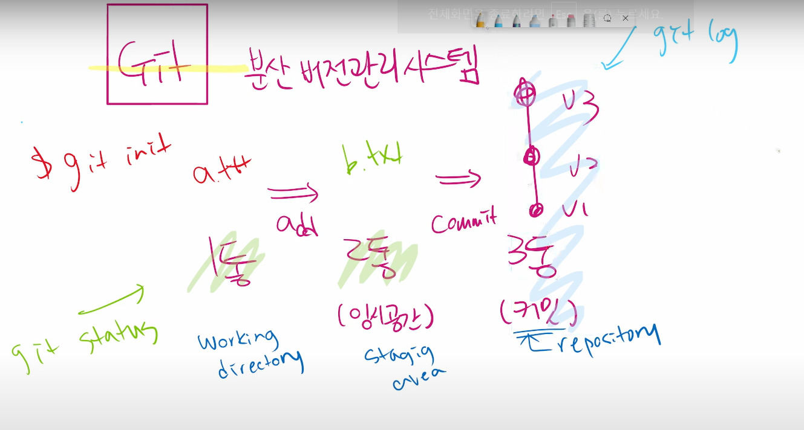

## 1. (master) 있는 곳에서는 git init 을 하지 않는다.


# Git bash

### 1. CLI

Command  명령

Line  줄

Interface 조작

### 2. Interface 란?

TV 를 조작하는것은 리모컨인데

리모컨은 TV를 조작하는 하나의 인터페이스이다

### 3. GUI

Graphic 그래픽

User 유저

Interface 조작

### 4. 디렉토리 관리

```bash
$ pwd (print working directory) :현재 디렉토리 출력
$ cd(change directory) : 디렉토리 이동
$ cd . : 현재 디렉토리
$ cd .. (cd와 .. 사이에 띄어쓰기 중요): 상위 디렉토리로 이동
$ ls (list) : 목록 보기
$ touch <파일명.확장명>: 새로운 파일생성
$ rm <파일명.확장명> : 파일삭제
$ rm -r <폴더명> : 폴더삭제
$ mkdir (make directory) : 디렉토리 생성
$ 역슬래쉬 : 키보드 원화모양
```

###  5. 비주얼 스튜디오 코드 터미널 명령어 정리 :` Ctrl+L`

##### GIt : 분산 버전관리 시스템

- 버전관리? : 컴퓨터 소프트웨어의 특정 상태
- 컴퓨터 파일의 변경사항을 추적
- 분산버전 관리시스템은 원격저장소를 통하여 협업하고 모든 히스토리를 클라이언트들이 공유

### 6. GIt 명령어

```bash
$ git init : 로컬에서 git의 저장소를 처음 만들때 사용
$ git add <파일명> : 버전을 기록할때 working directory => staging area로 이동시킨다.
$ git commit -m '기록문구' : staging area 에서 로컬 repository 로 이동하는 과정으로 최종 버전으로 기록할때 쓰인다.
$ git status : git 저장소에 있는 파일의 상태를 확인하기 위하여 활용된다. working directory 와 staging area 를 확인	

$ git log : 현재 저장소에(repository) 기록된 커밋을 조회하고 다양한 옵션을 통해 로그를 조회할 수 있다.
	
	- $ git log -1 : 최근 1개의 커밋을 보여줘
	- $ git log --oneline : 모든 커밋을 한줄로 보여줘
	- $ git log -2 --oneline : 최근 2개의 커밋을 한줄로 보여줘
	- $ git log --oneline --graph : 모든 커밋을 한줄의 그래프로 보여줘
	
$ git config --global user.email 'dortkthf@gmail.com' : user.eamil 설정할때 사용한다.
$ git config --global user.name 'dortkthf' : user.name 을 설정할때 사용한다.
$ git remote add origin <원격저장소의 url> : 원격저장소의 주소설정
$ git remote -v : 원격 저장소의 주소 정보 확인
$ git remote rm <원격저장소이름> : 원격 저장소의 주소를 제거

$ git push <원격저장소 이름> <브랜치이름> :
	- 원격 저장소로 로컬 저장소의 변경사항(commit)을 올림(push)
	- 명령어를 입력할때에는 꺽쇠<> 를 제외하고 스페이스바로 구분만 해서 명령
	
$ git pull <원격저장소 이름> <브랜치이름> :
	- 원격 저장소로부터 변경된 내역을 받아와서 이력을 병합함
	- 명령어를 입력할때에는 꺽쇠<> 를 제외하고 스페이스바로 구분만 해서 명령

$ git clone <원격저장소 url> : 원격 저장소를 복제하여 모든버전을 가져온다.
```


#### git clone 과 git pull 의 차이점은 Clone : 원격 저장소 복제 Pull : 원격저장소 커밋가져오기

- `touch .gitignore` : 

  - gitignore 파일안에 ignore할 파일을 파일확장명 까지 작성하면 사라짐
  - *.exe 라고하면 모든 exe 파일을 무시한다
  - commit 하기전에 미리 ignore 해야하고 이미 commit 된것을 gitignore 를 하면 무시가 되지않는다.

  * gitignore.io 홈페이지에서 나에게 맞는 상황을 설정하고 코드를 출력시켜서 그내로 복붙하면된다.

  

  **로컬에서 새로운 프로젝트의 시작? : `$ git init`**

  **원격에 있는 프로젝트 시작? : `$ git clone`**

  **프로젝트 개발 중 다른 사람 커밋 받아오기? : `$ git pull`**

  **내가 한 로컬 프로젝트 개발 공유? : `$ git push`**

  

### 7. 버전 저장 경로

### Working Directory -(Add 명령어)-> Staging Area - (Commit 명령어) ->Repository

- Staging Area 가 필요한 이유? : 내가 만든 버전 기록 파일들을 모으는 임시공간

`$ git add <file>`  :

- working directory (1번통 )상의 변경 내용을 staging area (2번통 {임시공간}) 에 추가하기 위해 사용

- untracked 상태의 파일을 staged로 변경
- modified 상태의 파일을 staged 로 변경

`$ git commit -m '<커밋메시지>'` :

- staged 상태의 파일들을 커밋을 통해 버전으로 기록
- SHA-1 해시를 사용하여 40자 길이의 체크섬을 생성하고, 이를 통해 고유한 커밋을 표기
- 커밋 메시지는 변경 사항을 나타낼 수 있도록 명화규하게 작성해야 함

Git은 파일을 modified, staged, committed 로 관리

- modified : 파일이 수정된 상태
- staged : 수정한 파일을 곧 커밋할 것이라고 표시한 상태
- committed



## 클론을 진행할때 생기는일

1. 클론하면 원격 저장소 이름의 폴더가 생성된다.
2. 클론이후에 생성된 원격 저장소이름의 폴더에서 시작을 하면된다.
3. 클론에서 생성된 폴더는 자동으로 git 저장소가 생겨서 master branch가 생긴다
4. 또한 해당 레포지토리의 remote도 등록되어있기때문에 remote add 가 불필요하다.
5. 따라서 그전에 버전또한 확인할수 있다.

## 클론이 아닌 압축을 풀어서 진행하면 생기는일

1. 그냥 압축파일을 다운받으면 그냥 압축된 파일만 받을수있다.
2. 압축이후 폴더에는 git 저장소가 생기지 않으며 새로 만들어야 한다.
3. 따라서 그 이전의 버전도 확인할수 없다.

### GIT 핵심용어 간단 정리

```bash
# 로컬
$ git init
$ git add
$ git commit -m 'z커밋메시지'
$ git status
$ git log

# 원격
$ git push origin master
$ git pull origin master
$ git remote add origin url
$ git clone url
```

