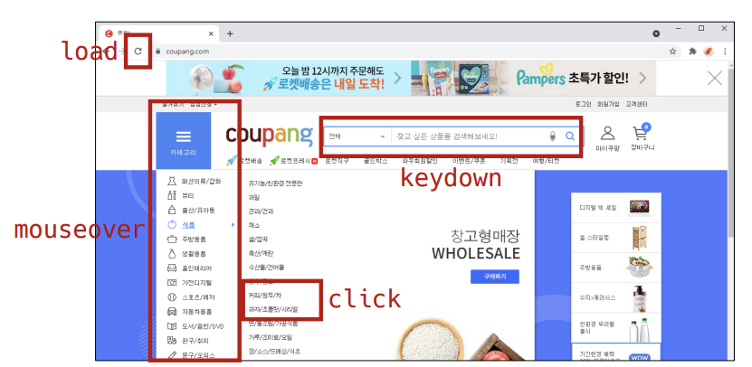

# Event

### Event 개념

- 네트워크 활동이나 사용자와의 상호작용 같은 사건의 발생을 알리기 위한 객체
- 이벤트 발생
  - 마우스를 클릭하거나 키보드를 누르는 등 사용자 행동으로 발생할 수도 있음
  - 특정 메서드를 호출(Element,click())하여 프로그래밍적으로도 만들어 낼 수 있음

### Event의 역할 1/3

“~ 하면 ~ 한다.”

### Event의 역할 2/3

"클릭하면, 경고창을 띄운다"

### Event의 역할 3/3

"특정 이벤트가 발생하면, 할 일(함수)을 등록한다."

### Event handler - addEventListener() 1/3

- EventTarget.addEventListener()
  - 지정한 이벤트가 대상에 전달될 때마다 호출할 함수를 성정
  - 이벤트를 지원하는 모든 객체(Element, Document, Window등)를 대상으로 지정 가능

### Event handler - addEventListener() 2/3

- target.addEventListener(type, listener[, options])

  - type

    - 반응 할 이벤트 유형 (대소문자 구분 문자열)

  - listener

    - 지정된 타입의 이벤트가 발생했을 때 알림을 받는 객체

      EventListener 인터페이스 혹은 JS function 객체 여야함

### Event handler - addEventListener() 3/3

'대상에 특정 이벤트가 발생하면, 할 일을 등록하자'

EventTarget.addEventListener(type, listener)

### Event 취소

- event.preventDefault()
- 현재 이벤트의 기본 동작을 중단
- HTML 요소의 기본 동작을 작동하지 않게 막음
  - ex) a 태그의 기본 동작은 클릭 시 링크로 이동 / form 태그의 기본 동작은 form 데이터 전송
- 이벤트를 취소할 수 있는 경우, 이벤트의 전파를 막지 않고 그 이벤트를 취소