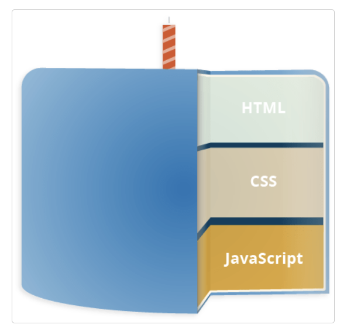
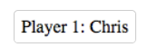
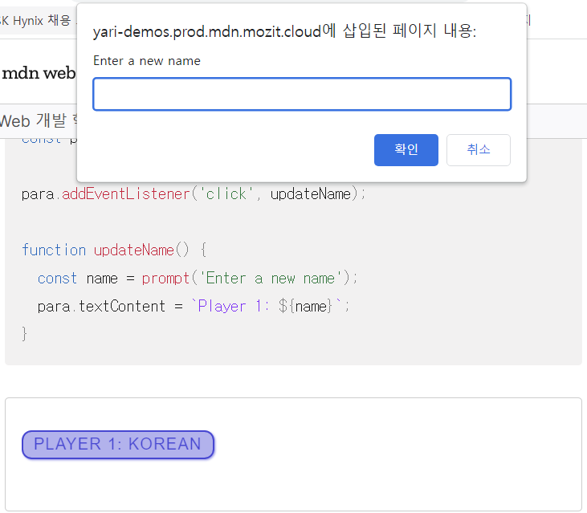
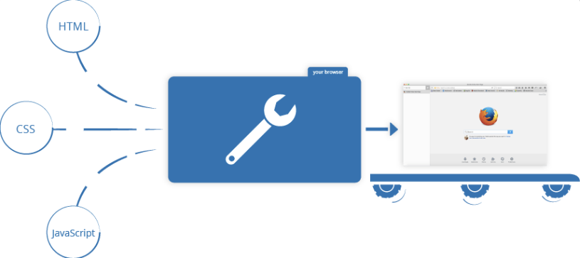

# JavaScript가 뭔가요?

JS는 웹페이지에서 복잡한 기능을 구현할 수 있도록 하는 스크립팅 언어 또는 프로그래밍 언어입니다. 페이지의 내용이 가만히 정적인 정보만 보여주는 것이 아니라 구지적으로 갱신되거나 사용자와 상호작용이 가능하거나, 애니메이션이 적용된 2D/3D 그래픽을 볼 수 있다면 JS 가 관여하고 있을 거라고 생각해도 좋습니다. JS는 표준 웹기술이라는 케이크의 세 번째 층입니다



- HTMl은 웹 콘텐츠의 구조를 짜고 의미를 부여하는 마크업 언어입니다. 예를 들어 페이지의 어디가 문단이고, 헤딩이고, 데이터 표와 외부 이미지/ 비디오인지 정의합니다.
- CSS 는 HTML 콘텐츠에 스타일을 적용할 수 있는 스타일 규칙 언어입니다. 배경색을 추가하고, 글꼴을 바꾸고, 콘텐츠를 신문처럼 다열 레이아웃으로 배치할 수 있습니다.
- JS는 동적으로 콘텐츠를 바꾸고, 멀티미디어를 제어하고, 애니메이션을 추가하는 등 거의 모든것을 만들 수 있는 스크립팅 언어입니다. (정말 모든게 가능하지는 않겠지만, JS코드 몇 줄만으로도 놀라운 결과를 이룰 수 있습니다.)

이렇게 세층은 서로의 위에 유기적으로 올라가 있습니다.

Only HTML



HTML with CSS


HTML with CSS, JS



### JS로 어떤 일을 할 수 있나요?

클라이언트 사이드 JS 언어의 핵심은 다음과 같은 일을 가능하게 해주는 프로그래밍 기능들로 구성됩니다.

- 변수에 값을 저장할 수 있습니다. 위의 예제를 보면, 요청해서 받은 새로운 이름을 `name` 이라는 변수에 저장합니다.
- 프로그래밍에서 '문자열' 이라고 부르는, 텍스트 조각을 조작합니다. 위 예제에서는 문자열 '플레이어 1:' 과 `name` 변수의 값을 합쳐 온전한 텍스트 레이블을 생성합니다.
- 웹 페이지에서 발생하는 어떤 이벤트에 코드가 응답하도록 합니다. 예제에서는 `click`이벤트를 사용해서 레이블을 클릭하는 순간을 탐지하고, 그 후에는 텍스트 레이블을 업데이트하고 있습니다.
- 그밖에 더 많은 것들이 있습니다.

하지만 위의 목록보다 더 흥미진진한건 클라이언트 사이드 JS 언어 위에 올라가있는 기능들입니다. **애플리케이션 프로그래밍 인터페이스(API)**라고 부르는 이 기능들은 여러분의 JS코드에서 사용할 수 있는 강력한 마법을 추가로 제공합니다.


API는 개발자가 직접 구현하기는 어렵거나 불가능한 기능들을 미리 만들어서 제공하는 것입니다. 가구 DIY 키트 같은 거죠. 미리 재단된 판과 나사로 책장을 조립하는게, 디자인하고 적합한 목재를 찾아서 올바른 크기의 모양으로 자른 후 적합한 크기으 ㅣ나사를 찾아서 마침내 책장으로 만드는 것보다 훨씬 쉬운 법입니다.


API는 일반적으로 두 개의 범주로 분류할 수 있습니다.

**브라우저 API**는 웹 브라우저에 내장된 API로, 현재 컴퓨터 환경에 관한 데이터를 제공하거나 여러가지 유용하고 복잡한 일을 수행합니다.

- DOM (Document Object Mode) API 로 HTML 콘텐츠를 추가, 제거, 변경하고, 동적으로 페이지에 스타일을 추가하는 등 HTML/CSS를 조작할 수 있습니다. 페이지 위에 뜨는 팝업창이나, 새로운 콘텐츠가 나타나는 것이 그 예입니다.
- Geolocation API로 지리정보를 가져올 수 있습니다. Google 지도 에서 여러분의 위치를 찾아 지도에 그릴 수 있는 이유가 바로 이 API입니다.
- Canvas 와 WebGL API로 애니메이션을 적용한 2D 와 3D 그래픽을 만들 수 있습니다. 
- HTMLMediaElement 와 WebRTC를 포함하는 오디오와 비디오 API로는 멀티미디어를 사용한 흥미로운 일을 할 수 있습니다. 예를 들어 오디오나 비디오를 웹 페이지에서 바로 재생하거나, 웹캠으로 비디오를 찍어 다른 사람의 화면에 보여줄 수 있습니다.

**서드파티 API**는 브라우저에 탑재되지 않은 API로, 웹의 어딘가에서 직접 코드와 정보를 찾아야 합니다.

- Twitter API 로 여러분의 최신 트윗을 웹 사이트가 보여주도록 구현할 수 있습니다.
- Google 지도 API와 OpenStreetMap API로 웹 사이트에 지도를 삽입하고, 지도 관련 기능을 추가할 수 있습니다.

여기 나열된 항목 말고도 다양한 API 들이 존재합니다!

### 웹 페이지에서 JS는 어떤 일을 하나요?

브라우저가 웹 페이지를 불러오면 어떤 일이 발생하는지 간단하게 복습해봅시다. 웹 페이지를 브라우저로 불러오면, 브라우저는 여러분의 코드(HTML, CSS, JS)를 실행 환경(브라우저 탭)에서 실행합니다. 원자재(코드)를 가져와서 상품(웹 페이지)을 생산하는 공장처럼 생각할 수 있습니다.



JS는 DOM(Document Object Model) API를 통해 HTML과 CSS를 동적으로 수정, 사용자 인터페이스를 업데이트하는 일에 가장 많이 쓰입니다. 참고로 웹 문서(페이지)의 코드는 보통 문서 상에 나타나는 순서 그대로 불러와 실행합니다. 수정하려는 HTML과 CSS코드 보다 JS를 먼저 불러와 실행해버리면 오류가 발생할 수 있습니다.

#### 브라우저 보안

각각의 브라우저 탭은 코드를 실행하기 위한 독립적인 그릇(기술 용어로 '실행 환경' 이라고 부릅니다)입니다. 독립적이라는 것은 대부분의 탭이 서로에게서 완전히 분리되어 한 탭의 코드가 다른 탭의 코드 또는 다른 사이트에 직접적인 영향을 줄 수 없다는 뜻입니다. 이건 중요한 보안 절차입니다. 만약 이러한 제약이 없으면 해커들이 다른 웹사이트에서 정보를 훔치는것을 포함해 여러가지 나쁜 일을 하는 코드를 작성할 것입니다.

#### JS 실행 순서

브라우저가 JS 블록을 마주치면, 일반적으로 순서대로 위에서 아래로 실행합니다. 따라서 코드 배치 순서에도 주의를 기울여야 합니다.

```javascript
const para = document.querySelector('p');

para.addEventListener('click', updateName);

function updateName() {
  const name = prompt('Enter a new name');
  para.textContent = `Player 1: ${name}`;
}
```

위 코드는 텍스트 문단을 선택(1줄)해서 이벤트 수신기를 부착(3줄)하여, 사용자가 문단을 클릭하면 `updateName()`코드 블록(5~8줄)을 실행하도록 합니다. `updateName()`코드 블록(함수)은 사용자에게 새로운 이름을 물어보고, 그 이름을 문단에 삽입해서 화면을 업데이트합니다.

만약 1번과 3번줄의 코드 순서를 서로 바꿔 실행하게되면 브라우저 개발자 콘솔에 오류`TypeError: para is undefined`  가 나타나며 `para`객체가 아직 존재하지 않으므로 이벤트 수신기를 부착할수 없습니다.

#### 인터프리터와 컴파일러

**인터프리터를 사용하는 언어**에서는 코드를 위에서 아래로 실행하고, 코드 구동 결과는 즉시 반환됩니다. 브라우저에서 JS코드를 실행하기 전에 다른 형태로 변환할 필요가 없습니다. 코드는 프로그래머가 읽을 수 있는 형태로 입력되고, 별도의 처리 없이 그대로 실행됩니다.


**컴파일러를 사용하는 언어**에서는 컴퓨터가 코드를 실행하기 전에 다른 형태로 변환(컴파일)해야 합니다. 예를 들어 C/C++ 에서는 코드를 컴파일러로 기계언어로 변환하여 그 결과를 컴퓨터가 실행합니다. 프로그램은 원본 소스 코드에서 생서안 이진 형식(바이너리)로부터 실행됩니다.


JS는 가볍고 인터프리터를 사용하는 프로그래밍 언어입니다. 웹 브라우저는 JS코드를 원분 형식으로 입력받아 실행합니다. 기술적으로는 대부분의 모던 JS 인터프리터들은 사실 JIT(just-in-time 컴파일)이라는 기술을 사용해 성능을 향상하기는 합니다. 스크립트의 실행과 동시에 소스 코드를 더 빠르게 실행할 수 있는 이진 형태로 변환하여 최대한 높은 실행 속도를 얻는 방법입니다. 하지만 JS는 여전히 인터프리터 언어로 분류됩니다. 컴파일을 먼저 해놔야 하는 것이 아니라 런타임에 일어나기 떄문입니다.

두 방법 모두 각자의 장점을 가지고 있습니다.


#### 서버 사이드와 클라이언트 사이드 코드

**클라이언트 사이드 코드**는 사용자의 컴퓨터에서 동작하는 코드입니다. 웹페이지를 방문하면 브라우저가 페이지 내의 클라이언트 사이드 코드를 다운로드하고 실행해서 화면에 띄웁니다. 바로 이 과정에서 다루는 것은 정확히는 클라이언트 사이드 JS 입니다.


**서버 사이드 코드**는 서버에서 동작하는 코드로, 그 실행 결과를 브라우저가 다운로드해서 화면에 띄우게 됩니다.유명한 서버 사이드 웹 언어로는 PHP, Pythin, Ruby, ASP.NET 그리고 JS 가 있습니다. JS는 브라우저 뿐만아니라 많은 사람들이 사용하는 Node.js환경처럼 서버 사이드 언어로도 사용할 수 있습니다.


#### 동적 코드와 정적 코드

클라이언트 사이드 JS와 서버사이드 언어들 모두 동적이라는 단어로 설명할 수 있습니다. 동적인 이유는 웹 페이지/웹 앱의 서로 다른 상황에 서로 다른 화면을 보여줄 수 있고, 필요하면 새로운 콘텐츠를 생성할 수 있기 때문입니다. 서버 사이드 코드는 서버에서 새로운 콘텐츠를 생성(데이터베이스에서 데이터를 가져오는 등) 합니다. 클라이언트 사이드 JS는 클라이언트 브라우저 내에서 새로운 콘텐츠를 생성(새로운 HTML표를 생성하고 서버에서 받아온 데이터로 채운 후 사용자가 보고 있는 웹페이지에 표시)합니다. 두 맥락 내에서 동적 이라는 단어의 정확한 뜩은 약간 다르지만 그럼에도 연관되어있어 두 방법(서버와 클라이언트 사이드)을 보통 함께 사용합니다.


동적으로 바뀌는 내용을 포함하지 않는 웹 페이지를 정적인 페이지라고 합니다. 정적인 페이지는 항상 같은 콘텐츠만 보여줍니다.

#### 스크립트 로딩 전략

스크립트를 적절한 시점에 불러오는 일에는 몇가지 문제가 있습니다. 흔히 마주치게 되는 문제는 페이지의 모든 HTML은 순서 그대로 불러온다는 점입니다. JS를 사용해서 페이지 내의 요소를 조작하려고 할 때 해당 요소를 포함한 HTML코드보다 JS를 먼저 불러와버리면 코드가 동작하지 못합니다.

내부 JS에서는 script 안에 아래 코드로 시작하는 것입니다.

```js
document.addEventListener('DOMContentLoaded', () => {
  ...
});
```

이건 HTML 본문 전체를 불러와 읽었다는 것을 나타내는 브라우저 DOMContentLoaded 이벤트를 수신하는 수신기입니다. 이 블록 내부의 JS는 이벤트가 발생하기 전에는 실행되지 않으므로 로딩 시점으로 인한 오류를 예방할 수 있습니다.

외부 JS에서는 defer 특성을 이용해 문제 발생을 억제합니다. defer 특성은 브라우저가 script태그를 마주쳐도 그 이후의 HTML 콘텐츠를 계속 불러오도록 지정합니다.

```html
<script src="script.js" defer></script>
```

이렇게 하면 스크립트와 HTML을 동시에 불러오므로 오류가 발생하지 않습니다.

**참고:** `defer` 특성이 오류를 예방하므로, 외부 예제에서는 `DOMContentLoaded`를 사용하지 않았습니다. 내부 예제에서는 `defer` 방법을 사용하지 않았는데, `defer`는 외부 스크립트에만 사용할 수 있기 때문입니다.

고전적인 방법은 스크립트 요소를 본문의 맨 마지막에 배치하는 것입니다. 그러면 모든 HTML을 읽은 후에 스크립트를 불러오게 됩니다. 이 방법의 문제는 HTML DOM을 모두 불러오기 전에는 스크립트의 로딩과 분석이 완전히 중단된다는 점입니다. 그래서 많은 스크립트를 포함하는 대형 사이트에서는 성능이 저하될 수 있습니다.

### async와 defer

스크립트 중단 문제를 해결할 수 있는 기능에는 두가지가 있습니다. async와 defer 입니다.

async 특성을 지정하면 스크립트를 가져오는 동안 페이지 로딩을 중단하지 않습니다.그러나 스크립트 다운로드가 끝나면 바로 실행되는데 실행 도중에는 페이지 렌더링이 중단됩니다. 스크립트의 실행 순서를 보장할수 없습니다. 따라서 async는 다른 스크립트에 의존하지 않는 독립 스크립트에 사용해야 합니다.

defer 특성을 지정한 스크립트는 페이지 내에 배치한 순서대로 불러오게 됩니다. 또한 페이지 콘텐츠를 모두 불러오기 전까지는 실행하지 않으므로, 페이지 요소를 수정하거나 추가하는 등 DOM 작업을 기대하는 스크립트에 유용합니다.

- async와 defer 모두 브라우저가 페이지의 다른 내용을 불러오는 동안 스크립트를 별도 스레드에서 불러오게 만듭니다. 덕분에 스크립트를 가져오는 동안 페이지 로딩이 중단되지 않습니다.
- async 특성을 지정한 스크립트는 다운로드가 끝나는 즉시 실행합니다. 실행은 현재 페이지 렌더링을 중단하며, 실행 순서는 보장되지 않습니다.
- defer 특성을 지정한 스크립트는 순서를 유지한 태로 가져오며 모든 콘텐츠를 다 불러온 이후에 실행합니다.
- 의존성 없는 스크립트를 불러온 즉시 실행하려면 async를 사용하세요.
- 다른 스크립트에 의존하거나 DOM로딩이 필요한 스크립트에는 defer를 사용하고 원하는 순서에 맞춰서 <script>요소를 배치하세요.

### 주석

HTML 및 CSS와 동일하게 JS 에서도 브라우저는 무시하는 주석을 작성해서 다른 개발자들에게 안내를 제공할 수 있습니다. 주석은 엄청 유용합니다. 자주 사용하세요. 특히 대규모 애플리케이션에서는요.

- 한 줄 짜리 주석은 맨 앞에 이중 빗금(//)으로 작성합니다

```js
// 나, 주석
```

- 여러 줄 주석은 /*과 */의 사이에 작성합니다.

```
/*
  나 또한
  주석
*/
```

