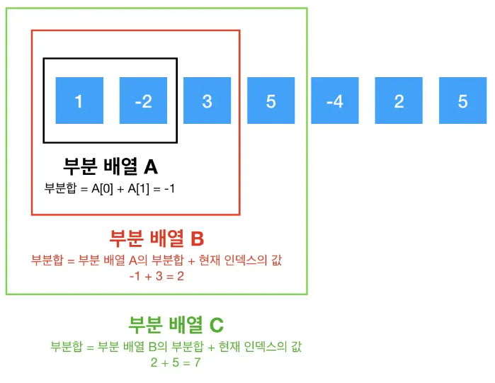

### 파이썬 개인공부

**print 문에서 sep와 end의 차이**

ex) **sep**는 print(1,2,3) 처럼 여러개의 데이터를 표현할 때 그 데이터들 사이에 어떻게 표현할지 나타내는것이고

**end**는 출력문이 끝났을때 어떻게 표현할지에 대한것

```python
print(1,2,3,sep='//')

출력된 결과 => 1//2//3

print(1, end='\n')
print(2, end='\n')
print(3)

출력된 결과 => 

1
2
3
```

**파이썬에서 분수표현하는 방법 fractions 모듈의 Fraction 함수 사용하기**

```python
from fractions import Fraction

print(Fraction(1,2))
=> 1/2

다만 리스트에 있는 값을 불러올때는 나머지가 0인경우는 분수로 표현되지 않는다.
따라서 분자와 분모를 따로 나눠서 불러와야한다.

ex)
l = [1,2]
print(Fraction(l[1],l[0]))
=> 2

따라서 분자와 분모를 나눠서 설정을 해놓으면
a = Fraction((l[1],l[0]))
a.numerator => 분자
a.denominator => 분모
print(a.numerator,a.denominator,sep='/') 로 해놓으면
=> 2/1 
```

### 파이썬 부동소수점 오류

**부동소수점이란**

실수를 표현할 때 소수점의 위치를 고정하지 않는 것을 말한다.

자세하게는 나중에 다시보기.

해결법은 여러개인데 일단 round() 로 해결해보기


### 파이썬 조합문제

**만약 4개의 서로다른 공을 아무것도 뽑지 않는 경우가 없도록 뽑는 숫자는?**

위의 문제는 서로다른 4개의 공을 각 각 +1 을 해준다 왜냐하면

1번공 2번공 3번공 4번공 이있을때

(1번공을 뽑을때, 1번공을 안뽑을때 ) 이렇게 두개의 경우로 나누어 지므로

1번공의 경우의수 2가지 * 2번공의 경우의수 2가지 * 3번공의 경우의수 2가지 * 4번공의 경우의수 2가지

총 16가지중에서 아무것도 뽑지 않는경우 -1 을 해주면 15개가 나온다. 

**이문제의 핵심은 아무것도 뽑지 않는경우를 하나의 공으로 여겨서 더해준다는 것이다.**


### 파이썬 억단위의 이항계수(nCr) 의 뒷자리 0의 개수를 구하는 문제

**이 문제는 ex) 100 과 50 의 이항 계수의 뒷자리 0의 개수는 금방 구해지지만 2000000000 과 150000000 의 뒷자리 0의 개수는 쉽게 구할수 없다**

따라서 이 문제는 뒷자리가 0이라는 것은 10의 배수라는 뜻이고 10은 2와 5의 곱셈이다

이를 해결하기 위해서는 n(2000000000)과 m(1500000000)의 2의 개수와 5의 개수를 알아보면된다.

먼저 2의 개수를 파악하기 위해서 n = n // 2 를 해보면 2의 배수의 개수가 나오게 되는데 이를 변수로 만들어준 two 에 더해준다 **하지만 여기에서 끝이 아니다. 2의 배수 중에서도 2*2의 배수들 즉 2가 한번씩 더 들어있는 수들의 배수를 구해본다. 그렇기 때문에 n = n // 2 라는 식을 쓰게 된다.**

그렇게 계속해서 n = 0 이 될때까지 구하게 되면 n이라는 팩토리얼의 2의 개수를 파악할수 있다.

이런식으로 똑같이 5의 배수도 구해준다.

**일단 nCr을 구하는것은 n!/(n-r)!r! 이기 때문에 n!의 2의 개수와 (n-r)!의 2의 개수와 r!의 2의 개수가 곂치게 되므로 [n! 의 2의개수 - (n-r)! 의 2의 개수 - r! 의 2의 개수] 를통해 2의 개수를 구한다 **

위와 같은 방식으로 5의 개수도 구하면된다.

그렇게 해서 2의 개수와 5의 개수중 작은 값을 취하면 된다. 왜냐하면 10이라는 것은 2와 5가 각각 하나씩 쌍을 이뤄야하는데 2가 더많고 5가 더적으면 더적은 쪽의 개수만큼 10이 이루어져있다는 뜻이므로

min(2의 개수, 5의 개수)로 구해준다.


### 파이썬에서 순열과 조합 리스트를 모듈을 사용해서 출력하기

**from itertools import permutations** 를 사용해서 순열을 출력할수있다.

ex)

```py
from itertools import permutations

nums = [1,2,3,4]
perm = list(permutations(nums,2))

=> [(1, 2), (1, 3), (1, 4), (2, 1), (2, 3), (2, 4), (3, 1), (3, 2), (3, 4), (4, 1), (4, 2), (4, 3)]
```

마찬가지로 **from itertools import combinations** 를 사용해서 조합을 출력할 수 있다.

ex)

```python
from itertools import combinations

nums = [1,2,3,4]
comb = list(combinations(nums, 2))

=> [(1, 2), (1, 3), (1, 4), (2, 3), (2, 4), (3, 4)] 출력
```

### 파이썬 계산에서 엄청나게 큰수(a) 를 엄청나게 큰수(b) 로 나눈 나머지를 구하는 것을 리스트에 저장시켜서 불러올때

**애초에 a를 b로 나눈 나머지를 저장시켜버린다. 예를들어서 5000000을 80235 으로 나눈 나머지를 해당 리스트에 저장시키게되면 큰숫자마다 나머지를 구할필요가 없이 같은 값을 나오게 하면서 메모리도 절약 할수 있다.**

 ### Kadane's Algorithm : O(N)

전체 배열에서의 최대 부분합을 구하는 문제에서 사용할수 있는 알고리즘이다.

최대 부분합 문제는 전체 배열이 주어졌 부분 배열이 가질 수 있는 부분합들 중에서 최대 부분합을 구해야한다. 이문제는 Brute Force 방식으로 풀면 풀수는 있지만 만약 N이 10만개라면 N**2 해서 100억번을 돌게된다 그러한 일을 방지하고자 O(N) 으로 계산하도록 한다. 

이 문제를 O(N)으로 풀기 위한 핵심은 각각의 최대 부분합은 이전 최대 부분합이 반영된 결과값이라는 것이다.



위에서 각각의 부분배열의 합은 이전 부분배열의 합에 현재의 인덱스 값을 더한 값임을 알 수 있다.
