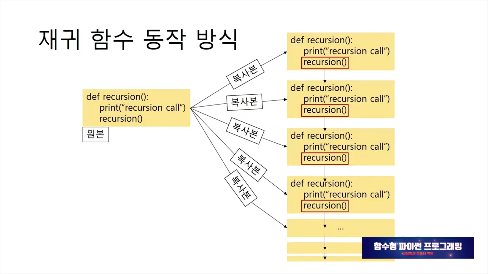
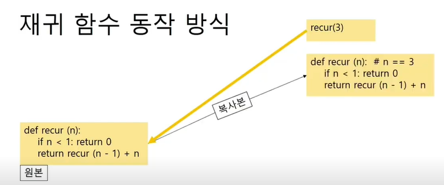
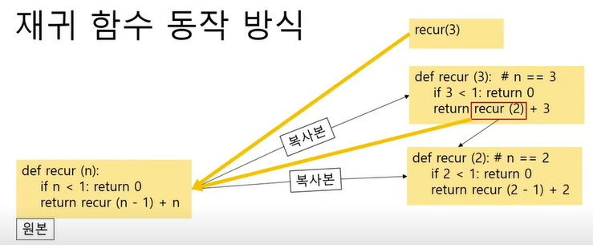
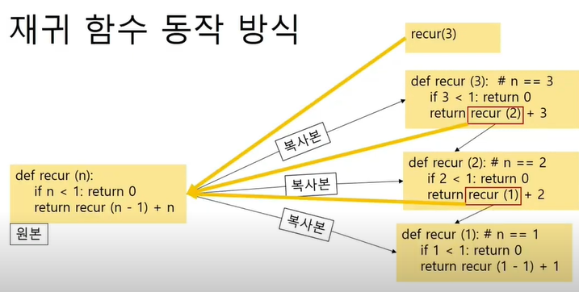
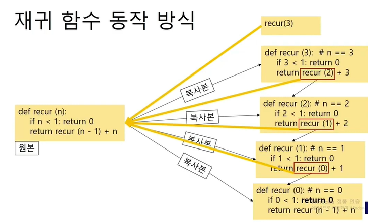
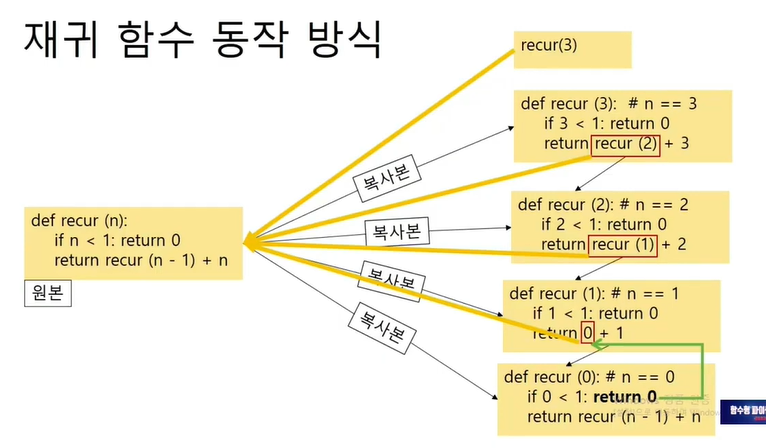
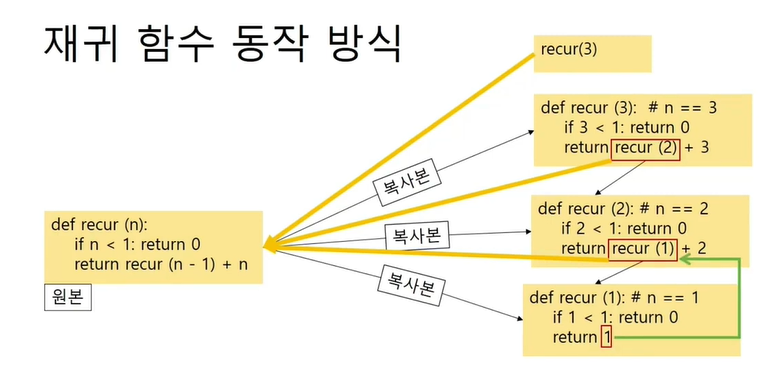
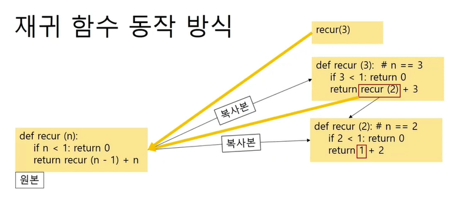
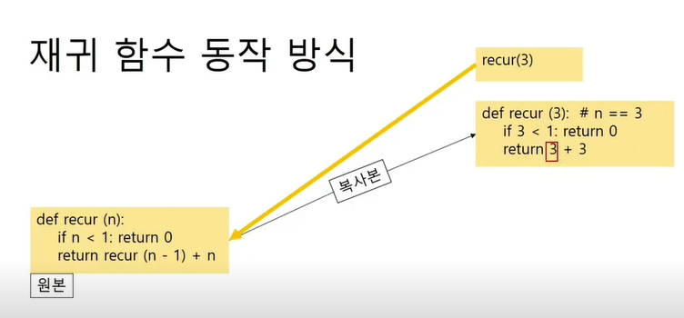

# 재귀함수

## 재귀 함수(Recursion) 란...

- 함수 내부에서 자기 자신의 함수를 다시 부를 때 그 함수를 '재귀 함수'라 부른다.
- 수학에서의 수학적 귀납법(Mathematical Induction)과 원리가 같다.
- 큰 문제를 부분 문제(sub-problem)로 쪼개서 풀 때 재귀 함수를 작성하는 경우가 많다.
- 재귀 함수 호출 마다 새로운 스택이 생긴다.
- 재귀 함수 호출 시 입력(인자)값이 특정 패턴을 반복하거나, 변화가 없으면 무한히 반복하게 된다.
- 재귀 함수 설계 시 입력 값이 종료 조건으로 수렴하는지 확인 해야한다.

재귀 함수의 재진입으로 이해해서는 안된다.

 

