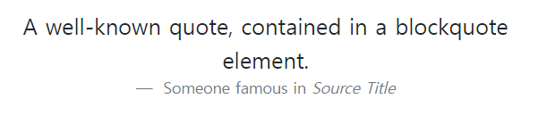

# Bootsrap 시작하기

```html
 <link href="https://cdn.jsdelivr.net/npm/bootstrap@5.2.0/dist/css/bootstrap.min.css" rel="stylesheet" integrity="sha384-gH2yIJqKdNHPEq0n4Mqa/HGKIhSkIHeL5AyhkYV8i59U5AR6csBvApHHNl/vI1Bx" crossorigin="anonymous">
```

```html
<script src="https://cdn.jsdelivr.net/npm/bootstrap@5.2.0/dist/js/bootstrap.bundle.min.js" integrity="sha384-A3rJD856KowSb7dwlZdYEkO39Gagi7vIsF0jrRAoQmDKKtQBHUuLZ9AsSv4jD4Xa" crossorigin="anonymous"></script>
```

위의 link를 head 태그 맨 밑에 입력시키고 script 태그를 body태그 맨 밑에 위치시킨다.

-----

head 태그안의 meta 태그 안에 viewport를 반드시 넣는다.

```html
<meta name="viewport" content="width=device-width, initial-scale=1">
```

# 레이아웃

## Breakpoint 중단점

Breakpoints 는 Bootstrap의 반응형 레이아웃이 뷰포트 크기 또는 기기에서 어떻게 작동 할지 결정하는 사용자가 정의 가능한 넓이입니다.

#### 핵심개념

- Breakpoints는 반응형 디자인의 구성 요소입니다. Breakpoints를 사용하여 레이아웃을 특정 뷰포트 크기 또는 기기에서 조정할 수 있는 시기를 제어합니다.
- 미디어 쿼리를 사용하여 Breakpoints로 CSS를 설계하세요. 미디어 쿼리는 브라우저 및 운영체제의 매개 변수 세트를 기반으로 조건부로 스타일을 적용 할 수 있는 CSS의 기능입니다. 미디어 쿼리에서는 일반적으로 min-width를 사용합니다.
- 반응형 디자인과 모바일 우선이 목표입니다. Bootstrap의 CSS는 최소한의 스타일을 적용하여 가장 작은 Breakpoints에서 레이아웃이 작동하도록 설정 한 후 스타일에 계층을 적용하여 더 큰  기기에 맞게 해당 디자인이 조정 되도록 하는 것을 목표로 합니다. 이를 통해 CSS를 최적화하고 렌더링 시간을 개선하며 방텍스트에게 훌륭한 경험을 제공합니다.

#### 사용 가능한 중단점

Bootstrap에는 반응형 제작을 위해 grid tiers라고 하는 6개의 Breakpoints가 포함되어 있습니다. 이러한 breakpoints는 Sass 소스 파일을 사용할 경우 사용자가 지정할 수 있습니다.

| Breakpoint        | Class infix | Dimensions |
| ----------------- | ----------- | ---------- |
| X-Small           | *None*      | <576px     |
| Small             | `sm`        | ≥576px     |
| Medium            | `md`        | ≥768px     |
| Large             | `lg`        | ≥992px     |
| Extra large       | `xl`        | ≥1200px    |
| Extra extra large | `xxl`       | ≥1400px    |

각각의 정의된 breakpoint는 넓이가 12의 배수인 containers를 문제없이 유지하기 위해 선택 되었습니다. breakpoint는 또한 공통 기기의 크기 및 뷰포트 수치의 지식 집합을 대표하며 모든 사용 사례 또는 장치를 특별히 대상하지 않습니다. 대신, 이 사전정의된 범위들은 거의 모든 기기에서 사용할 수 있는 강력하고 일관된 기반을 제공합니다.

#### 미디어 쿼리

Bootstrap은 모바일 우선으로 개발 되었으므로 몇 가지 미디어 쿼리를 이용하여 레이아웃에 적합한 breakpoints를 만듭니다. 이러한 breakpoints는 대부분 최소 뷰포트 넓이를 기반으로하며 뷰포트를 변경함에 따라 요소를 확장 할 수 있습니다.

# 컨텐츠

## Reboot

단일 파일에 있는 요소별 CSS 변경 모음인 Reboot는 Bootstrap을 초기에 구축하는 우아하고 일관되며 간단한 기준선을 제공합니다.

### 접근

Reboot는 Normalize를 기반으로 빌드되어 요소 선택자만 사용하여 다소 독선적인 스타일을 가진 많은 HTML 요소를 제공합니다. 추가 스타일링은 클래스에서만 수행됩니다. 예를 들어 더 간단한 기준선을 위해 일부 < table> 스타일링을 재부팅하고 나중에 .table, .table-border 등을 제공합니다.

다음은 재부팅에서 Reboot할 항목을 선택하는 지침과 이유입니다

- 확장 가능한 컴포넌트 간격에 em 대신 rem을 사용하도록 일부 브라우저의 기본값을 업데이트 합니다.
- margin-top을 제외합니다. 수직 margin은 구조적으로 불안정하며, 예상치 못한 결과를 가져올 수 있습니다. 더 중요한 것은 단방향 margin이 더 단순한 멘탈 모델이기 때문입니다.
- 더 쉬운 기기 간 크기 확장을 위해서 블럭 요소의 margin에 rem을 사용합니다.
- 가능하면 inherint를 사용하여 font 관련 속성의 선언을 최소한으로 유지합니다.

### 페이지 기본값

html과 body 요소는 더 넓은 페이지를 제공하기 위해 갱신됩니다. 구체적으로는 다음과 같습니다.

- box-sizing은 `*::before` 및 `*::after`를 포함한 모든 요소에서 boder-box로 전역적으로 설정됩니다. 이렇게 하면 요소의 선언된 너비가 패딩이나 테두리로 인해 초과되지 않습니다.
  - html 에는 기본 font-size가 선언되지 않지만 16xp가 가정됩니다 (브라우저 기본값). font-size:1rem 은 body에 적용되어 미디어 쿼리를 통한 손쉬운 반응형 유형 확장을 위해 사용자 설정값을 존중하고 보다 접근하기 쉬운 접근 방식을 보장합니다. 이브라우저 기본값은 $font-size-root 변수를 수정하여 재정의할 수 있습니다.
- body 는 전역 font-family, font-weight, line-height, color도 설정합니다. 이것은 나중에 글꼴 불일치를 방지하기 위해 일부 폼 요소에 의해 상속됩니다.
- 안전을 위해서 body에는 선언된 background-color 가 있으며 기본값은 #fff 입니다.

### 제목과 단락

모든 제목 요소( h1 및 p)는 margin-top이 제거되도록 재설정 됩니다. 제목에는 margin-bottom: .5rem 이 추가되고 단락은 margin-bottom : 1rem 이 추가되어 간격을 쉽게 조정할 수 있습니다.

### 목록

모든 목록 (ul ol dl) 에는 margin-top이 제거되고 margin-bottom : 1rem 이 제거됩니다. 중첩된 목록에는 margin-bottom이 없습니다. 또한 ul 및 ol 요소에서 padding-left를 재설정 했습니다.

더 간단한 스타일, 명확한 계층 구조, 더 나은 간격을 위해 설명 목록에는 업데이트된 `margin`이 포함되어 있습니다. `<dd>`의 `margin-left`를 `0`으로 재설정하고 `margin-bottom: .5rem`을 추가합니다. `<dt>`는 **굵게 표시**됩니다.

## 타이포그래피

### 제목

h1 부터 h6 까지의 모든 제목을 사용할 수 있습니다.

### 제목 표시

기존 제목 요소는 페이지 콘텐츠의 핵심에서 가장 잘 작동하도록 설계되었습니다. 눈에 띄는 제목이 필요한 경우 **표시 제목**을 사용하는 것이 좋습니다. 이 제목은 좀 더 크고 약간 더 독선적인 제목 스타일 입니다.


```html
<h1 class="display-1">Display 1</h1>
<h1 class="display-2">Display 2</h1>
<h1 class="display-3">Display 3</h1>
<h1 class="display-4">Display 4</h1>
<h1 class="display-5">Display 5</h1>
<h1 class="display-6">Display 6</h1>
```

디스플레이 제목은 `$display-font-sizes` Sass 맵과 두 개의 변수  `$display-font-weight` 및 `$display-line-height`를 통해 구성됩니다.

```scss
$display-font-sizes: (
  1: 5rem,
  2: 4.5rem,
  3: 4rem,
  4: 3.5rem,
  5: 3rem,
  6: 2.5rem
);

$display-font-weight: 300;
$display-line-height: $headings-line-height;
```

### 서두

lead를 추가하여 단락을 눈에 띄게 만들수 있습니다.


```html
<p class="lead">
  This is a lead paragraph. It stands out from regular paragraphs.
</p>
```

### 인라인 텍스트 요소

일반적인 인라인 HTML5 요소의 스타일링입니다.


```html
<p>You can use the mark tag to <mark>highlight</mark> text.</p>
<p><del>This line of text is meant to be treated as deleted text.</del></p>
<p><s>This line of text is meant to be treated as no longer accurate.</s></p>
<p><ins>This line of text is meant to be treated as an addition to the document.</ins></p>
<p><u>This line of text will render as underlined.</u></p>
<p><small>This line of text is meant to be treated as fine print.</small></p>
<p><strong>This line rendered as bold text.</strong></p>
<p><em>This line rendered as italicized text.</em></p>
```

- mark 는 참조 또는 표기 목적으로 표시되거나 강조된 텍스트를 나타냅니다.
- small 은 저작권 및 법적 텍스트와 같은 부가적인 댓글과 작은 텍스트를 나타냅니다.
- s 는 더이상 관련이 없거나 더 이상 정확하지 않은 요소를 나타냅니다.
- u 는 텍스트가 아닌 주석이 있음을 나타내는 방식으로 렌더링 되어야 하는 인라인 텍스트의 범위를 나타냅니다.

### 텍스트 유틸리티

텍스트 유틸리티 및 색상 유틸리티를 사용하여 텍스트 정렬, 변형, 스타일, 두께, 선 높이, 장식 및 색상을 변경하십시오.

### 인용문

문서 내의 다른 소스에서 콘텐츠 블록을 인용합니다. HTML을 인용문으로 

< blockquote class="blockquote"> 로 감쌉니다.


```html
<blockquote class="blockquote">
  <p>A well-known quote, contained in a blockquote element.</p>
</blockquote>
```

### 출처 표기

HTML 사양에서는 인용구 속성이 blockquote 외부에 배치되어야 합니다. 어트리뷰션을 제공할 때 blockquote를 figure로 감싸고 figcaption 또는 블록 레벨 요소를 blockquote-footer 클래스와 함께 사용하세요. 소스 작품의 이름도 cite로 감싸야 합니다.


```html
<figure>
  <blockquote class="blockquote">
    <p>A well-known quote, contained in a blockquote element.</p>
  </blockquote>
  <figcaption class="blockquote-footer">
    Someone famous in <cite title="Source Title">Source Title</cite>
  </figcaption>
</figure>
```

### 정렬

인용구의 정렬을 변경하려면 필요에 따라 텍스트 유틸리티를 사용하세요.



```html
<figure class="text-center">
  <blockquote class="blockquote">
    <p>A well-known quote, contained in a blockquote element.</p>
  </blockquote>
  <figcaption class="blockquote-footer">
    Someone famous in <cite title="Source Title">Source Title</cite>
  </figcaption>
</figure>
```


```html
<figure class="text-end">
  <blockquote class="blockquote">
    <p>A well-known quote, contained in a blockquote element.</p>
  </blockquote>
  <figcaption class="blockquote-footer">
    Someone famous in <cite title="Source Title">Source Title</cite>
  </figcaption>
</figure>
```

### 목록

### 스타일 제거

기본 list-style과 목록 항목의 왼쪽 여백을 제거합니다. ( 직계 자식만 해당). 이 부분은 직계 자식 목록 항목에만 적용됩니다. 즉, 중첩된 목록에 대해서도 클래스를 추가해야 합니다.


```html
<ul class="list-unstyled">
  <li>This is a list.</li>
  <li>It appears completely unstyled.</li>
  <li>Structurally, it's still a list.</li>
  <li>However, this style only applies to immediate child elements.</li>
  <li>Nested lists:
    <ul>
      <li>are unaffected by this style</li>
      <li>will still show a bullet</li>
      <li>and have appropriate left margin</li>
    </ul>
  </li>
  <li>This may still come in handy in some situations.</li>
</ul>
```

### 인라인

목록의 글 머리 기호를 제거하고 list-inline 과 list-inline-item 의 두 클래스 조합으로 약간의 margin을 적용합니다.


```html
<ul class="list-inline">
  <li class="list-inline-item">This is a list item.</li>
  <li class="list-inline-item">And another one.</li>
  <li class="list-inline-item">But they're displayed inline.</li>
</ul>
```

## 이미지

이미지를 반응형 동작으로 선택하고 (부모 요소보다 커지지 않도록) 클래스를 통해 경량 스타일을 추가하는 문서 및 예시입니다.

### 반응형 이미지

Bootstrap의 이미지는 img-fluid를 통해서 반응형으로 만들어집니다. 이렇게 하면 이미지에 max-width:100% 및 height: auto 가 적용되어 부모 요소와 함께 크기가 조정됩니다.


```html

```

### 이미지 썸네일

border-radius 유틸리티 외에도 img-thumnail을 사용하여 이미지에 둥큰 1px 테두리 모양을 제공할 수 있습니다.


```html

```

### 이미지 정렬

float 클래스 또는 텍스트 정렬 클래스로 이미지를 정렬하세요 block-level의 이미지는 mx-auto margin 유틸리티 클래스로 중앙 정렬할 수 있습니다.


```html


```


```html

```


```html
<div class="text-center">
  
</div>
```

### 표

Bootstrap을 사용한 테이블의 opt-in 스타일에 대한 문서 및 예시 (JavaScript 플러그인에서 널리 사용됨) 입니다.

### 개요

table 요소는 캘린더나 날짜 선택기 같은 서드 파티 위젯에서 폭넓게 사용되고 있기 때문에 Bootstrap의 표는 opt-in 방식을 사용합니다. 기본 클래스 .table 을 < table> 에 넣으면 우리의 선택 수정자 클래스 또는 커스텀 스타일로 확장할 수 있습니다. 모든 표 스타일이 bootstrap에 상속되지 않기 때문에 중첩된 테이블은 부모와 독립적으로 스타일을 지정할 수있습니다. 가장 기본적인 표 마크업을 사용해서 .table 기반 표가 Bootstrap에서 어떻게 표시되는지 보여드립니다.


```html
<table class="table">
  <thead>
    <tr>
      <th scope="col">#</th>
      <th scope="col">First</th>
      <th scope="col">Last</th>
      <th scope="col">Handle</th>
    </tr>
  </thead>
  <tbody>
    <tr>
      <th scope="row">1</th>
      <td>Mark</td>
      <td>Otto</td>
      <td>@mdo</td>
    </tr>
    <tr>
      <th scope="row">2</th>
      <td>Jacob</td>
      <td>Thornton</td>
      <td>@fat</td>
    </tr>
    <tr>
      <th scope="row">3</th>
      <td colspan="2">Larry the Bird</td>
      <td>@twitter</td>
    </tr>
  </tbody>
</table>
```

### 변형

상황별 표 색상, 표 행 또는 개별 셀을 사용하세요


```html
<!-- On tables -->
<table class="table-primary">...</table>
<table class="table-secondary">...</table>
<table class="table-success">...</table>
<table class="table-danger">...</table>
<table class="table-warning">...</table>
<table class="table-info">...</table>
<table class="table-light">...</table>
<table class="table-dark">...</table>

<!-- On rows -->
<tr class="table-primary">...</tr>
<tr class="table-secondary">...</tr>
<tr class="table-success">...</tr>
<tr class="table-danger">...</tr>
<tr class="table-warning">...</tr>
<tr class="table-info">...</tr>
<tr class="table-light">...</tr>
<tr class="table-dark">...</tr>

<!-- On cells (`td` or `th`) -->
<tr>
  <td class="table-primary">...</td>
  <td class="table-secondary">...</td>
  <td class="table-success">...</td>
  <td class="table-danger">...</td>
  <td class="table-warning">...</td>
  <td class="table-info">...</td>
  <td class="table-light">...</td>
  <td class="table-dark">...</td>
</tr>
```

### 표강조

스트라이프 행

.table-striped 를 사용하여 <tbody>내의 테이블 행에 줄무늬(zebra-striping)를 추가합니다.


```html
<table class="table table-striped">
  ...
</table>
```


```html
<table class="table table-dark table-striped">
  ...
</table>
```

### 호버할 수 있는 행

.table-hover 를 추가하여 < tbody>내의 테이블 행에 마우스 오버 상태를 활성화 합니다.


```html
<table class="table table-hover">
  ...
</table>
```

### 활성화 표

.table-active 클래스를 추가하여 테이블 행 또는 셀을 강조 표시합니다.


```html
<table class="table">
  <thead>
    ...
  </thead>
  <tbody>
    <tr class="table-active">
      ...
    </tr>
    <tr>
      ...
    </tr>
    <tr>
      <th scope="row">3</th>
      <td colspan="2" class="table-active">Larry the Bird</td>
      <td>@twitter</td>
    </tr>
  </tbody>
</table>
```

## 피규어

선택적 캡션이 있는 이미지와 같은 콘텐츠를 표시해야 할 때마다 figure를 사용하는 것을 고려해보세요. 포함된 .figure .figure-img .figure-caption 클래스를 사용하여 HTML5 < figure> 및 < figcaption> 요소에 대한 일부 기본 스타일을 제공합니다. Figure의 이미지에는 명시적인 크기가 없으므로 < img> 에 .img-fluid 클래스를 추가하여 반응하도록 해야합니다.


```html
<figure class="figure">
  
  <figcaption class="figure-caption">A caption for the above image.</figcaption>
</figure>
```

텍스트 유틸리티를 사용하면 피규어의 캡션을 쉽게 정렬할 수 있습니다.


```html
<figure class="figure">
  
  <figcaption class="figure-caption text-end">A caption for the above image.</figcaption>
</figure>
```

# 폼

## 개요

Bootstrap의 폼 컨트롤은 Reboot된 폼 스타일과 함께 사용합니다. 이 클래스를 사용해 재정의 된 표시를 선택하면 브라우저나 기기 간에 보다 일관된 렌더링을 적용시킬 수 있습니다.

메일 인증이나 숫자 선택 등의 새로운 입력 컨트롤을 사용하기 위해 모든 입력에 적절한 type 속성(메일 주소에는 email, 숫자 정보에는 number)을 사용해주세요.

여기에서는 Bootstrap의 폼 스타일의 간단한 예시를 소개합니다. 필수 클래스, 폼 레이아웃 등의 문서에 대해서는 계속해서 읽어 주세요.

###  폼 텍스트

블록 라벨(block-level) 또는 인라인 레벨(inline-level) 의 폼 텍스트는 .form-text를 사용 합니다.

> 폼 텍스트를 폼 컨트롤과 묶기
>
> 폼 텍스트는 aria-describedby 속성을 사용해 관련된 폼 컨트롤과 명시적으로 관련지어야 합니다. 그러면 사용자가 폼에 포커스를 주거나 입력할 때 스크린 리더 등의 지원 기술이 이 폼 텍스트를 정확하게 읽을 수 있습니다.

입력 폼 아래에 있는 폼 텍스트는 .form-text 로 스타일링 할 수 있습니다. 블록 라벨의 요소가 사용되는 경우에는 위의 립력 폼과의 간격을 위해 상단의 여백이 함께 포함되어 있습니다.


```html
<label for="inputPassword5" class="form-label">Password</label>
<input type="password" id="inputPassword5" class="form-control" aria-describedby="passwordHelpBlock">
<div id="passwordHelpBlock" class="form-text">
  Your password must be 8-20 characters long, contain letters and numbers, and must not contain spaces, special characters, or emoji.
</div>
```

인라인 텍스트는 전형적인 인라인 HTML 요소 (< span>, < small> 등) 로 .form-text 클래스 이외에는 사용하지 않습니다.


```html
<div class="row g-3 align-items-center">
  <div class="col-auto">
    <label for="inputPassword6" class="col-form-label">Password</label>
  </div>
  <div class="col-auto">
    <input type="password" id="inputPassword6" class="form-control" aria-describedby="passwordHelpInline">
  </div>
  <div class="col-auto">
    <span id="passwordHelpInline" class="form-text">
      Must be 8-20 characters long.
    </span>
  </div>
</div>
```

## 폼 컨트롤

텍스트 형식의 < input> 이나 < textarea> 과 같은 폼 컨트롤에 사용자 정의 스타일, 크기 조정, 포커스 상태등의 업그레이드를 실시할 수 있습니다.

### 예시


```html
<div class="mb-3">
  <label for="exampleFormControlInput1" class="form-label">Email address</label>
  <input type="email" class="form-control" id="exampleFormControlInput1" placeholder="name@example.com">
</div>
<div class="mb-3">
  <label for="exampleFormControlTextarea1" class="form-label">Example textarea</label>
  <textarea class="form-control" id="exampleFormControlTextarea1" rows="3"></textarea>
</div>
```

### 크기 조절

.form-control-lg 와 .form-control-sm 클래스를 사용해서 크기를 다르게 설정할 수 있습니다.


```html
<input class="form-control form-control-lg" type="text" placeholder=".form-control-lg" aria-label=".form-control-lg example">
<input class="form-control" type="text" placeholder="Default input" aria-label="default input example">
<input class="form-control form-control-sm" type="text" placeholder=".form-control-sm" aria-label=".form-control-sm example">
```

### 비활성화

disabled 불리언 속성을 추가하면 비활성화외형이 되면서 포인터 이벤트가 삭제됩니다.


```html
<input class="form-control" type="text" placeholder="Disabled input" aria-label="Disabled input example" disabled>
<input class="form-control" type="text" value="Disabled readonly input" aria-label="Disabled input example" disabled readonly>
```

### 읽기 전용

readonly 불리언 속성을 추가함으로써 입력 값의 변경을 막을 수 있습니다.


```html
<input class="form-control" type="text" value="Readonly input here..." aria-label="readonly input example" readonly>
```

### 읽기 전용 일반 텍스트

폼 내의 < input readonly> 요소를 일반 텍스트로 표시하고 싶은 경우, .form-control-plaintext 클래스를 사용합니다. 기본 폼 필드의 스타일을 삭제하고 그에 맞는 마진과 패딩을 유지한 일반 텍스트로 보여집니다.


```html
  <div class="mb-3 row">
    <label for="staticEmail" class="col-sm-2 col-form-label">Email</label>
    <div class="col-sm-10">
      <input type="text" readonly class="form-control-plaintext" id="staticEmail" value="email@example.com">
    </div>
  </div>
  <div class="mb-3 row">
    <label for="inputPassword" class="col-sm-2 col-form-label">Password</label>
    <div class="col-sm-10">
      <input type="password" class="form-control" id="inputPassword">
    </div>
  </div>
```


```html
<form class="row g-3">
  <div class="col-auto">
    <label for="staticEmail2" class="visually-hidden">Email</label>
    <input type="text" readonly class="form-control-plaintext" id="staticEmail2" value="email@example.com">
  </div>
  <div class="col-auto">
    <label for="inputPassword2" class="visually-hidden">Password</label>
    <input type="password" class="form-control" id="inputPassword2" placeholder="Password">
  </div>
  <div class="col-auto">
    <button type="submit" class="btn btn-primary mb-3">Confirm identity</button>
  </div>
</form>
```

### 파일 선택


```html
<div class="mb-3">
  <label for="formFile" class="form-label">Default file input example</label>
  <input class="form-control" type="file" id="formFile">
</div>
<div class="mb-3">
  <label for="formFileMultiple" class="form-label">Multiple files input example</label>
  <input class="form-control" type="file" id="formFileMultiple" multiple>
</div>
<div class="mb-3">
  <label for="formFileDisabled" class="form-label">Disabled file input example</label>
  <input class="form-control" type="file" id="formFileDisabled" disabled>
</div>
<div class="mb-3">
  <label for="formFileSm" class="form-label">Small file input example</label>
  <input class="form-control form-control-sm" id="formFileSm" type="file">
</div>
<div>
  <label for="formFileLg" class="form-label">Large file input example</label>
  <input class="form-control form-control-lg" id="formFileLg" type="file">
</div>
```


```html
<label for="exampleColorInput" class="form-label">Color picker</label>
<input type="color" class="form-control form-control-color" id="exampleColorInput" value="#563d7c" title="Choose your color">
```

### 데이터 목록

데이터 목록을 사용하면 < input> 안에서 엑세스(및 자동 보완) 할 수 있는 < option> 그룹을 작성할 수 있습니다. 이들은 < select> 요소와 비슷하지만 목록 표시에는 많은 제한과 차이가 있습니다. 대부분의 브라우저나 운영 체계는 < datalist>요소를 어느 정도 지원하고 있지만, 그 표시에는 일관성이 없습니다.


```html
<label for="exampleDataList" class="form-label">Datalist example</label>
<input class="form-control" list="datalistOptions" id="exampleDataList" placeholder="Type to search...">
<datalist id="datalistOptions">
  <option value="San Francisco">
  <option value="New York">
  <option value="Seattle">
  <option value="Los Angeles">
  <option value="Chicago">
</datalist>
```

## 셀렉트

브라우저의 기본 < select> 를 사용자 정의 CSS로 만들어 요소의 초기 표시를 변경할 수 있습니다.

### 기본값

사용자 정의의 < select>를 사용하기 위해 필요한 클래스는 .form-select 입니다. 이 스타일은 브라우저 제한으로 < select>의 처음 외형만 변경할 수 있고 그안에 있는 < option> 들의 스타일 변경은 불가능합니다.


```html
<select class="form-select" aria-label="Default select example">
  <option selected>Open this select menu</option>
  <option value="1">One</option>
  <option value="2">Two</option>
  <option value="3">Three</option>
</select>
```

### 크기 조절

같은 크기의 텍스트 입력에 맞춰 크고 작은 사용자 정의 셀렉트를 선택해 사용할 수 있습니다.


```html
<select class="form-select form-select-lg mb-3" aria-label=".form-select-lg example">
  <option selected>Open this select menu</option>
  <option value="1">One</option>
  <option value="2">Two</option>
  <option value="3">Three</option>
</select>

<select class="form-select form-select-sm" aria-label=".form-select-sm example">
  <option selected>Open this select menu</option>
  <option value="1">One</option>
  <option value="2">Two</option>
  <option value="3">Three</option>
</select>
```

그리고 multiple 속성도 지원됩니다.


```html
<select class="form-select" multiple aria-label="multiple select example">
  <option selected>Open this select menu</option>
  <option value="1">One</option>
  <option value="2">Two</option>
  <option value="3">Three</option>
</select>
```

또한 size 속성도 지원됩니다.


```html
<select class="form-select" size="3" aria-label="size 3 select example">
  <option selected>Open this select menu</option>
  <option value="1">One</option>
  <option value="2">Two</option>
  <option value="3">Three</option>
</select>
```

### 비활성화

불리언 속성인 disabled를 셀렉트에 추가하면 비활성화된 외형으로 표시되며 포인터 이벤트가 삭제됩니다.


```html
<select class="form-select" aria-label="Disabled select example" disabled>
  <option selected>Open this select menu</option>
  <option value="1">One</option>
  <option value="2">Two</option>
  <option value="3">Three</option>
</select>
```

## 체크박스와 라디오버튼

### 접근

브라우저의 기본 체크 박스와 라디오 버튼은 .form-check의 도움을 받아 대체할 수 있습니다. 이는 두 입력 유형을 위한 클래스로, HTML 요소의 레이아웃과 동작을 개선하여 보다 높은 맞춤성과 크로스 브라우저의 일관선을 제공합니다. 체크 박스는 목록 중 하나 또는 여러 개를 선택하고, 라디오 버튼은 여러 목록 중 하나를 선택하는 것입니다.

구조적으로 < input>과 < label>은 형제 요소이며, < label> 안에 < input> 이 들어 있는 것과는 다릅니다. 이것은 < input>이라고 < label>을 연관짓기 위해 id 와 for 속성을 지정해야 하기 때문에 약간 장황해집니다. 또한 : checked 나 : disabled 등, 모든 < input> 상태에는 형제 셀렉터(~)를 사용합니다. .form-check-label 클래스와 함께 사용함으로써 < input> 상태에 따라 각 항목의 텍스트를 쉽게 표시할 수 있습니다.

체크 박스에서는 Bootstrap 사용자 정의 아이콘을 사용하여 선택되었거나 선택전 상태를 표시하고 있습니다.

### 체크박스


```html
<div class="form-check">
  <input class="form-check-input" type="checkbox" value="" id="flexCheckDefault">
  <label class="form-check-label" for="flexCheckDefault">
    Default checkbox
  </label>
</div>
<div class="form-check">
  <input class="form-check-input" type="checkbox" value="" id="flexCheckChecked" checked>
  <label class="form-check-label" for="flexCheckChecked">
    Checked checkbox
  </label>
</div>
```

### 불확정

JavaScript를 수동으로 설정해 :indeterminate 가상 클래스를 사용할 수 있습니다 ( 이것을 지정하기  위해 이용 가능한 HTML 속성은 없습니다.)


```html
<div class="form-check">
  <input class="form-check-input" type="checkbox" value="" id="flexCheckIndeterminate">
  <label class="form-check-label" for="flexCheckIndeterminate">
    Indeterminate checkbox
  </label>
</div>
```

### 비활성화

disabled 속성을 추가하면 < label> 과 함꼐 관련된 입력 폼이 흐릿한 비활성화상태로 표시됩니다.


```html
<div class="form-check">
  <input class="form-check-input" type="checkbox" value="" id="flexCheckDisabled" disabled>
  <label class="form-check-label" for="flexCheckDisabled">
    Disabled checkbox
  </label>
</div>
<div class="form-check">
  <input class="form-check-input" type="checkbox" value="" id="flexCheckCheckedDisabled" checked disabled>
  <label class="form-check-label" for="flexCheckCheckedDisabled">
    Disabled checked checkbox
  </label>
</div>
```

### 라디오 버튼


```html
<div class="form-check">
  <input class="form-check-input" type="radio" name="flexRadioDefault" id="flexRadioDefault1">
  <label class="form-check-label" for="flexRadioDefault1">
    Default radio
  </label>
</div>
<div class="form-check">
  <input class="form-check-input" type="radio" name="flexRadioDefault" id="flexRadioDefault2" checked>
  <label class="form-check-label" for="flexRadioDefault2">
    Default checked radio
  </label>
</div>
```

### 비활성화

disabled 속성을 추가하면 < label> 과 함께 관련된 입력 폼이 흐릿한 비활성화 상태로 표시됩니다.


```html
<div class="form-check">
  <input class="form-check-input" type="radio" name="flexRadioDisabled" id="flexRadioDisabled" disabled>
  <label class="form-check-label" for="flexRadioDisabled">
    Disabled radio
  </label>
</div>
<div class="form-check">
  <input class="form-check-input" type="radio" name="flexRadioDisabled" id="flexRadioCheckedDisabled" checked disabled>
  <label class="form-check-label" for="flexRadioCheckedDisabled">
    Disabled checked radio
  </label>
</div>
```

### 스위치

사용자 정의 체크 박스의 마크업을 가지고 있는 스위치는 토글 스위치를 렌더링하기 위해 .form-switch 클래스를 사용합니다. 이 역학을 컨트롤의 특성을 지원하는 보조 기술에 보다 정확하게 전달 하려면 role="switch"를 사용하는 것이 좋습니다. 이전 보조 기술에서는 일반적인 체크박스로 간단히 폴백됩니다. 스위치는 disabled 속성도 지원하고 있습니다.


```html
<div class="form-check form-switch">
  <input class="form-check-input" type="checkbox" role="switch" id="flexSwitchCheckDefault">
  <label class="form-check-label" for="flexSwitchCheckDefault">Default switch checkbox input</label>
</div>
<div class="form-check form-switch">
  <input class="form-check-input" type="checkbox" role="switch" id="flexSwitchCheckChecked" checked>
  <label class="form-check-label" for="flexSwitchCheckChecked">Checked switch checkbox input</label>
</div>
<div class="form-check form-switch">
  <input class="form-check-input" type="checkbox" role="switch" id="flexSwitchCheckDisabled" disabled>
  <label class="form-check-label" for="flexSwitchCheckDisabled">Disabled switch checkbox input</label>
</div>
<div class="form-check form-switch">
  <input class="form-check-input" type="checkbox" role="switch" id="flexSwitchCheckCheckedDisabled" checked disabled>
  <label class="form-check-label" for="flexSwitchCheckCheckedDisabled">Disabled checked switch checkbox input</label>
</div>
```

### 기본값 (중첩됨)

기본적으로 직계 형제인 체크 박스나 라디오 버튼은 .form-check로 수직으로 쌓여 적절한 간격으로 배치됩니다.


```html
<div class="form-check">
  <input class="form-check-input" type="checkbox" value="" id="defaultCheck1">
  <label class="form-check-label" for="defaultCheck1">
    Default checkbox
  </label>
</div>
<div class="form-check">
  <input class="form-check-input" type="checkbox" value="" id="defaultCheck2" disabled>
  <label class="form-check-label" for="defaultCheck2">
    Disabled checkbox
  </label>
</div>
```


```html
<div class="form-check">
  <input class="form-check-input" type="radio" name="exampleRadios" id="exampleRadios1" value="option1" checked>
  <label class="form-check-label" for="exampleRadios1">
    Default radio
  </label>
</div>
<div class="form-check">
  <input class="form-check-input" type="radio" name="exampleRadios" id="exampleRadios2" value="option2">
  <label class="form-check-label" for="exampleRadios2">
    Second default radio
  </label>
</div>
<div class="form-check">
  <input class="form-check-input" type="radio" name="exampleRadios" id="exampleRadios3" value="option3" disabled>
  <label class="form-check-label" for="exampleRadios3">
    Disabled radio
  </label>
</div>
```

### 인라인

.forn-check에 .form-check-inline 클래스를 추가해 체크 박스나 라디오 버튼을 같은 수평 방향에 놓아 그룹화할 수 있습니다.


```html
<div class="form-check form-check-inline">
  <input class="form-check-input" type="checkbox" id="inlineCheckbox1" value="option1">
  <label class="form-check-label" for="inlineCheckbox1">1</label>
</div>
<div class="form-check form-check-inline">
  <input class="form-check-input" type="checkbox" id="inlineCheckbox2" value="option2">
  <label class="form-check-label" for="inlineCheckbox2">2</label>
</div>
<div class="form-check form-check-inline">
  <input class="form-check-input" type="checkbox" id="inlineCheckbox3" value="option3" disabled>
  <label class="form-check-label" for="inlineCheckbox3">3 (disabled)</label>
</div>
```


```html
<div class="form-check form-check-inline">
  <input class="form-check-input" type="radio" name="inlineRadioOptions" id="inlineRadio1" value="option1">
  <label class="form-check-label" for="inlineRadio1">1</label>
</div>
<div class="form-check form-check-inline">
  <input class="form-check-input" type="radio" name="inlineRadioOptions" id="inlineRadio2" value="option2">
  <label class="form-check-label" for="inlineRadio2">2</label>
</div>
<div class="form-check form-check-inline">
  <input class="form-check-input" type="radio" name="inlineRadioOptions" id="inlineRadio3" value="option3" disabled>
  <label class="form-check-label" for="inlineRadio3">3 (disabled)</label>
</div>
```

### 라벨 없음

라벨 텍스트가 없는 체크 박스나 라디오 버튼을 사용하고 싶을 때에는 .form-check를 생략합니다. 지원 기술을 위해 어떤 형태로든 접근성에 맞는 이름을 제공해야 하는 것을 잊지 마세요.(예를 들어, aria-label을 사용 한다든지 등). 


```html
<div>
  <input class="form-check-input" type="checkbox" id="checkboxNoLabel" value="" aria-label="...">
</div>

<div>
  <input class="form-check-input" type="radio" name="radioNoLabel" id="radioNoLabel1" value="" aria-label="...">
</div>
```

### 버튼 토글

버튼과 같은 체크 박스나 라디오 버튼을 작성하기 위해서는 < label>요소에 .form-check-label이 아닌 .btn 스타일을 사용합니다. 이러한 토글 버튼은 빌요에 따라 다시 button group으로 그룹화할 수 있습니다.

### 체크박스 토글 버튼


```html
<input type="checkbox" class="btn-check" id="btn-check" autocomplete="off">
<label class="btn btn-primary" for="btn-check">Single toggle</label>
```


```html
<input type="checkbox" class="btn-check" id="btn-check-2" checked autocomplete="off">
<label class="btn btn-primary" for="btn-check-2">Checked</label>
```


```html
<input type="checkbox" class="btn-check" id="btn-check-3" autocomplete="off" disabled>
<label class="btn btn-primary" for="btn-check-3">Disabled</label>
```

### 라디오버튼 토글 버튼


```html
<input type="radio" class="btn-check" name="options" id="option1" autocomplete="off" checked>
<label class="btn btn-secondary" for="option1">Checked</label>

<input type="radio" class="btn-check" name="options" id="option2" autocomplete="off">
<label class="btn btn-secondary" for="option2">Radio</label>

<input type="radio" class="btn-check" name="options" id="option3" autocomplete="off" disabled>
<label class="btn btn-secondary" for="option3">Disabled</label>

<input type="radio" class="btn-check" name="options" id="option4" autocomplete="off">
<label class="btn btn-secondary" for="option4">Radio</label>
```

### 테두리 스타일

다양한 종류의 .btn이 지원되고 있습니다.


```html
<input type="checkbox" class="btn-check" id="btn-check-outlined" autocomplete="off">
<label class="btn btn-outline-primary" for="btn-check-outlined">Single toggle</label><br>

<input type="checkbox" class="btn-check" id="btn-check-2-outlined" checked autocomplete="off">
<label class="btn btn-outline-secondary" for="btn-check-2-outlined">Checked</label><br>

<input type="radio" class="btn-check" name="options-outlined" id="success-outlined" autocomplete="off" checked>
<label class="btn btn-outline-success" for="success-outlined">Checked success radio</label>

<input type="radio" class="btn-check" name="options-outlined" id="danger-outlined" autocomplete="off">
<label class="btn btn-outline-danger" for="danger-outlined">Danger radio</label>
```
