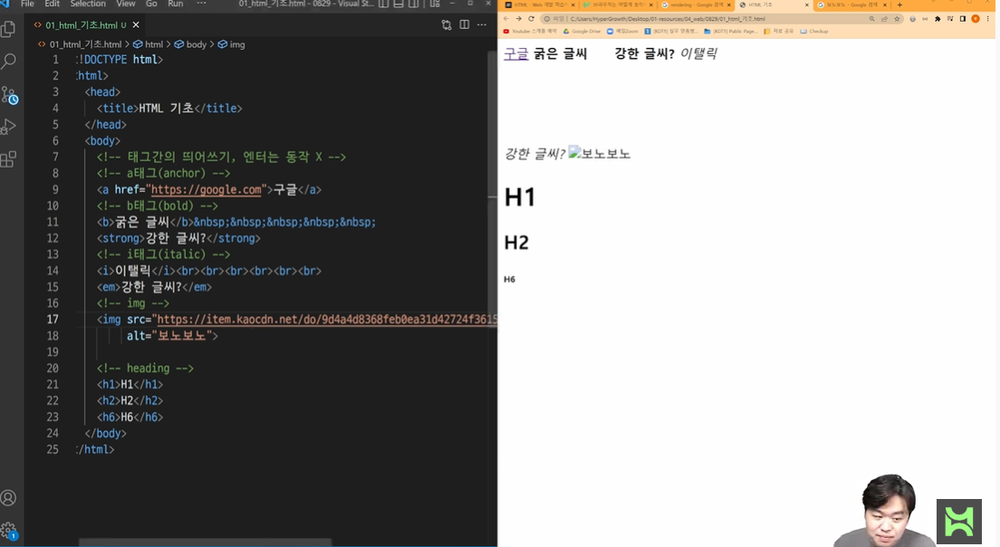
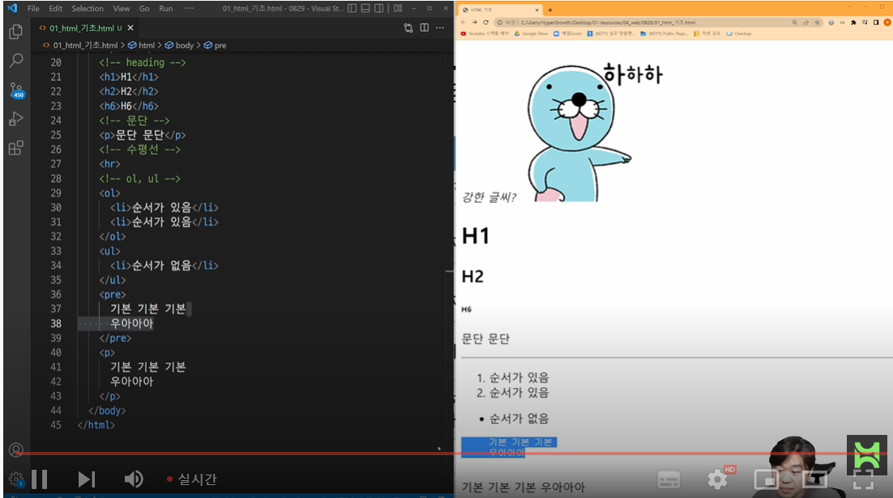
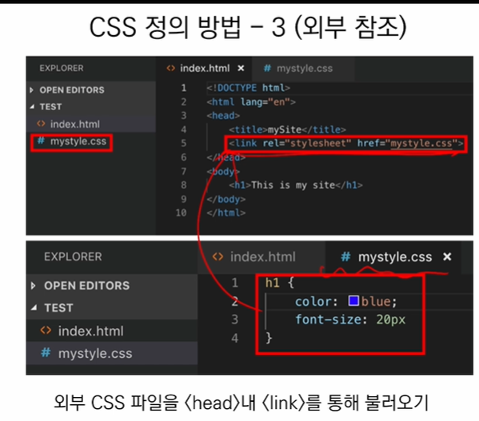
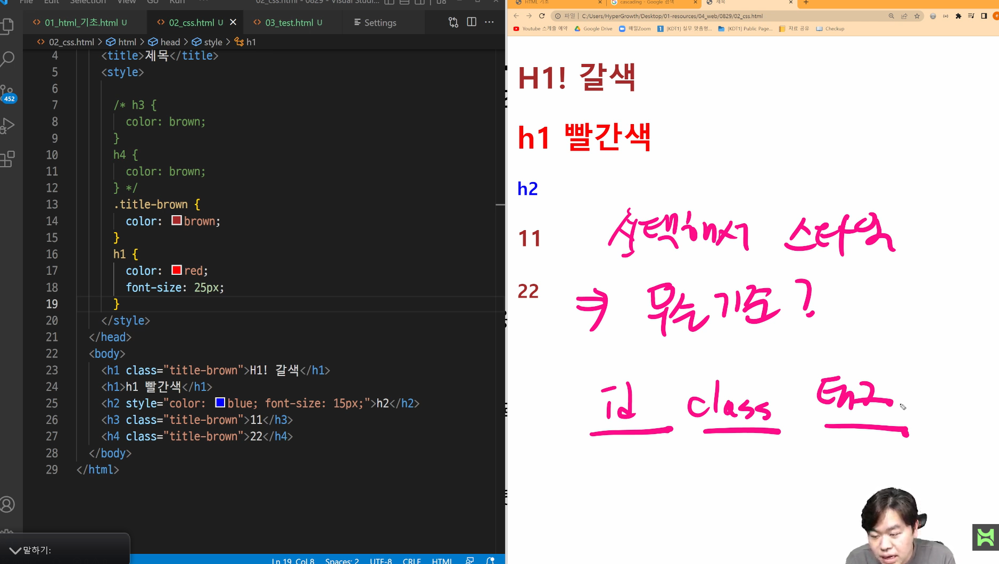

img 요소의 src는 소스, alt 는 대체 텍스트

pre 태그 안에서는 띄어쓰기 엔터가 그대로 적용된다.

div,span은 별도로 말해주신다고함

css는 내부참조를하거나 외부참조로 하는것이 좋다.

href는 경로

기본적으로 id class 태그 순서로 중요도가 높고

같은 class 혹은 같은 id 로 나열되어있다면 마지막에 선언된 class 혹은 id의 값으로 적용됨

css 는 선택해서 스타일을 적용한다.

적용에는 우선순위가 있다.

같은 레벨이라면 나중에 '선언'된 것이 적용된다.

id, class, 태그는 서로 다른 레벨이다.

id > class > 태그 순으로 우선순위를 가집니다.

**다만 일반적으로 css 스타일링은 클래스로만 합나디ㅏ.**

id는 잘 활용하지 않고 js로 개발할 때 보통 활용합니다.

id는 문서에서 반드시 한번만 등장해야 합니다.

html : 문서의 구조, 태그

css : 스타일링 무엇인가를 선택해서 스타일

​						무엇: 태그, class, id