# HTML 태그및 속성 정리

### 목차

- [**< a > 태그**](# <-a->)
- [**< abbr > 태그**](# <-abbr->)
- [**< address > 태그**](# <-address->)
- [**< area > 태그**](# <-area->)
- [**< article > 태그**](# <-article->)
- [**< aside > 태그**](# <-aside->)
- [**< audio > 태그**](# <-audio->)
- [**< b > 태그**](# <-b->)
- [**< bdo > 태그**](# <-bdo->)
- [**< blockquote > 태그**](# <-blockquote->)
- [**< br > 태그**](# <-br->)
- [**< button > 태그**](# <-button->)
- [**< canvas > 태그**](# <-canvas->)
- [**< caption > 태그**](# <-caption->)
- [**< cite > 태그**](# <-cite->)
- [**< code > 태그**](# <-code->)

# < a > 

HTML < a > 요소(앵커 요소)는 `href` 특성을 통해 다른 페이지나 같은 페이지의 어느 위치, 파일 이메일 주소와 그 외 다른 URL로 연결할 수 있는 하이퍼링크를 만듭니다. `<a>` 안의 콘텐츠는 링크 목적지의 설명을 나타내야 합니다.

 ### 특성

###### `href`

하이퍼링크가 가리키는 URL. 링크는 HRRP 기반 URL 일 필요는 없고, 브라우저가 지원하는 모든 URL 스킴을 사용할 수 있습니다.

- 페이지 구획을 가리키는 프래그먼트 URL
- 미디어 파일 일부를 가리키는 미디어 프래그먼트
- `tel:` URL을 사용하는 전화번호
- `mailto: `URL을 사용하는 메일주소
- 웹 브라우저는 다른 URL 스킴을 지원하지 않지만, 웹사이트는 `Navigator.registerProtocolHandler()`를 통해 지원할수 있습니다.

###### `download`

링크로 이동하는 대신 사용자에게 URL을 저장할지 물어봅니다. 값을 지정할 수도 있고, 지정하지 않을 수도 있습니다.

- 값이 없으면 파일 이름과 확장자는 브라우저가 다양한 인자로부터 생성해 제안합니다.
- 값을 지정하면 저장할 때의 파일 이름으로서 제안합니다. `/`와`\`문자는 `_`로 변환합니다. 파일 시스템에서 다른 문자도 제한 할수 있으므로, 필요한 경우 브라우저가 추가로 이름을 조정할 수 있습니다.

###### `ping`

하나의 스페이스로 구분하는 URL 목록, 링크를 클릭해 따라갈 경우, 브라우저가 URL 각각에 POST 요청을 전송합니다. 대개 추적 용도로 사용합니다.

###### `rel`

하나의 스페이스로 구분하는, 연결한 URL과의 관계를 나타내는 링크 유형 목록

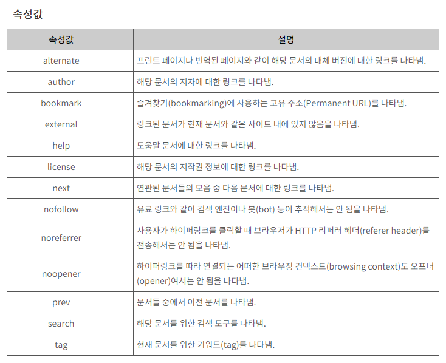

###### `target`

링크한 URL을 표시할 위치. 기능한 값은 브라우징 맥락으로, 즉 탭,창,`<iframe>`의 이름이나 특정 키워드입니다. 다음 키워드는 특별한 뜻을 가지고 있습니다.

- _self : URL을 현재 브라우징 맥락에 표시합니다. 기본값.
- _blank : URL을 새로운 브라우징 맥락에 표시합니다. 보통 새 탭이지만, 사용자가 브라우저 설정을 통해 새 창으로 바꿀 수 있습니다.
- _parent : URL을 현재 브라우징 맥락의 부모에 표시합니다. 부모가 존재하지 않으면 _self와 동일하게 행동합니다.
- _top : URL을 최상단 브라우징 맥락(현재 맥락의 부모면서 자신의 부모가 존재하지 않는, 제일 높은 맥락)에 표시합니다. 부모가 존재하지 않으면 _self 와 동일하게 행동합니다.

참고

- target 을 사용할 때, `rel="noreferrer"`를 추가해 `window.opener`API의 악의적인 사용을 방지하는걸 고려하세요.

- 최근의 브라우저에서는 target='_blank'를 지정하면 `rel="noopener"`를 적용한 것과 같은 동작을 합니다.

###### `type`

링크 URL의 MIME type에 대한 힌트. 특별한 내장 기능은 없습니다.

*MIME type은 파일의 형식을 나타내는 문자열로 파일과 같이 송신되는데 content의 형식을 나타내기 위해 사용한다. 

# < abbr >

HTML `<abbr>`요소는 준말 또는 머리글자를 나타냅니다. 선택 속성인 `title`을 사용하면 준말의 전체 뜻이나 설명을 제공할 수 있습니다. `title`속성은 전체 설명만을 가져야 하며 다른건 포함할 수 없습니다.

### 특성

`<abbr>` 요소에서의 `title` 특성은 특정한 의미를 가지며, `title`은 준말에 대한 설명 혹은 확장형태를 사람이 읽을 수 있는 형태를 값으로 가져야 합니다. 브라우저는 `title`의 값을 보통 마우스 커서를 올렸을 때 나타나는 툴팁으로 보여줍니다.

각각의 `<abbr>`요소는 서로 독립적입니다. 하나의 요소에 `title`을 제공한다고 나머지에 지정하지 않아도 되는것은 아닙니다.

### 기본 스타일

`<abbr>`의 목적은 오로지 HTML 작성자의 편리함을 위함이며, 모든 브라우저는 기본적으로 인라인으로 렌더링 합니다. 그러나 기본 스타일은 브라우저마다 다를 수 있습니다.

### 예제

**준말임을 나타내기**

설명 없이, 단순히 특정 단어가 준말임을 나타내기만 하고자 하면 `<abbr>`을 다른 특성 없이 사용하세요.

HTML

```python
<p>Using <abbr>HTML</abbr> is fun and easy!</p>
```

결과

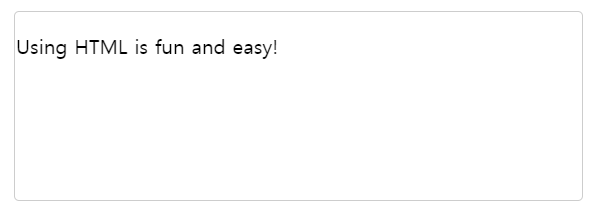

**펼친 형태 보여주기**

`title`특성을 사용하면 준말과 머리글자를 펼친 원래 형태를 보여줄 수 있습니다.

HTML

```html
<p>Ashok's joke made me <abbr title="Laugh Out Loud">LOL</abbr> big
time.</p>
```

결과

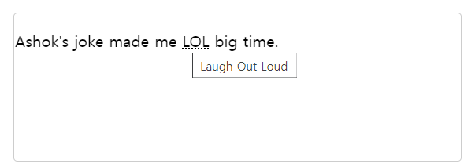

**준말 정의하기**

`<abbr>`과 `<dfn>`을 사용하면 준말을 정식으로 정의할 수 있습니다.

HTML

```html
<p><dfn id="html"><abbr title="HyperText Markup Language">HTML</abbr>
</dfn> is a markup language used to create the semantics and structure
of a web page.</p>

<p>A <dfn id="spec">Specification</dfn>
(<abbr title="Specification">spec</abbr>) is a document that outlines
in detail how a technology or API is intended to function and how it is
accessed.</p>
```

결과

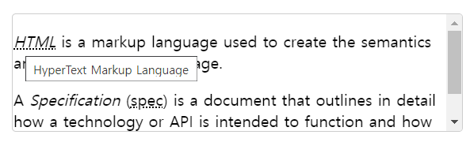

### 접근성 고려사항

준말과 머리글자가 처음 사용될 때, 그 뜻을 풀어 설명하면 독자가 문서를 이해하기 쉬워집니다. 특히 콘텐츠가 기술이나 산업에 관련된 전문적인 내용인 경우 더욱 그렇습니다.

# < address >

HTML `<address>`요소는 가까운 HTML 요소의 사람, 단체, 조직 등에 대한 연락처 정보를 나타냅니다.

`<address>`요소의 콘텐츠가 제공하는 연락처 정보는 현재 맥락에 적절한 아무 형태나 취할수 있으며, 물리적 주소, URL, 이메일 주소, 전화번호, SNS 식별자, 좌표 등 어떠한 정보라도 포함할 수 있습니다. 반드시 포함해야 하는 정보는 연락처가 가리키는 개인, 조직, 단체의 이름입니다.

`<address>`는 다양한 맥락에서 사용할 수 있습니다. 사업체 연락 방법을 페이지 헤더에 배치할 때도 쓸 수 있고,`<article>`내부에 배치해서 글의 작성자를 나타낼 수도 있습니다.

**예제**

```html
<address>
  You can contact author at <a href="http://www.somedomain.com/contact">
  www.somedomain.com</a>.<br>
  If you see any bugs, please <a href="mailto:webmaster@somedomain.com">
  contact webmaster</a>.<br>
  You may also want to visit us:<br>
  Mozilla Foundation<br>
  331 E Evelyn Ave<br>
  Mountain View, CA 94041<br>
  USA
</address>
```

**결과**

*You can contact author at* [www.somedomain.com](http://www.somedomain.com/contact)*.*
*If you see any bugs, please* [contact webmaster](mailto:webmaster@somedomain.com)*.*
*You may also want to visit us:*
*Mozilla Foundation*
*331 E Evelyn Ave*
*Mountain View, CA 94041*
*USA*

비록 겉보기는 `<i>` 나 `<em>` 요소와 같지만, `<address>` 요소는 자체적인 의미를 갖고 있으므로 연락처 표기에는 `<address>`가 더 적합합니다.

# < area >

HTML `<area>`요소는 이미지의 핫스팟 영역을 정의하고 하이퍼링크를 `<map>`요소 안에서만 사용할 수 있습니다.

**예제**

```html
<map name="infographic">
    <area shape="rect" coords="184,6,253,27"
          href="https://mozilla.org"
          target="_blank" alt="Mozilla" />
    <area shape="circle" coords="130,136,60"
          href="https://developer.mozilla.org/"
          target="_blank" alt="MDN" />
    <area shape="poly" coords="130,6,253,96,223,106,130,39"
          href="https://developer.mozilla.org/docs/Web/Guide/Graphics"
          target="_blank" alt="Graphics" />
    <area shape="poly" coords="253,96,207,241,189,217,223,103"
          href="https://developer.mozilla.org/docs/Web/HTML"
          target="_blank" alt="HTML" />
    <area shape="poly" coords="207,241,54,241,72,217,189,217"
          href="https://developer.mozilla.org/docs/Web/JavaScript"
          target="_blank" alt="JavaScript" />
    <area shape="poly" coords="54,241,6,97,36,107,72,217"
          href="https://developer.mozilla.org/docs/Web/API"
          target="_blank" alt="Web APIs" />
    <area shape="poly" coords="6,97,130,6,130,39,36,107"
          href="https://developer.mozilla.org/docs/Web/CSS"
          target="_blank" alt="CSS" />
</map>

```

**결과**


**특성**

###### `alt`

이미지를 출력하지 않는 브라우저에서 대신 표시할 대안 텍스트입니다. 텍스트의 내용은 대안 텍스트 없이 이미지만 표시할 때와 동일한 수준의 선택지를 나타낼 수 있어야 합니다. `href`특성이 존재할 경우 필수 사항입니다.

###### `coords`

핫스팟 영역을 지정하는 일련의 좌표입니다. 값의 수와 의미는 `shape`특성의 값에 따라 달라집니다.

- `rect`: 좌상단과 우하단을 나타내는 두 개의 x, y 쌍입니다.
- `circle`: `x,y,r`로서 `x,y`는 원의 중심 좌표이며 `r`은 반지름 입니다.
- `poly`: 다각형의 꼭지점을 나타내는 다수의 x, y 쌍 (x1,y1,x2,y2,x3,y3,...) 입니다.

값의 단위는 CSS 픽셀입니다.

###### `download`

특성이 존재할 경우, 이 하이퍼링크는 리소스 다운로드 용도로 사용하는 것을 의도했음을 나타냅니다.

###### `href`

`<area>` 하이퍼링크의 대상입니다. 유효한 URL이야 합니다. 생략할 경우, 이`<area>`요소는 하이퍼링크를 나타내지 않습니다.

###### `ping`

하이퍼링크를 따라갈 때. 백그라운드에서 브라우저가 POST요청을 본문 `PING`으로 전성할 URL의 목록입니다. 공백으로 구분하며 주로 추적용으로 사용합니다.

###### `shape`

지정할 스팟의 모양을 정합니다. `rect`, `circle`, `poly` 가 있습니다.

###### `target`

이 속성은 링크된 리소스가 어디에 표시될지 지정합니다.

- _self : 결과를 현재 HTML4 프레임 또는 HTML5 브라우징 컨텍스트에 로드합니다.  이 target속성이 정의되어있지 않은경우 이 값이 기본값이 됩니다.
- _blank: 결과를 이름없는 새로운 HTML4 윈도우나 HTML5 브라우징 컨텍스트에 로드합니다.
- _parent: 결과를 현재 HTML4 프레임의 부모 프레임셋에 로드하거나 부모 HTML5 브라우징 컨텍스트에 로드합니다. 만약 부모가 없을경우 _self와 동일하게 여겨집니다.
- _top: HTML4 에서는, 다른 모든 프레임을 취소하고 결과를 꽉찬 본래의 윈도우에 로드합니다. HTML5에서는, 결과를 최상위 브라우징 컨텍스트에 로드합니다. 만약 부모가 없다면 이 옵션은 _self와 같이 행동합니다. 

이 속성은 href속성이 존재할때만 사용합니다.

# < article >

HTML `<article>`요소는 문서, 페이지, 애플리케이션, 또는 사이트 안에서 독립적으로 구분해 배포하거나 재사용할 수 있는 구획을 나타냅니다. 사용 예제로 게시판과 블로그 글, 매거진이나 뉴스 기사 등이 있습니다.

### 예제

```html
<article class="forecast">
    <h1>Weather forecast for Seattle</h1>
    <article class="day-forecast">
        <h2>03 March 2018</h2>
        <p>Rain.</p>
    </article>
    <article class="day-forecast">
        <h2>04 March 2018</h2>
        <p>Periods of rain.</p>
    </article>
    <article class="day-forecast">
        <h2>05 March 2018</h2>
        <p>Heavy rain.</p>
    </article>
</article>

```

```css
.forecast {
    margin: 0;
    padding: .3rem;
    background-color: #eee;
    font: 1rem 'Fira Sans', sans-serif;
}

.forecast > h1,
.day-forecast {
    margin: .5rem;
    padding: .3rem;
    font-size: 1.2rem;
}

.day-forecast {
    background: right/contain content-box border-box no-repeat
        url('/media/examples/rain.svg') white;
}

.day-forecast > h2,
.day-forecast > p {
    margin: .2rem;
    font-size: 1rem;
}
```

### 결과

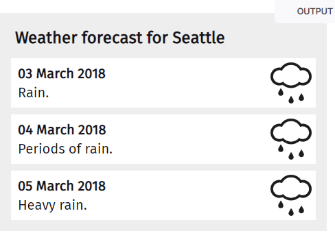

하나의 문서가 여러 개의 `<article>`을 가질 수 있습니다. 예컨대 사용자가 스크롤하면 계속해서 다음 글을 보여주는 블로그의 경우, 각각의 글이 `<article>`요소가 되며, 그 안에는 또 여러 개의 `<section>`이 존재할 수 있습니다.

# < aside >

HTML `<aside>`요소는 문서의 주요 내용과 간접적으로만 연관된 부분을 나타냅니다. 주로 사이드바 혹은 콜아웃 박스로 표현합니다.

### 예제

```html
<article>
  <p>
    디즈니 만화영화 <em>인어 공주</em>는
    1989년 처음 개봉했습니다.
  </p>
  <aside>
    인어 공주는 첫 개봉 당시 8700만불의 흥행을 기록했습니다.
  </aside>
  <p>
    영화에 대한 정보...
  </p>
</article>
```


### 결과

디즈니 만화영화 *인어 공주*는 1989년 처음 개봉했습니다.

인어 공주는 첫 개봉 당시 8700만불의 흥행을 기록했습니다.

영화에 대한 정보...

# < audio >

HTML `<audio>` 요소는 문서에 소리 콘텐츠를 포함할 때 사용합니다. src측성 또는 <source>_(en-US) 요소를 사용해 한 개 이상의 오디오 소스를 지정할 수 있으며, 다수를 지정한 경우 가장 적절한 소스를 브라우저가 고릅니다. MediaStream_(en-US)을 사용하면 미디어 스트림을 바라볼 수도 있습니다.

### 예제

```html
<figure>
    <figcaption>Listen to the T-Rex:</figcaption>
    <audio
        controls
        src="/media/cc0-audio/t-rex-roar.mp3">
            Your browser does not support the
            <code>audio</code> element.
    </audio>
</figure>
```

### 결과

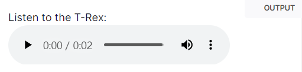

### 특성

`autiplay`

지정한 경우, 전체 오디오 파일의 다운로드를 기다리지 않고 가능한 빠른 시점에 재생을 시작합니다.

`controls`

지정한 경우 오디오 재생, 볼륨, 탐색, 일시 정지 컨트롤을 브라우저에서 제공합니다.

# < b >

HTML `<b>`요소는 독자의 주의를 요소의 콘텐츠로 끌기 위한 용도로 사용합니다. 그 외의 다른 특별한 중요도는 주어지지 않습니다. 원래는 "굵은 글씨 요소"로 불렸으며, 대부분의 브라우저도 여전히 텍스트를 굵은 글씨체로 강조합니다. 그러나 `<b>`를 사용해 텍스트를 꾸미면 안됩니다. 대신 CSS `font-weight`를 사용해 굵은 글씨체를 적용하거나, `<strong>`요소를 사용해 특별히 중요한 텍스트를 나타내세요.

### 예제

```html
<p>The two most popular science courses offered by the school are <b class="term">chemistry</b> (the study of chemicals and the composition of substances) and <b class="term">physics</b> (the study of the nature and properties of matter and energy).</p>
```

### 결과

The two most popular science courses offered by the school are **chemistry** (the study of chemicals and the composition of substances) and **physics** (the study of the nature and properties of matter and energy).

### 사용일람

- 요약 키워드, 리뷰의 제품명 등, 특별한 중요성을 가지고 있지는 않지만 굵게 표시할 부분에 <b>를 사용하세요.
- <b>요소와 <strong>, <em>, <mark>요소를 혼동하지 않도록 주의하세요. <strong> 요소는 중요한 글을, <em>요소는 약간의 강조가 필요한 글을, <mark>요소는 관련성이 있는 글을 나타냅니다. <b>요소는 아무런 의미도 갖지 않으므로 다른 요소가 적합하지 않을 때만 사용하세요.
- 비슷한 이유로 <b>요소로만 제목을 만들어선 안됩니다. 제목은 <h1>에서 <h6>태그로 표현하세요. 특히 스타일시트를 사용해 제목 요소의 스타일을 바꿀 수 있다는 점을 생각해보면, 제목이 꼭 굵은 글씨체일 필요는 없습니다.
- 과거 <b>요소는 굵은 글씨를 만들 때 사용했습니다. HTML4부터 스타일 정보는 사용하지 않으므로 <b>요소의 의미도 바뀌었습니다.
- <b>의 의미와 관계 없이 굵은 글씨를 사용하고 있다면, CSS font-weight속성의 "bold" 값을 사용하는 방법을 고려하세요.

# < bdo >

HTML <bdo> 요소는 현재 텍스트의 쓰기 방향을 덮어쓰고 다른 방향으로 렌더링 할 때 사용합니다.

### 특성

`dir`

요소 콘텐츠의 텍스트 쓰기 방향. 가능한 값은 다음과 같습니다.

- `ltr`: 텍스트를 왼쪽에서 오른쪽으로 써야 함을 나타냅니다.
- `rtl`: 텍스트를 오른쪽에서 왼쪽으로 써야 함을 나타냅니다.

### 예제

```html
<!-- 쓰기 방향 바꾸기 -->
<p>이 글은 왼쪽에서 오른쪽으로 작성합니다.</p>
<p><bdo dir="rtl">이 글은 오른쪽에서 왼쪽으로 작성합니다.</bdo></p>
```

### 결과

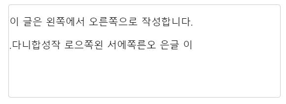

# < blockquote >

HTML <blockquote>요소는 안쪽의 텍스트가 긴 인용문임을 나타냅니다. 주로 들여쓰기를 한 것으로 그려집니다. (외형을 바꾸는 법은 사용 일람을 참고하세요) 인용문의 출처 URL은 cite 특성으로 출처 텍스트는 <cite>요소로 제공할 수 있습니다.

### 특성

`cite`

인용문의 출처 문서나 메시지를 가리키는 URL. 인용문의 맥락 혹은 출처 정보를 가리킬 용도입니다.

### 예시

```html
<blockquote cite="https://tools.ietf.org/html/rfc1149">
  <p>Avian carriers can provide high delay, low
  throughput, and low altitude service.  The
  connection topology is limited to a single
  point-to-point path for each carrier, used with
  standard carriers, but many carriers can be used
  without significant interference with each other,
  outside of early spring.  This is because of the 3D
  ether space available to the carriers, in contrast
  to the 1D ether used by IEEE802.3.  The carriers
  have an intrinsic collision avoidance system, which
  increases availability.</p>
</blockquote>
```

### 결과 

실제결과는 안으로 들여쓰기가 되어있는 상태이다.

> Avian carriers can provide high delay, low throughput, and low altitude service. The connection topology is limited to a single point-to-point path for each carrier, used with standard carriers, but many carriers can be used without significant interference with each other, outside of early spring. This is because of the 3D ether space available to the carriers, in contrast to the 1D ether used by IEEE802.3. The carriers have an intrinsic collision avoidance system, which increases availability.

# < br >

HTML `<br>`요소는 텍스트 안에 줄바꿈(캐리지 리턴)을 생성합니다. 주소나 시조 등 줄의 구분이 중요한 내용을 작성할 때 유용합니다.

> 참고 : 문단 사이에 여백을 두기 위한 용도로 <br>을 사용하지 마세요. 대신 <p>요소로 감싼 후 CSS 의 margin 속성으로 여백의 크기를 조절하세요.

#  < button >

HTML <button>요소는 클릭 가능한 버튼을 나타냅니다. 버튼은 양식 내부는 물론 간단한 표준 버튼 기능이 필요한 곳이라면 문서 어디에나 배치할 수 있습니다, 기본값의 HTML 버튼은 사용자 에이전트의 호스트 ㅡㄹ랫폼과 비슷한 디자인을 따라가지만 외형은 CSS 로 변경할 수 있습니다.

```html
<button class="favorite styled"
        type="button">
    Add to favorites
</button>
```

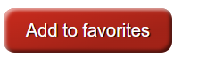

### 특성

`autofocus`

​	페이지 로드 후, 이 버튼에 포커스가 위치해야 하는지 나타냅니다. 문서 내에서 하나의 요소	만 `autofocus`특성을 가질 수 있습니다.

`dusabled`

​	버튼과 사용자의 상호작용, 즉 누르거나 클릭하는 것을 막습니다.

`form`

​	버튼과 연결할 `<form>`요소. 같은 문서에 존재하는 `<form>`요소의 id 특성 값을 사용해야

​	합니다. `<form>` 특성을 지정하지 않았으나 조상 중 `<form>`요소가 존재하면 해당 `<form>`	과 연결됩니다.

`formmethod`

`<button>`이 제출 버튼인 경우, `<formmethod>`특성은 양식을 서버로 제출할 때 사용할 HTTP 메서드를 지정합니다. 가능한 값은 다음과 같습니다.

- post : 양식의 데이터를 HTTP 요청 본문에 넣습니다. 비밀번호처럼,양식 데이터 중 공개하지 않아야 하는 항목이 있으면 사용하세요.
- get:양식 action URL 뒤에 ? 를 추가한 후 양식 데이터를 덧붙입니다. 검색 양식처럼, 양식이 사이드 이펙트를 가지 않을 때 사용하세요.

`name`

버튼의 이름. 제출할 때, 버튼의 `value` 특성과 함께 양식 데이터의 일부를 구성합니다.

`type`

버튼의 행동 방식. 가능한 값은 다음과 같습니다.

- `submit`: 버튼이 서버로 양식 데이터를제출합니다. 지정하지 않은 경우 기본값이며, 유효하지 않은 값일 때도 사용합니다.
- `reset`:`<input type="reset">` 처럼, 모든 컨트롤을 초깃값으로 되돌립니다.
- `button`: 기본 행동이 없으며 클릭했을 때 아무것도 하지 않습니다. 클라이언트측 스크립트와 연결할 수 있습니다.

`value`

버튼의 초깃값. 제출할 때, 버튼의 `value`특성과 함께 양식 데이터의 일부를 구성합니다.

양식 제출용 버튼이 아니라면 `type` 특성을 `button`으로 지정하는것 잊지 마세요. 기본값에서는 버튼을 눌렀을 때 양식 데이터를 제출하고, (존재하지 않는) 응답을 불러오려고 시도하는 과정에서 문서의 현재 상태가 사라질 수 있습니다.

# < canvas >

HTML 과 <canvas> 요소는 캔버스 스크립팅 API 또는 WebGL API 와 함께 사용해 그래픽과 애니메이션을 그릴 수 있습니다.

### 특성

`height`

좌표 공간의 높이입니다. CSS 픽셀 단위로, 기본값은 150입니다.

`width`

좌표 공간의 너비입니다. CSS 픽셀 단위로, 기본값은 300입니다.

### 대체 콘텐츠

`<canvas>` 블록 안에 콘텐츠를 추가해 대체 콘텐츠로서 사용할 수 있습니다. 대체 콘텐츠는 캔버스를 지원하지 않는 구형 브라우저와, JavaScript를 비활성화한 브라우저에서 표시됩니다. 유용한 대체 텍스트, 혹은 하위 DOM을 제공하면 캔버스의 접근성을 향상할 수 있습니다.

닫는 태그 필수

요소와 달리, <canvas>요소는 닫는 태그 </canvas>를 필요로 합니다.

# < caption >

HTML < caption > 요소는 표의 설명 또는 제목을 나타냅니다.

### 사용 일람

< caption > 요소는 부모 < table > 요소의 첫 번째 자식이어야 합니다.

< caption > 요소를 가진 < table > 요소가 만약 < figcation > 요소의 유일한 자식인 경우 

< figcaption >을 대신 사용하세요.

### 예제

```html
<table>
  <caption>Example Caption</caption>
  <tr>
    <th>Login</th>
    <th>Email</th>
  </tr>
  <tr>
    <td>user1</td>
    <td>user1@sample.com</td>
  </tr>
  <tr>
    <td>user2</td>
    <td>user2@sample.com</td>
  </tr>
</table>
```

### 결과

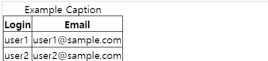

# < cite > 

HTML < cite > 요소는 저작물의 출처를 표기할 때 사용하며, 제목을 반드시 포함해야 합니다. 적절한 맥락 아래에서는 출처를 축약해서 표기할 수 있습니다.

W3C 명세는 < cite > 요소로 저작물의 출처를 표기할 때 저작자도 표기할 수 있음을 명시하고 있습니다. 그러나 정반대로, WHATWG 명세는 사람 이름을 어떤 상황에서도 절대 포함하지 말아야 한다고 적혀있다는 점을 알아두는 것이 좋습니다.

보통 브라우저는 < cite > 요소를 그릴 때 기울임 꼴로 표햔합니다. 기울임꼴을 제거하려면 CSS 속성을 < cite > 에 적용하세요.

### 예제

```html
<p>More information can be found in <cite>[ISO-0000]</cite>.</p>
```

### 결과

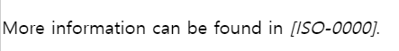

# < code >

HTML <code>요소는 짧은 코드 조각을 나타내는 스타일을 사용해 자신의 콘텐츠를 표시합니다. 기본 스타일은 사용자 에이전트의 고정폭 글씨체입니다.

#### 예제

```html
<p>The <code>push()</code> method adds one or more elements to the end of an array and returns the new length of the array.</p>
```

#### 결과

The `push()` method adds one or more elements to the end of an array and returns the new length of the array.

### 참고

여러 줄의 코드를 나타내려면 < code > 요소를 < pre > 로 감싸세요. 보통 상황에서 < code > 는 코드 한 줄만 나타냅니다. 

CSS code 태그 선택자를 사용해 브라우저의 기본 글씨체를 바꿀 수 있습니다. 그러나 사용자 설정이 CSS 보다 우선할 수도 있습니다.

# < col>

HTML col 요소는 표의 열을 나타내며, 열에 속하는 칸에 공통된 의미를 부여할 때 사용합니다. <colgroup> 안에서 찾을 수 있습니다.

<table>
    <caption>Superheros and sidekicks</caption>
    <colgroup>
        <col>
        <col span="2" class="batman">
        <col span="2" class="flash">
    </colgroup>
    <tr>
        <td> </td>
        <th scope="col">Batman</th>
        <th scope="col">Robin</th>
        <th scope="col">The Flash</th>
        <th scope="col">Kid Flash</th>
    </tr>
    <tr>
        <th scope="row">Skill</th>
        <td>Smarts</td>
        <td>Dex, acrobat</td>
        <td>Super speed</td>
        <td>Super speed</td>
    </tr>
</table>

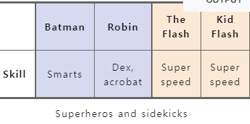

### 특성

`span`

​	`<col>`이 차지할 열의 수를 나타내는 양의 정수. 기본값은 1입니다.

