# Happy Web

웹 사이트의 구성 요소

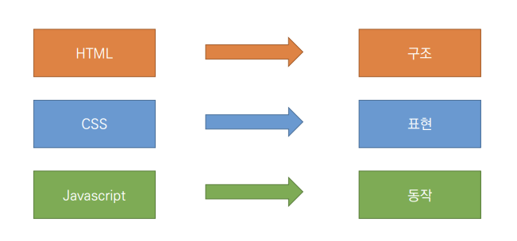


## 웹 사이트와 브라우저

- 웹 사이트는 브라우저를 통해 동작함

- 브라우저마다 동작이 약간씩 달라서 문제가 생기는 경우가 많음(파편화)

- 해결책으로 웹 표준이 등장

  

## 웹 표준

- 웹에서 표준적으로 사용되는 기술이나 규칙
- 어떤 브라우저든 웹 페이지가 동일하게 보이도록 함(크로스 브라우징)

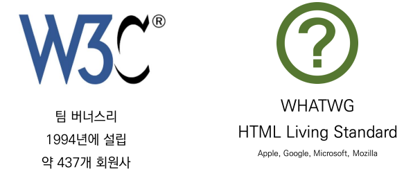\


 

# 개발 환경 설정

Visual Studio Code

- HTML/CSS 코드 작성을 위한 Visual Studio Code 추천 확장 프로그램
  - Open in browser
  - Auto Rename Tag
  - Auto Close Tag
  - Intellisense for CSS class names in HTML
  - HTML CSS Support

크롬 개발자 도구

- 웹 브라우저 크롬에서 제공하는 개발과 관련된 다양한 기능을 제공
- 주요 기능
  - Elements - DOM 탐색 및 CSS 확인 및 변경
    - Styles - 요소에 적용된 CSS 확인
    - Computed - 스타일이 계산된 최종 결과
    - Event Listeners - 해당 요소에 적용된 이벤트 (JS)
  - Sources, Networkm Performance, Application, Security, Audits 등

# HTML 기초

***Hyper Text Markup Language***

## Hyper Text란?

- 참조(하이퍼링크)를 통해 사용자가 한 문서에서 다른 문서로 즉시 접근할 수 있는 텍스트

## Markup Language

- 태그 등을 이용하여 문서나 데이터의 구조를 명시하는 언어
  - 대표적인 예 - HTML, Markdown

## HTML 이란?

웹 페이지를 작성(구조화)하기 위한 언어

.html

HTML 파일

- HTML 스타일 가이드

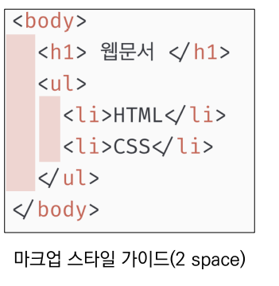

# HTML 기본 구조

```html
<!DOCTYPE html>
<html lang="en">
    <head>
        <meta charset='UTF-8'>
        <title>Document</title>
    </head>
<body>
    
</body>
</html>

```

- html : 문서의 최상위(root) 요소
- head : 문서 메타데이터 요소
  - 문서 제목, 인코딩, 스타일, 외부 파일 로딩 등
  - 일반적으로 브라우저에 나타나지 않는 내용
- body : 문서 본문 요소
  - 실제 화면 구성과 관련된 내용

## head 예시

- `<title>` : 브라우저 상단 타이틀
- `<meta>` : 문서 레벨 메타데이터 요소
- `<link` : 외부 리소스 연결 요소 (CSS 파일, favicon 등)
- `<script` : 스크립트 요소 (JavaScript 파일/코드)
- `<style>` : CSS 직접 작성

- head 예시

  ```html
  <head>
      <title>HTML 수업</title>
      <meta charset='UTF-8'>
      <link href='style.css' rel='stylesheet'>
      <script src='javascript.js'></script>
      <style>
          p {
              color: black;
          }
      </style>
  </head>
  ```

## head 예시 : Open Graph Protocol

- 메타 데이터를 표현하는 새로운 규약
  - HTML 문서의 메타 데이터를 통해 문서의 정보를 전달
  - 메타정보에 해당하는 제목, 설명 등을 쓸 수 있도록 정의

## 요소


**HTML의 요소는 태그와 내용(contents)로 구성되어 있다.**

- HTML 요소는 시작 태그와 종료 태그 그리고 태그 사이에 위치한 내용으로 구성
  - 요소는 태그로 컨텐츠(내용)를 감싸는 것으로 그정보의 성격과 의미를 정의
  - 내용이 없는 태그들도 존재(닫는 태그가 없음)
    - br, hr, img, input, link, meta
- 요소는 중첩(nested)될 수 있음
  - 요소의 중첩을 통해 하나의 문서를 구조화
  - 여는 태그와 닫는 태그의 쌍을 잘 확인해야함
    - 오류를 반환하는 것이 아닌 그냥 레이아웃이 깨진 상태로 출력되기 떄문에, 디버깅이 힘들어 질 수 있음

## HTML with 개발자 도구

- elements : 해당 요소의 HTML 태그


- 속성(attribute)

`<a href='https://google.com'></a>`

태그별로 사용할 수 있는 속성은 다르다.

- 속성(attribute) 작성 방식 통일하기


## 속성(attribute)

- 속성을 통해 태그의 부가적인 정보를 설정할 수 있음
- 요소는 속성을 가질 수 있으며, 경로나 크기와 같은 추가적인 정보를 제공
- 요소의 시작 태그에 작성하며 보통 이름과 값이 하나의 쌍으로 존재
- 태그와 상관없이 사용 가능한 속성(HTML Global Attribute)들도 있음

## HTML Global Attribute

- 모든 HTML 요소가 공통으로 사용할 수 있는 대표적인 속성 (몇몇 요소에는 아무 효과가 없을 수 있음)
  - id : 문서 전체에서 유일한 고유 식별자 지정
  - class : 공백으로 구분된 해당 요소의 클래스의 목록 (CSS, JS에서 요소를 선택하거나 접근)
  - data-* : 페이지에 개인 사용자 정의 데이터를 저장하기 위해 사용
  - style : inline 스타일
  - title : 요소에 대한 추가 정보 지정
  - tabindex : 요소의 탭 순서

## 텍스트로 작성된 코드가 어떻게 웹 사이트가 되는 걸까?

- 렌더링(Rendering)
  - 웹사이트 코드를 사용자가 보게 되는 웹사이트로 바꾸는 과정

## DOM(Document Object Model) 트리

- 텍스트 파일인 HTML 문서를 브라우저에 렌더링 하기 위한 구조
  - HTML 문서에 대한 모델을 구성함
  - HTML 문서 내의 각 요소에 접근 / 수정에 필요한 프로퍼티와 메서드를 제공함

- DOM(Document Object Model) 트리

  

## 인라인 / 블록 요소

- HTML 요소는 크게 인라인 / 블록 요소로 나눔
- 인라인 요소는 글자처럼 취급
- 블록 요소는 한 줄 모두 사용

## 텍스트 요소

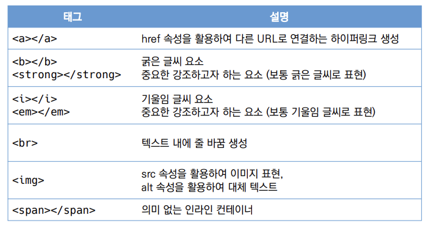

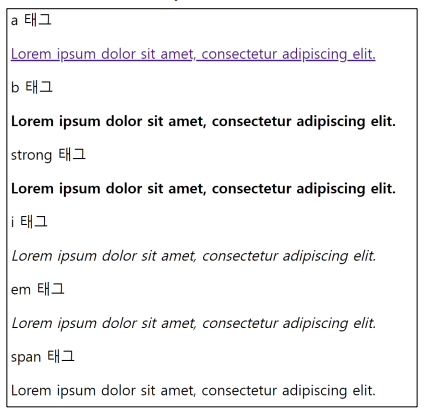

## 그룹 컨텐츠


# CSS 기초

Cascading Style Sheets


**스타일을 지정하기 위한 언어**

***선택하고, 스타일을 지정한다.***

## CSS 구문

h1 {

​	color: blue;

​	font-size: 15px; 

}

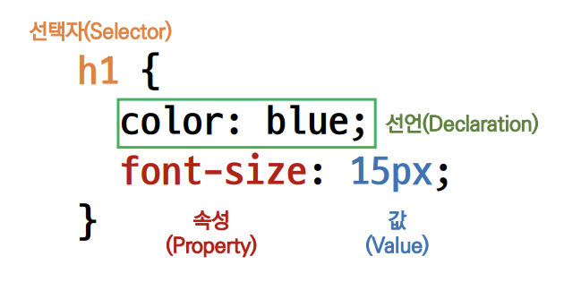

- CSS 구문은 선택자를 통해 스타일을 지정할 HTML 요소를 선택
- 중괄호 안에서는 속성과 값, 하나의 쌍으로 이루어진 선언을 진행
- 각 쌍은 선택한 요소의 속성, 속성에 부여할 값을 의미
  - 속성 (Property) : 어떤 스타일 기능을 변경할지 결정
  - 값 (Value) : 어떻게 스타일 기능을 변경할지 결정

## CSS 정의 방법

- 인라인(inline)

  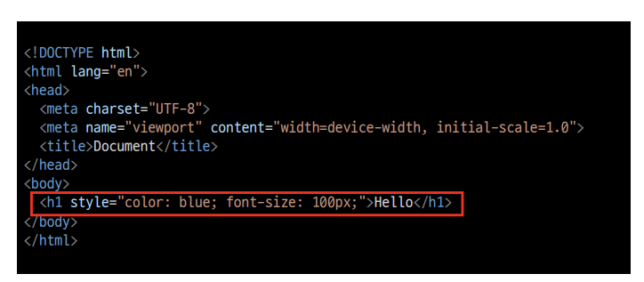

  해당 태그에 직접 style 속성을 활용

  

- 내부 참조(embedding) - <style>

  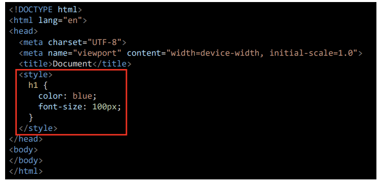

  <head> 태그 내에 <style>에 지정

  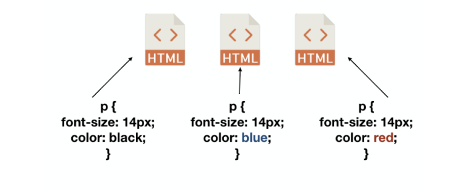

- 외부 참조(link file) - 분리된 CSS 파일


외부 CSS 파일을 <head>내 <link>를 통해 불러오기

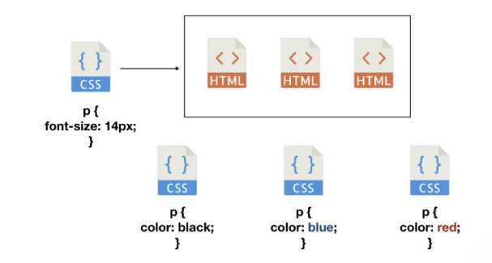

## CSS with 개발자 도구

- styles : 해당 요소에 선언된 모든 CSS
- computed : 해당 요소에 최종 계산된 CSS

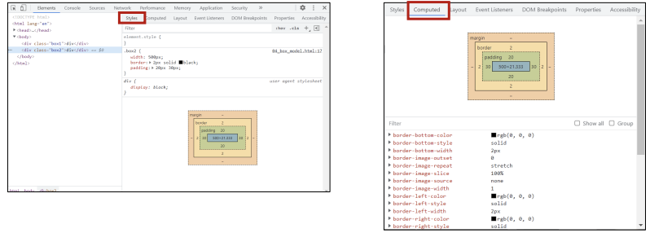

## CSS 기초 선택자

- 요소 선택자
  - HTML 태그를 직접 선택

- 클래스(class) 선택자

  - 마침표(.)문자로 시작하며, 해당 클래스가 적용된 항목을 선택

- 아이디(id) 선택자

  - `#` 문자로 시작하며, 해당 아이디가 적용된 항목을 선택

  - 일반적으로 하나의 문서에 1번만 사용
  - 여러 번 사용해도 동작하지만, 단일 id를 사용하는 것을 권장