# CSS Position

- 문서 상에서 요소의 위치를 지정
- static : 모든 태그의 기본 값(기준 위치)
  - 일반적인 요소의 배치 순서에 따름(좌측 상단)
  - 부모 요소 내에서 배치될 때는 부모 요소의 위치를 기준으로 배치 됨
- 아래는 좌표 프로퍼티(top, bottom, left, right)를 사용하여 이동 가능
  1. relative
  2. absolute
  3. fixed
  4. sticky

---

1. relative : 상대 위치

   - 자기 자신의 static 위치를 기준으로 이동 (normal flow 유지)
   - 레이아웃에서 요소가 차지하는 공간은 static일 때와 같음 (normal position 대비 offset)

2. absolute : 절대 위치

   - 요소를 일반적인 문서 흐름에서 제거 후 레이아웃에 공간을 차지하지 않음 (normal flow에서 벗어남)

   - static이 아닌 가장 가까이 있는 부모/ 조상 요소를 기준으로 이동 (없는 경우 브라우저 화면 기준으로 이동)

3. fixed : 고정 위치

   - 요소를 일반적인 문서 흐름에서 제거 후 레이아웃에 공간을 차지하지 않음 (normal flow에서 벗어남)
   - 부모 요소와 관계없이 viewport를 기준으로 이동
     - 스크롤 시에도 항상 같은 곳에 위치함

4. sticky : 스크롤에 따라 static -> fixed로 변경

   - 속성을 적용한 박스는 평소에 문서 안에서 position: static 상태와 같이 일반적인 흐름에 따르지만 스크롤 위치가 임계점에 이르면 position : fixed와 같이 박스를 화면에 고정할 수 있는 속성

## static

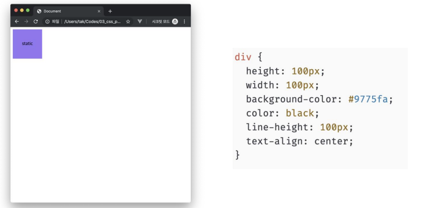

## relative

 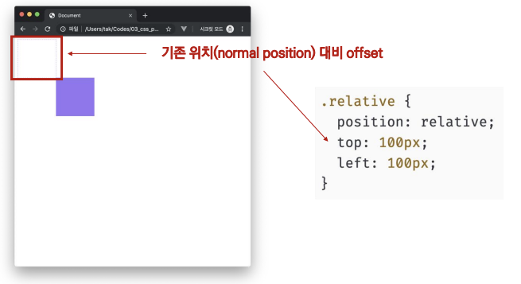

## absolute

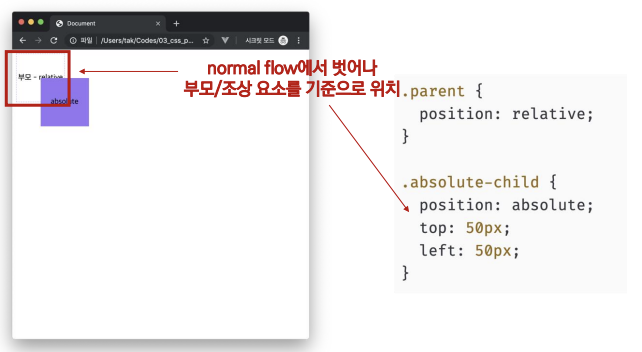

## fixed

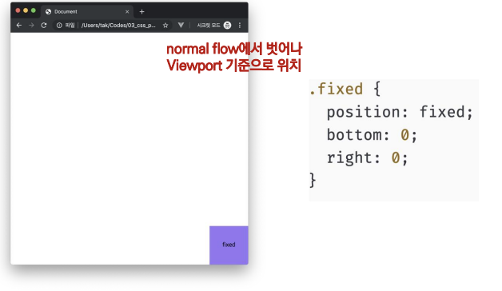

## absolute vs relative

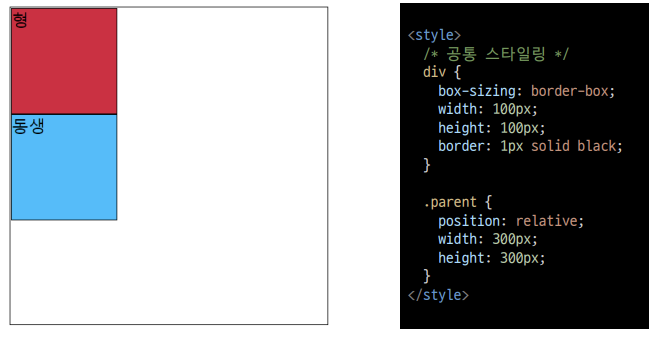


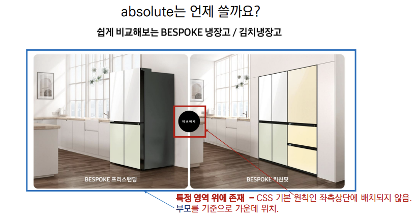

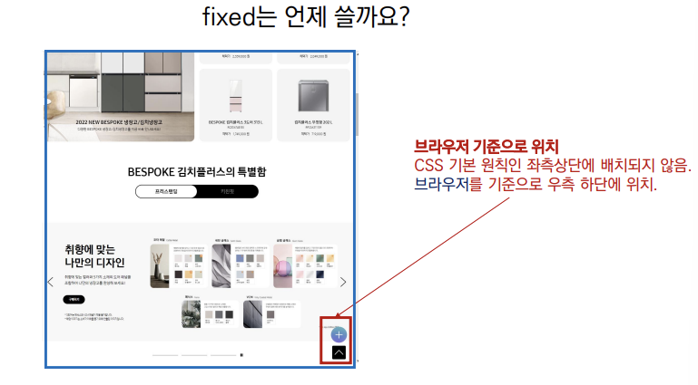

position sticky

- sticky : 스크롤에 따라 static -> fixed로 변경
  - 속성을 적용한 박스는 평소에 문서 안에서 position : static 상태와 같이 일반적인 흐름에 따르지만, 스크롤 위치가 임계점에 이르면 position : fixed 와 같이 박스를 화면에 고정할 수 있는 속성
  - 일반적으로 Navigation Bar에서 사용됨.

## CSS 원칙

- CSS 원칙 I, II : Normal flow
  - 모든 요소는 네모(박스모델), 좌측상단에 배치
  - display에 따라 크기와 배치가 달라짐
- CSS 원칙 III
  - position으로 위치의 기준을 변경
    - relative : 본인의 원래 위치
    - absolute : 특정 부모의 위치
    - fixed : 화면의 위치
    - sticky : 기본적으로 static이나 스크롤 이동에 따라 fixed로 변경

# CSS Layout

## CSS layout techniques

- Display
- Position
- Float (CSS1, 1996)
- Flexbox (2012)
- Grid (2017)
- 기타
  - Responsive Web Design

# Float

## CSS 원칙 I


### Normal Flow

모든 요소는 네머(박스모델)이고,

위에서부터 아래로, 왼쪽에서 오른쪽으로 쌓인다.(좌측 상단에 배치)

### Float

- 박스를 왼쪽 혹은 오른쪽으로 이동시켜 텍스트를 포함 인라인요소들이 주변을 wrapping 하도록 함

- 요소가 Normal flow를 벗어나도록 함

  

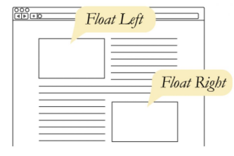

Float 예시

```html
<head>
    <style>
        .box {
            width: 150px;
            height: 150px;
            border: 1px solid black;
            background-color: crimson;
            color: white;
            margin-right: 30px;
        }
        .left {
            float: left;
        }
    </style>
</head>
<body>
    <div class="box left">
        float left
    </div>
    <p>
        lorem300 자동 완성으로 길~게
    </p>
</body>
```

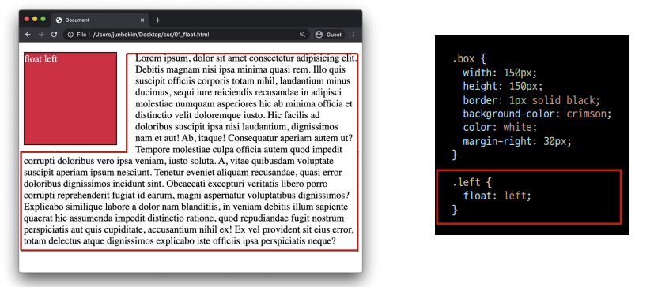

# Flexbox

## CSS Flexible Box Layout

- 행과 열 형태로 아이템들을 배치하는 1차원 레이아웃 모델
- 축
  - main axis (메인 축)
  - cross axis (교차 축)
- 구성 요소
  - Flex Container (부모 요소)
  - Flex Item (자식 요소)

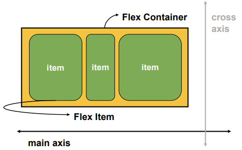

## Flexbox 축

- flex-direction : row

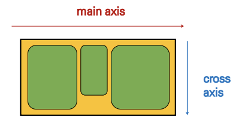

## Flexbox 구성 요소

- Flex Container (부모 요소)
  - flexbox 레이아웃을 형성하는 가장 기본적인 모델
  - Flex Item들이 놓여있는 영역
  - display 속성을 flex 혹은 inline-flex로 지정
- Flex Item (자식 요소)
  - 컨테이너에 속해 있는 컨텐츠(박스)

## 왜 Flexbox를 사용해야 할까?

이전까지 Normal Flow를 벗어나는 수단은 Float 혹은 Position

## 하기 어려웠던 것?

(수동 값 부여 없이)

1. 수직 정렬

2. 아이템의 너비와 높이 혹은 간격을 동일하게 배치

## Flex 속성

- 배치 설정
  - flex-direction
  - flex-wrap
- 공간 나누기
  - justify-content (main axis)
  - align-content (cross axis)
- 정렬
  - align-items (모든 아이템을 cross axis 기준으로)
  - align-self (개별 아이템)

## Flex 속성 : flex-direction

- Main axis 기준 방향 설정
- 역방향의 경우 HTML 태그 선언 순서와 시각적으로 다르니 유의 (웹 접근성에 영향)

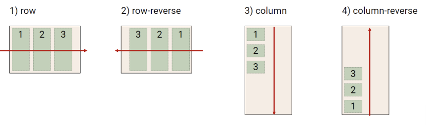

## Flex 속성 : flex-wrap

- 아이템이 컨테이너를 벗어나는 경우 해당 영역 내에 배치되도록 설정
- 즉, 기본적으로 컨테이너 영역을 벗어나지 않도록 함

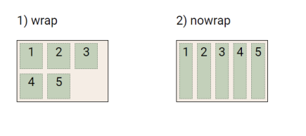

## Flex 속성 : flex-direction & flex-wrap

- flex-direction : Main axis의 방향을 설정
- flex-wrap : 요소들이 강제로 한 줄에 배치 되게 할 것인지 여부 결정
  - nowrap(기본 값) : 한 줄에 배치
  - wrap : 넘치면 그 다음 줄로 배치
- flex-flow
  - flex-direction 과 flex-wrap 의 shorthand
  - flex-direction 과 flex-wrap에 대한 설정 값을 차례로 작성
  - 예시) flex-flow : row nowrap;

## Flex 속성 : justify-content

- Main axis를 기준으로 공간 배분

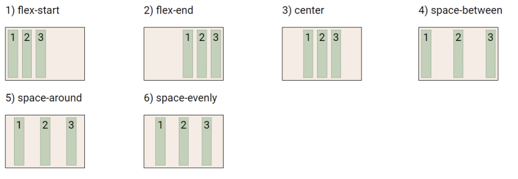

## Flex 속성 : align-content

- Cross axis를 기준으로 공간 배분 (아이템이 한 줄로 배치되는 경우 확인할 수 없음)

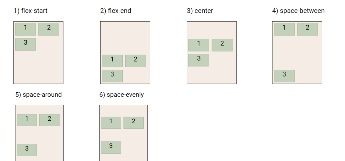

## Flex 속성 : justify-content & align-content

- 공간 배분
  - flex-start (기본 값) : 아이템들을 axis 시작점으로
  - flex-end : 아이템들을 axis 끝 쪽으로
  - center : 아이템들을 axis 중앙으로
  - space-between : 아이템 사이의 간격을 균일하게 분재
  - space-around : 아이템을 둘러싼 영역을 균일하게 분배 ( 가질 수 있는 영역을 반으로 나눠서 양쪽에)
  - space-evenly : 전체 영역에서 아이템 간 간격을 균일하게 분배

## Flex 속성 : align-items

- 모든 아이템을 Cross axis를 기준으로 정렬

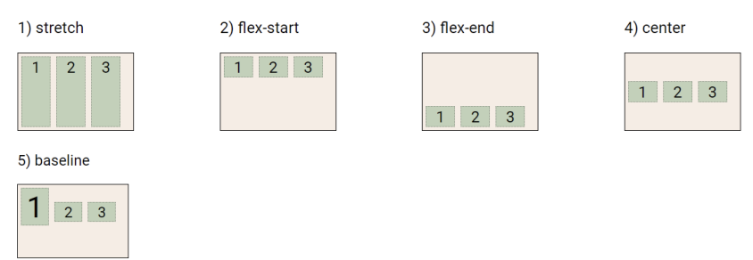

## Flex 속성 : align-self

- 개별 아이템을 Cross axis 기준으로 정렬
  - 주의! 해당 속성은 컨테이너에 적용하는 것이 아니라 개별 아이템에 적용


## Flex 속성 : align-itmes & align-self

- Cross axis를 중심으로
  - stretch (기본 값) : 컨테이너를 가득 채움
  - flex-start : 위
  - flex-end : 아래
  - center : 가운데
  - baseline : 텍스트 baseline에 기준선을 맞춤

## Flex에 적용하는 속성

- 기타 속성
  - flex-grow : 남은 영역을 아이템에 분배
  - order : 배치 순서

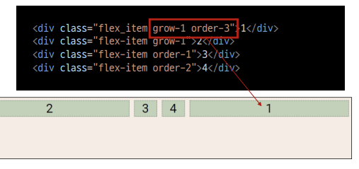

## 활용 레이아웃 - 수직 수평 가운데 정렬

```html
* 방법 1
컨테이너 설정
*/
.container {
display: flex;
justify-content: center;
align-items: center;
}
/* 방법 2
아이템 설정
*/
.container {
display: flex;
}
.item {
margin: auto;
}
```

## 활용 레이아웃 - 카드 배치

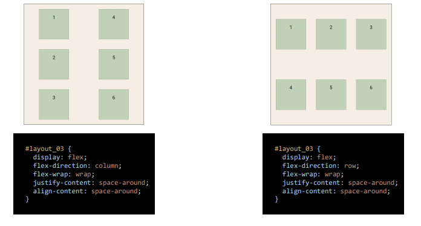

