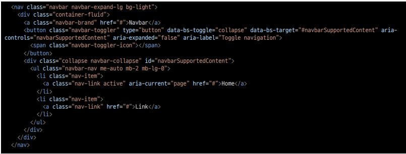

# Bootstrap 컴포넌트

#### Components

- Bootstrap의 다양한 UI 요소를 활용할 수 있음
- 아래 Components 탭 및 검색으로 원하는 UI 요소를 찾을 수 있음
- 기본 제공된 Components를 변환해서 활용

#### Butoons

- 클릭 했을 때 어떤 동작이 일어나도록 하는 요소

#### Dropdowns

- dropdown, dropdown-menu, dropdown-item 클래스를 활용해 옵션 메뉴를 만들 수 있습니다.

#### Forms > Form controls

- form-control 클래스를 사용해 < input> 및 < form> 태그를 스타일링할 수 있습니다.

#### Navbar

- navbar 클래스를 활용하면 네비게이션 바를 제작할 수 있습니다.

#### Carousel

- 콘텐츠(사진)을 순환시키기 위한 슬라이드쇼

#### Modal

- 사용자와 상호작용 하기 위해서 사용하며, 긴급 상황을 알리는 데 주로 사용
- 현재 열려 있는 페이지 위에 또 다른 레이어를 띄움
- 페이지를 이동하면 자연스럽게 사라짐(제거를 하지 않고도 배경 클릭시 사라짐-옵션에 따라 다름)

