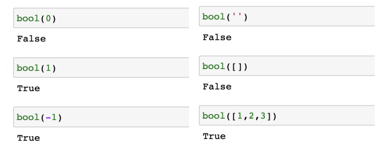

# Python

### 컴퓨터(computer)

> Calculation + Remeber

### 프로그래밍(programming)

> 명령어의 모음(집합)

### 언어

> 자신의 생각을 나타내고 전달하기 위해 사용하는 체계 문법적으로 맞는 말의 집합

#### 선언적 지식 (declarative knowledge)

> 사실에 대한 내용

#### 명령적 지식 (imperative knowledge) 

> How-to

## 파이썬이란?

- Easy to learn
  - 다른 프로그래밍 언어보다 문법이 간단하면서도 엄경하지 않음
    - 예시 : 변수에 별도의 타입 지정이 필요없음 -> 동적 타이핑 언어
  - 문법 표현이 매우 간결하여 프로그래밍 경험이 없어도 짧은 시간 내에 마스터할 수 있음
    - 예시 : 문장을 구분할 때 중괄호 ( {,})대신 들여쓰기 사용

- Expressive Language

  - 같은 작업에 대해서도 C나 자바로 작성할 때 보다 더 간결하게 작성 가능

  ```python
  print('Hello Python!')

- 크로스 플랫폼 언어
  - 윈도우, macOS, 리눅스, 유닉스 등 아양한 운영체제에서 실행가능
- 인터프리터 언어(Interpreter)
  - 소스코드를 기계어로 변환하는 컴파일 과정 없이 바로 실행 가능
  - 코드를 대화하듯 한 줄 입력하고 실행한 후, 바로 확인할 수 있음

```python
>>> 2+2 # 사용자가 입력 (input)
4		# 컴퓨터가 대답 (output)
```

- 객체 지향 프로그래밍(Object Oriented Programming)

  - 파이썬은 객체지향 언어이며, 모든 것이 객체로 구현되어 있음
    - 객체(object) : 숫자, 문자, 클래스 등 값을 가지고 있는 모든 것

  

##  파이썬 개발환경

### 코드 스타일 가이드

- 코드를 '어떻게 작성할지'에 대한 가이드라인

```python
print('hello')
print('world')

a = 'apple'

if True:
    print(True)
else:
    print(False)
  
b = 'banana'
```

### 들여쓰기(Identation)

- Space Sensitive
  - 문장을 구분할 때, 들여쓰기 (identation)를 사용
  - 들여쓰기를 할 때는 4칸(space키 4번) 혹은 1탭(Tab키 1번)을 입력
    - 주의! 한 코드 안에서는 반드시 한 종류의 들여쓰기를 사용 -> 혼용X
      - Tab으로 들여쓰면 계속 탭으로 들여써야 함
      - 원칙적으로는 공백(space키) 사용을 권장*PEP8권장사항

### 변수

- 변수란?

  - 컴퓨터 메모리 어딘가에 저장되어 있는 객체를 참조하기 위해 사용되는 이름

    - 객체(object) : 숫자, 문자, 클래스 등 값을 가지고 있는 모든 것

      -> 파이썬은 객체지향 언어이며, 모든 것이 객체로 구현되어 있음

    - 동일 변수에 다른 객체를 언제든 할당할 수 있기 때문에,

      즉 참조하는 객체가 바뀔 수 있기 때문에 '변수'라고 불림

- 변수는 할당 연산자(=)를 통해 값을 할당(assignment)

- type()

  - 변수에 할당된 값의 타입

- id()

  - 변수에 할당된 값(객체)의 고유한 아이덴티티 값

    

#### *코드는 위에서부터 아래로실행됨*

#### *오른쪽에서 왼쪽으로*


### 변수연산


### 변수할당

- 같은 값을 동시에 할당할 수 있음

  ```python
  x = y = 1004
  print(x, y)
  ```

- 다른 값을 동시에 할당 할 수 있음

  ```python
  x, y = 1, 2
  print(x, y)
  ```

  


```python
# 방법 1) 임시 변수 활용
# x, y의 값을 바꿔서 저장하는 코드를 작성하기
x, y = 10, 20
tmp = x
x = y
y = tmp
print(x, y)
```

```python
# 방법 2) Pythonic!
x, y = 10, 20
y, x = x, y
print(x, y)
```

### 식별자

- 파이썬 객체(변수, 함수, 모듈, 클래스 등)를 식별하는데 사용하는 이름(name)

- 규칙

  - 식별자의 이름은 영문 알파벳, 언더스코어(_), 숫자로 구성
  - 첫 글자에 숫자가 올 수 없음
  - 길이제한이 없고, 대소문자를 구별
  - 다음의 키워드는 예약어로 사용할 수 없음

  

- 내장함수나 모듈 등의 이름으로도 만들면 안됨

  - 기존의 이름에 다른 값을 할당하게 되므로 더이상 동작하지 않음

  ```python
  print(5)
  print = 'hi'
  print(5) # 위에서 print를 'hi'로 정의해서 더이상 print의 본래기능을 하지못하게됨
  ```


### 사용자 입력

- input([primpt])

  - 사용자로부터 값을 즉시 입력 받을 수있는 내장함수
  - 대괄호 부분에 문자열을 입력 시, 해당 문자열을 출력할 수 있음
  - **반환값은 항상 문자열의 형태로 반환**

  ```python
  name = input('이름을 입력해주세요 : ')
  print(name)
  # 파이썬
  type(name)
  # str
  ```

### 주석

- 코드에 대한 설명
  - 중요한 점이나 다시 확인하여야 하는 부분을 표시
  - 컴퓨터는 주석을 인식하지 않음 사용자만을 위한것
- 가장 중요한 습관
  - 개발자에게 주석을 작성하는 습관은 매우 중요
  - 쉬운 이해와 코드 분석 및 수정 용이
    - 주석은 코드 실행에 영향을 미치지 않을 뿐만 아니라
    - 프로그램의 속도를 느리게 하지 않으며 용량을 늘리지 않음

- 한 줄 주석

  - 주석으로 처리될 내용 앞에 '#' 을 입력

    - 한 줄을 온전히 사용할 수도 있고,  작성된 코드 뒷부분에 작성 할 수 있음

    ```python
    # 주석입니다.
    print('world') # 주석입니다.
    ```


### 파이썬 자료형

- **None**

  - 파이썬 자료형 중 하나
  - 파이썬에서는 값이 없음을 표현하기 위해 None타입이 존재함.
  - 일반적으로 반환 값이 없는 함수에서 사용하기도 함.

  ```python
  print(type(None))  # <class 'NoneType'>
  a = None
  print(a)  # None
  ```


- **불린형(Boolean Type) = True(1)/ False (0)**

  - True / False 값을 가진 타입은 bool
  - 비교/ 논리 연산을 수행함에 있어서 활용됨
  - 다음은 모두 False로 변환
    - 0, 0.0, (), [], {}, "", None
  - bool() 함수
    - 특정 데이터가 True인자 False인지 검증

  

  

- **수치형(Numeric Type)**

  - 정수(int)

    - 모든 정수의 타입은 int
    - 매우 큰 수를 나타낼 때 오버플로우가 발생하지 않음
      - 오버플로우(overflow) : 데이터 타입별로 사용할수 있는 메모리의 크기를 넘어서는 상황
      - Arbitrary precision arithmetic(임의 정밀도 산술)을 통해 고정된 형태의 메모리가 아닌 가용 메모리들을 활용하여 모든 수 표현에 활용

  - float (부동소수점, 실수, floating point number)

    - 실수 비교할때 실수할수 있다.
    - 정수가 아닌 모든 실수는 float 타입
    - 부동소수점
      - 실수를 컴퓨터가 표현하는 방법 -2진수(비트)로 숫자를 표현
      - 이 과정에서 floating point rounding error가 발생하여, 예상치 못한 결과가 발생

  - Floating point rounding error

    - 부동소수점에서 실수 연산 과정에서 발생 가능

      - 값 비교하는 과정에서 정수가 아닌 실수인 경우 주의할 것

      ```python
      # 아래는 참일까? 거짓일까?
      3.14 - 3.02 == 0.12
      # 0.1200000000000001
      ```

      - 매우 작은 수보다 작은지를 확인하거나 math 모듈 활용

      ```python
      $$$$$$$ 이 코드는 추후 공부필요 이해부족
      # 1. 임의의 작은수
      abs(a - b) <= 1e-10
      # 2. math 모듈 활용
      import math
      math.isclose(a,b)
      ```

      

  - complex (복소수, complex number)

    - 실수부와 허수부로 구성된 복소수는 모두 complex 타입

      - 허수부를 j로 표현

      ```python
      a = 3+4j
      type(a)
      # <class 'complex'>
      a.real
      # 3.0
      a.img
      # 3.0
      ```

      

- **문자열 (String Type)**

  - 모든 문자는 str 타입
  - 문자열은 작은 따옴표('')나 큰 따옴표를("")를 활용하여 표기
    - 문자열을 묶을 때 동일한 문장부호를 활용
    - PEP8에서는 소스코드 내에서 하나의 문장부호를 선택하여 유지하도록 함

  - 중첩따옴표(Nested Quotes)

    - 따옴표 안에 따옴표를 표현할 경우

      - 작은 따옴표가 들어 있는 경우는 큰 따옴표로 문자열 생성
      - 큰 따옴표가 들어 있는 경우는 작은 따옴표로 문자열 생성

      ```python
      print("문자열 안에 '작은 따옴표'를 사용하려면 큰 따옴표로 묶는다.")
      print('문자열 안에 "큰 따옴표"를 사용하려면 작은 따옴표로 묶는다.')
      ```

  - 삼중따옴표(Triple Quotes)

    - 작은 따옴표나 큰 따옴표를 삼중으로 사용

      - 따옴표 안에 따옴표를 넣을 때,
      - 여러줄을 나눠 입력할 때 편리

      ```python
      print('''문자열 안에 '작은 따옴표'나 
      "큰 따옴표"를 사용할 수 있고
      여러 줄을 사용할 때도 편리하다.''')
      ```

### 문자열(String Type) 연산자

#### 인덱싱

- 인덱스를 통해 특정 값에 접근할 수 있음
- s[1] => 'b'

|       | a    | b    | c    | d    | e    | f    | g    | h    | i    |
| ----- | ---- | ---- | ---- | ---- | ---- | ---- | ---- | ---- | ---- |
| index | 0    | 1    | 2    | 3    | 4    | 5    | 6    | 7    | 8    |

#### 문자열 슬라이싱(Slicing)

- s[2:5]  => 'cde'
- 2이상 5미만을 뜻 한다.

|       | a    | b    | c    | d    | e    | f    | g    | h    | i    |
| ----- | ---- | ---- | ---- | ---- | ---- | ---- | ---- | ---- | ---- |
| index | 0    | 1    | 2    | 3    | 4    | 5    | 6    | 7    | 8    |
| index | -9   | -8   | -7   | -6   | -5   | -4   | -3   | -2   | -1   |

- s[2:5:2] => 'ce'
- 2부터 5까지 중에서 2칸 뛰고 불러줘

|       | a    | b    | c    | d    | e    | f    | g    | h    | i    |
| ----- | ---- | ---- | ---- | ---- | ---- | ---- | ---- | ---- | ---- |
| index | 0    | 1    | 2    | 3    | 4    | 5    | 6    | 7    | 8    |
| index | -9   | -8   | -7   | -6   | -5   | -4   | -3   | -2   | -1   |

- s[5:2:-1] => 'fed'
- 5부터 2까지 -1 만큼 씩 불러줘

|       | a    | b    | c    | d    | e    | f    | g    | h    | i    |
| ----- | ---- | ---- | ---- | ---- | ---- | ---- | ---- | ---- | ---- |
| index | 0    | 1    | 2    | 3    | 4    | 5    | 6    | 7    | 8    |
| index | -9   | -8   | -7   | -6   | -5   | -4   | -3   | -2   | -1   |

- s[-6:-2] => 'defg'  
- 파이썬은 음의 인덱스도 가지고 있다.

|       | a    | b    | c    | d    | e    | f    | g    | h    | i    |
| ----- | ---- | ---- | ---- | ---- | ---- | ---- | ---- | ---- | ---- |
| index | 0    | 1    | 2    | 3    | 4    | 5    | 6    | 7    | 8    |
| index | -9   | -8   | -7   | -6   | -5   | -4   | -3   | -2   | -1   |


### 문자열(String Type) 기타 연산자

- 결합

```python
'hello, ' + 'python!'
# 'hello, python!'
```

- 반복

```python
'hi!' * 3
# 'hi!hi!hi!'
```

- 포함

```python
'a' in 'apple'
# True
'app' in 'apple'
# True
'b' in 'apple'
# False
```

### 문자열(String Type) 활용

#### Escape sequence

- 문자열 내에서 특정 문자나 조작을 위해서 역슬래시(\)를 활용하여 구분

|   예약문자   |       내용        |
| :----------: | :---------------: |
|      \n      |      줄 바꿈      |
|      \t      |        탭         |
| \r  --- 모름 |    캐리지리턴     |
|      \0      |     널(Null)      |
|      \\      |         \         |
|     \ '      | 단일인용부호( ' ) |
|     \ "      | 이중인용부호( " ) |

```python
print('철수 \'안녕\'')
# 철수 '안녕'
print('이 다음은 엔터.\n그리고 탭\t탭')
# 이 다음은 엔터.
# 그리고 탭	 탭
```

#### 문자열 특징

- Immutable : 변경 불가능함
- Iterable : 반복 가능함

### 논리 연산자 (Logical Operator)

- 논리식을 판단하여 참(True)와 거짓(False)를 반환함

| 연산자  |              내용              |
| :-----: | :----------------------------: |
| A and B |    A와 B 모두 True시, True     |
| A or B  |   A와 B 모두 False시, False    |
|   Not   | True를 False로, False를 True로 |

- and : 모두 참인 경우 참, 그렇지 않으면 거짓

| 논리연산자 and  | 내용  |
| :-------------: | :---: |
|  True and True  | True  |
| True and False  | False |
| False and True  | False |
| False and False | False |

- or : 둘 중 하나만 참이라도 참, 그렇지 않으면 거짓

| 논리연산자 or  | 내용  |
| :------------: | :---: |
|  True or True  | True  |
| True or False  | True  |
| False or True  | True  |
| False or False | False |

- not : 참 것짓의 반대의 결과

| 논리연산자 not | 내용  |
| :------------: | :---: |
|    not True    | False |
|   not False    | True  |


### 연산자

##### 산술 연산자(Arithmetic Operator)

- 기본적인 사칙연산 및 수식 계산

| 연산자 |   내용   |
| :----: | :------: |
|   +    |   덧셈   |
|   -    |   뺄셈   |
|   *    |   곱셈   |
|   %    |  나머지  |
|   /    |  나누기  |
|   //   |    몫    |
|   **   | 거듭제곱 |

##### 복합 연산자(In-place Operator)

- 연산과 할당이 함꼐 이뤄짐

| 연산자  |    내용    |
| :-----: | :--------: |
| a += b  | a = a + b  |
| a -= b  | a = a - b  |
| a *= b  | a = a * b  |
| a /= b  | a = a / b  |
| a //= b | a = a // b |
| a %= b  | a = a % b  |
| a **= b | a = a ** b |

##### 비교 연산자 (Comparison Operator)

- 값을 비교하며, True / False 값을 리턴함

| 연산자 |   내용   |
| :----: | :------: |
|   <    |   미만   |
|   <=   |   이하   |
|   >    |   초과   |
|   >=   |   이상   |
|   ==   |   같음   |
|   !=   | 같지않음 |

### 형변환(Typecasting)

##### 자료형 변환(Typecasting)

- 파이썬에서 데이터 형태는 서로 변환할 수 있음
- 암시적 형 변환(Implicit)
  - 사용자가 의도하지 않고, 파이썬 내부적으로 자료형을 변환 하는 경우
    - bool
    - Numeric type (int, float, complex)

```python
True + 3
# 4
3 + 5.0
# 8.0
3 + 4j + 5
# (8+4j)
```

- **명시적 형 변환(Explicit)**
  - 사용자가 특정 함수를 활용하여 의도적으로 자료형을 변환 하는 경우
  - int
    - str*,float => int
  - float
    - str*,int => float
  - str
    - int, float, list, tuple, dict => str

```python
# 문자열은 암시적 타입 변환이 되지 않음
'3' + 4
# TypeError: can only concatenate str (not "int") to str
# 명시적 타입 변환이 필요함
int('3') + 4
# 7
# 정수 형식이 아닌 경우 타입 변환할 수 없음
int('3.5') + 5
# ValueError: invalid literal for int() with base 10: '3.5'
float('3.5') + 5
# 8.5
```

## 컨테이너(Container) 정의

- 컨테이너란?
  - 여러 개의 값을 담을 수 있는 것(객체) 으로, 서로 다른 자료형을 저장할 수 있음
    - 예시 : List, tuple
- 컨테이너의 분류
  - 순서가 있는 데이터(Ordered) vs. 순서가 없는 데이터 (Unordered)
  - 순서가 있다 != 정렬되어 있다.

## 컨테이너 분류

- 시퀀스
  - 문자열(immutable) : 문자들의 나열
  - 리스트 (mutable) : 변경 가능한 값들의 나열
  - 튜플(immutable) : 변경 불가능한 값들의 나열
  - 레인지(immutable) : 숫자의 나열
- 컬렉션/비시퀀스
  - 세트(mutable) : 유일한 값들의 모음
  - 딕셔너리(mutable) : 키-값들의 모음

## 시퀀스형 컨테이너(Sequence Container)

### 시퀀스형 주요 공통 연산자

| **연산**              | **결과**                                                     |
| --------------------- | ------------------------------------------------------------ |
| **s[i]**              | **s 의 i 번째 항목, 0에서부터 시작합니다.**                  |
| **s[i:j]**            | **s 의 i 에서 j 까지의 슬라이스**                            |
| **s[i:j:k]**          | **s 의 i 에서 j 까지 스텝 k 의 슬라이스**                    |
| **s + t**             | **s 와 t 의 이어 붙이기**                                    |
| **s * n 또는 n *  s** | **s를 그 자신에 n 번 더하는것**                              |
| **x in s**            | **s 의 항목 중 하나가 x 와 같으면 True, 그렇지 않으면 False** |
| **x not in s**        | **s 의 항목 중 하나가 x 와 같으면 False, 그렇지 않으면 True** |
| **len(s)**            | **s 의 길이**                                                |
| **min(s)**            | **s 의 가장 작은 항목**                                      |
| **max(s)**            | **s 의 가장 큰 항목**                                        |

## 리스트(List)

### 리스트(List)의 정의

- 변경 가능한 값들의 나열된 자료형

- 순서를 가지며, 서로 다른 타입의 요소를 가질 수 있음

- 변경 가능하며(mutable), 반복 가능함(iterable)

- 항상 대괄호 형태로 정의하며, 요소는 콤마로 구분

  #### [ 0, 1, 2, 3, 4, 5 ]

### 생성과 접근

- 리스트는 대괄호[] 혹은 list() 를통해 생성
- 순서가 있는 시퀀스로 인덱스를 통해 접근 가능


### 리스트 생성

```python
# 생성
my_list = []
another_list = list()
type(my_list)
# <class 'list'>
type(another_list)
# <class 'list'>
```

### 리스트 접근과 변경

```python
# 값 접근
a = [1, 2, 3]
print(a[0])
# 1
# 값 변경
a[0] = '1'
print(a)
# ['1', 2, 3]
```

### 리스트 값 추가/삭제

- 값 추가는 .append()를 활용하여 추가하고자 하는 값을 전달

  ```python
  even_numbers = [2, 4, 6, 8]
  even_numbers.append(10)
  even_numbers
  # => [2, 4, 6, 8, 10]
  ```

- 값 삭제는 .pop()을 활용하여 삭제하고자 하는 인덱스를 전달

  ```python
  even_numbers = [2, 4, 6, 8]
  even_numbers.pop(0)
  even_numbers
  # => [4, 6, 8]
  ```

### 리스트 예제

- ```python
  boxes = ['apple', 'banana']
  len(boxes)
  # 2
  boxes[1]
  # 'banana'
  boxes[1][0]
  # 'b'
  ```


# 튜플(Tuple)

### 튜플(Tuple) 정의

- 불변한 값들의 나열
- 순서를 가지며, 서로 다른 타입의 요소를 가질 수 있슴
- 변경 불가능하며(immutable), 반복 가능함(iterable)
- 항상 소괄호 형태로 정의하며, 요소는 콤마로 구분

​	ex)	**(0, 1, 3)**

### 생성과 접근

- 소괄호() 혹은 tuple()을 통해 생성

- 값에 대한 접근은 리스트와 동일하게 인덱스로 접근

  - 값 변경은 불가능하여 추가/삭제도 불가능함

    ```python
    # 값 접근
    a = (1, 2, 3, 1)
    a[1]
    # 값 변경 => 불가능
    a[1] = ‘3’
    
    #TypeError Traceback (most recent call last) 
    #1 # 값 변경 => 불가능 ----> 
    #2 a[1] = '3’ 
    #TypeError: 'tuple' object does not support item assignment
    ```

# 레인지(Range)

- 숫자의 시퀀스를 나타내기 위해 사용
  - 기본형 : range(n)
    - 0부터 n-1까지의 숫자의 시퀀스
  - 범위 지정 : range(n, m)
    - n 부터 m-1까지의 숫자의 시퀀스
  - 범위 및 스텝 지정 : range(n, m, s)
    - n 부터 m-1까지 s만큼 증가시키며 숫자의 시퀀스
- 변경 불가능하며(immutable), 반복 가능함(iterable) 

# 비시퀀스형 컨테이너(Associative Container)

### 세트(Set)

- 유일한 값들의 모음 (collection)
- 순서가 없고 중복된 값이 없음
  - 수학에서의 집합과 동일한 구조를 가지며, 집합 연산도 가능
- 변경 가능하며(mutable), 반복 가능함(iterable)
  - 단, 셋은 순서가 없어 반복의 결과가 정의한 순서와 다를 수 있음

### 세트(Set) 생성

- 중괄호{} 혹은 set()을 통해 생성
  - 빈 Set를 만들기 위해서는 set()을 반드시 활용해야 함

```python
{1, 2, 3, 1, 2} ## {}중괄호를 사용하여 묶어서 중복 값 제거
# {1, 2, 3}		## {}중괄호를 사용하여 중복 값 제거 결과
type({1, 2, 3})
# <class 'set'>
blank_set = set()
```

```python
{'hi', 1, 2}
# => {1, 2, 'hi'}
```

- 순서가 없어 별도의 값에 접근할 수 없음

```python
{1, 2, 3}[0]  # 순서가 없어 인덱스 접근 등 특정 값에 접근할 수 없음

TypeError Traceback (most recent call last) 
<ipython-input-95-0c8fa4a2ff15> in <module> 
----> 1 {1, 2, 3}[0] 
TypeError: 'set' object is not subscriptable
```

### 세트(Set) 추가/삭제

- 값 추가는 .add() 를 활용하여 추가하고자 하는 값을 전달

  ```python
  numbers = {1, 2, 3}
  numbers.add(5)
  numbers
  # => {1, 2, 3, 5}
  numbers.add(1)
  numbers
  # => {1, 2, 3, 5}
  ```

- 값 삭제는 .remove() 를 활용하여 삭제하고자 하는 값을 전달

  ```python
  numbers = {1, 2, 3}
  numbers.remove(1)
  numbers
  # => {2, 3}
  numbers.remove(5)
  # Traceback (most recent call last):
  # File "<stdin>", line 1, in <module>
  #KeyError: 5
  ```

### 세트(Set) 활용

- 세트를 활용하면 다른 컨테이너에서 중복된 값을 쉽게 제거할 수 있음

  - 단, 이후 순서가 무시되므로 순서가 중요한 경우 사용할 수 없음

- 아래의 리스트에서 고유한 지역의 개수는?

  ```py
  my_list = ['서울', '서울', '대전', '광주', 
  '서울', '대전', '부산', '부산’]
  len(set(my_list))
  # 4
  set(my_list)
  # {'광주', '대전', '부산', '서울'}

# 딕셔너리(Dictionary)

### 딕셔너리(Dictionary)

- 키-값 (key-value) 쌍으로 이뤄진 모음 (collection)
  - 키(key)
    - 불변 자료형만 가능 (리스트, 딕셔너리 등은 불가능함)
  - 값(value)
    - 어떠한 형태든 관계 없음
- 키와 값은 : 로 구분 됩니다. 개별 요소는 , 로 구분됩니다.
- 변경 가능하여(mutable) 반복 가능함(iterable)
  - 딕셔너리는 반복하면 키가 반환됩니다.

### 딕셔너리(Dictionary) 생성

- key와 value가 쌍으로 이뤄진 자료구조
  - key는 변경 불가능한 데이터(immutable)만 활용 가능
    - string, integer, float, boolean, tuple, range
  - value는 모든 값으로 설정 가능 (List, Dictionary 등)

### 딕셔너리(Dictionary) 접근

```python
movie = {
'title': '설국열차', 
'genres': ['SF', '액션', '드라마'],
'open_date': '2013-08-01',
'time': 126,
'adult': False, 
}
movie['genres']
# ['SF', '액션', '드라마']

movie['actors’]
Traceback (most recent call last):
File "<stdin>", line 1, in <module>
KeyError: 'actors'
```

### 딕셔너리(Dictionary) 키-값 추가 및 변경

- 딕셔너리에 키와 값의 쌍을 추가할 수 있으며,

- 이미 해당하는 키가 있다면 기존 값이 변경됩니다.

  ```python
  students = {'홍길동': 100, '김철수': 90}
  students['홍길동'] = 80
  # {'홍길동': 80, '김철수': 90}
  students['박영희'] = 95
  # {'홍길동': 80, '김철수': 90, '박영희': 95}
  ```

### 딕셔너리(Dictionary) 키-값 삭제

- 키를 삭제하고자하면 .pop()을 활용하여 삭제하고자 하는 키를 전달

  ```python
  students = {'홍길동': 30, '김철수': 25}
  students.pop('홍길동')
  students
  # {'김철수': 25}
  ```

- 키가 없는 경우는 KeyError 발생

  ```python
  students = {'홍길동': 30, '김철수': 25}
  students.pop('jane')
  Traceback (most recent call last):
  File "<stdin>", line 1, in <module>
  KeyError: 'jane'
  ```

  


