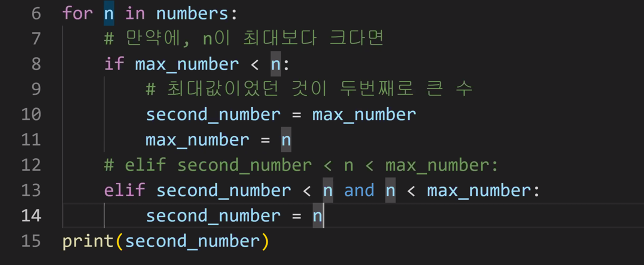
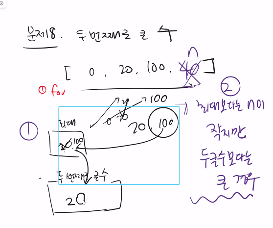

# 제어문(Control Statement)

### 제어문이란

- 파이썬은 기본적으로 위에서부터 아래로 순차적으로 명령을 수행

- 특정 상황에 따라 코드를 선택적으로

  실행(분기/조건)하거나 계속하여 실행(반복)하는 제어가 필요함

- 제어문은 순서도(flow chart)로 표현이 가능

# 조건문(Conditional Statement)

### 조건문

- 조건문은 참/거짓을 판단할 수 있는 조건식과 함께 사용

### 기본형식

- expression에는 참/거짓에 대한 조건식

  - 조건이 참인 경우 if 이후 들여쓰기 되어있는 코드 블럭을 실행

  - 이외의 경우 else 이후 들여쓰기 되어있는 코드 블럭을 실행

    - else는 선택적으로 활용 가능함

    ```python
    if < expression >:
    # Run this Code block
    else:
    # Run this Code block
    ```

# 복수 조건문

### 복수의 조건식을 활용할 경우 elif를 활용하여 표현함

- 복수 조건문

  ```python
  if <expression>:
  # Code block
  elif <expression>:
  # Code block
  elif <expression>:
  # Code block
  else:
  # Code block
  ```

- 다음은 미세먼지 농도에 따른 등급일 때

  dust 값에 따라 등급을 출력하는 조건식을 작성하시오.

  ```python
  dust = 80
  if dust > 150:
  print('매우 나쁨')
  elif dust > 80:
  print('나쁨')
  elif dust > 30:
  print('보통')
  else:
  print('좋음')
  print('미세먼지 확인 완료')
  ```

# 중첩 조건문

- 조건문은 다른 조건문에 중첩되어 사용될 수 있음

  - 들여쓰기를 유의하여 작성할 것

    ```python
    if <expression>:
    	# Code block
    	if <expression>:
    		# Code block
    else:
    	# Code block
    ```

# 조건 표현식

- 조건 표현식(Conditional Expression)이란?

  - 조건 표현식을 일반적으로 조건에 따라 값을 할당 할 때 활용

  ```python
  <true인 경우 값> if <expression> else <false인 경우 값>
  ```

# 반복문

- 특정 조건을 도달할 때까지, 계속 반복되는 일련의 문장

### 반복문의 종류

- while 문
  - 종료조건에 해당하는 코드를 통해 반복문을 종료시켜야 함
- for 문
  - 반복가능한 객체를 모두 순회하면 종료 (별도의 종료조건이 필요 없음)
- 반복 제어
  - break, continue, for-else

# While문

- while문은 조건식이 참인 경우 반복적으로 코드를 실행

  - 조건이 참인 경우 들여쓰기 되어 있는 코드 블록이 실행됨

  - 코드 블록이 모두 실행되고, 다시 조건식을 검사하며 반복적으로 실행됨

  - while문은 무한 루프를 하지 않도록 종료조건이 반드시 필요

    ```python
    while <expression>:
    # Code block
    ```

# for문

- for문은 시퀀스(string, tuple, list, range)를 포함한 순회가능한 객채(iterable)

  요소를 모두 순회함

  - 처음부터 끝까지 모두 순회하므로 별도의 종료조건이 필요하지 않음

    ```python
    for <변수명> in <iterable>:
    # Code block
    ```

### For문 일반 형식

- Iterable
  - 순회할 수 있는 자료형(str, list, dict 등)
  - 순회형 함수(range, enumerate)

### 문자열 순회

- 사용자가 입력한 문자를 한 글자씩 세로로 출력하시오

  ```python
  chars = input()
  # hi
  
  for char in chars:
  print(char)
  # h
  # i
  ```

- 사용자가 입력한 문자를 range를 활용하여 한 글자씩 출력하시오.

  ```python
  chars = input()
  # hi
  for idx in range(len(chars)):
  print(chars[idx])
  # h
  # i
  ```

### enumerate순회 **(잘사용하지 않음)**

- enumerate()

  - 인덱스와 객체를 쌍으로 담은 열거형(enumerate) 객체 반환

    - (index, value) 형태의 tuple로 구성된 열거 객체를 반환

    ```python
    members = ['민수', '영희', '철수']
    for i in range(len(members)):
    print(f’{i} {members[i]}')
    
    for i, member in enumerate(members):
    print(i, member)      
    ```

- enumerate 순회

  ```python
  enumerate(members)
  # <enumerate at 0x105d3e100>
  list(enumerate(members))
  # [(0, '민수'), (1, '영희'), (2, '철수')]
  list(enumerate(members, start=1))
  # [(1, '민수'), (2, '영희'), (3, '철수')]
  ```

# 딕셔너리 순회

- 딕셔너리는 기본적으로 key를 순회하며, key를 통해 값을 활용

  ```python
  grades = {'john': 80, 'eric': 90}
  for name in grades:
  	print(name)
  # john 
  # eric
  
  grades = {'john': 80, 'eric': 90}
  for name in grades:
  	print(name, grades[name])
  # john 80 
  # eric 90
  ```

# 반복문 제어

- break

  - 반복문을 종료

  - break 문을 만나면 반복문은 종료됨

    ```python
    n = 0
    while True:
    	if n == 3:
    		break
    	print(n)
    	n += 1
    0 
    1 
    2
    
    for i in range(10):
    	if i > 1:
    		print('0과 1만 필요해!')
    		break
    	print(i)
    0 
    1
    0과 1만 필요해!

- continue

  - continue 이후의 코드 블록은 수행하지 않고, 다음 반복을 수행

    ```python
    for i in range(6):
    	if i % 2 == 0:
    		continue
    	print(i)
    1
    3
    5
    ```

    

- for-else

  - 끝까지 반복문을 실행한 이후에 else문 실행
    - break를 통해 중간에 종료되는 경우 else 문은 실행되지 않음

  ```python
  for char in 'banana':
  	if char == 'b':
  		print('b!')
  		break
  else:
  	print('b가 없습니다.')
  # b가 없습니다.
  
  for char in 'apple':
  	if char == 'b':
  		print('b!')
  		break
  else:
  	print('b가 없습니다.')
  # b!
  ```


# 두번째로 큰수 출력





