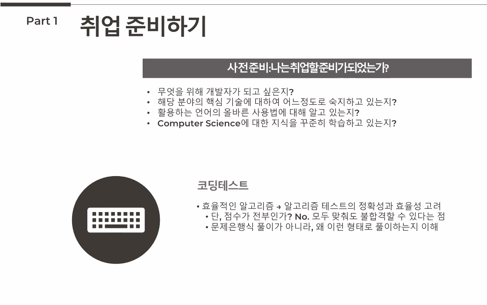

회사는 전공 비전공을 구분하지않는다.

회사는 전공자이든 비전공자이든 현재 모습을 가장 중요시한다.

짧은 기간동안 잘해낸다면 성장 가능성을 확인할수 있다.

기술면접에서는 원래전공에 대해서 물어보지않는다.

어떤 프로젝트에서 가장 중요한것은 

어떤 서비스를 제공했느냐 보다는 어떤 코드를 사용했는지가 훨씬 중요하다..

파이썬 장고 백앤드 개발자로의 취업

객관 적으로는 스프링 에 비해서는 적다

파이썬은 일반적으로 신규서비스인 경우가 많다.

파이썬은 자바와 달리 인터프리터 언어이다. 파이썬은 개발이 쉬워서 빠르게 개발이가능

단점은 자료형을 선언을 하지않기 때문에 서비스가 커지면 커질수록 협업이 어려워진다.

인터프리터 언어로 타입도 선언하지않고 변수도 않하기때문에 느리다.

하드웨어의 발전에 따라서 장고와 스프링의 스피드가 크게 차이가 나지 않는다.

