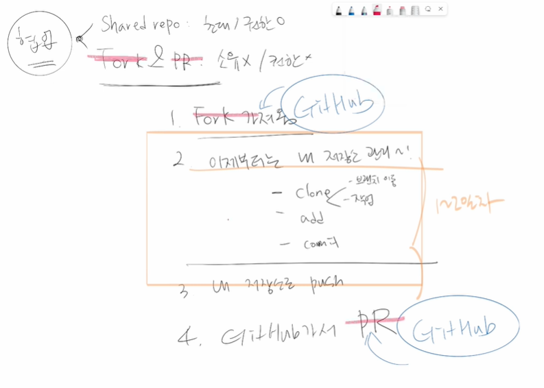

협업을 하기위해 하위 두가지를 한다

- Shared repo : 초대해서 하는것으로 권한을가지고있다

- Fork & Pull Request 하는이유는 ?? : 소유하지 않아서 

  1. Fork 찍어서 가져옴
  2. 이제부터는 내 저장소를 관리하는것과 100%동일
     - clone
     - add
     - commit

  ---

  3. 내 저장소로 push
  4. GitHub 가서 Pull Resquest

​		

merge request == Pull request

``.gitkeep`` : 빈 폴더를 만들기위해서사용 한다. 유지시키려는 빈폴더에 .gitkeep 파일을 생성하면 해당 빈폴더를 유지시킬수있다. 

``.gitkeep`` 말고 다른 이름으로 사용이 가능하다. 관용적으로 쓰이는 것이다 ex).keep 등등 하지만 그냥 관용표현인 gitkeep을 사용하는것이 나아보인다.

``.gitignore`` : git으로 추적하지 않는 파일 관리-- why? -- git은 하위 디렉토리의 몯느 파일을 추적하니까

이름 바꾸기 불가능 .gitignore 로만 사용가능